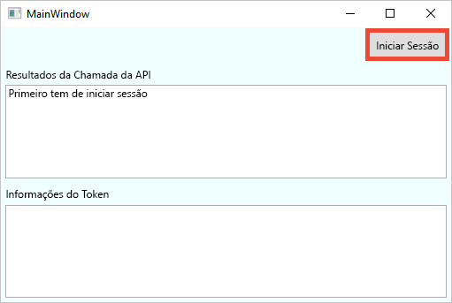
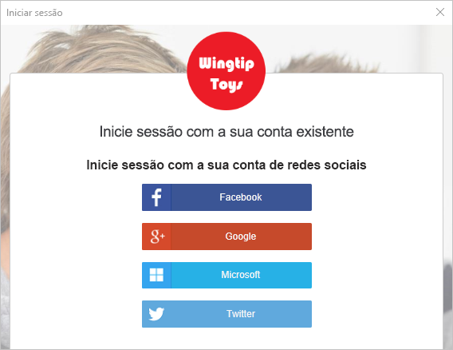
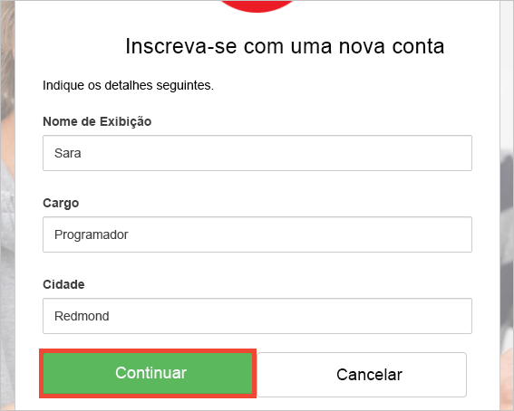
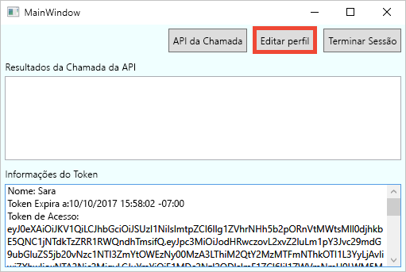
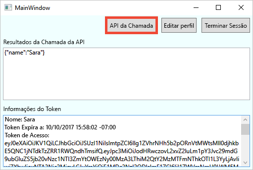

# <a name="quickstart-set-up-sign-in-for-a-desktop-app-using-azure-active-directory-b2c"></a>Início Rápido: configurar o início de sessão para uma aplicação de ambiente de trabalho através do Azure Active Directory B2C 

O Azure Active Directory (Azure AD) B2C fornece gestão de identidades na cloud para manter as aplicações, as empresas e os clientes protegidos. O Azure AD B2C permite às aplicações efetuar a autenticação em contas de redes sociais e contas empresariais, através de protocolos padrão abertos.

Neste início rápido, vai utilizar uma aplicação de ambiente de trabalho do Windows Presentation Foundation (WPF) de exemplo, ativada pelo Azure AD B2C, para iniciar sessão através de um fornecedor de identidade de redes sociais e chamar uma API Web protegida pelo Azure AD B2C.

[!INCLUDE [quickstarts-free-trial-note](../../includes/quickstarts-free-trial-note.md)]

## <a name="prerequisites"></a>Pré-requisitos

* [Visual Studio 2017](https://www.visualstudio.com/downloads/) com a carga de trabalho de **desenvolvimento ASP.NET e Web**. 
* Uma conta de rede social do Facebook, Google, Microsoft ou Twitter.

## <a name="download-the-sample"></a>Transferir o exemplo

[Transfira um ficheiro zip](https://github.com/Azure-Samples/active-directory-b2c-dotnet-desktop/archive/master.zip) ou clone a aplicação Web de exemplo a partir do GitHub.

```
git clone https://github.com/Azure-Samples/active-directory-b2c-dotnet-desktop.git
```

## <a name="run-the-app-in-visual-studio"></a>Executar a aplicação no Visual Studio

Na pasta de projeto do exemplo de aplicação, abra a solução `active-directory-b2c-wpf.sln` no Visual Studio.

Prima **F5** para depurar a aplicação.

## <a name="create-an-account"></a>Criar uma conta

Clique em **Iniciar sessão** para iniciar o fluxo de trabalho **Inscrever-se ou Iniciar Sessão**, com base numa política do Azure AD B2C.



O exemplo suporta várias opções de inscrição, incluindo através de um fornecedor de identidade de redes sociais ou criando uma conta local com um endereço de e-mail. Neste início rápido, utilize uma conta de fornecedor de identidade de redes sociais do Facebook, Google, Microsoft ou Twitter. 

### <a name="sign-up-using-a-social-identity-provider"></a>Inscrever-se através de um fornecedor de identidade de redes sociais

O Azure AD B2C apresenta uma página de início de sessão personalizada para uma marca fictícia com o nome Wingtip Toys para a aplicação Web de exemplo. 

1. Para inscrever-se através de um fornecedor de identidade de redes sociais, clique no botão do fornecedor de identidade que pretende utilizar. 

    

    Efetue a autenticação (início de sessão) com as suas credenciais da rede social e autorize a aplicação a ler as informações da sua conta da rede social. Ao conceder acesso, a aplicação pode obter as informações do perfil da conta de rede social, como o nome e a localidade. 

2. Conclua o processo de início de sessão para o fornecedor de identidade. Por exemplo, se tiver escolhido o Twitter, introduza as suas credenciais do Twitter e clique em **Iniciar sessão**.

    

    Os detalhes do perfil da nova conta são pré-preenchidos com as informações da sua conta da rede social. 

3. Modifique os detalhes, se assim o desejar, e clique em **Continuar**. Os valores que introduzir são utilizados para o seu perfil de conta de utilizador do Azure AD B2C.

    

    Criou com êxito uma nova conta de utilizador do Azure AD B2C que utiliza um fornecedor de identidade. Após o início de sessão, o token de acesso é apresentado na caixa de texto *Informações do token*. O token de acesso é utilizado ao aceder ao recurso de API.

## <a name="edit-your-profile"></a>Editar o seu perfil

O Azure Active Directory B2C fornece funcionalidades para permitir que os utilizadores atualizem os seus perfis.  O exemplo de aplicação Web utiliza uma política de edição de perfil do Azure AD B2C para o fluxo de trabalho. 

1. Clique em **Editar perfil** para editar o perfil que criou.

    

2. Escolha o fornecedor de identidade associado à conta que criou. Por exemplo, se utilizou o Twitter como o fornecedor de identidade quando criou a conta, escolha o Twitter para modificar os detalhes associados ao perfil.

3. Altere o **Nome a apresentar** ou a **Cidade** e clique em **Continuar**.

    É apresentado um novo token de acesso na caixa de acesso *Informações do token*. Se pretender verificar as alterações ao seu perfil, copie e cole o token de acesso no descodificador de token https://jwt.ms.

## <a name="access-a-protected-web-api-resource"></a>Aceder a um recurso protegido da API Web

Clique em **Chamar API** para fazer um pedido ao recurso protegido pelo Azure AD B2C https://fabrikamb2chello.azurewebsites.net/hello. 



A aplicação inclui o token de acesso do Azure AD no pedido ao recurso protegido de API Web. A API Web devolve o nome a apresentar contido no token de acesso.

Utilizou com êxito a conta de utilizador do Azure AD B2C para efetuar uma chamada autorizada para uma API Web protegida pelo Azure AD B2C.

## <a name="clean-up-resources"></a>Limpar recursos

Pode utilizar o inquilino do Azure AD B2C se planeia experimentar outros inícios rápidos ou tutoriais do Azure AD B2C. Quando já não for necessário, pode [eliminar o inquilino do Azure AD B2C](active-directory-b2c-faqs.md#how-do-i-delete-my-azure-ad-b2c-tenant).

## <a name="next-steps"></a>Passos seguintes

O passo seguinte é criar o seu inquilino do Azure AD B2C e configurar o exemplo a executar com o seu inquilino. 

> [!div class="nextstepaction"]
> [Criar um inquilino do Azure Active Directory B2C no portal do Azure](active-directory-b2c-get-started.md)
