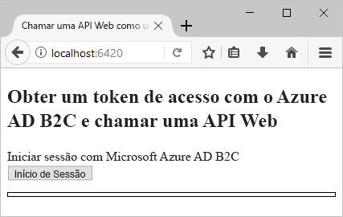
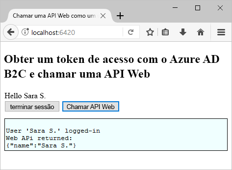

# <a name="quickstart-set-up-sign-in-for-a-single-page-app-using-azure-active-directory-b2c"></a>Guia de introdução: Definir o início de sessão para uma aplicação de página única utilizando o Azure Active Directory B2C

O Azure Active Directory (Azure AD) B2C fornece gestão de identidades na cloud para manter as aplicações, as empresas e os clientes protegidos. O Azure AD B2C permite às aplicações efetuar a autenticação em contas de redes sociais e contas empresariais, através de protocolos padrão abertos.

Neste início rápido, vai utilizar um exemplo de aplicação de página única ativada pelo Azure AD B2C para iniciar sessão com um fornecedor de identidade de redes sociais e chamar uma API Web protegida pelo Azure AD B2C.

[!INCLUDE [quickstarts-free-trial-note](../../includes/quickstarts-free-trial-note.md)]

## <a name="prerequisites"></a>Pré-requisitos

* [Visual Studio 2017](https://www.visualstudio.com/downloads/) com a carga de trabalho de **desenvolvimento ASP.NET e Web**.
* Instalar o [Node. js](https://nodejs.org/en/download/)
* Uma conta de rede social do Facebook, Google, Microsoft ou Twitter.

## <a name="download-the-sample"></a>Transferir o exemplo

[Transfira um ficheiro zip](https://github.com/Azure-Samples/active-directory-b2c-javascript-msal-singlepageapp/archive/master.zip) ou clone a aplicação Web de exemplo a partir do GitHub.

```
git clone https://github.com/Azure-Samples/active-directory-b2c-javascript-msal-singlepageapp.git
```

## <a name="run-the-sample-application"></a>Executar o exemplo de aplicação

Para executar este exemplo a partir da linha de comandos Node.js: 

```
cd active-directory-b2c-javascript-msal-singlepageapp
npm install && npm update
node server.js
```

A aplicação Node.js produz o número de porta na qual está a escutar no localhost.

```
Listening on port 6420...
```

Navegue até ao URL da aplicação `http://localhost:6420` num browser.



## <a name="create-an-account"></a>Criar uma conta

Clique no botão **Iniciar sessão** para iniciar o fluxo de trabalho **Inscrever-se ou Iniciar Sessão** do Azure AD B2C, com base numa política do Azure AD B2C. 

O exemplo suporta várias opções de inscrição, incluindo através de um fornecedor de identidade de redes sociais ou criando uma conta local com um endereço de e-mail. Neste início rápido, utilize uma conta de fornecedor de identidade de redes sociais do Facebook, Google, Microsoft ou Twitter. 

### <a name="sign-up-using-a-social-identity-provider"></a>Inscrever-se através de um fornecedor de identidade de redes sociais

O Azure AD B2C apresenta uma página de início de sessão personalizada para uma marca fictícia com o nome Wingtip Toys para a aplicação Web de exemplo. 

1. Para inscrever-se através de um fornecedor de identidade de redes sociais, clique no botão do fornecedor de identidade que pretende utilizar.

    

    Efetue a autenticação (início de sessão) com as suas credenciais da rede social e autorize a aplicação a ler as informações da sua conta da rede social. Ao conceder acesso, a aplicação pode obter as informações do perfil da conta de rede social, como o nome e a localidade. 

2. Conclua o processo de início de sessão para o fornecedor de identidade. Por exemplo, se tiver escolhido o Twitter, introduza as suas credenciais do Twitter e clique em **Iniciar sessão**.

    

    Os detalhes do perfil da nova conta são pré-preenchidos com as informações da sua conta da rede social. 

3. Atualize os campos Nome a Apresentar, Cargo e Localidade e clique em **Continuar**.  Os valores que introduzir são utilizados para o seu perfil de conta de utilizador do Azure AD B2C.

    Criou com êxito uma nova conta de utilizador do Azure AD B2C que utiliza um fornecedor de identidade. 

## <a name="access-a-protected-web-api-resource"></a>Aceder a um recurso protegido da API Web

Clique no botão **Chamar API Web** para que o nome a apresentar seja devolvido na chamada da API Web como um objeto JSON. 



O exemplo de aplicação de página única inclui um token de acesso do Azure AD no pedido para o recurso de API Web protegido para executar a operação para devolver o objeto JSON.

## <a name="clean-up-resources"></a>Limpar recursos

Pode utilizar o inquilino do Azure AD B2C se planeia experimentar outros inícios rápidos ou tutoriais do Azure AD B2C. Quando já não for necessário, pode [eliminar o inquilino do Azure AD B2C](active-directory-b2c-faqs.md#how-do-i-delete-my-azure-ad-b2c-tenant).

## <a name="next-steps"></a>Passos Seguintes

Neste início rápido, utilizou um exemplo de aplicação ASP.NET ativada pelo Azure AD B2C para iniciar sessão com uma página de início de sessão personalizado, iniciar sessão com um fornecedor de identidade de redes sociais, criar uma conta do Azure AD B2C e chamar uma API Web protegida pelo Azure AD B2C. 

O passo seguinte é criar o seu inquilino do Azure AD B2C e configurar o exemplo a executar com o seu inquilino. 

> [!div class="nextstepaction"]
> [Criar um inquilino do Azure Active Directory B2C no portal do Azure](active-directory-b2c-get-started.md)