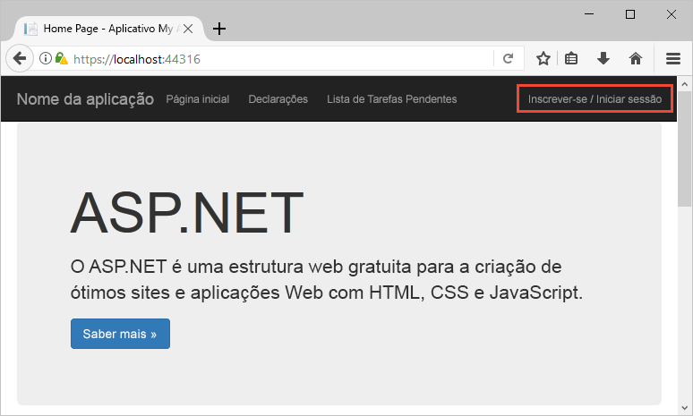
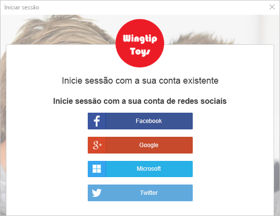
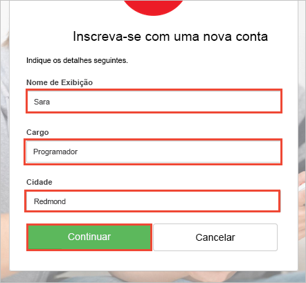
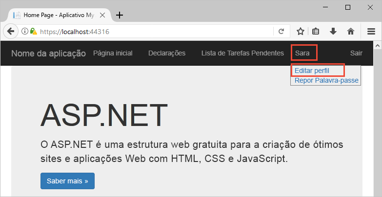
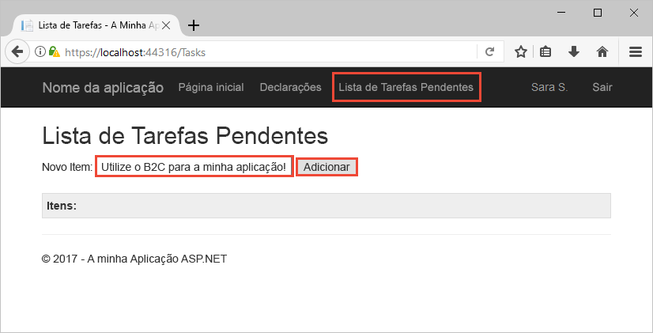

# <a name="quickstart-set-up-sign-in-for-an-aspnet-application-using-azure-active-directory-b2c"></a>Início Rápido: configurar o início de sessão para uma aplicação ASP.NET através do Azure Active Directory B2C

O Azure Active Directory (Azure AD) B2C fornece gestão de identidades na cloud para manter as aplicações, as empresas e os clientes protegidos. O Azure AD B2C permite às aplicações efetuar a autenticação em contas de redes sociais e contas empresariais, através de protocolos padrão abertos.

Neste início rápido, vai utilizar um exemplo de aplicação ASP.NET ativada pelo Azure AD B2C para iniciar sessão com um fornecedor de identidade de redes sociais e chamar uma API Web protegida pelo Azure AD B2C.

[!INCLUDE [quickstarts-free-trial-note](../../includes/quickstarts-free-trial-note.md)]

## <a name="prerequisites"></a>Pré-requisitos

* [Visual Studio 2017](https://www.visualstudio.com/downloads/) com a carga de trabalho de **desenvolvimento ASP.NET e Web**. 
* Uma conta de rede social do Facebook, Google, Microsoft ou Twitter.

## <a name="download-the-sample"></a>Transferir o exemplo

[Transfira um ficheiro zip](https://github.com/Azure-Samples/active-directory-b2c-dotnet-webapp-and-webapi/archive/master.zip) ou clone a aplicação Web de exemplo a partir do GitHub.

```
git clone https://github.com/Azure-Samples/active-directory-b2c-dotnet-webapp-and-webapi.git
```

## <a name="run-the-app-in-visual-studio"></a>Executar a aplicação no Visual Studio

Na pasta de projeto do exemplo de aplicação, abra a solução `B2C-WebAPI-DotNet.sln` no Visual Studio.

Existem dois projetos na solução de exemplo:

**Aplicação de exemplo da aplicação Web (TaskWebApp):** aplicação Web para criar e editar uma lista de tarefas. A aplicação Web utiliza a política de **inscrição ou início de sessão** para inscrição ou início de sessão de utilizadores.

**Exemplo de aplicação da API Web (TaskService):** API Web que suporta a funcionalidade de criação, leitura, atualização e eliminação da lista de tarefas. A API Web é protegida pelo Azure AD B2C e chamada pela aplicação Web.

Para este início rápido, vai executar ambos os projetos `TaskWebApp` e `TaskService` em simultâneo. 

1. Selecione a solução `B2C-WebAPI-DotNet` no Explorador de Soluções.
2. No menu do Visual Studio, selecione **Projeto > Definir Projetos de Arranque...**. 
3. Selecione o botão de opção **Vários projetos de arranque**.
4. Altere a **Ação** em ambos os projetos para **Iniciar**. Clique em **OK**.

Prima **F5** para depurar as duas aplicações. Cada aplicação abre no seu próprio separador do browser:

`https://localhost:44316/` - Esta página é a aplicação Web ASP.NET. No início rápido, interage diretamente com esta aplicação.
`https://localhost:44332/` - Esta página é a API Web que é chamada pela aplicação Web ASP.NET.

## <a name="create-an-account"></a>Criar uma conta

Clique na ligação **Inscrever-se / Iniciar sessão** na aplicação Web ASP.NET para iniciar o fluxo de trabalho **Inscrever-se ou Iniciar Sessão** com base numa política do Azure AD B2C.



O exemplo suporta várias opções de inscrição, incluindo através de um fornecedor de identidade de redes sociais ou criando uma conta local com um endereço de e-mail. Neste início rápido, utilize uma conta de fornecedor de identidade de redes sociais do Facebook, Google, Microsoft ou Twitter. 

### <a name="sign-up-using-a-social-identity-provider"></a>Inscrever-se através de um fornecedor de identidade de redes sociais

O Azure AD B2C apresenta uma página de início de sessão personalizada para uma marca fictícia com o nome Wingtip Toys para a aplicação Web de exemplo. 

1. Para inscrever-se através de um fornecedor de identidade de redes sociais, clique no botão do fornecedor de identidade que pretende utilizar.

    

    Efetue a autenticação (início de sessão) com as suas credenciais da rede social e autorize a aplicação a ler as informações da sua conta da rede social. Ao conceder acesso, a aplicação pode obter as informações do perfil da conta de rede social, como o nome e a localidade. 

2. Conclua o processo de início de sessão para o fornecedor de identidade. Por exemplo, se tiver escolhido o Twitter, introduza as suas credenciais do Twitter e clique em **Iniciar sessão**.

    

    Os detalhes do perfil da nova conta do Azure AD B2C são pré-preenchidos com as informações da sua conta de rede social.

3. Atualize os campos Nome a Apresentar, Cargo e Localidade e clique em **Continuar**.  Os valores que introduzir são utilizados para o seu perfil de conta de utilizador do Azure AD B2C.

    

    Utilizou com êxito o exemplo de aplicação Web que utiliza uma política do Azure AD B2C para autenticar com um fornecedor de identidade e criar uma conta de utilizador do Azure AD B2C. 

## <a name="edit-your-profile"></a>Editar o seu perfil

O Azure Active Directory B2C fornece funcionalidades para permitir que os utilizadores atualizem os seus perfis. O exemplo de aplicação Web utiliza uma política de edição de perfil do Azure AD B2C para o fluxo de trabalho. 

1. Na barra de menus da aplicação Web, clique no nome do perfil e selecione **Editar perfil** para editar o perfil que criou.

    

2. Altere o **Nome a apresentar** e **Cidade**.  
3. Clique em **Continuar** para atualizar o seu perfil. O novo nome a apresentar é apresentado na parte superior direita da home page da aplicação Web.

## <a name="access-a-protected-web-api-resource"></a>Aceder a um recurso protegido da API Web

1. Clique em **Lista de Tarefas** para introduzir e modificar os itens da lista de tarefas. 

2. Introduza texto na caixa de texto **Novo Item**. Clique em **Adicionar** para chamar a API Web protegida pelo Azure AD B2C, que adiciona um item da lista de tarefas.

    

    A aplicação Web ASP.NET inclui um token de acesso do Azure AD no pedido para o recurso da API Web protegido para executar operações nos itens da lista de tarefas do utilizador.

Utilizou com êxito a conta de utilizador do Azure AD B2C para efetuar uma chamada autorizada para uma API Web protegida pelo Azure AD B2C.

## <a name="clean-up-resources"></a>Limpar recursos

Pode utilizar o inquilino do Azure AD B2C se planeia experimentar outros inícios rápidos ou tutoriais do Azure AD B2C. Quando já não for necessário, pode [eliminar o inquilino do Azure AD B2C](active-directory-b2c-faqs.md#how-do-i-delete-my-azure-ad-b2c-tenant).

## <a name="next-steps"></a>Passos seguintes

Neste início rápido, utilizou um exemplo de aplicação ASP.NET ativada pelo Azure AD B2C para iniciar sessão com uma página de início de sessão personalizado, iniciar sessão com um fornecedor de identidade de redes sociais, criar uma conta do Azure AD B2C e chamar uma API Web protegida pelo Azure AD B2C. 

Continue para o tutorial para saber como configurar o exemplo de ASP.NET para utilizar o seu inquilino do Azure AD B2C.

> [!div class="nextstepaction"]
> [Tutorial: Autenticar utilizadores com o Azure Active Directory B2C numa aplicação Web ASP.NET](active-directory-b2c-tutorials-web-app.md)