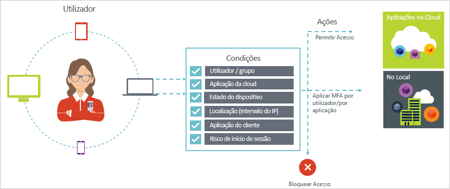
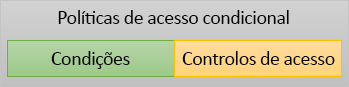

# Acesso condicional no Azure Active Directory

A segurança é uma preocupação superior para organizações com a nuvem. Um aspeto chave da segurança de nuvem é a identidade e acesso quando se trata de gerir os recursos de nuvem. No mundo mobile-primeiro, primeiro de nuvem, os utilizadores podem aceder a recursos da organização utilizando uma variedade de dispositivos e aplicações a partir de qualquer lugar. Como resultado, apenas concentrar-se em quem pode aceder a um recurso já não faz suficiente. Para mestra o equilíbrio entre produtividade e segurança, profissionais de TI tem também de fator como um está a ser aceder aos recursos para uma decisão de controlo de acesso. Com o acesso condicional do Azure AD, pode resolver este requisito. Acesso condicional é uma funcionalidade do Azure Active Directory permite-lhe aplicar controlos de acesso a aplicações no seu ambiente com base nas condições específicas de uma localização central. 

Este artigo fornece uma descrição geral conceptual do acesso condicional no Azure AD.

## Cenários comuns

No mundo mobile-primeiro, primeiro de nuvem, o Azure Active Directory permite início de sessão único para dispositivos, aplicações e serviços em qualquer lugar. Com a proliferação de dispositivos (incluindo o BYOD), trabalham em redes empresariais e aplicações de SaaS de terceiros 3rd, profissionais de TI são confrontadas com dois objetivos adversária:

- Capacitar os utilizadores sejam produtivos onde quer que e sempre
- Proteger os ativos da empresa em qualquer altura

Ao utilizar políticas de acesso condicional, pode aplicar os controlos de acesso à direita nas condições necessárias. Acesso condicional do Azure AD fornece maior segurança quando for necessário e mantém-se fora do modo do utilizador quando não se encontra. 

Seguem-se alguns problemas de acesso comuns que acesso condicional pode ajudar com:

- **Início de sessão risco**: Azure AD Identity Protection Deteta riscos de início de sessão. Como restringir acesso se um risco de início de sessão detetado indica um ator incorretos? E se gostaria de obter uma provas mais forte que um início de sessão foi realmente efetuado pelo utilizador legítimo ou os doubts são suficientemente seguras para bloquear o mesmo utilizadores específicos de aceder a uma aplicação?

- **Localização de rede**: do Azure AD é acessível a partir de qualquer lugar. E se uma tentativa de acesso é executada a partir de uma localização de rede que não se encontra sob o controlo do seu departamento de TI? Utilizando uma combinação de nome de utilizador e palavra-passe pode ser suficiente boa como tentativas de uma prova de identidade para o acesso aos recursos da sua rede empresarial. E se a procura uma prova de identidade mais forte para acesso tenta que são iniciadas a partir do outro inesperados países ou regiões do mundo? E se quiser, mesmo bloquear o acesso tenta de determinadas localizações?  

- **Gestão de dispositivos**: no Azure AD, os utilizadores podem aceder a aplicações na nuvem de uma vasta gama de dispositivos, incluindo mobile bem como dispositivos pessoais. E se precisar desse tentativa de acesso só deve ser executada utilizador através de dispositivos que são geridos pelo departamento de TI? E se quiser, mesmo bloquear o acesso de formulário de tipos determinados dispositivos em aplicações na nuvem no seu ambiente? 

- **Aplicação de cliente**: atualmente, pode aceder a várias aplicações na nuvem através de diferentes tipos de aplicação, como aplicações baseadas na web, as aplicações móveis ou aplicações de ambiente de trabalho. E se é efetuada uma tentativa de acesso, utilização de um tipo de aplicação de cliente que provoque problemas conhecidos? E se necessitam de um dispositivo que é gerido pelo departamento de TI para determinados tipos de aplicação? 

Estas perguntas e as respostas relacionadas representam cenários comuns de acesso de acesso condicional do Azure AD. Acesso condicional é uma funcionalidade do Azure Active Directory permite-lhe processar cenários de acesso utilizando uma abordagem baseada em políticas.

## Políticas de acesso condicional

Uma política de acesso condicional é a definição de um cenário de acesso através do padrão de seguinte:

**Em seguida, fazer isto** define a resposta da sua política. É importante salientar que o objetivo da política de acesso condicional não conceder acesso a uma aplicação de nuvem. No Azure AD, conceder acesso a aplicações em nuvem é requerente atribuições de utilizador. Com a política de acesso condicional, controla utilizadores autorizados como (utilizadores que tenham sido concedidos acesso a uma aplicação de nuvem) podem aceder a aplicações na nuvem em condições específicas. Na sua resposta impor requisitos adicionais, tais como a autenticação multifator, um dispositivo gerido e outras pessoas. No contexto do acesso condicional do Azure AD, os requisitos que da política impõe são denominados controlos de acesso. O formato mais restritivas, a política pode bloquear o acesso. Para obter mais informações, consulte [aceder controlos de acesso condicional do Azure Active Directory](active-directory-conditional-access-controls.md).
     

**Quando isto acontece** define o motivo para acionar a política. Esta razão é caracterizada por um grupo de condições que têm foram satisfeitos. No acesso condicional do Azure AD, as condições de atribuição de dois desempenham uma função especial:

- **Os utilizadores**: os utilizadores executar uma tentativa de acesso (**quem**). 

- **Aplicações em nuvem**: os destinos de uma tentativa de acesso (**que**).    

Estas duas condições são obrigatórias numa política de acesso condicional. Para além das duas condições obrigatórias, também pode incluir condições adicionais que descrevem como é efetuada a tentativa de acesso. Exemplos comuns estiver a utilizar dispositivos móveis ou localizações que pertencem à sua rede empresarial. Para obter mais informações, consulte [condições de acesso condicional do Azure Active Directory](active-directory-conditional-access-conditions.md).   

A combinação de condições com os controlos de acesso representa uma política de acesso condicional. 

Com o acesso condicional do Azure AD, pode controlar os utilizadores autorizados como pode aceder às suas aplicações em nuvem. O objetivo da política de acesso condicional é impor controlos de acesso adicionais numa tentativa de acesso a uma aplicação de nuvem é suscitada pelo departamento pela forma como é efetuada uma tentativa de acesso.

Uma vantagem de utilizar uma abordagem baseada em políticas para proteger o acesso às suas aplicações em nuvem é que pode iniciar drafting os requisitos da política para o seu ambiente utilizando a estrutura descrita neste artigo, sem ter de se preocupar sobre a implementação técnica. 

## Passos Seguintes

- Se pretender saber mais sobre as condições, consulte [condições de acesso condicional do Azure Active Directory](active-directory-conditional-access-conditions.md).

- Se pretender saber mais sobre os controlos de acesso, consulte [aceder controlos de acesso condicional do Azure Active Directory](active-directory-conditional-access-controls.md).

- Se pretender obter alguma experiência com a configuração de políticas de acesso condicional, consulte [introdução ao acesso condicional no Azure Active Directory](active-directory-conditional-access-azure-portal-get-started.md).

- Se estiver pronto para configurar políticas de acesso condicional para o seu ambiente, consulte o [melhores práticas para acesso condicional no Azure Active Directory](active-directory-conditional-access-best-practices.md). 
