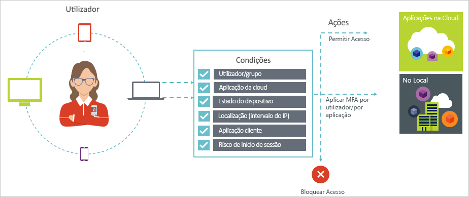
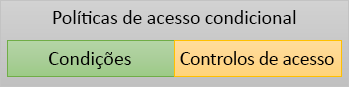

# O que é o acesso condicional no Azure Active Directory?

A segurança é uma das principais preocupações para as organizações que utilizam a cloud. Um dos principais aspetos da segurança na cloud é a identidade e o acesso no que diz respeito a gerir os recursos na cloud. Num mundo “mobile-first, cloud-first”, os utilizadores podem aceder aos recursos da sua organização com diversos dispositivos e aplicações em qualquer local. Como resultado, limitar-se a concentrar-se apenas em quem pode aceder a um recurso já não é suficiente. Para controlar o equilíbrio entre segurança e produtividade, também tem de ter em conta de que forma é que se acede a um determinado recurso numa decisão de controlo de acesso. Com o acesso condicional do Azure Active Directory (Azure AD), pode solucionar este requisito. O acesso condicional é uma capacidade do Azure Active Directory. Permite-lhe implementar decisões de controlo de acesso automatizadas relativamente ao acesso às aplicações na cloud que têm por base condições. 

Políticas de acesso condicional são aplicadas após o primeiro--factor authentication foi concluído. Por conseguinte, acesso condicional não se destina como uma defesa de linha de primeira para cenários como denial-of-service (DoS) distribuídos, mas pode utilizar os sinais desses eventos (por exemplo, o nível de risco de início de sessão, a localização do pedido e assim por diante) para determinar o acesso.  

Este artigo mostra-lhe uma descrição geral conceptual do acesso condicional no Azure AD.

## Cenários comuns

Num mundo “mobile-first, cloud-first”, o Azure Active Directory proporciona o início de sessão único em dispositivos, aplicações e serviços, em qualquer local. Com a proliferação de dispositivos (incluindo dispositivos BYOD), do trabalho fora das redes das empresas e das aplicações SaaS de terceiros, as equipas de TI estão perante dois objetivos opostos:

- Capacitar os utilizadores a ser produtivos em qualquer local e em qualquer momento
- Proteger os recursos da empresa em todos os momentos

Com a utilização de políticas de acesso condicional, pode aplicar os controlos de acesso certos sob as condições necessárias. O acesso condicional do Azure AD oferece-lhe mais segurança quando é preciso e não atrapalha os utilizadores quando não é preciso. 

Seguem-se algumas preocupações comuns relativas ao acesso e com as quais o acesso condicional pode ajudar:

- **[Início de sessão de risco](conditions.md#sign-in-risk)**: O Azure AD Identity Protection Deteta os riscos de início de sessão. Como restringe o acesso se um risco de início de sessão detetado indicar um ator malicioso? E se quiser ter provas mais sólidas de que um início de sessão foi feito por um utilizador legítimo? E se as suas dúvidas forem tão fundamentadas para o levarem inclusivamente a impedir utilizadores específicos de aceder a uma aplicação?  

- **[Localização de rede](location-condition.md)**: O Azure AD é acessível em qualquer lugar. E se alguém tentar aceder numa localização de rede que não está sob o controlo do seu departamento de TI? A combinação de nome de utilizador e palavra-passe pode ser uma prova de identidade suficientemente forte para tentativas de acesso feitas a partir da rede da sua empresa. E se precisar de uma prova de identidade mais sólida para as tentativas de acesso que são iniciadas noutros países ou regiões do mundo inesperados? E se quiser até bloquear tentativas de acesso em determinadas localizações?  

- **[Gestão de dispositivos](conditions.md#device-platforms)**: No Azure AD, os utilizadores podem aceder a aplicações de cloud contra uma grande variedade de dispositivos, incluindo dispositivos móveis e também dispositivos pessoais. E se quiser que as tentativas de acesso sejam feitas apenas com dispositivos geridos pelo seu departamento de TI? E se quiser inclusivamente impedir determinados tipos de dispositivos de aceder às aplicações na cloud no seu ambiente? 

- **[Aplicação de cliente](conditions.md#client-apps)**: Hoje em dia, pode aceder a muitas aplicações na cloud com tipos de aplicações diferentes, como aplicações baseadas na web, aplicações móveis ou aplicativos de desktop. E se for feita uma tentativa de acesso com um tipo de aplicação cliente que origina problemas conhecidos? E se quiser que seja utilizado um dispositivo gerido pelo departamento de TI para determinados tipos de aplicações? 

Estas perguntas, e as respostas às mesmas, representam cenários de acesso comuns para o acesso condicional do Azure Ad. O acesso condicional é uma capacidade do Azure Active Directory que lhe permite utilizar uma abordagem baseada em políticas para lidar com os cenários de acesso.

  

> [!VIDEO https://www.youtube.com/embed/eLAYBwjCGoA]

## Políticas de acesso condicional

As políticas de acesso condicional são uma definição de um cenário de acesso que utilizam o seguinte padrão:

**Then do this** (Depois, fazer isto) especifica a resposta da política. É importante ter em conta que o objeto das políticas de acesso condicional não é conceder acesso a uma aplicação na cloud. No Azure AD, a concessão do acesso às aplicações na cloud está sujeita a atribuições de utilizador. Com uma política de acesso condicional, pode controlar de que forma é que os utilizadores autorizados (utilizadores a quem foi concedido acesso a uma aplicação na cloud) podem aceder a aplicações na cloud sob determinadas condições. Na resposta, vai aplicar requisitos adicionais, como a autenticação multifator, um dispositivo gerido, entre outros. No contexto do acesso condicional do Azure AD, os requisitos que a política aplica são denominados controlos de acesso. Na sua forma mais restritiva, a sua política pode bloquear o acesso. Para obter mais informações, veja [Access controls in Azure Active Directory conditional access](controls.md) (Controlos de acesso no acesso condicional do Azure Active Directory).
     

**When this happens** (Quando isto acontece) define o motivo para acionar a política. Esse motivo é caracterizado por um conjunto de condições que foram verificadas. No acesso condicional do Azure AD, as duas condições de atribuição desempenham papéis especiais:

- **[Os utilizadores](conditions.md#users-and-groups)**: Os usuários que realizarem uma tentativa de acesso (**quem**). 

- **[Aplicações na cloud](conditions.md#cloud-apps)**: Os destinos de uma tentativa de acesso (**o que**).    

Estas duas condições são obrigatórias nas políticas de acesso condicional. Para além dessas duas condições obrigatórias, também pode incluir outras que descrevem a forma como a tentativa de acesso é feita. Os exemplos mais comuns são utilizar dispositivos móveis ou localizações fora da rede da sua empresa. Para obter mais informações, veja [Conditions in Azure Active Directory conditional access](conditions.md) (Condições no acesso condicional do Azure Active Directory).   

A combinação de condições e dos controlos de acesso representa uma política de acesso condicional. 

Com o acesso condicional do Azure AD, pode controlar a forma como os utilizadores autorizados podem aceder às aplicações na cloud. O objetivo das políticas de acesso condicional é aplicar controlos de acesso adicionais a tentativas de acesso a uma aplicação na cloud com base na forma como essas tentativas são feitas.

Uma abordagem baseada em políticas para proteger o acesso às aplicações na cloud é começar a desenhar os requisitos das políticas para o seu ambiente com a estrutura descrita neste artigo sem se preocupar com a implementação técnica. 

## Acesso condicional e autenticação federada do Azure AD

As políticas de acesso condicional funcionam perfeitamente com a [autenticação federada](../../security/azure-ad-choose-authn.md#federated-authentication). Este suporte inclui todas as condições e controlos suportados, bem como a visibilidade da forma como a política é aplicada aos inícios de sessão do utilizador ativo com os [relatórios do Azure AD](../reports-monitoring/concept-sign-ins.md).

*Autenticação federada com o Azure AD* significa que um serviço de autenticação fidedigno processa a autenticação do utilizador no Azure AD. Um serviço de autenticação fidedigno é, por exemplo, o Active Directory Federation Services (AD FS) ou qualquer outro serviço de federação. Nesta configuração, a autenticação de utilizador principal é executada no serviço e, em seguida, o Azure AD é utilizado para iniciar sessão em aplicações individuais. O acesso condicional do Azure AD é aplicado antes de o acesso ser concedido à aplicação a que o utilizador está a aceder. 

Quando a política de acesso condicional configurada exigir autenticação multifator, o Azure AD está predefinido para utilizar o Azure MFA. Se utilizar o serviço de federação para MFA, pode configurar o Azure AD para redirecionar para o serviço de federação quando for necessário MFA, ao definir `-SupportsMFA` como `$true` no [PowerShell](https://docs.microsoft.com/powershell/module/msonline/set-msoldomainfederationsettings). Esta definição funciona para os serviços de autenticação federada que suportam o pedido de desafio MFA emitido pelo Azure AD com `wauth= http://schemas.microsoft.com/claims/multipleauthn`.

Depois de o utilizador ter iniciado sessão no serviço de autenticação federada, o Azure AD processa outros requisitos de política, como a conformidade do dispositivo ou uma aplicação aprovada.

## Requisitos de licenciamento para o acesso condicional

A utilização do acesso condicional requer uma licença do Azure AD Premium. Para encontrar a licença certa para os seus requisitos, veja [Comparação das funcionalidades disponíveis geralmente das edições Gratuita, Básica e Premium](https://azure.microsoft.com/pricing/details/active-directory/).

## Passos Seguintes

- Se quiser saber mais sobre:
    - Condições, veja [Conditions in Azure Active Directory conditional access](conditions.md) (Condições no acesso condicional do Azure Active Directory).

    - Controlos de acesso, veja [Access controls in Azure Active Directory conditional access](controls.md) (Controlos de acesso no acesso condicional do Azure Active Directory).

- Se quiser obter alguma experiência na configuração de políticas de acesso condicional, veja [Require MFA for specific apps with Azure Active Directory conditional access](app-based-mfa.md) (Pedir MFA para aplicações específicas com o acesso condicional do Azure Active Directory).

- Se quiser um plano de implementação passo a passo com políticas recomendadas, veja [Conditional access deployment plan](https://aka.ms/conditionalaccessdeploymentplan) (Plano de implementação do acesso condicional).
