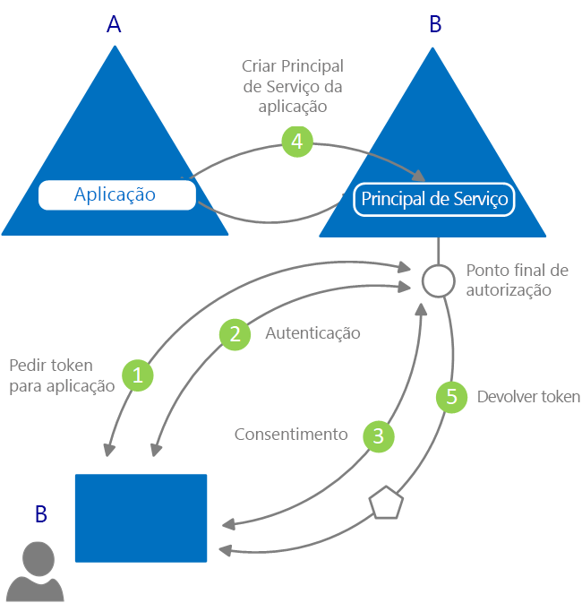

# O que é a autenticação?

*Autenticação* é o ato de obter credenciais legítimas de uma entidade, fornecendo a base para a criação de um principal de segurança a utilizar para controlo de acesso e identidade. Em termos mais simples, é o processo de provar que é quem diz ser. Por vezes, o termo é abreviado como AuthN.

*Autorização* é o ato de conceder uma permissão de principal de segurança autenticada para fazer algo. Especifica os dados aos quais tem permissão de acesso e o que pode fazer com eles. Por vezes, o termo é abreviado como AuthZ.

O Azure Active Directory (Azure AD) simplifica a autenticação para os programadores de aplicações ao fornecer uma identidade como serviço, com suporte de protocolos de normas da indústria, como OAuth 2.0 e OpenID Connect, bem como bibliotecas de código aberto para diferentes plataformas para o ajudar a começar a codificar rapidamente.

Existem dois casos de utilização principais no modelo de programação do Azure AD:

* Durante um fluxo de concessão de autorização do OAuth 2.0 - quando o proprietário do recurso concede autorização à aplicação cliente e permite ao cliente aceder aos recursos do proprietário do recurso.
* Durante o acesso a recursos pelo cliente - conforme implementado pelo servidor de recursos, com os valores de afirmações presentes no token de acesso para tomar decisões de controlo de acesso com base nos mesmos.

## Conceitos básicos de autenticação no Azure Active Directory

Considere o cenário mais básico, em que é necessária uma identidade: um utilizador num browser precisa de se autenticar numa aplicação Web. O diagrama seguinte mostra este cenário:

Eis o que precisa de saber sobre os vários componentes mostrados no diagrama:

* O Azure AD é o fornecedor de identidade. O fornecedor de identidade é responsável por verificar a identidade dos utilizadores e aplicações existentes num diretório da organização e emite tokens de segurança após a autenticação com êxito desses utilizadores e aplicações.
* Uma aplicação que queira subcontratar a autenticação ao Azure AD tem de estar registada no Azure AD. O Azure AD regista e identifica exclusivamente a aplicação no diretório.
* Os programadores podem utilizar as bibliotecas de autenticação de código aberto do Azure AD para facilitar a autenticação ao lidar com os detalhes de protocolo por si. Para mais informações, veja [Bibliotecas de autenticação v2.0](reference-v2-libraries.md) e [Bibliotecas de autenticação v1.0](active-directory-authentication-libraries.md) do Azure AD.
* Após a autenticação de um utilizador, a aplicação tem de validar o token de segurança do utilizador para assegurar que a autenticação foi efetuada com êxito. Pode encontrar inícios rápidos, tutoriais e exemplos de código numa variedade de linguagens e arquiteturas que mostram o que a aplicação tem de fazer.
  * Para criar rapidamente uma aplicação e adicionar funcionalidades como obter tokens, atualizar tokens, iniciar a sessão de um utilizador, apresentar algumas informações de utilizador e muito mais, veja a secção **Inícios Rápidos** da documentação.
  * Para obter procedimentos detalhados baseados em cenários para tarefas de programador de autenticação, como obter tokens de acesso e utilizá-los em chamadas à Microsoft Graph API e outras APIs, implementar o início de sessão Microsoft com uma aplicação Web tradicional baseada no browser com o OpenID Connect e muito mais, veja a secção **Tutoriais** da documentação.
  * Para transferir exemplos de código, aceda ao [GitHub](https://github.com/Azure-Samples?q=active-directory).
* O fluxo de pedidos e respostas do processo de autenticação é determinado pelo protocolo de autenticação utilizado, como OAuth 2.0, OpenID Connect, WS-Federation ou SAML 2.0. Para obter mais informações sobre protocolos, veja a secção **Conceitos > Protocolos** da documentação.

No cenário de exemplo acima, pode classificar as aplicações de acordo com estas duas funções:

* Aplicações que precisam de aceder de forma segura a recursos
* Aplicações que desempenham a função do recurso em si

Agora que tem uma descrição geral dos conceitos básicos, continue a ler para compreender o modelo de aplicação de identidade e a API, como funciona o aprovisionamento no Azure AD e obter ligações para informações detalhadas sobre os cenários comuns suportados pelo Azure AD.

## Modelo de aplicação

O Azure AD representa as aplicações que seguem um modelo específico concebido para satisfazer duas funções principais:

* **Identificar a aplicação de acordo com os protocolos de autenticação suportados** - Envolve enumerar todos os identificadores, URLs, segredos e informações relacionadas necessários no momento da autenticação. Aqui, o Azure AD:

    * Contém todos os dados necessários para suportar a autenticação no tempo de execução.
    * Contém todos os dados para decidir quais os recursos de que uma aplicação pode precisar de aceder e se deve ser cumprido um determinado pedido e em que circunstâncias.
    * Fornece a infraestrutura para implementar o aprovisionamento de aplicações no inquilino do programador de aplicações e em qualquer outro inquilino do Azure AD.

* **Processar o consentimento do utilizador durante o tempo de pedido de tokens e facilitar o aprovisionamento dinâmico de aplicações em inquilinos** - Aqui, o Azure AD:

    * Permite aos utilizadores e administradores conceder ou negar dinamicamente o consentimento da aplicação para aceder a recursos em seu nome.
    * Por fim, permite aos administradores decidir que aplicações estão autorizados a fazer, que utilizadores podem utilizar aplicações específicas e de que forma são acedidos os recursos de diretório.

No Azure AD, um **objeto de aplicação** descreve uma aplicação como uma entidade abstrata. Os programadores trabalham com aplicações. No momento da implementação, o Azure AD utiliza um determinado objeto de aplicação como esquema para criar um **principal de serviço**, que representa uma instância concreta de uma aplicação num diretório ou inquilino. É o principal de serviço que define o que a aplicação pode realmente fazer num diretório de destino específico, quem pode utilizá-la, a que recursos tem acesso e assim por diante. O Azure AD cria um principal de serviço a partir de um objeto de aplicação por **consentimento**.

O diagrama seguinte mostra um fluxo de aprovisionamento simplificado do Azure AD orientado por consentimento.

Neste fluxo de aprovisionamento:

|   |   |
|---|---|
| 1 | Um utilizador a partir de B tenta iniciar sessão com a aplicação |
| 2 | As credenciais do utilizador são obtidas e verificadas |
| 3 | É pedido ao utilizador para dar consentimento para a aplicação obter acesso ao inquilino B |
| 4 | O Azure AD utiliza o objeto de aplicação em A como esquema para criar um principal de serviço em B |
| 5 | O utilizador recebe o token pedido |
|   |   |

Pode repetir este processo quantas vezes desejar para outros inquilinos (C, D e assim por diante). O diretório A retém o esquema da aplicação (objeto de aplicação). Os utilizadores e administradores de todos os outros inquilinos onde foi dado consentimento à aplicação mantêm o controlo sobre o que a aplicação tem permissão para fazer através do objeto principal de serviço correspondente em cada inquilino. Para obter mais informações, veja [Objetos de aplicação e principal de serviço no Azure AD](app-objects-and-service-principals.md).

## Afirmações nos tokens de segurança do Microsoft Azure AD

Os tokens de segurança (tokens de acesso e ID) emitidos pelo Azure AD contêm afirmações ou asserções de informações sobre o requerente que foi autenticado. As aplicações podem utilizar afirmações para várias tarefas, incluindo:

* Validar o token
* Identificar o inquilino de diretório do requerente
* Apresentar informações de utilizador
* Determinar a autorização do requerente

As afirmações presentes em qualquer token de segurança dependem do tipo de token, do tipo de credencial utilizado para autenticar o utilizador e da configuração da aplicação.

É fornecida uma breve descrição de cada tipo de afirmação emitida pelo Azure AD na tabela abaixo. Para obter informações mais detalhadas, veja os [tokens de acesso](access-tokens.md) e [tokens de ID](id-tokens.md) emitidos pelo Azure AD.

| Afirmação | Descrição |
| --- | --- |
| ID da aplicação | Identifica a aplicação que está a utilizar o token. |
| Audiência | Identifica o recurso de destinatário a que se destina o token. |
| Referência da Classe de Contexto de Autenticação da Aplicação | Indica de que forma o cliente foi autenticado (cliente público versus cliente confidencial). |
| Autenticação Instantânea | Regista a data e hora em que ocorreu a autenticação. |
| Método de Autenticação | Indica de que forma o requerente do token foi autenticado (palavra-passe, certificado, etc.). |
| Nome Próprio | Fornece o nome próprio do utilizador conforme definido no Azure AD. |
| Grupos | Contém os IDs de objeto dos grupos do Azure AD de que o utilizador é membro. |
| Fornecedor de Identidade | Regista o fornecedor de identidade que autenticou o requerente do token. |
| Emitido às | Regista a hora a que o token foi emitido, muitas vezes utilizado para atualização do token. |
| Emissor | Identifica o STS que emitiu o token, bem como o inquilino do Azure AD. |
| Apelido | Fornece o apelido do utilizador conforme definido no Azure AD. |
| Nome | Fornece um valor legível por humanos que identifica o requerente do token. |
| ID de objeto | Contém um identificador exclusivo imutável do requerente no Azure AD. |
| Funções | Contém os nomes amigáveis das Funções de Aplicação do Azure AD concedidas ao utilizador. |
| Âmbito | Indica as permissões concedidas à aplicação cliente. |
| Requerente | Indica o principal sobre o qual o token declara informações. |
| ID do inquilino | Contém um identificador exclusivo imutável do inquilino do diretório que emitiu o token. |
| Duração do Token | Define o intervalo de tempo durante o qual um token é válido. |
| Nome Principal de Utilizador | Contém o nome principal de utilizador do requerente. |
| Versão | Contém o número de versão do token. |

## Passos seguintes

* Saiba mais sobre os [Tipos de aplicação e cenários suportados no Azure Active Directory](app-types.md)
