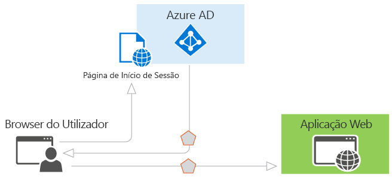

# Cenários de autenticação do Azure AD

Azure Active Directory (Azure AD) simplifica a autenticação para os desenvolvedores ao fornecer identidade como um serviço, com suporte para protocolos de norma da indústria, como o OAuth 2.0 e OpenID Connect, bem como código-fonte aberto bibliotecas para plataformas diferentes para o ajudar a começar a codificar rapidamente. Este artigo ajuda-o a compreender as vários suporta cenários do Azure AD e mostrar-lhe como começar a utilizar. Está dividido nas secções seguintes:

* [Noções básicas da autenticação do Azure AD](#basics-of-authentication-in-azure-ad)
* [Afirmações nos tokens de segurança do Azure AD](#claims-in-azure-ad-security-tokens)
* [Noções básicas do registo de aplicações no Azure AD](#basics-of-registering-an-application-in-azure-ad)
* [Tipos de aplicativos e cenários](#application-types-and-scenarios)

  * [Navegador da Web para a aplicação web](#web-browser-to-web-application)
  * [Aplicação de página única (SPA)](#single-page-application-spa)
  * [Aplicação nativa a API web](#native-application-to-web-api)
  * [Aplicação Web para a API web](#web-application-to-web-api)
  * [O daemon ou servidor de aplicativo web API](#daemon-or-server-application-to-web-api)

## Noções básicas da autenticação do Azure AD

Se não estiver familiarizado com conceitos básicos de autenticação no Azure AD, leia esta secção. Caso contrário, pode optar por ignorar para [tipos de aplicativos e cenários](#application-types-and-scenarios).

Vamos considerar o cenário mais básico, onde é necessária a identidade: um utilizador num navegador da web tem de autenticar uma aplicação web. Este cenário é descrito mais detalhadamente no [navegador da Web para o aplicativo web](#web-browser-to-web-application) secção, mas do ponto de partida útil para ilustrar os recursos do Azure AD e conceitualizar como funciona o cenário. Considere o seguinte diagrama para este cenário:

O diagrama acima em mente, eis o que precisa saber sobre os diversos componentes:

* O Azure AD é o fornecedor de identidade, responsável por verificar a identidade de usuários e aplicativos existentes no diretório da organização e, em última análise, emitir tokens de segurança após a autenticação com êxito desses usuários e aplicativos.
* Um aplicativo que deseja terceirizar a autenticação para o Azure AD tem de estar registado no Azure AD, que registra e identifica exclusivamente a aplicação no diretório.
* Os desenvolvedores podem usar as bibliotecas de autenticação de código-fonte aberto do Azure AD para que a autenticação mais fácil ao lidar com os detalhes de protocolo para. Para obter mais informações, consulte [bibliotecas de autenticação do Azure Active Directory](active-directory-authentication-libraries.md).
* Assim que um utilizador ser autenticado, a aplicação deve validar o token de segurança do utilizador para se certificar de que a autenticação foi efetuada com êxito. Temos exemplos do que o aplicativo deve fazer numa variedade de linguagens e estruturas no [GitHub](https://github.com/Azure-Samples?q=active-directory). Se estiver a criar uma aplicação web no ASP.NET, consulte a [adicionar início de sessão para um guia de aplicação web ASP.NET](https://docs.microsoft.com/en-us/azure/active-directory/develop/guidedsetups/active-directory-aspnetwebapp). Se estiver a criar um recurso de API do ASP.NET na web, consulte a [web API do guia de introdução](https://docs.microsoft.com/en-us/azure/active-directory/develop/active-directory-devquickstarts-webapi-dotnet).
* O fluxo de solicitações e respostas ao processo de autenticação é determinado pelo protocolo de autenticação que foi utilizado, tais como OAuth 2.0, OpenID Connect, WS-Federation ou SAML 2.0. Esses protocolos são discutidos em mais detalhes a [protocolos de autenticação do Azure Active Directory](active-directory-authentication-protocols.md) artigo e nas secções abaixo.

> [!NOTE]
> O Azure AD suporta o OAuth 2.0 e OpenID Connect padrões que fazem uso extensas utilizam tokens de portador, incluindo os tokens de portador representados como JWTs. R *token de portador* é um token de segurança simples que concede o acesso de "bearer" a um recurso protegido. Nesse sentido, "bearer" é capaz de apresentar o token de terceiros. Embora uma parte deve primeiro autenticar com o Azure AD para receber o token de portador, se não são tidas nos passos necessários para proteger o token na transmissão e o armazenamento, podem ser intercetado e utilizado por uma entidade não-intencionais. Embora alguns tokens de segurança tem um mecanismo interno para impedir que partes não autorizadas a utilizá-los, os tokens de portador não tem esse mecanismo e devam ser transportados num canal seguro, como a segurança de camada de transporte (HTTPS). Se um token de portador é transmitido de forma, um ataque man-in-the-middle pode ser utilizado por usuários mal-intencionados para adquirir o token e utilizá-lo para um acesso não autorizado a um recurso protegido. Os mesmos princípios de segurança se aplicam ao armazenar ou de colocação em cache os tokens de portador para utilização posterior. Certifique-se sempre de que seu aplicativo transmite e armazena os tokens de portador de forma segura. Para obter mais considerações de segurança em tokens de portador, consulte [RFC 6750 secção 5](http://tools.ietf.org/html/rfc6750).

Agora que tem uma descrição geral dos conceitos básicos, leia as secções abaixo para compreender como aprovisionamento funciona no Azure AD e os cenários comuns que o Azure AD suporta.

## Afirmações nos tokens de segurança do Azure AD

Tokens de segurança (acesso e tokens de ID) emitidos pelo Azure AD contêm afirmações ou asserções de informações sobre o assunto que foi autenticado. Essas declarações podem ser utilizadas pela aplicação para várias tarefas. Por exemplo, as aplicações podem utilizar afirmações para validar o token, identificar o inquilino do diretório do assunto, exibir informações de utilizador, determinar autorização o assunto e assim por diante. As ações presentes em qualquer token de segurança de determinado dependem do tipo de token, o tipo de credencial usado para autenticar o utilizador e a configuração da aplicação. Uma breve descrição de cada tipo de afirmação emitido pelo Azure AD é fornecida na tabela abaixo. Para obter mais informações, consulte [tipos de token e afirmação suportados](active-directory-token-and-claims.md).

| Afirmação | Descrição |
| --- | --- |
| ID da aplicação | Identifica a aplicação que está a utilizar o token. |
| Audiência | Identifica o recurso de destinatário que do token destina-se para. |
| Referência de classe de contexto de autenticação de aplicação | Indica como o cliente foi autenticado (cliente público versus cliente confidencial). |
| Autenticação instantâneas | Regista a data e hora em que ocorreu a autenticação. |
| Método de Autenticação | Indica como o assunto do token foi autenticado (palavra-passe, certificados, etc.). |
| Nome Próprio | Fornece o nome próprio do utilizador conforme definido no Azure AD. |
| Grupos | Contém os grupos de IDs do Azure AD de objeto que o utilizador é membro do. |
| Fornecedor de Identidade | Regista o fornecedor de identidade que autenticou o assunto do token. |
| Emitida em | Regista o tempo em que o token foi emitido, muitas vezes utilizado para atualização de token. |
| Emissor | Identifica o STS que emitidos o token, bem como o inquilino do Azure AD. |
| Apelido | Fornece o apelido do utilizador conforme definido no Azure AD. |
| Nome | Fornece um valor de legível humano que identifica o assunto do token. |
| ID de objeto | Contém um identificador exclusivo, imutável o assunto no Azure AD. |
| Funções | Contém os nomes amigáveis do Azure AD de funções de aplicação que o utilizador recebeu. |
| Âmbito | Indica as permissões concedidas à aplicação cliente. |
| Assunto | Indica o principal sobre o qual o token declara informações. |
| ID do inquilino | Contém um imutável, exclusivo o identificador de inquilino do diretório que emitiu o token. |
| Duração do token | Define o intervalo de tempo no qual um token é válido. |
| Nome do Principal de Utilizador | Contém o nome do principal de utilizador do assunto. |
| Versão | Contém o número de versão do token. |

## Noções básicas do registo de aplicações no Azure AD

Qualquer aplicativo que terceiriza a autenticação para o Azure AD tem de estar registado num diretório. Este passo envolve Azure AD a informar sobre a sua aplicação, incluindo o URL onde este se encontra, o URL para enviar respostas após a autenticação, o URI para identificar a sua aplicação e muito mais. Esta informação é necessária para alguns dos motivos principais:

* O Azure AD precisa para comunicar com o aplicativo ao processar o início de sessão ou trocas tokens. As informações passadas entre o Azure AD e o aplicativo inclui o seguinte:
  
  * **URI de ID de aplicação** -o identificador para uma aplicação. Este valor é enviado para o Azure AD durante a autenticação para indicar qual aplicativo o chamador deseja um token para. Além disso, este valor está incluído no token, para que a aplicação saiba que era o destino pretendido.
  * **URL de resposta** e **URI de redirecionamento** -para uma web API ou aplicação web, o URL de resposta é a localização onde o Azure AD irá enviar a resposta de autenticação, incluindo um token, se a autenticação foi efetuada com êxito. Para um aplicativo nativo, o URI de redirecionamento é um identificador exclusivo para o qual o Azure AD irá redirecionar o agente do usuário numa solicitação de OAuth 2.0.
  * **ID da aplicação** -o ID para uma aplicação, o que é gerada pelo Azure AD quando a aplicação fica registada. Quando pedir um código de autorização ou token, o ID da aplicação e a chave são enviadas para o Azure AD durante a autenticação.
  * **Chave** -a chave que é enviada com um ID de aplicação durante a autenticação para o Azure AD para chamar uma API web.
* O Azure AD precisa garantir que a aplicação tem as permissões necessárias para aceder aos seus dados de diretório, outras aplicações na sua organização e assim por diante.

Aprovisionamento ficará mais claro quando compreender o que há duas categorias de aplicações que podem ser desenvolvidas e integradas com o Azure AD:

* **Única aplicação de inquilino** -uma aplicação de inquilino único destina-se a utilização de uma organização. São, normalmente, linha de negócio (LoB) aplicativos escritos por um programador empresarial. Uma aplicação de inquilino individual apenas tem de ser acedidos por utilizadores num diretório e, assim, ele só precisa ser aprovisionado num diretório. Esses aplicativos são, normalmente, registados por um desenvolvedor na organização.
* **Aplicação multi-inquilino** -uma aplicação multi-inquilino destina-se para uso em muitas organizações, não apenas uma organização. Estas são normalmente software-como-serviço (SaaS) aplicações escritas por um fabricante de software independente (ISV). Aplicações de multi-inquilinos tem de ser aprovisionado em cada diretório em que serão utilizadas, necessita de consentimento do utilizador ou administrador para registá-los. Este processo de consentimento é iniciado quando uma aplicação foi registrada no diretório e é dado acesso para a Graph API ou talvez outro web API. Quando um utilizador ou administrador a partir de uma organização diferente se inscreve para utilizar a aplicação, é-lhes apresentada uma caixa de diálogo que apresenta as permissões que o aplicativo requer. O utilizador ou administrador pode, em seguida, autorizar o aplicativo, que dá à aplicação acesso aos dados declarados e, finalmente, regista o aplicativo em seu diretório. Para obter mais informações, consulte [descrição geral da estrutura de consentimento](quickstart-v1-integrate-apps-with-azure-ad.md#overview-of-the-consent-framework).

### Considerações adicionais durante o desenvolvimento de aplicações de inquilino ou multi-inquilino de único
Algumas considerações adicionais surgirem ao desenvolver uma aplicação multi-inquilino, em vez de uma aplicação de inquilino único. Por exemplo, se estiver fazendo seu aplicativo disponível para utilizadores em vários diretórios, terá um mecanismo para determinar qual o inquilino estão na. Uma aplicação de inquilino único apenas precisa de ter um aspeto em seu próprio diretório para um utilizador, enquanto uma aplicação de multi-inquilino precisa de identificar um utilizador específico no todos os diretórios no Azure AD. Para realizar esta tarefa, o Azure AD fornece um ponto de extremidade autenticação comum em que qualquer aplicação multi-inquilino pode direcionar o início de sessão solicitações, em vez de um ponto de extremidade específico de inquilino. Este ponto final fizer https://login.microsoftonline.com/common para todos os diretórios no Azure AD, enquanto que um ponto de extremidade específico de inquilino pode ser https://login.microsoftonline.com/contoso.onmicrosoft.com. O ponto de extremidade comum é especialmente importante a ter em consideração quando desenvolver a sua aplicação, porque terá da lógica necessária para lidar com vários inquilinos durante o início de sessão, fim de sessão e a validação do token.

Se estiver atualmente a desenvolver uma aplicação de inquilino único, mas pretende disponibilizar para muitas organizações, pode facilmente efetuar alterações para a aplicação e a respetiva configuração no Azure AD para torná-lo a multi-inquilino com capacidade. Além disso, o Azure AD utiliza a mesma chave de assinatura para todos os tokens em todos os diretórios, se está a fornecer autenticação num único inquilino ou aplicação multi-inquilino.

Cada cenário listado neste documento inclui uma subseção que descreve os requisitos de aprovisionamento. Para mais informações sobre aprovisionamento de uma aplicação no Azure AD e as diferenças entre aplicativos de únicas e multi-inquilinos, consulte [integrar aplicações com o Azure Active Directory](quickstart-v1-integrate-apps-with-azure-ad.md) para obter mais informações. Continue a ler para compreender os cenários comuns de aplicação no Azure AD.

## Tipos de aplicativos e cenários

Cada um dos cenários descritos aqui pode ser desenvolvida usando vários idiomas e plataformas. Todos são apoiados por exemplos de código completo disponíveis na [guia de amostras de código](active-directory-code-samples.md), ou diretamente a partir do correspondente [repositórios de exemplo do GitHub](https://github.com/Azure-Samples?q=active-directory). Além disso, se seu aplicativo precisar de uma parte específica ou um segmento de um cenário ponto-a-ponto, na maioria dos casos essa funcionalidade pode ser adicionada independentemente. Por exemplo, se tiver um aplicativo nativo que chama uma API web, pode adicionar facilmente uma aplicação web que também chama a API web. O diagrama seguinte ilustra estes cenários e tipos de aplicativos, e como componentes diferentes podem ser adicionados:

Estes são os cinco cenários de aplicação principal suportados pelo Azure AD:

* [Browser do aplicativo web](#web-browser-to-web-application): o utilizador precisa de iniciar sessão a uma aplicação web que está protegida pelo Azure AD.
* [A única aplicação de página (SPA)](#single-page-application-spa): um utilizador tem de iniciar sessão na aplicação de página única que está protegida pelo Azure AD.
* [Aplicação nativa a web API](#native-application-to-web-api): um aplicativo nativo que é executado num telefone, tablet ou PC tem de autenticar um usuário para obter recursos de uma API web que está protegida pelo Azure AD.
* [Aplicação Web API Web](#web-application-to-web-api): uma aplicação web tem de obter recursos de uma API web protegida pelo Azure AD.
* [O daemon ou servidor de aplicativo web API](#daemon-or-server-application-to-web-api): precisa de um aplicativo de daemon ou um aplicativo de servidor sem interface do usuário de web obter recursos de uma API web protegida pelo Azure AD.

### Navegador da Web para a aplicação web

Esta secção descreve um aplicativo que autentica um usuário num navegador da web a uma aplicação web. Neste cenário, o aplicativo web direciona o navegador do usuário para iniciar sessão-las Azure AD. O Azure AD devolve uma resposta de início de sessão por meio de navegador do usuário, que contém as afirmações sobre o utilizador num token de segurança. Este cenário suporta início de sessão utilizando os protocolos WS-Federation, SAML 2.0 e OpenID Connect.

#### Diagrama

#### Descrição do fluxo de protocolo

1. Quando um usuário visita o aplicativo e tem de iniciar sessão, é redirecionado através de um pedido de início de sessão para o ponto final de autenticação no Azure AD.
1. O utilizador inicia sessão na página de início de sessão.
1. Se a autenticação for bem-sucedida, o Azure AD cria um token de autenticação e devolve uma resposta de início de sessão para o URL de resposta do aplicativo que foi configurada no portal do Azure. Para uma aplicação de produção, este URL de resposta deve ser HTTPS. O token devolvido inclui declarações sobre o utilizador e o Azure AD, que são necessários pelo aplicativo para validar o token.
1. A aplicação valida o token com uma chave pública de assinatura e informações de emissor disponíveis no documento de metadados de Federação para o Azure AD. Depois da aplicação valida o token, inicia uma nova sessão com o utilizador. Esta sessão permite ao utilizador aceder à aplicação até expirar.

#### Exemplos de código

Veja os exemplos de código para o navegador da Web para cenários de aplicativo Web. E, visite-a freqüentemente--novos exemplos são adicionados com frequência. [Aplicação Web](active-directory-code-samples.md#web-applications).

#### A registar

* Inquilino único: Se estiver a criar uma aplicação apenas para a sua organização, tem de ser registado no diretório da sua empresa com o portal do Azure.
* Multi-inquilino: Se estiver a criar uma aplicação que pode ser utilizada por utilizadores fora da sua organização, ela deve ser registrada no diretório da sua empresa, mas também tem de estar registrada no diretório de cada organização que irá utilizar a aplicação. Para disponibilizar a aplicação no seu diretório, pode incluir um processo de inscrição para os seus clientes, que permite autorizar a aplicação. Quando se inscrevem no seu aplicativo, serão apresentadas com uma caixa de diálogo que mostra as permissões que a aplicação requer e, em seguida, a opção para dar consentimento. Consoante as permissões necessárias, um administrador da outra organização poderá ser necessário para dar consentimento. Quando o utilizador ou administrador autorizar, o aplicativo está registado no seu diretório. Para obter mais informações, consulte [integrar aplicações com o Azure Active Directory](quickstart-v1-integrate-apps-with-azure-ad.md).

#### Expiração do token

A sessão do utilizador expira quando expira o tempo de vida do token emitido pelo Azure AD. Seu aplicativo pode reduzir este período de tempo, se assim o desejar, por exemplo, terminar sessão dos utilizadores com base num período de inatividade. Quando a sessão expira, será pedido ao utilizador iniciar sessão novamente.

### Aplicação de página única (SPA)

Esta secção descreve a autenticação para um único aplicativo de página, que utiliza o Azure AD e a autorização implícita OAuth 2.0 concedem para proteger o seu web API volta terminar. Aplicativos de única página são estruturados geralmente como uma camada de apresentação de JavaScript (front-end) que é executado no navegador e um Web API back-end que é executado num servidor e implementa a lógica comercial do aplicativo. Para obter mais informações sobre a concessão de autorização implícita e ajudar a decidir se é adequada para o seu cenário de aplicação, veja [Noções básicas sobre o OAuth2 implícita conceder o fluxo no Azure Active Directory](active-directory-dev-understanding-oauth2-implicit-grant.md).

Neste cenário, quando o utilizador inicia sessão, o JavaScript de front-end utiliza [Active Directory Authentication Library para JavaScript (ADAL. JS)](https://github.com/AzureAD/azure-activedirectory-library-for-js) e a concessão de autorização implícita para obter um token de ID (id_token) do Azure AD. O token é colocado em cache e o cliente liga-ao pedido que o token de portador ao efetuar chamadas para a sua API Web back-end, que está protegida com o middleware da OWIN. 

#### Diagrama

#### Descrição do fluxo de protocolo

1. O utilizador navega para a aplicação web.
1. A aplicação devolve o front-end JavaScript (camada de apresentação) para o navegador.
1. O utilizador inicia sessão, por exemplo, clicando num link de início de sessão. O browser envia um GET para o ponto final de autorização do Azure AD para pedir um token de ID. Este pedido inclui o URL de ID e a resposta do aplicativo nos parâmetros de consulta.
1. O Azure AD valida o URL de resposta contra o URL de resposta registado, que foi configurada no portal do Azure.
1. O utilizador inicia sessão na página de início de sessão.
1. Se a autenticação for bem-sucedida, cria um token de ID do Azure AD e o retorna como um fragmento de URL (#) para o URL de resposta do aplicativo. Para uma aplicação de produção, este URL de resposta deve ser HTTPS. O token devolvido inclui declarações sobre o utilizador e o Azure AD, que são necessários pelo aplicativo para validar o token.
1. O código de cliente JavaScript em execução no browser extrai o token da resposta a utilizar na proteção de chamadas para web da aplicação que API volta termina.
1. O navegador chama web da aplicação API volta terminar com o token de ID no cabeçalho de autorização. O serviço de autenticação do Azure AD emite um token de ID que pode ser utilizado como um token de portador, se o recurso é o mesmo que o ID de cliente (neste caso, isso é verdadeiro como a API web é o back-end da aplicação). 

#### Exemplos de código

Veja os exemplos de código para cenários de aplicação de página única (SPA). Certifique-se de que visite-a freqüentemente--novos exemplos são adicionados com frequência. [A única aplicação de página (SPA)](active-directory-code-samples.md#single-page-applications).

#### A registar

* Inquilino único: Se estiver a criar uma aplicação apenas para a sua organização, tem de ser registado no diretório da sua empresa com o portal do Azure.
* Multi-inquilino: Se estiver a criar uma aplicação que pode ser utilizada por utilizadores fora da sua organização, ela deve ser registrada no diretório da sua empresa, mas também tem de estar registrada no diretório de cada organização que irá utilizar a aplicação. Para disponibilizar a aplicação no seu diretório, pode incluir um processo de inscrição para os seus clientes, que permite autorizar a aplicação. Quando se inscrevem no seu aplicativo, serão apresentadas com uma caixa de diálogo que mostra as permissões que a aplicação requer e, em seguida, a opção para dar consentimento. Consoante as permissões necessárias, um administrador da outra organização poderá ser necessário para dar consentimento. Quando o utilizador ou administrador autorizar, o aplicativo está registado no seu diretório. Para obter mais informações, consulte [integrar aplicações com o Azure Active Directory](quickstart-v1-integrate-apps-with-azure-ad.md).

Depois de registar a aplicação, tem de ser configurado para utilizar o protocolo de concessão implícita OAuth 2.0. Por predefinição, este protocolo está desabilitado para aplicativos. Para ativar o protocolo de concessão implícita OAuth2 para a sua aplicação, editar o manifesto da aplicação do portal do Azure e defina o valor de "oauth2AllowImplicitFlow" como true. Para obter instruções detalhadas, consulte [ativar o OAuth 2.0 concessão implícita para aplicações de página única](quickstart-v1-integrate-apps-with-azure-ad.md).

#### Expiração do token

Usar ADAL.js ajuda com:

* atualizar um token expirado
* pedir um token de acesso para chamar um recurso de API web

Após uma autenticação com êxito, o Azure AD escreve um cookie no navegador do usuário para estabelecer uma sessão. Tenha em atenção de que a sessão existe entre o utilizador e o Azure AD (não entre o utilizador e a aplicação web). Quando um token expira, ADAL.js utiliza esta sessão silenciosamente obter outro token. ADAL.js utiliza um iFrame oculto para enviar e receber a solicitação usando o protocolo de concessão implícito de OAuth. ADAL.js também pode utilizar esse mesmo mecanismo para obter silenciosamente os tokens de acesso para outros recursos de web API, o aplicativo chama, desde que esses recursos suportam os recursos de várias origens (CORS), de partilha são registadas no diretório do usuário, e qualquer consentimento necessário foi especificado pelo utilizador durante o início de sessão.

### Aplicação nativa a API web

Esta secção descreve um aplicativo nativo que chama uma API web em nome de um utilizador. Este cenário baseia-se no tipo de concessão de código de autorização OAuth 2.0 com um cliente público, conforme descrito na secção 4.1 dos [especificação do OAuth 2.0](http://tools.ietf.org/html/rfc6749). O aplicativo nativo obtém um token de acesso do utilizador utilizando o protocolo de OAuth 2.0. Esse token de acesso, em seguida, é enviado no pedido para a web API, que autoriza o usuário e retorna o recurso pretendido.

#### Diagrama

#### Descrição do fluxo de protocolo

Se estiver a utilizar as bibliotecas de autenticação do AD, a maioria dos detalhes descritos abaixo protocolo é processada para, como o pop-up do browser, tokens em cache e manipulação de tokens de atualização.

1. Usando um navegador pop-up, que o aplicativo nativo faz um pedido ao ponto final de autorização no Azure AD. Este pedido inclui o ID da aplicação e o URI de redirecionamento do aplicativo nativo, conforme mostrado no portal do Azure e o URI de ID da aplicação para a API web. Se o utilizador ainda não tiver iniciado sessão, é-lhes pedido para iniciar sessão novamente
1. O Azure AD autentica o utilizador. Se é uma aplicação multi-inquilino e é necessário usar o aplicativo o consentimento, o utilizador será necessário para dar consentimento se eles ainda não fez isso. Depois de conceder autorização e, após a autenticação com êxito, o Azure AD emite uma resposta de código de autorização volta para o URI de redirecionamento da aplicação cliente.
1. Quando o Azure AD emite uma resposta de código de autorização volta para o URI de redirecionamento, a aplicação cliente deixa de interação de navegador e extrai o código de autorização da resposta. Usando este código de autorização, a aplicação cliente envia um pedido ao ponto final de token do Azure AD que inclui o código de autorização, detalhes sobre a aplicação de cliente (ID da aplicação e URI de redirecionamento) e o recurso desejado (o URI de ID da aplicação para o Web API).
1. O código de autorização e as informações sobre a API web e de aplicação de cliente são validadas pelo Azure AD. Após a validação com êxito, o Azure AD devolve dois tokens: um token de acesso do JWT e um token de atualização do JWT. Além disso, o Azure AD devolve informações básicas sobre o usuário, como o respetivo ID de nome e de inquilino. exibição
1. Através de HTTPS, a aplicação cliente utiliza o token de acesso devolvido do JWT para adicionar a cadeia de caracteres do JWT com uma designação de "Bearer" no cabeçalho de autorização do pedido para a API web. A API web, em seguida, valida o token JWT e se a validação for bem-sucedida, retorna o recurso pretendido.
1. Quando o token de acesso expira, a aplicação cliente receberá um erro que indica que o utilizador tem de autenticar novamente. Se o aplicativo tem um token de atualização válido, ele pode ser usado para adquirir um novo token de acesso sem pedir ao utilizador que inicie sessão novamente. Se o token de atualização expirar, o aplicativo precisará de forma interativa autenticar o utilizador mais uma vez.

> [!NOTE]
> O token de atualização emitido pelo Azure AD pode ser utilizado para aceder a vários recursos. Por exemplo, se tiver uma aplicação de cliente que tenha permissão para chamar as APIs da web dois, o token de atualização pode servir-se para obter um acesso de token para a outra API web também.

#### Exemplos de código

Veja os exemplos de código para o aplicativo nativo para cenários de Web API. Além disso, visite-a freqüentemente – adicionamos novos exemplos com frequência. [Aplicação nativa a Web API](active-directory-code-samples.md#desktop-and-mobile-public-client-applications-calling-microsoft-graph-or-a-web-api).

#### A registar

* Inquilino único: A nativas de aplicativos e a API web têm de estar registados no mesmo diretório no Azure AD. A API web pode ser configurada para expor um conjunto de permissões, que são utilizadas para limitar o acesso da aplicação nativa aos seus recursos. A aplicação de cliente, em seguida, seleciona as permissões pretendidas no menu pendente "Permissões para outras aplicações" no portal do Azure.
* Multi-inquilino: Primeiro, o aplicativo nativo só registado no desenvolvedor ou diretório do publicador. Em segundo lugar, o aplicativo nativo está configurado para indicar as permissões que ele requer que seja funcional. Esta lista de permissões necessárias é mostrada numa caixa de diálogo quando um utilizador ou administrador no diretório de destino dá consentimento para a aplicação, o que torna disponível para a sua organização. Apenas algumas aplicações necessitam de permissões de nível de usuário, que pode consentir qualquer utilizador na organização. Outras aplicações requerem permissões de nível de administrador, que não pode autorizar um utilizador na organização. Apenas um administrador do diretório pode dar consentimento a aplicações que exigem esse nível de permissões. Quando o utilizador ou administrador autorizar, apenas a API de web está registada no respetivo diretório. Para obter mais informações, consulte [integrar aplicações com o Azure Active Directory](quickstart-v1-integrate-apps-with-azure-ad.md).

#### Expiração do token

Quando o aplicativo nativo usa seu código de autorização para obter token de acesso um JWT, também recebe um token de atualização do JWT. Quando o token de acesso expira, o token de atualização pode servir-se novamente à autenticação do utilizador sem a necessidade de iniciar sessão novamente. Este token de atualização, em seguida, é utilizado para autenticar o utilizador, que resulta num novo token de acesso e o token de atualização.

### Aplicação Web para a API web

Esta secção descreve uma aplicação web que precisa para obter recursos de uma API web. Neste cenário, existem dois tipos de identidade que o aplicativo web pode utilizar para autenticar e chamar a API web: uma identidade de aplicação ou uma identidade de usuário delegado.

*Identidade da aplicação:* este cenário utiliza a concessão de credenciais de cliente OAuth 2.0 para autenticar-se que a aplicação e aceder a API web. Quando utilizar uma identidade de aplicação, a web API só pode detetar que o aplicativo web é chamá-la, como o web API não recebeu qualquer informação sobre o utilizador. Se o aplicativo recebe informações sobre o utilizador, este será enviado através do protocolo de aplicação e não está assinado pelo Azure AD. A API web confia que o aplicativo web autenticar o utilizador. Por esse motivo, esse padrão é chamado de um subsistema confiável.

*Delegado a identidade de utilizador:* este cenário pode ser feito de duas formas: OpenID Connect e concessão de código de autorização de OAuth 2.0 com um cliente confidencial. A aplicação web obtém um token de acesso para o utilizador, o que comprova a web API que o utilizador autenticado com êxito para a aplicação web e de que a aplicação web foi capaz de obter uma identidade de utilizador delegado para chamar a API web. Esse token de acesso é enviado no pedido para a web API, que autoriza o usuário e retorna o recurso pretendido.

#### Diagrama

#### Descrição do fluxo de protocolo

A identidade da aplicação e os tipos de identidade do utilizador delegado são abordados no fluxo abaixo. A principal diferença entre eles é que a identidade de utilizador delegado deve primeiramente adquirir um código de autorização antes do utilizador pode iniciar sessão e obter acesso para a API web.

##### Conceder a identidade da aplicação com credenciais de cliente OAuth 2.0

1. Um utilizador tem sessão iniciado para o Azure AD na aplicação web (consulte a [navegador da Web para o aplicativo Web](#web-browser-to-web-application) acima).
1. A aplicação web tem de adquirir um token de acesso, para que possa autenticar para a API web e recuperar o recurso pretendido. Ele faz um pedido ao ponto final de token do Azure AD, fornecendo a credencial, o ID da aplicação e o URI de ID da aplicação da API web.
1. O Azure AD autentica o aplicativo e devolve um token de acesso do JWT que é utilizado para chamar a API web.
1. Através de HTTPS, a aplicação web utiliza o token de acesso devolvido do JWT para adicionar a cadeia de caracteres do JWT com uma designação de "Bearer" no cabeçalho de autorização do pedido para a API web. A API web, em seguida, valida o token JWT e se a validação for bem-sucedida, retorna o recurso pretendido.

##### Identidade de utilizador delegado com OpenID Connect

1. Um usuário está conectado a uma aplicação web com o Azure AD (veja a [navegador da Web para o aplicativo Web](#web-browser-to-web-application) secção acima). Se o utilizador da aplicação web não consentiu ainda para permitir que a aplicação web para chamar a API web em seu nome, o utilizador terá de dar consentimento. A aplicação irá apresentar as permissões requer e, se qualquer uma dessas permissões ao nível do administrador, um usuário normal no diretório não será capaz de dar consentimento. Este processo de consentimento só se aplica a aplicações multi-inquilino, aplicações de inquilino não único, como o aplicativo já terá as permissões necessárias. Quando o usuário conectado, a aplicação web foi recebido um token de ID com informações sobre o utilizador, bem como um código de autorização.
1. Usando o código de autorização emitido pelo Azure AD, o aplicativo web envia um pedido ao ponto final de token do Azure AD que inclui o código de autorização, detalhes sobre a aplicação de cliente (ID da aplicação e URI de redirecionamento) e o recurso desejado (ID da aplicação URI para a API web).
1. O código de autorização e as informações sobre o aplicativo web e a web API são validadas pelo Azure AD. Após a validação com êxito, o Azure AD devolve dois tokens: um token de acesso do JWT e um token de atualização do JWT.
1. Através de HTTPS, a aplicação web utiliza o token de acesso devolvido do JWT para adicionar a cadeia de caracteres do JWT com uma designação de "Bearer" no cabeçalho de autorização do pedido para a API web. A API web, em seguida, valida o token JWT e se a validação for bem-sucedida, retorna o recurso pretendido.

##### Identidade de utilizador delegado com a concessão do código de autorização de OAuth 2.0

1. Um utilizador já tiver sessão iniciado aplicativo web, cujo mecanismo de autenticação é independente do Azure AD.
1. O aplicativo web requer um código de autorização para adquirir um token de acesso, portanto, ele emite um pedido por meio do navegador para o ponto final de autorização do Azure AD, fornecendo o ID da aplicação e URI de redirecionamento para a aplicação web após a autenticação com êxito. O utilizador inicia sessão com o Azure AD.
1. Se o utilizador da aplicação web não consentiu ainda para permitir que a aplicação web para chamar a API web em seu nome, o utilizador terá de dar consentimento. A aplicação irá apresentar as permissões requer e, se qualquer uma dessas permissões ao nível do administrador, um usuário normal no diretório não será capaz de dar consentimento. Este consentimento aplica-se a aplicação de única e multi-inquilino. No caso do inquilino único, um administrador pode executar o consentimento para consentimento de administrador em nome dos seus utilizadores. Isso pode ser feito com o `Grant Permissions` botão no [Portal do Azure](https://portal.azure.com). 
1. Depois do utilizador consentiu, o aplicativo web recebe o código de autorização que necessita para adquirir um token de acesso.
1. Usando o código de autorização emitido pelo Azure AD, o aplicativo web envia um pedido ao ponto final de token do Azure AD que inclui o código de autorização, detalhes sobre a aplicação de cliente (ID da aplicação e URI de redirecionamento) e o recurso desejado (ID da aplicação URI para a API web).
1. O código de autorização e as informações sobre o aplicativo web e a web API são validadas pelo Azure AD. Após a validação com êxito, o Azure AD devolve dois tokens: um token de acesso do JWT e um token de atualização do JWT.
1. Através de HTTPS, a aplicação web utiliza o token de acesso devolvido do JWT para adicionar a cadeia de caracteres do JWT com uma designação de "Bearer" no cabeçalho de autorização do pedido para a API web. A API web, em seguida, valida o token JWT e se a validação for bem-sucedida, retorna o recurso pretendido.

#### Exemplos de código

Veja os exemplos de código para a aplicação Web para cenários de Web API. E, visite-a freqüentemente--novos exemplos são adicionados com frequência. Web [aplicativo Web API](active-directory-code-samples.md#web-applications-signing-in-users-calling-microsoft-graph-or-a-web-api-with-the-users-identity).

#### A registar

* Inquilino único: Para a identidade da aplicação e casos de identidade do utilizador delegado, o aplicativo web e a API web tem de estar registado no mesmo diretório no Azure AD. A API web pode ser configurada para expor um conjunto de permissões, que são utilizadas para limitar o acesso da aplicação web para seus recursos. Se está a ser utilizado um tipo de identidade do utilizador delegado, a aplicação web tem de selecionar as permissões pretendidas no menu pendente "Permissões para outras aplicações" no portal do Azure. Este passo não é necessário se o tipo de identidade da aplicação está a ser utilizado.
* Multi-inquilino: Primeiro, o aplicativo web está configurado para indicar as permissões que ele requer que seja funcional. Esta lista de permissões necessárias é mostrada numa caixa de diálogo quando um utilizador ou administrador no diretório de destino dá consentimento para a aplicação, o que torna disponível para a sua organização. Apenas algumas aplicações necessitam de permissões de nível de usuário, que pode consentir qualquer utilizador na organização. Outras aplicações requerem permissões de nível de administrador, que não pode autorizar um utilizador na organização. Apenas um administrador do diretório pode dar consentimento a aplicações que exigem esse nível de permissões. Quando o utilizador ou administrador autorizar, o aplicativo web e a API web são ambos registados no respetivo diretório.

#### Expiração do token

Quando a aplicação web utiliza o seu código de autorização ao obter o token de acesso de um JWT, também recebe um token de atualização do JWT. Quando o token de acesso expira, o token de atualização pode servir-se novamente à autenticação do utilizador sem a necessidade de iniciar sessão novamente. Este token de atualização, em seguida, é utilizado para autenticar o utilizador, que resulta num novo token de acesso e o token de atualização.

### O daemon ou servidor de aplicativo web API

Esta secção descreve um aplicativo de daemon ou servidor que precisa para obter recursos de uma API web. Existem dois cenários secundárias que se aplicam a esta secção: um daemon que precisa chamar uma API web, baseado no tipo de concessão de credenciais de cliente OAuth 2.0; e um aplicativo de servidor (por exemplo, uma API web) que precisa chamar uma API web, criado na especificação do OAuth 2.0 On-Behalf-Of rascunho.

Para o cenário quando um aplicativo de daemon precisa chamar uma API web, é importante compreender algumas coisas. Em primeiro lugar, a interação do utilizador não é possível com uma aplicação de daemon, que requer que a aplicação ter sua própria identidade. Um exemplo de um aplicativo de daemon é uma tarefa do batch, ou um serviço de sistema operativo em execução em segundo plano. Este tipo de aplicativo solicita um token de acesso ao utilizar a sua identidade da aplicação e apresentar o seu ID da aplicação, a credencial (palavra-passe ou certificado) e o aplicativo URI de ID para o Azure AD. Após a autenticação com êxito, o daemon de recebe um token de acesso do Azure AD, em seguida, é utilizado para chamar a API web.

Para o cenário quando uma aplicação de servidor precisa chamar uma API web, é útil usar um exemplo. Imagine que um usuário foi autenticado num aplicativo nativo, e esse aplicativo nativo precisa para chamar uma API web. O Azure AD emite um token de acesso do JWT para chamar a API web. Se a API web precisa chamar outra API web a jusante, ele pode usar o fluxo em-nome-de delegar a identidade do utilizador e autenticar para a API da web de segundo nível.

#### Diagrama

#### Descrição do fluxo de protocolo

##### Conceder a identidade da aplicação com credenciais de cliente OAuth 2.0

1. Em primeiro lugar, a aplicação de servidor tem de autenticar com o Azure AD em nome próprio, sem qualquer interação humana, como um diálogo de início de sessão interativo. Ele faz um pedido ao ponto final de token do Azure AD, fornecendo a credencial, o ID da aplicação e o URI de ID da aplicação.
1. O Azure AD autentica o aplicativo e devolve um token de acesso do JWT que é utilizado para chamar a API web.
1. Através de HTTPS, a aplicação web utiliza o token de acesso devolvido do JWT para adicionar a cadeia de caracteres do JWT com uma designação de "Bearer" no cabeçalho de autorização do pedido para a API web. A API web, em seguida, valida o token JWT e se a validação for bem-sucedida, retorna o recurso pretendido.

##### Identidade de utilizador delegado com a especificação do OAuth 2.0 On-Behalf-Of rascunho

O fluxo abordado a seguir pressupõe que um utilizador ser autenticado no outro aplicativo (como uma aplicação nativa) e a identidade de utilizador foi utilizada para adquirir um token de acesso para a API da web de primeiro nível.

1. O aplicativo nativo envia o token de acesso para a API da web de primeiro nível.
1. A API da web de primeiro nível envia um pedido ao ponto final de token do Azure AD, fornecendo o ID da aplicação e as credenciais, bem como o token de acesso do utilizador. Além disso, a solicitação é enviada com um on_behalf_of parâmetro que indica a web API é solicitar novos tokens para chamar uma API web a jusante em nome do utilizador original.
1. O Azure AD verifica que a API da web de primeiro nível tem permissões para aceder a API da web de segundo nível e valida a solicitação, retornando um token de acesso do JWT e token para a API da web de primeiro nível de atualização de um JWT.
1. Através de HTTPS, a API web de primeiro nível, em seguida, chama a API da web de segundo camada, acrescentando a cadeia de caracteres de token no cabeçalho de autorização no pedido. A API da web de primeiro nível pode continuar a chamar a API da web de segundo nível, desde que o token de acesso e tokens de atualização são válidos.

#### Exemplos de código

Veja os exemplos de código para Daemon ou uma aplicação de servidor para cenários de Web API. E, visite-a freqüentemente--novos exemplos são adicionados com frequência. [Servidor ou aplicativo de Daemon, a API Web](active-directory-code-samples.md#daemon-applications-accessing-web-apis-with-the-applications-identity)

#### A registar

* Inquilino único: Para a identidade da aplicação e casos de identidade do utilizador delegado, o aplicativo de daemon ou servidor tem de estar registado no mesmo diretório no Azure AD. A API web pode ser configurada para expor um conjunto de permissões, que são utilizados para limitar o daemon ou acesso ao seus recursos do servidor. Se está a ser utilizado um tipo de identidade do utilizador delegado, a aplicação de servidor tem de selecionar as permissões pretendidas no menu pendente "Permissões para outras aplicações" no portal do Azure. Este passo não é necessário se o tipo de identidade da aplicação está a ser utilizado.
* Multi-inquilino: em primeiro lugar, o aplicativo de daemon ou o servidor está configurado para indicar as permissões que ele requer que seja funcional. Esta lista de permissões necessárias é mostrada numa caixa de diálogo quando um utilizador ou administrador no diretório de destino dá consentimento para a aplicação, o que torna disponível para a sua organização. Apenas algumas aplicações necessitam de permissões de nível de usuário, que pode consentir qualquer utilizador na organização. Outras aplicações requerem permissões de nível de administrador, que não pode autorizar um utilizador na organização. Apenas um administrador do diretório pode dar consentimento a aplicações que exigem esse nível de permissões. Quando o utilizador ou administrador autorizar, ambas as APIs da web estão registadas no respetivo diretório.

#### Expiração do token

Quando o primeiro aplicativo utiliza o seu código de autorização ao obter o token de acesso de um JWT, também recebe um token de atualização do JWT. Quando o token de acesso expira, o token de atualização pode servir-se novamente à autenticação do utilizador sem pedir credenciais. Este token de atualização, em seguida, é utilizado para autenticar o utilizador, que resulta num novo token de acesso e o token de atualização.

## Consultar Também

[Guia para programadores do Azure Active Directory](azure-ad-developers-guide.md)

[Exemplos de código do Azure Active Directory](active-directory-code-samples.md)

[Informações importantes sobre o Rollover da chave de assinatura no Azure AD](active-directory-signing-key-rollover.md)

[OAuth 2.0 no Azure AD](https://msdn.microsoft.com/library/azure/dn645545.aspx)
