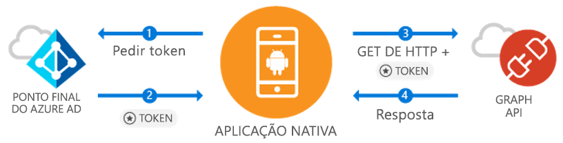

# <a name="quickstart-sign-in-users-and-call-the-microsoft-graph-api-from-an-android-app"></a>Início rápido: Iniciar sessão dos utilizadores e chamar a API do Microsoft Graph a partir de uma aplicação Android

[!INCLUDE [active-directory-develop-applies-v1-adal](../../../includes/active-directory-develop-applies-v1-adal.md)]

Se estiver a desenvolver uma aplicação Android, a Microsoft torna o processo de início de sessão dos utilizadores no Azure Active Directory (Azure AD) simples e direto. O Azure AD permite que a sua aplicação obtenha acesso a dados de utilizador através do Microsoft Graph ou da sua própria API WEB protegida.

A biblioteca do Android do Azure AD Authentication Library (ADAL) permite que a aplicação começar a utilizar o [Cloud do Microsoft Azure](https://cloud.microsoft.com) e [API do Microsoft Graph](https://developer.microsoft.com/graph) ao suportar [Microsoft Azure Contas do Active Directory](https://azure.microsoft.com/services/active-directory/) com o setor padrão OAuth 2.0 e OpenID Connect.

Neste início rápido, vai aprender a:

* Obter um token para o Microsoft Graph
* Atualizar um token
* Chamar o Microsoft Graph
* Terminar a sessão do utilizador

## <a name="prerequisites"></a>Pré-requisitos

Para começar, vai precisar de um inquilino do Azure AD no qual possa criar utilizadores e registar uma aplicação. Se ainda não tiver um inquilino, [saiba como obter um](quickstart-create-new-tenant.md).

## <a name="scenario-sign-in-users-and-call-the-microsoft-graph"></a>Cenário: Iniciar sessão dos utilizadores e chamar o Microsoft Graph



Pode utilizar esta aplicação para todas as contas do Azure AD. Suporta cenários de inquilino único e multi-inquilino (discutidos nos passos). Demonstra como pode criar aplicações para ligar a utilizadores empresariais e aceder aos seus dados do Azure + O365 através do Microsoft Graph. Durante o fluxo de autenticação, os utilizadores finais precisarão de iniciar sessão e consentir as permissões da aplicação e, em alguns casos, pode ser preciso que um administrador dê o consentimento para a aplicação. A maioria da lógica neste exemplo mostra como autenticar um utilizador final e fazer uma chamada básica ao Microsoft Graph.

## <a name="sample-code"></a>Código de exemplo

Pode encontrar o código de exemplo completo [no GitHub](https://github.com/Azure-Samples/active-directory-android).

```Java
// Initialize your app with MSAL
AuthenticationContext mAuthContext = new AuthenticationContext(
        MainActivity.this,
        AUTHORITY,
        false);


// Perform authentication requests
mAuthContext.acquireToken(
    getActivity(),
    RESOURCE_ID,
    CLIENT_ID,
    REDIRECT_URI,
    PromptBehavior.Auto,
    getAuthInteractiveCallback());

// ...

// Get tokens to call APIs like the Microsoft Graph
mAuthResult.getAccessToken()
```

## <a name="step-1-register-and-configure-your-app"></a>Passo 1: Registar e configurar a sua aplicação

Terá de ter uma aplicação cliente nativa registada na Microsoft com o [portal do Azure](https://portal.azure.com).

1. Aceder ao registo de aplicações
    - Navegue para o [portal do Azure](https://aad.portal.azure.com).
    - Selecione ***Azure Active Directory*** > ***Registos das Aplicações***.

2. Criar a aplicação
    - Selecione **Novo registo de aplicação**.
    - Introduza um nome de aplicação no campo **Nome**.
    - Em **Tipo de aplicação**, selecione **Nativa**.
    - Em **URI de Redirecionamento**, introduza `http://localhost`.

3. Configurar o Microsoft Graph
    - Selecione **Definições > Permissões obrigatórias**.
    - Selecione **Adicionar** e, dentro de **Selecionar uma API**, selecione ***Microsoft Graph***.
    - Selecione a permissão **Iniciar sessão e ler perfil do utilizador** e clique em **Selecionar** para guardar.
        - Esta permissão é mapeada para o âmbito `User.Read`.
    - Opcional: Dentro **permissões obrigatórias > Windows Azure Active Directory**, remova a permissão selecionada **iniciar sessão e ler o perfil de utilizador**. Esta ação irá evitar que a página de consentimento do utilizador apresente a permissão duas vezes.

4. Parabéns! A sua aplicação está corretamente configurada. Na secção seguinte, terá de:
    - `Application ID`
    - `Redirect URI`

## <a name="step-2-get-the-sample-code"></a>Passo 2: Obter o código de exemplo

1. Clone o código.
    ```
    git clone https://github.com/Azure-Samples/active-directory-android
    ```
2. Abra o exemplo no Android Studio.
    - Selecione **Open an existing Android Studio project** (Abrir um projeto existente do Android Studio).

## <a name="step-3-configure-your-code"></a>Passo 3: Configurar o seu código

Pode encontrar toda a configuração para este exemplo de código no ficheiro ***src/main/java/com/azuresamples/azuresampleapp/MainActivity.java***.

1. Substitua a constante `CLIENT_ID` pelo `ApplicationID`.
2. Substitua a constante `REDIRECT URI` pelo `Redirect URI` que configurou anteriormente (`http://localhost`).

## <a name="step-4-run-the-sample"></a>Passo 4: Executar o exemplo

1. Selecione **Compilar > Limpar Projeto**.
2. Selecione **Executar > Executar aplicação**.
3. A aplicação deve criar e mostrar alguma UX básica. Quando clica no botão `Call Graph API`, irá pedir um início de sessão e, em seguida, chamar silenciosamente a Microsoft Graph API com o novo token.

## <a name="next-steps"></a>Passos Seguintes

1. Consulte o [Wiki ADAL Android](https://github.com/AzureAD/azure-activedirectory-library-for-android/wiki) para obter mais informações sobre a mecânica da biblioteca e como configurar novos cenários e capacidades.
2. Em cenários Nativos, a aplicação vai utilizar uma Webview incorporada e não deixará a aplicação. O `Redirect URI` pode ser arbitrário.
3. Deparou-se com problemas ou tem pedidos? Pode criar um problema ou publicar no Stack Overflow com a marca `azure-active-directory`.

### <a name="cross-app-sso"></a>SSO entre várias aplicações

Saiba [como ativar o SSO entre várias aplicações em Android com a ADAL](howto-v1-enable-sso-android.md).

### <a name="auth-telemetry"></a>Telemetria de autenticação

A biblioteca ADAL expõe telemetria de autenticação para ajudar os programadores de aplicações a compreenderem o comportamento das suas aplicações e criar melhores experiências. Isto permite-lhe capturar o êxito do início de sessão, os utilizadores ativos e várias outras informações interessantes. A utilização da telemetria de autenticação requer que os programadores de aplicações estabeleçam um serviço de telemetria para agregar e armazenar eventos.

Para saber mais sobre a telemetria de autenticação, veja [Telemetria de autenticação da ADAL Android](https://github.com/AzureAD/azure-activedirectory-library-for-android/wiki/Telemetry).
