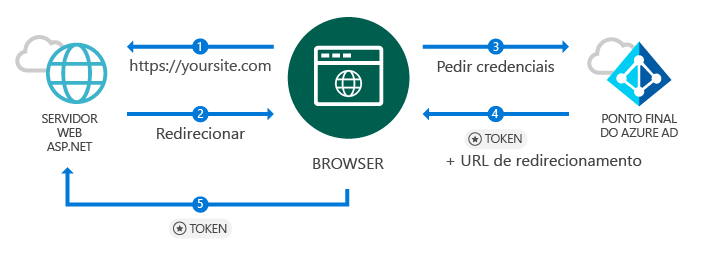
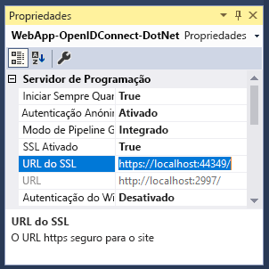
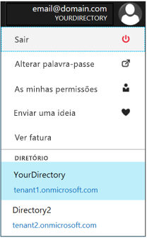
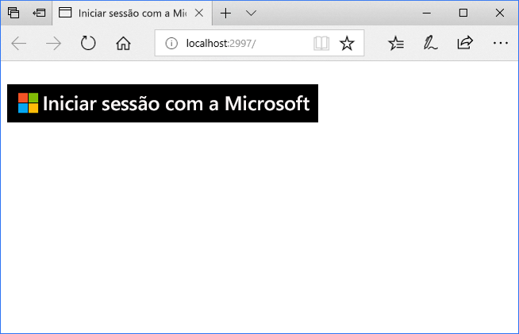
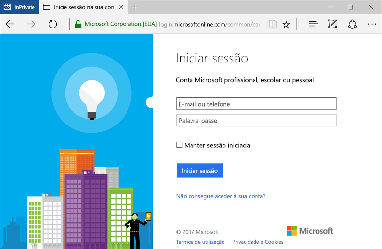

# <a name="quickstart-add-sign-in-with-microsoft-to-an-aspnet-web-app"></a>Início Rápido: adicionar início de sessão com a Microsoft a uma aplicação Web ASP.NET

[!INCLUDE [active-directory-develop-applies-v1](../../../includes/active-directory-develop-applies-v1.md)]

Neste início rápido, vai aprender a implementar o início de sessão com a Microsoft, através de uma solução ASP.NET MVC tradicional baseada no browser através de OpenID Connect. Vai aprender a permitir inícios de sessão das contas profissionais ou escolares na aplicação ASP.NET.

No final deste início rápido, a aplicação irá aceitar inícios de sessão de contas profissionais e escolares de organizações que se integraram no Azure Active Directory (Azure AD).

> [!NOTE]
> Se precisar de permitir inícios de sessão de contas pessoais, além de contas profissionais e escolares, pode utilizar o [ponto final v2.0](azure-ad-endpoint-comparison.md). Para obter mais informações, veja [este tutorial do ASP.NET para o ponto final v2.0](tutorial-v2-asp-webapp.md), bem como [este artigo](active-directory-v2-limitations.md), que explica as limitações atuais do ponto final v2.0.

## <a name="prerequisites"></a>Pré-requisitos

Para começar, certifique-se de que cumpre estes pré-requisitos:

* Ter o Visual Studio 2015 Update 3 ou o Visual Studio 2017 instalado. Não o tem? [Transferir o Visual Studio 2017 gratuitamente](https://www.visualstudio.com/downloads/)

## <a name="scenario-sign-in-users-from-work-and-school-accounts-in-your-aspnet-app"></a>Cenário: iniciar sessão de utilizadores de contas profissionais e escolares na aplicação ASP.NET



Neste cenário, um browser acede a um site do ASP.NET e pede ao utilizador para autenticar com um botão de início de sessão. Neste cenário, a maior parte do trabalho para compor a página Web ocorre do lado do servidor.

O início rápido demonstra como iniciar a sessão dos utilizadores numa aplicação Web ASP.NET a partir de um modelo em branco e inclui passos de como adicionar um botão de início de sessão e cada controlador e os métodos, e aborda os conceitos subjacentes a estas tarefas. Em alternativa, também pode criar um projeto para iniciar a sessão de utilizadores do Azure AD (contas profissionais e escolares) através do [modelo Web do Visual Studio](https://docs.microsoft.com/aspnet/visual-studio/overview/2013/creating-web-projects-in-visual-studio#organizational-account-authentication-options) e ao selecionar **contas organizacionais** e, em seguida, uma das opções da cloud. Esta opção utiliza um modelo mais avançado, com vistas, métodos e controladores adicionais.

## <a name="libraries"></a>Bibliotecas

Este início rápido utiliza os seguintes pacotes:

| Biblioteca | Descrição |
|---|---|
| [Microsoft.Owin.Security.OpenIdConnect](https://www.nuget.org/packages/Microsoft.Owin.Security.OpenIdConnect/) | Middleware que permite que uma aplicação utilize o OpenIdConnect para autenticação |
| [Microsoft.Owin.Security.Cookies](https://www.nuget.org/packages/Microsoft.Owin.Security.Cookies) |Middleware que permite que uma aplicação mantenha a sessão de utilizador com cookies |
| [Microsoft.Owin.Host.SystemWeb](https://www.nuget.org/packages/Microsoft.Owin.Host.SystemWeb) | Permite que as aplicações com base em OWIN sejam executados nos IIS através do pipeline de pedidos do ASP.NET |
|  |  |

## <a name="step-1-set-up-your-project"></a>Passo 1: configurar o seu projeto

Estes passos mostram como instalar e configurar o pipeline de autenticação através do middleware OWIN num projeto ASP.NET com o OpenID Connect.

Para transferir o projeto do Visual Studio deste exemplo em vez disso, siga estes passos:
1. [Transfira o projeto do GitHub](https://github.com/AzureADQuickStarts/WebApp-OpenIdConnect-DotNet/archive/GuidedSetup.zip).
1. Avance para o [Passo de configuração](#configure-your-webconfig-and-register-an-application) para configurar o exemplo de código antes de executar.

## <a name="step-2-create-your-aspnet-project"></a>Passo 2: criar o seu projeto ASP.NET

1. No Visual Studio, aceda a **Ficheiro -> Novo -> Projeto**.
2. Em **Visual C#\Web**,selecione **Aplicação Web ASP.NET (.NET Framework)**.
3. Dê um nome à aplicação e selecione **OK**.
4. Selecione **Vazio** e, em seguida, selecione a caixa de verificação para adicionar referências **MVC**.

## <a name="step-3-add-authentication-components"></a>Passo 3: adicionar os componentes de autenticação

1. No Visual Studio, aceda a **Ferramentas > Gestor de Pacotes Nuget >Consola do Gestor de Pacotes**.
2. Adicione **Pacotes NuGet de middleware OWIN**, escrevendo o seguinte na janela da Consola do Gestor de Pacotes:

    ```powershell
    Install-Package Microsoft.Owin.Security.OpenIdConnect
    Install-Package Microsoft.Owin.Security.Cookies
    Install-Package Microsoft.Owin.Host.SystemWeb
    ```

<!--start-collapse-->
> ### <a name="about-these-packages"></a>Sobre estes pacotes
>As bibliotecas acima ativam o início de sessão único (SSO) com o OpenID Connect através da autenticação baseada em cookies. Depois de a autenticação estar concluída e o token que representa o utilizador ser enviado para a sua aplicação, o middleware OWIN cria um cookie de sessão. O browser utiliza então esse cookie em pedidos subsequentes, para que o utilizador não tenha de voltar a autenticar, e não é necessária nenhuma verificação adicional.
<!--end-collapse-->

## <a name="step-4-configure-the-authentication-pipeline"></a>Passo 4: configurar o pipeline de autenticação

Siga estes passos para criar um middleware OWIN *Classe de Arranque* para configurar a autenticação do OpenID Connect. Esta classe é executada automaticamente.

> [!TIP]
> Se o projeto não tiver um ficheiro `Startup.cs` na pasta raiz:<br/>
> 1. Clique com o botão direito do rato na pasta raiz do projeto: > **Adicionar > Novo Item... > Classe de Arranque do OWIN**<br/>
> 2. Dê-lhe o nome `Startup.cs`<br/>
>
>> Certifique-se de que a classe selecionada é uma Classe de Arranque do OWIN e não uma classe C# padrão. Para confirmar, verifique se vê `[assembly: OwinStartup(typeof({NameSpace}.Startup))]` por cima do espaço de nomes.

Para criar uma *Classe de Arranque* de middleware OWIN:

1. Adicione os espaços de nomes *OWIN* e *Microsoft.IdentityModel* a `Startup.cs`:

    [!code-csharp[main](../../../WebApp-OpenIDConnect-DotNet/WebApp-OpenIDConnect-DotNet/Startup.cs?name=AddedNameSpaces "Startup.cs")]

2. Substitua a classe de Arranque pelo código seguinte:

    [!code-csharp[main](../../../WebApp-OpenIDConnect-DotNet/WebApp-OpenIDConnect-DotNet/Startup.cs?name=Startup "Startup.cs")]

<!--start-collapse-->
> [!NOTE]
> Os parâmetros que fornecer em *OpenIDConnectAuthenticationOptions* servem de coordenadas para a aplicação comunicar com o Azure AD. Dado que o middleware do OpenID Connect utiliza cookies, terá também de configurar a autenticação de cookies, tal como mostra o código anterior. O valor *ValidateIssuer* diz ao OpenIdConnect para não restringir o acesso a uma organização específica.
<!--end-collapse-->

<!--end-setup-->

<!--start-use-->

## <a name="step-5-add-a-controller-to-handle-sign-in-and-sign-out-requests"></a>Passo 5: adicionar um controlador para processar pedidos de início de sessão e fim de sessão

Crie um novo controlador para expor os métodos de início de sessão e fim de sessão.

1.  Clique com o botão direito do rato na pasta **Controladores** e selecione **Adicionar > Controlador**
2.  Selecione **Controlador MVC (versão .NET) – Vazio**.
3.  Selecione **Adicionar**.
4.  Dê-lhe o nome `HomeController` e selecione **Adicionar**.
5.  Adicione espaços de nomes **OWIN** à classe:

    [!code-csharp[main](../../../WebApp-OpenIDConnect-DotNet/WebApp-OpenIDConnect-DotNet/Controllers/HomeController.cs?name=AddedNameSpaces "HomeController.cs")]

6. Adicione os seguintes métodos para processar o início de sessão e fim de sessão para o seu controlador, iniciando um desafio de autenticação por meio do código:

    [!code-csharp[main](../../../WebApp-OpenIDConnect-DotNet/WebApp-OpenIDConnect-DotNet/Controllers/HomeController.cs?name=SigInAndSignOut "HomeController.cs")]

## <a name="step-6-create-the-apps-home-page-to-sign-in-users-via-a-sign-in-button"></a>Passo 6: criar a página de boas-vindas da aplicação para os utilizadores iniciarem sessão através de um botão de início de sessão

No Visual Studio, crie uma nova vista para adicionar o botão de início de sessão e apresentar informações do utilizador após a autenticação:

1. Clique com o botão direito do rato na pasta **Vistas\Início** e selecione **Adicionar Vista**.
1. Dê-lhe o nome **Índice**.
1. Adicione o seguinte HTML, que inclui o botão de início de sessão, ao ficheiro:

    [!code-html[main](../../../WebApp-OpenIDConnect-DotNet/WebApp-OpenIDConnect-DotNet/Views/Home/Index.cshtml "Index.cshtml")]

<!--start-collapse--> Esta página adiciona um botão de início de sessão no formato SVG com um fundo preto:<br/><br/> Para obter mais botões de início de sessão, aceda a [Diretrizes de imagem corporativa para aplicações](howto-add-branding-in-azure-ad-apps.md).
<!--end-collapse-->

## <a name="step-7-display-users-claims-by-adding-a-controller"></a>Passo 7: apresentar afirmações de utilizadores ao adicionar um controlador

Este controlador demonstra as utilizações do atributo `[Authorize]` para proteger um controlador. Este atributo restringe o acesso ao controlador, permitindo apenas utilizadores autenticados. O código seguinte utiliza o atributo para apresentar afirmações de utilizador que foram obtidas como parte do início de sessão.

1. Clique com o botão direito do rato na pasta **Controladores** e, em seguida, selecione **Adicionar > Controlador**.
1. Selecione **Controlador MVC {versão} – Vazio**.
1. Selecione **Adicionar**.
1. Dê-lhe o nome **ClaimsController**.
1. Substitua o código da sua classe de controlador pelo código seguinte - esta ação adiciona o atributo `[Authorize]` à classe:

    [!code-csharp[main](../../../WebApp-OpenIDConnect-DotNet/WebApp-OpenIDConnect-DotNet/Controllers/ClaimsController.cs?name=ClaimsController "ClaimsController.cs")]

<!--start-collapse-->
> [!NOTE]
> Devido à utilização do atributo `[Authorize]`, todos os métodos deste controlador só podem ser executados se o utilizador estiver autenticado. Se o utilizador não estiver autenticado e tentar aceder ao controlador, o OWIN inicia um desafio de autenticação e força o utilizador a autenticar. O código acima examina a coleção de afirmações do utilizador relativamente aos atributos específicos incluídos no token do utilizador. Estes atributos incluem o nome completo do utilizador e o nome de utilizador, bem como o assunto do identificador de utilizador global. Também contém o *ID de inquilino*, que representa o ID da organização do utilizador.
<!--end-collapse-->

## <a name="step-8-create-a-view-to-display-the-users-claims"></a>Passo 8: criar uma vista para apresentar as afirmações do utilizador

No Visual Studio, crie uma nova vista para apresentar as afirmações do utilizador numa página Web:

1. Clique com o botão direito do rato na pasta **Vistas\Afirmações** e, em seguida, selecione **Adicionar Vista**.
1. Dê-lhe o nome **Índice**.
1. Adicione o seguinte HTML ao ficheiro:

    [!code-html[main](../../../WebApp-OpenIDConnect-DotNet/WebApp-OpenIDConnect-DotNet/Views/Claims/Index.cshtml "Index.cshtml")]

<!--end-use-->

<!--start-configure-->

## <a name="step-9-configure-your-webconfig-and-register-an-application"></a>Passo 9: configurar o *web.config* e registar uma aplicação

1. No Visual Studio, adicione o seguinte a `web.config` (localizado na pasta raiz) na secção `configuration\appSettings`:

    ```xml
    <add key="ClientId" value="Enter_the_Application_Id_here" />
    <add key="RedirectUrl" value="Enter_the_Redirect_Url_here" />
    <add key="Tenant" value="common" />
    <add key="Authority" value="https://login.microsoftonline.com/{0}" />
    ```
2. No Explorador de Soluções, selecione o projeto e observe a janela <i>Propriedades</i> (se não vir uma janela Propriedades, prima F4)
3. Alterar SSL ativado para <code>True</code>
4. Copie o URL de SSL do projeto para a área de transferência:<br/><br/><br />
5. Em <code>web.config</code>, substitua <code>Enter_the_Redirect_URL_here</code> pelo URL de SSL do projeto.

### <a name="register-your-application-in-the-azure-portal-then-add-its-information-to-webconfig"></a>Registar a aplicação no Portal do Azure e adicionar as respetivas informações em *web.config*

1. Aceda ao [portal do Microsoft Azure – Registos de aplicações](https://portal.azure.com/#blade/Microsoft_AAD_IAM/ActiveDirectoryMenuBlade/RegisteredApps) para registar uma aplicação.
2. Selecione **Novo registo de aplicação**.
3. Introduza um nome para a aplicação.
4. Cole o *URL de SSL* do projeto do Visual Studio no **URL de início de sessão**. Este URL é também adicionado automaticamente à lista de URLs de Resposta da aplicação que está a registar.
5. Selecione **Criar** para registar a aplicação. Esta ação direciona-o novamente para a lista de aplicações.
6. Agora, pesquise e/ou selecione a aplicação que acabou de criar para abrir as respetivas propriedades.
7. Copie o GUID em **ID da Aplicação** na área de transferência.
8. Volte ao Visual Studio e, em `web.config`, substitua `Enter_the_Application_Id_here` pelo ID da aplicação que acabou de registar.

> [!TIP]
> Se a conta estiver configurada para aceder a vários diretórios, certifique-se de que selecionou o diretório correto para a organização na qual pretende registar a aplicação, ao clicar no nome da conta no canto superior direito no portal do Azure e, em seguida, verifique o diretório selecionado conforme indicado:<br/>

## <a name="step-10-configure-sign-in-options"></a>Passo 10: configurar as opções de início de sessão

Pode configurar a sua aplicação para permitir que apenas os utilizadores que pertencem a uma instância do Azure AD de uma organização possam iniciar sessão, ou aceitar inícios de sessão de utilizadores que pertencem a qualquer organização. Siga as instruções de uma das seguintes opções:

### <a name="configure-your-application-to-allow-sign-ins-of-work-and-school-accounts-from-any-company-or-organization-multi-tenant"></a>Configurar a aplicação para permitir inícios de sessão de contas profissionais e escolares de qualquer empresa ou organização (multi-inquilino)

Siga os passos seguintes, se pretender aceitar inícios de sessão de contas profissionais e escolares de qualquer empresa ou organização que esteja integrada no Azure AD. Este é um cenário comum para *aplicações SaaS*:

1. Volte ao [portal do Microsoft Azure – Registos de aplicações](https://portal.azure.com/#blade/Microsoft_AAD_IAM/ActiveDirectoryMenuBlade/RegisteredApps) e localize a aplicação que acabou de registar.
2. Em **Todas as Definições**, selecione **Propriedades**.
3. Altere a propriedade **Com múltiplos inquilinos** para **Sim** e, em seguida, selecione **Guardar**.

Para obter mais informações sobre esta definição e o conceito de aplicações multi-inquilino, veja [Descrição geral de multi-inquilino](howto-convert-app-to-be-multi-tenant.md).

### <a name="restrict-users-from-only-one-organizations-active-directory-instance-to-sign-in-to-your-application-single-tenant"></a>Restringir os utilizadores da instância do Active Directory de apenas uma organização para iniciar sessão na aplicação (inquilino único)

Esta opção é um cenário comum para aplicações de linha de negócio.

Se quiser que a aplicação aceite inícios de sessão apenas de contas que pertençam a uma instância específica do Azure AD (incluindo *contas de convidado* dessa instância), siga estes passos:

1. Substitua o parâmetro `Tenant` em *web.config* de `Common` pelo nome de inquilino da organização – por exemplo, *contoso.onmicrosoft.com*.
1. Altere o argumento `ValidateIssuer` na sua [*Classe de Arranque do OWIN*](#configure-the-authentication-pipeline) para `true`.

Para permitir utilizadores de apenas uma lista de organizações específicas, siga estes passos:

1. Defina `ValidateIssuer` como verdadeiro.
1. Utilize o parâmetro `ValidIssuers` para especificar uma lista de organizações.

Outra opção é implementar um método personalizado para validar os emissores com o parâmetro *IssuerValidator*. Para obter mais informações sobre `TokenValidationParameters`, veja [este artigo do MSDN](https://msdn.microsoft.com/library/system.identitymodel.tokens.tokenvalidationparameters.aspx "artigo do MSDN TokenValidationParameters").

<!--end-configure-->

<!--start-configure-arp-->
<!--
## Configure your ASP.NET Web App with the application's registration information

In this step, you will configure your project to use SSL, and then use the SSL URL to configure your application’s registration information. After this, add the application’ registration information to your solution via *web.config*.

1.  In Solution Explorer, select the project and look at the `Properties` window (if you don’t see a Properties window, press F4)
2.  Change `SSL Enabled` to `True`
3.  Copy the value from `SSL URL` above and paste it in the `Redirect URL` field on the top of this page, then click *Update*:<br/><br/><br />
4.  Add the following in `web.config` file located in root’s folder, under section `configuration\appSettings`:

```xml
<add key="ClientId" value="[Enter the application Id here]" />
<add key="RedirectUri" value="[Enter the Redirect URL here]" />
<add key="Tenant" value="common" />
<add key="Authority" value="https://login.microsoftonline.com/{0}" /> 
```
-->
<!--end-configure-arp-->
<!--start-test-->

## <a name="step-11-test-your-code"></a>Passo 11: testar o seu código

1. Prima **F5** para executar o projeto no Visual Studio. O browser abre e direciona-o para `http://localhost:{port}`, onde verá o botão **Iniciar sessão com a Microsoft**.
1. Selecione o botão para iniciar sessão.

### <a name="sign-in"></a>Iniciar sessão

Quando estiver pronto para testar, utilize uma conta profissional (Azure AD) para iniciar sessão.





#### <a name="expected-results"></a>Resultados esperados

Após o início de sessão, o utilizador é redirecionado para a página de boas-vindas do seu site, que é o URL HTTPS especificado nas informações de registo da sua aplicação no Portal de Registo de Aplicações da Microsoft. Esta página mostra agora *Olá {Utilizador}*, uma ligação para terminar sessão e uma ligação para ver as afirmações do utilizador – que é uma ligação para o controlador Autorizar criado anteriormente.

### <a name="see-users-claims"></a>Ver as afirmações do utilizador

Selecione a hiperligação para ver as afirmações do utilizador. Esta ação direciona-o para o controlador e a vista que só está disponível para utilizadores autenticados.

#### <a name="expected-results"></a>Resultados esperados

 Deve ver uma tabela que contém as propriedades básicas do utilizador com sessão iniciada:

| Propriedade | Valor | Descrição |
|---|---|---|
| Nome | {Nome Completo do Utilizador} | O nome próprio e apelido do utilizador |
| Nome de utilizador | <span>user@domain.com</span> | O nome de utilizador utilizado para identificar o utilizador com sessão iniciada |
| Assunto| {Assunto} |Uma cadeia de caracteres para identificar exclusivamente o início de sessão do utilizador na Web |
| ID do inquilino | {Guid} | Um *guid* que representa exclusivamente a organização do Azure AD do utilizador |

Além disso, verá uma tabela que inclui todas as afirmações do utilizador incluídas no pedido de autenticação. Para obter uma lista de todas as afirmações no Token de ID e a respetiva explicação, veja [Lista de afirmações no token de ID](https://docs.microsoft.com/azure/active-directory/develop/active-directory-token-and-claims).

### <a name="optional-access-a-method-that-has-an-authorize-attribute"></a>(Opcional) Aceder a um método que tem um atributo *[Authorize]*

Neste passo, vai testar o acesso ao controlador Afirmações como um utilizador anónimo:<br/>
Selecione a ligação para terminar a sessão do utilizador e concluir o processo de fim de sessão.<br/>
Agora no seu browser, escreva http://localhost:{port}/claims para aceder ao seu controlador, que está protegido pelo atributo `[Authorize]`

#### <a name="expected-results"></a>Resultados esperados

Deverá ver uma linha de comandos pedindo-lhe para autenticar de modo a ver a vista.

## <a name="additional-information"></a>Informações adicionais

<!--start-collapse-->
### <a name="protect-your-entire-web-site"></a>Proteger todo o site

Para proteger todo o site, adicione o `AuthorizeAttribute` a `GlobalFilters` no método `Global.asax``Application_Start`:

```csharp
GlobalFilters.Filters.Add(new AuthorizeAttribute());
```
<!--end-collapse-->

<div></div>
<br/>

<!--end-test-->

## <a name="next-steps"></a>Passos Seguintes

Agora, pode avançar para cenários adicionais.

> [!div class="nextstepaction"]
> [Tutorial do ASP.NET](https://docs.microsoft.com/azure/active-directory/develop/tutorial-v2-asp-webapp)