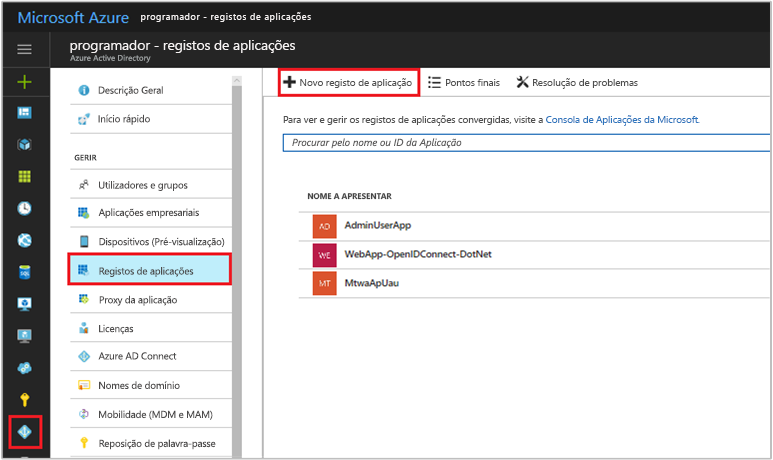
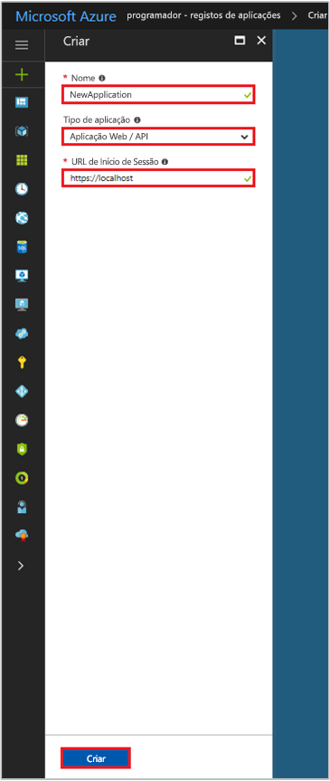

# <a name="integrating-applications-with-azure-active-directory"></a>Integrar aplicações com o Azure Active Directory

[!INCLUDE [active-directory-develop-applies-v1](../../../includes/active-directory-develop-applies-v1.md)]

Os desenvolvedores corporativos e fornecedores de software-como-serviço (SaaS) podem desenvolver serviços cloud comerciais ou aplicações de linha de negócio, que podem ser integradas no Azure Active Directory (Azure AD) para fornecer o início de sessão seguro e autorização para seus serviços. Para integrar uma aplicação ou serviço com o Azure AD, o desenvolvedor deve primeiro registar a aplicação com o Azure AD.

Este artigo mostra-lhe como adicionar, atualizar ou remover o registo de uma aplicação no Azure AD. Conheça os diferentes tipos de aplicativos que podem ser integrados com o Azure AD, como configurar as suas aplicações para aceder a outros recursos, tais como as APIs web e muito mais.

Para saber mais sobre os dois objetos do Azure AD que representam uma aplicação registada e o relacionamento entre elas, consulte [objectos da aplicação e objetos de Principal de serviço](app-objects-and-service-principals.md); para saber mais sobre as diretrizes de imagem corporativa, deve utilizar o desenvolvimento de aplicativos com o Azure Active Directory, veja [diretrizes de imagem corporativa para aplicações integradas](howto-add-branding-in-azure-ad-apps.md).

## <a name="adding-an-application"></a>Adicionar uma aplicação

Qualquer aplicativo que deseja usar os recursos do Azure AD em primeiro lugar tem de estar registado no inquilino do Azure AD. Este processo de registro envolve a fornecer os detalhes do Azure AD sobre a sua aplicação, como a URL onde este se encontra, o URL para enviar respostas após um utilizador é autenticado, o URI que identifica a aplicação e assim por diante.

### <a name="to-register-a-new-application-using-the-azure-portal"></a>Para registar uma nova aplicação com o portal do Azure

1. Inicie sessão no [portal do Azure](https://portal.azure.com).
2. Se sua dá conta de acesso a mais do que um, clique na sua conta no canto superior direito e definir a sua sessão do portal para o Azure AD pretendido de inquilino.
3. No painel de navegação do lado esquerdo, clique nas **do Azure Active Directory** do serviço, clique em **registos das aplicações**e clique em **novo registo de aplicação**.

   

4. Quando o **criar** é apresentada a página, introduza as informações de registo do seu aplicativo: 

  - **Nome:** introduza um nome de aplicação com significado
  - **Tipo de aplicação:** 
    - Selecione "Nativo" para [aplicativos cliente](developer-glossary.md#client-application) que são instaladas localmente num dispositivo. Esta definição é utilizada para o público de OAuth [clientes nativos](developer-glossary.md#native-client).
    - Selecione "aplicação Web / API" para [aplicações cliente](developer-glossary.md#client-application) e [aplicações de API derecursos/](developer-glossary.md#resource-server) que são instaladas num servidor seguro. Esta definição é utilizada para OAuth confidencial [clientes web](developer-glossary.md#web-client) e públicas [baseada no utilizador-agente clientes](developer-glossary.md#user-agent-based-client). O mesmo aplicativo também pode expor um cliente e o recurso/API.
  - **URL de início de sessão:** para "aplicação Web / API" aplicações, indique o URL base da sua aplicação. Por exemplo, `http://localhost:31544` pode ser o URL para uma aplicação web em execução no seu computador local. Os utilizadores usaria este URL para iniciar sessão a uma aplicação de cliente da web. 
  - **URI de redirecionamento:** para aplicações "Nativas", forneça o URI utilizado pelo Azure AD para devolver respostas token. Introduza um valor específico para seu aplicativo, por exemplo `http://MyFirstAADApp`

   

   Se pretender exemplos específicos de aplicações web ou de aplicativos nativos, confira nossos [inícios Rápidos](azure-ad-developers-guide.md#get-started).

5. Quando terminar, clique em **Criar**. Do Azure AD atribui um ID de aplicação exclusivo para a sua aplicação e será encaminhado à página de registo principal do seu aplicativo. Dependendo se o seu aplicativo é um aplicativo nativo ou web, as diferentes opções são fornecidas para adicionar recursos à sua aplicação. Consulte a secção seguinte para uma descrição geral de consentimento e detalhes sobre a ativação de funcionalidades de configuração adicional no seu registo de aplicação (as credenciais, permissões, ativar início de sessão para os utilizadores de outros inquilinos).

  > [!NOTE]
  > Por predefinição, uma aplicação web recentemente registada é configurada para permitir **apenas** que os utilizadores ao mesmo inquilino para iniciar sessão na sua aplicação.

## <a name="updating-an-application"></a>Atualização de aplicativos

Assim que a sua aplicação foi registrada com o Azure AD, ele poderá ter de ser atualizado para fornecer acesso a web APIs, disponibilizada no outras organizações e muito mais. Esta secção descreve várias formas na qual pode configurar ainda mais a sua aplicação. Primeiro vamos começar com uma visão geral da estrutura do consentimento, o que é importante compreender ao criar aplicativos que precisam de ser utilizado por outros utilizadores ou aplicações.

### <a name="overview-of-the-consent-framework"></a>Descrição geral da estrutura do consentimento

A estrutura de consentimento do Azure AD torna mais fácil desenvolver aplicações clientes nativas e web de multi-inquilino. Esses aplicativos permitem início de sessão por contas de utilizador de um inquilino do Azure AD diferente em que a aplicação fica registada. Também poderá acessar a web, APIs, como o Microsoft Graph API (para aceder ao Azure Active Directory, o Intune e serviços do Office 365) e APIs de outros serviços da Microsoft, além de suas próprias APIs web. O framework baseia-se um utilizador ou um administrador a dar o consentimento para um aplicativo que solicita a registar no seu diretório, o que pode envolver a aceder a dados do diretório.

Por exemplo, se precisar de uma aplicação de cliente da web ler as informações de calendário sobre o utilizador do Office 365, esse utilizador é necessário para dar consentimento para a aplicação cliente pela primeira vez. Depois de consentimento for dado, o aplicativo cliente poderá chamar o Microsoft Graph API em nome do utilizador e utilize as informações de calendário, conforme necessário. O [Microsoft Graph API](https://graph.microsoft.io) fornece acesso a dados no Office 365 (como calendários e mensagens do Exchange, sites e listas do SharePoint, documentos do OneDrive, blocos de notas do OneNote, tarefas do Planner, livros do Excel, etc.), bem como os utilizadores e grupos do Azure AD e outros objetos de dados de mais serviços cloud da Microsoft. 

Estrutura do consentimento baseia-se em OAuth 2.0 e os vários fluxos, como concedem credenciais de cliente e de concessão do código de autorização, usando clientes públicos ou confidenciais. Ao utilizar o OAuth 2.0, do Azure AD torna possível criar vários tipos diferentes de aplicativos cliente, tal como num telemóvel, tablet, servidor ou um aplicativo web e obter acesso aos recursos necessários.

Para obter mais informações sobre como utilizar a estrutura do consentimento com concessões de autorização de OAuth2.0, consulte [autorizar o acesso a aplicações web com OAuth 2.0 e o Azure AD](v1-protocols-oauth-code.md) e [cenários de autenticação do Azure AD](authentication-scenarios.md). Para obter informações sobre como obter acesso autorizado ao Office 365 através do Microsoft Graph, consulte [autenticação de aplicações com o Microsoft Graph](https://graph.microsoft.io/docs/authorization/auth_overview).

#### <a name="example-of-the-consent-experience"></a>Exemplo da experiência de consentimento

Os passos seguintes mostram como o consentimento refletir funciona para o desenvolvedor de aplicativos e o utilizador.

1. Suponha que tem uma aplicação de cliente web que precisa para solicitar permissões específicas para aceder a uma recurso/API. Ficará a saber como fazer esta configuração na secção seguinte, mas, essencialmente, o portal do Azure é utilizado para declarar as solicitações de permissão no momento da configuração. Como outras definições de configuração, que se tornem parte do registo da aplicação do Azure AD:
   
  
    
2. Considere que foram atualizadas as permissões de seu aplicativo, a execução do aplicativo e um utilizador estiver prestes a utilizá-lo pela primeira vez. Pela primeira vez que a aplicação tem de obter um código de autorização do Azure AD `/authorize` ponto final. O código de autorização, em seguida, pode ser usado para adquirir um novo acesso e atualizar o token.

3. Se o utilizador já não for autenticado, o Azure do AD `/authorize` endpoint pede-lhe para iniciar sessão.
   
  

4. Depois do utilizador tem sessão iniciada, do Azure AD irá determinar se o utilizador tem de ser apresentada uma página de consentimento. Essa determinação baseia-se o utilizador (ou o administrador da sua organização) já concedeu o consentimento da aplicação. Se já não tiver sido concedido consentimento, o Azure AD solicita o consentimento do usuário e exibe as permissões necessárias para funcionar. O conjunto de permissões que são apresentadas na caixa de diálogo de consentimento corresponder aos perfis selecionados nas permissões delegadas no portal do Azure.
   
  

5. Depois do utilizador concede consentimento, é devolvido um código de autorização para seu aplicativo, que é resgatado para adquirir um token de acesso e atualizar o token. Para obter mais informações sobre este fluxo, veja [API]](web-api.md) na Web.

6. Como administrador, pode também autorizar permissões delegadas de uma aplicação em nome de todos os utilizadores no seu inquilino. Consentimento administrativo impede que a caixa de diálogo de consentimento que aparece para cada utilizador no inquilino e pode ser feito no [portal do Azure](https://portal.azure.com) por usuários com a função de administrador. Do **definições** para a sua aplicação, clique em **permissões obrigatórias** e clique nas **conceder permissões** botão. 

  
    
  > [!NOTE]
  > Conceder explícita consentir utilizar o **conceder permissões** botão é atualmente necessário para aplicações de página única (SPA) que utilizam ADAL.js. Caso contrário, o aplicativo falhar quando o token de acesso é solicitado. 

### <a name="configure-a-client-application-to-access-web-apis"></a>Configurar uma aplicação de cliente para aceder a APIs web

Ordem de uma aplicação web/confidencial de cliente poder participar de um fluxo de concessão de autorização que requer autenticação (e obter um token de acesso), tem de estabelecer credenciais seguras. O método de autenticação padrão suportado pelo portal do Azure é o ID de cliente + chave secreta. Esta secção abrange os passos de configuração necessários para fornecer a chave secreta com credenciais de seu cliente.

Além disso, antes de um cliente pode aceder a uma web API exposta por uma aplicação de recurso (por exemplo, a Microsoft Graph API), a estrutura do consentimento garante que o cliente obtém a concessão de permissão necessária, com base nas permissões solicitadas. Por predefinição, todos os aplicativos podem escolher as permissões de "Windows Azure Active Directory" (Graph API) e "Windows API de gestão de serviço do Azure." O [permissão da Graph API de "início de sessão e ler perfil de utilizador"](https://msdn.microsoft.com/Library/Azure/Ad/Graph/howto/azure-ad-graph-api-permission-scopes#PermissionScopeDetails) também está selecionada por predefinição. Se o cliente está a ser registado num inquilino com contas de subscrever o Office 365, web APIs e permissões para o Exchange Online e SharePoint estão disponíveis para seleção. Pode selecionar a partir [dois tipos de permissões](developer-glossary.md#permissions) para cada web API de pretendido:

- Permissões de aplicação: A aplicação cliente precisa acessar a API web diretamente em nome próprio (nenhum contexto de usuário). Este tipo de permissão necessita de consentimento de administrador e também não está disponível para aplicações de cliente nativo.

- Permissões delegadas: A aplicação cliente precisa de aceder a API web, como o utilizador com sessão iniciada, mas com acesso limitado pela permissão selecionada. Este tipo de permissão pode ser concedido por um utilizador, a menos que a permissão necessita de consentimento de administrador. 

  > [!NOTE]
  > Adicionando uma permissão delegada a um aplicativo não concede automaticamente consentimento para os utilizadores no inquilino. Os utilizadores tem manualmente de dar consentimento para as permissões de delegado foi adicionadas no tempo de execução, a menos que o administrador conceder consentimento em nome de todos os utilizadores.

#### <a name="to-add-application-credentials-or-permissions-to-access-web-apis"></a>Para adicionar credenciais de aplicativo ou permissões para aceder a APIs web

1. Inicie sessão no [portal do Azure](https://portal.azure.com).
2. Se sua dá conta de acesso a mais do que um, clique na sua conta no canto superior direito e definir a sua sessão do portal para o Azure AD pretendido de inquilino.
3. No painel de navegação do lado esquerdo, clique a **do Azure Active Directory** de serviço, clique em **registos das aplicações**, em seguida, localizar/clique a aplicação que pretende configurar.

   

4. É direcionado para página de registo principal do aplicativo, o qual abre o **definições** página para a aplicação. Para adicionar uma credencial para a sua aplicação web:
  - Clique no **chaves** secção sobre o **definições** página. 
  - Para adicionar um certificado:
    - Selecione **carregar chave pública**.
    - Selecione o ficheiro que pretende carregar. Tem de ser um dos seguintes tipos de ficheiro:. cer,. pem,. crt.
  - Para adicionar uma palavra-passe:
    - Adicione uma descrição para a sua chave.
    - Selecione uma duração.
    - Clique em **Guardar**. A coluna mais à direita irá conter o valor da chave, depois de guardar as alterações de configuração. **Certifique-se de que copie a chave** para utilização no código da aplicação de cliente, pois não está acessível uma vez que sair desta página.

5. Para adicionar permissão ou permissões para aceder às APIs de recurso a partir do seu cliente
  - Clique no **permissões obrigatórias** secção sobre o **definições** página. 
  - Clique no botão **Adicionar**.
  - Clique em **selecionar uma API** para selecionar o tipo de recursos que quer recolher do.
  - Navegue pela lista de APIs disponíveis ou utilize a caixa de pesquisa para selecionar a partir de aplicações no seu diretório de recursos disponíveis que expõem uma API web. Clique no recurso que está interessado, em seguida, clique em **selecione**.
  - É levado para o **ativar o acesso ao** página. Selecione as permissões de aplicação e/ou permissões delegadas seu aplicativo precisa quando aceder à API.
   
  

  

6. Quando terminar, clique no **selecionar** botão **ativar o acesso ao** página, o **feito** botão o **adicionar acesso à API** página. É reencaminhado para o **permissões obrigatórias** página, onde o novo recurso é adicionado à lista de APIs.

### <a name="configuring-a-resource-application-to-expose-web-apis"></a>Configurar uma aplicação de recurso para expor as APIs web

Pode desenvolver uma API web e torná-lo disponível para aplicativos cliente, expor o acesso [âmbitos](developer-glossary.md#scopes) e [funções](developer-glossary.md#roles). Uma API web configurados corretamente é disponibilizada como outro Microsoft APIs web, incluindo a Graph API e as APIs do Office 365. Âmbitos de acesso e as funções são expostas através de sua [manifesto da aplicação](developer-glossary.md#application-manifest), que é um ficheiro JSON que representa a configuração de identidade do seu aplicativo. 

A seção a seguir mostra como expor os âmbitos de acesso, ao modificar o manifesto da aplicação de recurso.

#### <a name="adding-access-scopes-to-your-resource-application"></a>Adicionar âmbitos de acesso à sua aplicação de recurso

1. Inicie sessão no [portal do Azure](https://portal.azure.com).
2. Se sua dá conta de acesso a mais do que um, clique na sua conta no canto superior direito e definir a sua sessão do portal para o Azure AD pretendido de inquilino.

3. No painel de navegação do lado esquerdo, clique a **do Azure Active Directory** de serviço, clique em **registos das aplicações**, em seguida, localizar/clique a aplicação que pretende configurar.

   

4. É direcionado para página de registo principal do aplicativo, o qual abre o **definições** página para a aplicação. Mude para o **editar manifesto** página, ao clicar em **manifesto** da página de Registro do aplicativo. Um editor de manifesto baseada na web é aberto, permitindo que **editar** o manifesto no portal. Opcionalmente, pode clicar em **baixe** e editar localmente, em seguida, utilize **carregar** para voltar a aplicar à sua aplicação.

5. Neste exemplo, vamos expor um novo âmbito chamado `Employees.Read.All` em nosso recurso/API, adicionando o seguinte elemento JSON para o `oauth2Permissions` coleção. A atual `user_impersonation` âmbito é fornecido por predefinição durante o registo. `user_impersonation` permite que um aplicativo cliente solicitar a permissão para aceder ao recurso, sob a identidade do utilizador com sessão iniciada. Certifique-se de que adicionar a vírgula após existente `user_impersonation` analisar o elemento e alterar os valores de propriedade para atender às necessidades do seu recurso. 

  ```json
  {
    "adminConsentDescription": "Allow the application to have read-only access to all Employee data.",
    "adminConsentDisplayName": "Read-only access to Employee records",
    "id": "2b351394-d7a7-4a84-841e-08a6a17e4cb8",
    "isEnabled": true,
    "type": "User",
    "userConsentDescription": "Allow the application to have read-only access to your Employee data.",
    "userConsentDisplayName": "Read-only access to your Employee records",
    "value": "Employees.Read.All"
  }
  ```
  > [!NOTE]
  > O valor de "id" tem de ser gerado usando uma ferramenta de geração de GUID, tal como [guidgen](https://msdn.microsoft.com/library/ms241442%28v=vs.80%29.aspx) ou programaticamente. Ele representa um identificador exclusivo para o âmbito conforme exposto pela web API. Assim que um cliente está configurado corretamente com permissões para aceder a API web, ele é emitido um token de acesso de OAuth2.0 pelo Azure AD. Quando o cliente chamará a API web, ele apresenta o token de acesso que tenha o âmbito (scp) afirmação definir para as permissões pedidas no respetivo registo de aplicação.
  >
  > Pode expor âmbitos adicionais mais tarde conforme necessários. Considere que a API web pode expor vários âmbitos associados a uma variedade de funções diferentes. O recurso pode controlar o acesso para a API web em tempo de execução, ao avaliar o âmbito (`scp`) afirmação ou afirmações no token de acesso recebido do OAuth 2.0.
  > 

6. Quando terminar, clique em **guardar**. Agora, a API web está configurada para utilização por outros aplicativos no seu diretório. 

  

#### <a name="verify-the-web-api-is-exposed-to-other-applications-in-your-tenant"></a>Certifique-se a web que API é exposta a outros aplicativos no seu inquilino
1. Vá para o seu Azure AD de inquilino, clique em **registos das aplicações** mais uma vez, em seguida, localizar/clique a aplicação de cliente que pretende configurar.

   

2. Repita o passo 5 como fez na [configurar uma aplicação de cliente para aceder a web APIs](#configure-a-client-application-to-access-web-apis). Quando vai para o **selecionar uma API** passo, procure o seu recurso ao introduzir o respetivo nome de aplicação no campo de pesquisa e clique em **selecione**. 

3. Sobre o **ativar o acesso ao** página deverá ver o novo âmbito, disponível para solicitações de permissão de cliente.

  

#### <a name="more-on-the-application-manifest"></a>Obter mais informações sobre o manifesto do aplicativo

O manifesto do aplicativo, na verdade, serve como um mecanismo para atualizar a entidade de aplicativo, que define todos os atributos de configuração de identidade de uma aplicação Azure AD, incluindo os âmbitos de acesso de API que discutimos. Para obter mais informações sobre a entidade de aplicativo e seu esquema, consulte a [documentação de entidade de aplicação do Graph API](https://msdn.microsoft.com/Library/Azure/Ad/Graph/api/entity-and-complex-type-reference#application-entity). O artigo contém informações de referência completa sobre os membros da entidade de aplicativo utilizado para especificar permissões para a sua API, incluindo:  

- O membro appRoles, que é uma coleção de [função de aplicação](https://msdn.microsoft.com/Library/Azure/Ad/Graph/api/entity-and-complex-type-reference#approle-type) entidades, usadas para definir [permissões de aplicação](developer-glossary.md#permissions) para uma API web. 
- O membro de oauth2Permissions, que é uma coleção de [OAuth2Permission](https://msdn.microsoft.com/Library/Azure/Ad/Graph/api/entity-and-complex-type-reference#oauth2permission-type) entidades, usadas para definir [permissões delegadas](developer-glossary.md#permissions) para uma API web.

Para obter mais informações sobre a aplicação conceitos de manifesto em geral, consulte [compreender o manifesto da aplicação do Azure Active Directory](reference-app-manifest.md).

### <a name="accessing-the-azure-ad-graph-and-office-365-via-microsoft-graph-apis"></a>Acessando o Azure AD Graph e do Office 365 através de APIs do Microsoft Graph  

Conforme mencionado anteriormente, além de expor/aceder APIs para as suas próprias aplicações, pode registar a aplicação de cliente para aceder a APIs expostas por recursos de Microsoft. O Microsoft Graph API, referido como "Microsoft Graph" na lista de recursos/API no portal, está disponível para todas as aplicações que são registadas no Azure AD. Se estiver a registar a aplicação de cliente num inquilino que contém as contas que se inscreveram numa subscrição do Office 365, também pode acessar os âmbitos expostos pelos vários recursos do Office 365.

Para uma discussão completa sobre âmbitos expostas pela API do Microsoft Graph, consulte a [referência de permissões do Microsoft Graph](https://developer.microsoft.com/en-us/graph/docs/concepts/permissions_reference) artigo.

> [!NOTE]
> Devido a uma limitação atual, aplicativos de cliente nativo apenas podem chamar para o Azure AD Graph API se utilizarem a permissão "Aceder ao diretório da sua organização". Esta restrição não se aplica para aplicativos web.

### <a name="configuring-multi-tenant-applications"></a>Configurar aplicações de multi-inquilinos

Ao registar uma aplicação no Azure AD, poderá ser útil a sua aplicação para ser acedido apenas por utilizadores na sua organização. Em alternativa, também poderá o aplicativo seja acessível pelos usuários em organizações externas. Estes dois tipos de aplicativos são chamados de aplicativos de inquilino único e multi-inquilinos. Esta secção descreve como modificar a configuração de um aplicativo de inquilino único para torná-lo uma aplicação multi-inquilino.

É importante ter em conta as diferenças entre uma aplicação de inquilino único e multi-inquilino:  

- Uma aplicação de inquilino único destina-se a utilização de uma organização. Normalmente, é uma aplicação (LoB) de linha de negócio escrita por um programador empresarial. Uma aplicação de inquilino único só pode ser acedida por utilizadores com contas no mesmo inquilino, porque o registo de aplicação. Como resultado, ele só precisa ser aprovisionado num diretório.
- Uma aplicação multi-inquilino destina-se a ser utilizado em muitas organizações. Conhecido como um aplicativo de web do software-como-serviço (SaaS), ele é, normalmente, escrito por um fabricante de software independente (ISV). Aplicações de multi-inquilinos tem de ser aprovisionadas no cada inquilino onde os utilizadores precisam de acesso. Para inquilinos diferente em que a aplicação fica registada, é necessário para registá-los o consentimento de utilizador ou administrador. Observe que aplicações clientes nativas são multi-inquilino por padrão, que eles estejam instalados no dispositivo do proprietário do recurso. Consulte precedente [descrição geral da estrutura do consentimento](#overview-of-the-consent-framework) secção para obter detalhes sobre a estrutura de consentimento.

Fazer um multi-inquilino de aplicativo requer ambas as alterações de registo de aplicação, bem como alterações para o próprio aplicativo da web. As secções seguintes abrangem ambos.

#### <a name="changing-the-application-registration-to-support-multi-tenant"></a>Alterar o registo de aplicação para suportar o multi-inquilino

Se estiver escrevendo um aplicativo que pretende disponibilizar aos seus clientes ou parceiros fora da sua organização, terá de atualizar a definição da aplicação no portal do Azure.

> [!IMPORTANT]
> Azure AD requer que o URI de ID de aplicação das aplicações de multi-inquilinos para ser globalmente exclusivo. O URI de ID de aplicação é uma das formas num que aplicativo é identificado em mensagens de protocolo. Para uma aplicação de inquilino único, é suficiente para o URI de ID de aplicação para que seja exclusivo dentro desse inquilino. Para uma aplicação multi-inquilino, tem de ser globalmente exclusivo para que o Azure AD possa encontrar a aplicação em todos os inquilinos. Exclusividade global é aplicada, exigindo que o URI de ID de aplicação ter um nome de anfitrião que corresponde a um domínio verificado do inquilino do Azure AD. Por exemplo, se o nome do seu inquilino for contoso.onmicrosoft.com, em seguida, válido App ID URI seria https://contoso.onmicrosoft.com/myapp. Se o seu inquilino tiver um domínio verificado do contoso.com, então um URI de ID de aplicação válido também seria https://contoso.com/myapp. Se o URI de ID de aplicação não seguir esse padrão, a definição de um aplicativo como falha de multi-inquilino.
> 

Para conceder a utilizadores externos a capacidade de aceder à sua aplicação: 

1. Inicie sessão no [portal do Azure](https://portal.azure.com).
2. Se sua dá conta de acesso a mais do que um, clique na sua conta no canto superior direito e definir a sua sessão do portal para o Azure AD pretendido de inquilino.
3. No painel de navegação do lado esquerdo, clique a **do Azure Active Directory** de serviço, clique em **registos das aplicações**, em seguida, localizar/clique a aplicação que pretende configurar. É direcionado para página de registo principal do aplicativo, o qual abre o **definições** página para a aplicação.
4. Do **configurações** página, clique em **propriedades** e altere o **vários inquilinos** mudar para **Sim**.

Depois de efetuar as alterações, os utilizadores e os administradores em outras organizações podem conceder aos utilizadores a capacidade de iniciar sessão na sua aplicação, permitindo que a sua aplicação para aceder aos recursos protegidos pelo respetivo inquilino.

#### <a name="changing-the-application-to-support-multi-tenant"></a>Alterar o aplicativo para oferecer suporte a multi-inquilino

Suporte para aplicativos de multilocação depende muito de estrutura do consentimento do Azure AD. Consentimento é o mecanismo que permite que um usuário de outro inquilino para conceder à aplicação acesso aos recursos protegidos pelo inquilino do utilizador. Esta experiência é referida como "consentimento do utilizador."

Também pode oferecer a sua aplicação web:

- A capacidade para que os administradores "inscrever-se a minha empresa." Esta experiência, conhecida como "consentimento do admin", dá a capacidade de conceder autorização em nome do administrador- *todos os utilizadores* na sua organização. Apenas um usuário autenticado com uma conta que pertence à função de Administrador Global pode fornecer o consentimento de administrador outras pessoas recebem um erro.

- Uma experiência de inscrição para os utilizadores. Espera-se que o utilizador é fornecido um botão de "inscrição" que irá redirecionar o navegador para o OAuth2.0 de AD do Azure `/authorize` ponto final ou uma ligação do OpenID `/userinfo` ponto final. Estes pontos finais permitem que o aplicativo obter informações sobre o novo utilizador ao inspecionar o id_token. Após a fase de inscrição, é apresentada ao utilizador com um prompt de consentimento, semelhante ao mostrado na [descrição geral da estrutura do consentimento](#overview-of-the-consent-framework) secção.

Para obter mais informações sobre as alterações de aplicação necessários para suportar vários inquilinos acesso e experiências de início de sessão-em/inscrever-se, consulte:

- [Como iniciar sessão de qualquer utilizador do Azure Active Directory (AD) utilizando o padrão de aplicação multi-inquilino](howto-convert-app-to-be-multi-tenant.md)
- A lista de [exemplos de código de multi-inquilino](https://azure.microsoft.com/documentation/samples/?service=active-directory&term=multi-tenant). 
- [Início rápido: Adicionar a imagem corporativa à sua página de início de sessão no Azure AD](../fundamentals/customize-branding.md)

### <a name="enabling-oauth-20-implicit-grant-for-single-page-applications"></a>Ativar o OAuth 2.0 implícita é garantir para aplicações de página única

Página única (SPAs aplicativos) normalmente são estruturados com um forte JavaScript front-end que executa no navegador, que chama API web a aplicação back-end para realizar sua lógica de negócios. Para SPAs alojados no Azure AD, utilize concessão implícita OAuth 2.0 para autenticar o utilizador com o Azure AD e obter um token que pode utilizar para proteger as chamadas de cliente de JavaScript do aplicativo, a sua API da web de back-end. 

Depois do utilizador tenha concedido consentimento, esse mesmo protocolo de autenticação pode servir-se para obter os tokens para proteger as chamadas entre o cliente e outras web configurados para a aplicação de recursos de API. Para obter mais informações sobre a concessão de autorização implícita e ajudar a decidir se é adequada para o seu cenário de aplicação, veja [Noções básicas sobre o OAuth2 implícita conceder o fluxo no Azure Active Directory](v1-oauth2-implicit-grant-flow.md).

Por predefinição, a concessão implícita OAuth 2.0 está desativado para as aplicações. Pode ativar a concessão implícita OAuth 2.0 para a sua aplicação, definindo a `oauth2AllowImplicitFlow` valor em seu [manifesto do aplicativo](reference-app-manifest.md).

#### <a name="to-enable-oauth-20-implicit-grant"></a>Para ativar a concessão implícita OAuth 2.0

> [!NOTE]
> Para obter detalhes sobre como editar o manifesto do aplicativo, certifique-se de que reveja a secção anterior, primeiro [configurar uma aplicação de recurso para expor APIs web](#configuring-a-resource-application-to-expose-web-apis).

1. Inicie sessão no [portal do Azure](https://portal.azure.com).
2. Se sua dá conta de acesso a mais do que um, clique na sua conta no canto superior direito e definir a sua sessão do portal para o Azure AD pretendido de inquilino.
3. No painel de navegação do lado esquerdo, clique a **do Azure Active Directory** de serviço, clique em **registos das aplicações**, em seguida, localizar/clique a aplicação que pretende configurar. É direcionado para página de registo principal do aplicativo, o qual abre o **definições** página para a aplicação.
4. Mude para o **editar manifesto** página, ao clicar em **manifesto** da página de Registro do aplicativo. Um editor de manifesto baseada na web é aberto, permitindo que **editar** o manifesto no portal. Localize e defina o valor de "oauth2AllowImplicitFlow" como "true". Por predefinição, está definido como "false".
   
  ```json
  "oauth2AllowImplicitFlow": true,
  ```
5. Guarde o manifesto atualizado. Depois de guardado, a API web está agora configurada para utilizar a concessão implícita OAuth 2.0 para autenticar os utilizadores.

## <a name="removing-an-application"></a>Remoção de um aplicativo

Esta secção descreve como remover o registo de uma aplicação de inquilino do Azure AD.

### <a name="removing-an-application-authored-by-your-organization"></a>Remoção de um aplicativo criado pela sua organização

Aplicativos que sua organização tiver registado aparecem sob o filtro de "As minhas aplicações" na página do seu inquilino principal "registos de aplicações". Esses aplicativos são aqueles que registou manualmente através do portal do Azure ou através de programação através do PowerShell ou a Graph API. Mais especificamente, eles são representados por ambas as um objeto Principal de serviço e aplicações no seu inquilino. Para obter mais informações, consulte [objectos da aplicação e objetos de Principal de serviço](app-objects-and-service-principals.md).

#### <a name="to-remove-a-single-tenant-application-from-your-directory"></a>Para remover uma aplicação de inquilino único do diretório

1. Inicie sessão no [portal do Azure](https://portal.azure.com).
2. Se sua dá conta de acesso a mais do que um, clique na sua conta no canto superior direito e definir a sua sessão do portal para o Azure AD pretendido de inquilino.
3. No painel de navegação do lado esquerdo, clique a **do Azure Active Directory** de serviço, clique em **registos das aplicações**, em seguida, localizar/clique a aplicação que pretende configurar. É direcionado para página de registo principal do aplicativo, o qual abre o **definições** página para a aplicação.
4. Na página de registo principal do aplicativo, clique em **eliminar**.
5. Clique em **Sim** na mensagem de confirmação.

#### <a name="to-remove-a-multi-tenant-application-from-its-home-directory"></a>Para remover uma aplicação multi-inquilino do respetivo diretório raiz

1. Inicie sessão no [portal do Azure](https://portal.azure.com).
2. Se sua dá conta de acesso a mais do que um, clique na sua conta no canto superior direito e definir a sua sessão do portal para o Azure AD pretendido de inquilino.
3. No painel de navegação do lado esquerdo, clique a **do Azure Active Directory** de serviço, clique em **registos das aplicações**, em seguida, localizar/clique a aplicação que pretende configurar. É direcionado para página de registo principal do aplicativo, o qual abre o **definições** página para a aplicação.
4. Do **definições** página, selecione **propriedades** e altere o **vários inquilinos** mudar para **não**, para altere primeiro a sua aplicação para inquilino único, em seguida, clique em **guardar**. Objetos principais de serviço do aplicativo permanecerem em inquilinos de todas as organizações que têm já deu consentimento ao mesmo.
5. Clique nas **eliminar** botão da página de registo principal do aplicativo.
6. Clique em **Sim** na mensagem de confirmação.

### <a name="removing-a-multi-tenant-application-authorized-by-another-organization"></a>Remover uma aplicação multi-inquilino autorizada por outra organização

Um subconjunto dos aplicativos que são apresentados o filtro de "Todas as aplicações" (excluindo os registos de "As minhas aplicações") na página de "Registos de aplicações" principal do seu inquilino, são aplicações multi-inquilino. Em termos técnicos, estas aplicações de multi-inquilinos são de outro inquilino e foram registadas no seu inquilino durante o processo de consentimento. Mais especificamente, são representados por apenas um objeto principal do serviço no seu inquilino, com nenhum objeto de aplicativo correspondente. Para obter mais informações sobre as diferenças entre aplicativos e objetos de principal de serviço, consulte [aplicativos e objetos de principal de serviço no Azure AD](app-objects-and-service-principals.md).

Para remover o acesso de uma aplicação multi-inquilino para o seu diretório (depois de ter autoriza), o administrador da empresa tem de remover o seu principal de serviço. O administrador tem de ter acesso de administrador global e pode removê-lo através do portal do Azure ou utilizar o [Cmdlets do Azure AD PowerShell](http://go.microsoft.com/fwlink/?LinkId=294151).

## <a name="next-steps"></a>Passos Seguintes

- Para obter mais informações sobre como funciona a autenticação no Azure AD, consulte [cenários de autenticação do Azure AD](authentication-scenarios.md).
- Consulte a [diretrizes de imagem corporativa para aplicações integradas](howto-add-branding-in-azure-ad-apps.md) para obter dicas sobre visual orientações para a sua aplicação.
- Para obter mais informações sobre a relação entre objetos de Principal de serviço e aplicações de uma aplicação, consulte [objectos da aplicação e objetos de Principal de serviço](app-objects-and-service-principals.md).
- Para saber mais sobre a função desempenhada de manifesto da aplicação, veja [compreender o manifesto da aplicação do Azure Active Directory](reference-app-manifest.md)
- Consulte a [Glossário do programador do Azure AD](developer-glossary.md) para obter definições de alguns dos conceitos de Programador de núcleos do Azure AD.
- Visite o [Guia do programador do Active Directory](azure-ad-developers-guide.md) para uma descrição geral de todos os conteúdos relacionados ao desenvolvedor.
