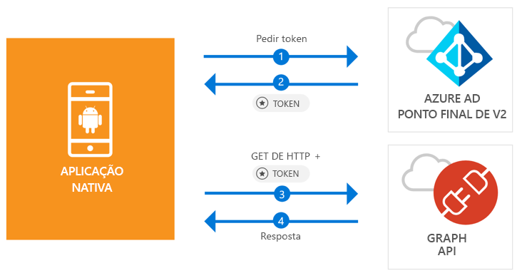

# <a name="quickstart-sign-in-users-and-call-the-microsoft-graph-api-from-an-android-app"></a>Início rápido: Iniciar sessão dos utilizadores e chamar a API do Microsoft Graph a partir de uma aplicação Android

[!INCLUDE [active-directory-develop-applies-v2-msal](../../../includes/active-directory-develop-applies-v2-msal.md)]

Este início rápido contém um exemplo de código que demonstra como uma aplicação Android pode iniciar sessão em contas pessoais ou contas profissionais e escolares, obter um token de acesso e chamar a Microsoft Graph API.



> [!NOTE]
> **Pré-requisitos**
> * Android Studio 3 ou posterior
> * O Android SDK 21 ou posterior é necessário (o SDK 27 é recomendado)

> [!div renderon="docs"]
> ## <a name="register-and-download"></a>Registar e transferir
> ### <a name="register-and-configure-your-application-and-code-sample"></a>Registar e configurar a aplicação e o exemplo de código
> #### <a name="step-1-register-your-application"></a>Passo 1: Registar a sua aplicação
> Para registar a sua aplicação e adicionar as informações de registo da aplicação à sua solução, faça o seguinte:
> 1. Aceda ao [Microsoft Application Registration Portal](https://apps.dev.microsoft.com/portal/register-app) para registar uma aplicação.
> 1. Na caixa **Nome da Aplicação**, introduza um nome para a sua aplicação.
> 1. Certifique-se de que a caixa de verificação **Configuração Assistida** está desmarcada e, em seguida, selecione **Criar**.
> 1. Selecione **Adicionar Plataforma**, selecione **Aplicação Nativa** e, em seguida, selecione **Guardar**.

> [!div renderon="portal" class="sxs-lookup"]
> #### <a name="step-1-configure-your-application"></a>Passo 1: Configurar a aplicação
> Para que o exemplo de código deste início rápido funcione, terá de adicionar um URL de resposta como **msal{AppId}://auth** (em que {AppId} é o ID de aplicação da sua aplicação).
> > [!div renderon="portal" id="makechanges" class="nextstepaction"]
> > [Fazer esta alteração por mim]()
>
> > [!div id="appconfigured" class="alert alert-info"]
> >  A sua aplicação está configurada com estes atributos

#### <a name="step-2-download-the-project"></a>Passo 2: Transfira o projeto

* [Transfira o Projeto do Android Studio](https://github.com/Azure-Samples/active-directory-android-native-v2/archive/master.zip)

#### <a name="step-3-configure-your-project"></a>Passo 3: Configurar o seu projeto

1. Extraia e abra o Projeto no Android Studio.
1. Em **app** > **java** > **<i>{host}.{namespace}</i>**, abra **MainActivity**.
1. Substitua a linha que começa com `final static String CLIENT_ID` por:

    > [!div renderon="portal" class="sxs-lookup"]
    > ```java
    > final static String CLIENT_ID = "ENTER_THE_APPLICATION_ID_HERE";
    > ```

    > [!div renderon="docs"]
    > ```java
    > final static String CLIENT_ID = "<ENTER_THE_APPLICATION_ID_HERE>";
    > ```

1. Abra: **app** > **manifestos** > **AndroidManifest.xml**.
1. Adicione a atividade seguinte ao nó **manifest\application**. Este fragmento de código regista um **BrowserTabActivity** para permitir que o sistema operativo retome a sua aplicação depois de concluir a autenticação:

    > [!div renderon="docs"]
    > ```xml
    > <!--Intent filter to capture System Browser calling back to our app after Sign In-->
    > <activity
    >     android:name="com.microsoft.identity.client.BrowserTabActivity">
    >     <intent-filter>
    >         <action android:name="android.intent.action.VIEW" />
    >         <category android:name="android.intent.category.DEFAULT" />
    >         <category android:name="android.intent.category.BROWSABLE" />
    > 
    >         <!--Add in your scheme/host from registered redirect URI-->
    >         <!--By default, the scheme should be similar to 'msal[appId]' -->
    >         <data android:scheme="msal<ENTER_THE_APPLICATION_ID_HERE>"
    >             android:host="auth" />
    >     </intent-filter>
    > </activity>
    > ```

    > [!div renderon="portal" class="sxs-lookup"]
    > ```xml
    > <!--Intent filter to capture System Browser calling back to our app after Sign In-->
    > <activity
    >     android:name="com.microsoft.identity.client.BrowserTabActivity">
    >     <intent-filter>
    >         <action android:name="android.intent.action.VIEW" />
    >         <category android:name="android.intent.category.DEFAULT" />
    >         <category android:name="android.intent.category.BROWSABLE" />
    > 
    >         <!--Add in your scheme/host from registered redirect URI-->
    >         <!--By default, the scheme should be similar to 'msal[appId]' -->
    >         <data android:scheme="msalENTER_THE_APPLICATION_ID_HERE"
    >             android:host="auth" />
    >     </intent-filter>
    > </activity>
    > ```

> [!div renderon="docs"]
> <span>6.</span> Substitua `<ENTER_THE_APPLICATION_ID_HERE>` pelo *ID de Aplicação* da sua aplicação. Se precisar de localizar o *ID de Aplicação*, aceda à página *Descrição geral*.

## <a name="more-information"></a>Mais Informações

Leia as secções seguintes para obter mais informações sobre este início rápido.

### <a name="msal"></a>MSAL

A MSAL ([com.microsoft.identity.client](https://javadoc.io/doc/com.microsoft.identity.client/msal)) é a biblioteca utilizada para iniciar sessão dos utilizadores e solicitar tokens utilizados para aceder a uma API protegida pelo Microsoft Azure Active Directory (Azure AD). Pode utilizar o Gradle para instalá-la, adicionando o seguinte em **Gradle Scripts** > **build.gradle (Module: app)** em **Dependencies**:

```gradle  
implementation 'com.android.volley:volley:1.1.1'
implementation 'com.microsoft.identity.client:msal:0.1.+'
```

### <a name="msal-initialization"></a>Inicialização da MSAL

Pode adicionar a referência para MSAL, adicionando o código seguinte:

```java
import com.microsoft.identity.client.*;
```

Em seguida, inicialize a MSAL com o código seguinte:

```java
sampleApp = new PublicClientApplication(
        this.getApplicationContext(),
        CLIENT_ID);
```

> |Em que: ||
> |---------|---------|
> |`CLIENT_ID` | O ID de Aplicação da aplicação registada em *portal.azure.com* |

### <a name="requesting-tokens"></a>Solicitar tokens

A MSAL tem dois métodos utilizados para adquirir tokens: `acquireToken` e `acquireTokenSilentAsync`

#### <a name="getting-a-user-token-interactively"></a>Obter um token de utilizador interativamente

Algumas situações exigem forçar os utilizadores a interagir com o ponto final v2.0 do Azure AD, o que resulta numa alternância de contexto para o browser de sistema para validar as credenciais dos utilizadores ou para darem consentimento. Alguns exemplos incluem:

* A primeira vez que os utilizadores iniciam sessão na aplicação
* Quando os utilizadores possam ter de reintroduzir as respetivas credenciais por a palavra-passe ter expirado
* Quando a aplicação está a pedir acesso a um recurso para o qual o utilizador tem de dar consentimento
* Quando é precisa a autenticação de dois fatores

```java
sampleApp.acquireToken(this, SCOPES, getAuthInteractiveCallback());
```

> |Em que:||
> |---------|---------|
> | `SCOPES` | Contém os âmbitos que estão a ser solicitados (ou seja, `{ "user.read" }` para o Microsoft Graph ou `{ "<Application ID URL>/scope" }` para as APIs Web personalizadas (ou seja, `api://<Application ID>/access_as_user`) |
> | `getAuthInteractiveCallback` | Chamada de retorno executada quando o controlo é devolvido à aplicação após a autenticação |

#### <a name="getting-a-user-token-silently"></a>Obter um token de utilizador automaticamente

Não vai querer exigir que o utilizador valide as suas credenciais sempre que precisar de aceder a um recurso. Na maioria das vezes, vai querer que as aquisições e renovação de tokens sejam feitas sem qualquer interação do utilizador. Pode utilizar o método `AcquireTokenSilentAsync` para obter tokens para aceder a recursos protegidos após o método `acquireToken` inicial:

```java
sampleApp.acquireToken(getActivity(), SCOPES, getAuthInteractiveCallback());
```

> |Em que:||
> |---------|---------|
> | `SCOPES` | Contém os âmbitos que estão a ser solicitados (ou seja, `{ "user.read" }` para o Microsoft Graph ou `{ "<Application ID URL>/scope" }` para as APIs Web personalizadas (ou seja, `api://<Application ID>/access_as_user`) |
> | `getAuthInteractiveCallback` | Chamada de retorno executada quando o controlo é devolvido à aplicação após a autenticação |

## <a name="next-steps"></a>Passos Seguintes

### <a name="learn-the-steps-to-create-the-application-used-in-this-quickstart"></a>Conheça os passos para criar a aplicação utilizada neste início rápido

Experimente o tutorial para Android para obter um guia passo a passo completo sobre a criação de aplicações e novas funcionalidades, incluindo uma explicação completa deste início rápido.

> [!div class="nextstepaction"]
> [Tutorial Chamar a Graph API Android](https://docs.microsoft.com/azure/active-directory/develop/guidedsetups/active-directory-android)

### <a name="msal-for-android-library-wiki"></a>Wiki da biblioteca MSAL para Android

Leia mais informações sobre a biblioteca MSAL para Android:

> [!div class="nextstepaction"]
> [Wiki da biblioteca MSAL para Android](https://github.com/AzureAD/microsoft-authentication-library-for-android/wiki)

[!INCLUDE [Help and support](../../../includes/active-directory-develop-help-support-include.md)]
