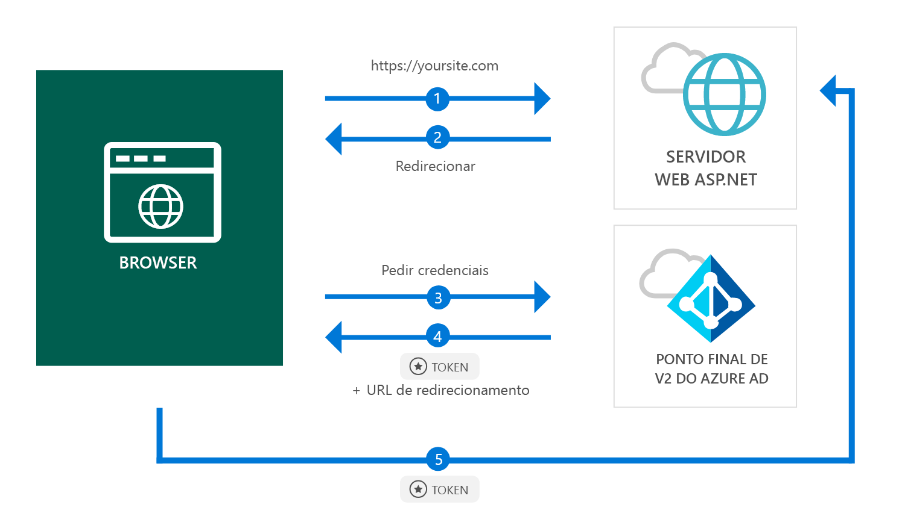

# <a name="quickstart-add-sign-in-with-microsoft-to-an-aspnet-web-app"></a>Início Rápido: adicionar início de sessão com a Microsoft a uma aplicação Web ASP.NET

[!INCLUDE [active-directory-develop-applies-v2](../../../includes/active-directory-develop-applies-v2.md)]

Neste início rápido, vai ficar a saber como uma aplicação Web ASP.NET pode iniciar sessão em contas pessoais (hotmail.com, outlook.com, entre outras) e em contas escolares e profissionais a partir de qualquer instância do Azure Active Directory (Azure AD).



> [!div renderon="docs"]
> ## <a name="register-and-download-your-quickstart-app"></a>Registar e transferir a aplicação do início rápido
> Tem duas opções para iniciar a aplicação de início rápido:
> * [Express] [Opção 1: registar e configurar automaticamente a sua aplicação e, em seguida, transferir o exemplo de código](#option-1-register-and-auto-configure-your-app-and-then-download-your-code-sample)
> * [Manual] [Opção 2: registar e configurar manualmente a aplicação e o exemplo de código](#option-2-register-and-manually-configure-your-application-and-code-sample)
>
> ### <a name="option-1-register-and-auto-configure-your-app-and-then-download-your-code-sample"></a>Opção 1: registar e configurar automaticamente a sua aplicação e, em seguida, transferir o exemplo de código
>
> 1. Aceda ao [Portal do Azure - Registo de Aplicação (Pré-visualização)](https://portal.azure.com/#blade/Microsoft_AAD_RegisteredApps/applicationsListBlade/quickStartType/AspNetWebAppQuickstartPage/sourceType/docs).
> 1. Introduza um nome para a sua aplicação e clique em **Registar**.
> 1. Siga as instruções para transferir e configurar automaticamente a sua nova aplicação num só clique.
>
> ### <a name="option-2-register-and-manually-configure-your-application-and-code-sample"></a>Opção 2: registar e configurar manualmente a aplicação e o exemplo de código
>
> #### <a name="step-1-register-your-application"></a>Passo 1: Registar a aplicação
> Para registar a sua aplicação e adicionar as informações de registo da aplicação à sua solução manualmente, siga os passos a seguir:
>
> 1. Inicie sessão no [portal do Azure](https://portal.azure.com) com uma conta profissional ou escolar ou uma conta pessoal da Microsoft.
> 1. Se a sua conta permitir aceder a mais de um inquilino, selecione-a no canto superior direito e defina a sua sessão no portal para o inquilino pretendido do Azure AD.
> 1. No painel de navegação do lado esquerdo, selecione o serviço **Azure Active Directory** e, em seguida, selecione **Registos de aplicações (Pré-visualização)** > **Novo registo**.
> 1. Quando a **página Registar uma aplicação** for apresentada, introduza as informações de registo da aplicação:
>      - Na secção **Nome**, introduza um nome de aplicação significativo que será apresentado aos utilizadores da aplicação, por exemplo `ASPNET-Quickstart`.
>      - Adicione `https://localhost:44368/` no **URL de Resposta** e clique em **Registar**.
Selecione o menu **Autenticação**, defina os **tokens de ID** em **Concessão Implícita** e, em seguida, selecione **Guardar**.

> [!div class="sxs-lookup" renderon="portal"]
> #### <a name="step-1-configure-your-application-in-azure-portal"></a>Passo 1: Configurar a aplicação no portal do Azure
> Para o código de exemplo deste início rápido funcionar, terá de adicionar um URL de resposta como `https://localhost:44368/`.
> > [!div renderon="portal" id="makechanges" class="nextstepaction"]
> > [Fazer esta alteração por mim]()
>
> > [!div id="appconfigured" class="alert alert-info"]
> >  A sua aplicação está configurada com este atributo

#### <a name="step-2-download-your-project"></a>Passo 2: Transferir o projeto

[Transfira a solução do Visual Studio 2017](https://github.com/AzureADQuickStarts/AppModelv2-WebApp-OpenIDConnect-DotNet/archive/master.zip)

#### <a name="step-3-configure-your-visual-studio-project"></a>Passo 3: Configurar o projeto do Visual Studio

1. Extraia o ficheiro zip para uma pasta local próxima da pasta raiz, por exemplo, **C:\Azure-Samples**
1. Abra a solução no Visual Studio (AppModelv2-WebApp-OpenIDConnect-DotNet.sln)
1. Edite **Web.config** e substitua os parâmetros `ClientId` e `Tenant` por:

    ```xml
    <add key="ClientId" value="Enter_the_Application_Id_here" />
    <add key="Tenant" value="Enter_the_Tenant_Info_Here" />
    ```

> [!div renderon="docs"]
> Em que:
> - `Enter_the_Application_Id_here` - é o Id da Aplicação que registou.
> - `Enter_the_Tenant_Info_Here` - é uma das opções abaixo:
>   - Se a sua aplicação suportar **Apenas a minha organização**, substitua este valor pelo **Id do Inquilino** ou pelo **Nome do inquilino** (por exemplo, contoso.microsoft.com)
>   - Se a sua aplicação suportar **Contas em qualquer diretório organizacional**, substitua este valor por `organizations`
>   - Se a sua aplicação suportar **Todos os utilizadores com contas Microsoft**, substitua este valor por `common`
>
> > [!TIP]
> > Para encontrar os valores do *ID da Aplicação*, o *ID de Diretório (inquilino)*, e os *Tipos de conta suportados*, vá para a página **Descrição geral**

## <a name="more-information"></a>Mais informações

Esta secção fornece uma descrição geral do código necessário para o início de sessão dos utilizadores. Pode ser útil para compreender como o código funciona, os principais argumentos e também se pretende adicionar início de sessão a uma aplicação ASP.NET existente.

### <a name="owin-middleware-nuget-packages"></a>Pacotes NuGet de middleware OWIN

Pode configurar o pipeline de autenticação com a autenticação baseada em cookies através do OpenID Connect em ASP.NET com pacotes de Middleware OWIN. Pode instalar estes pacotes ao executar os comandos seguintes na **Consola do Gestor de Pacotes** do Visual Studio:

```powershell
Install-Package Microsoft.Owin.Security.OpenIdConnect
Install-Package Microsoft.Owin.Security.Cookies
Install-Package Microsoft.Owin.Host.SystemWeb
```

### <a name="owin-startup-class"></a>Classe de Arranque OWIN

O middleware OWIN utiliza uma *classe de arranque* que é executada quando o processo de alojamento é inicializado (no caso deste início rápido, o ficheiro *startup.cs* localizado na pasta raiz). O código seguinte mostra o parâmetro utilizado por este início rápido:

```csharp
public void Configuration(IAppBuilder app)
{
    app.SetDefaultSignInAsAuthenticationType(CookieAuthenticationDefaults.AuthenticationType);

    app.UseCookieAuthentication(new CookieAuthenticationOptions());
    app.UseOpenIdConnectAuthentication(
        new OpenIdConnectAuthenticationOptions
        {
            // Sets the ClientId, authority, RedirectUri as obtained from web.config
            ClientId = clientId,
            Authority = authority,
            RedirectUri = redirectUri,
            // PostLogoutRedirectUri is the page that users will be redirected to after sign-out. In this case, it is using the home page
            PostLogoutRedirectUri = redirectUri,
            Scope = OpenIdConnectScope.OpenIdProfile,
            // ResponseType is set to request the id_token - which contains basic information about the signed-in user
            ResponseType = OpenIdConnectResponseType.IdToken,
            // ValidateIssuer set to false to allow personal and work accounts from any organization to sign in to your application
            // To only allow users from a single organizations, set ValidateIssuer to true and 'tenant' setting in web.config to the tenant name
            // To allow users from only a list of specific organizations, set ValidateIssuer to true and use ValidIssuers parameter
            TokenValidationParameters = new TokenValidationParameters()
            {
                ValidateIssuer = false
            },
            // OpenIdConnectAuthenticationNotifications configures OWIN to send notification of failed authentications to OnAuthenticationFailed method
            Notifications = new OpenIdConnectAuthenticationNotifications
            {
                AuthenticationFailed = OnAuthenticationFailed
            }
        }
    );
}
```

> |Onde  |  |
> |---------|---------|
> | `ClientId`     | O ID de Aplicação da aplicação registada no portal do Azure |
> | `Authority`    | O ponto final STS para o utilizador autenticar. Normalmente https://login.microsoftonline.com/{tenant}/v2.0 para a cloud pública, em que {tenant} é o nome do seu inquilino, o Id do seu inquilino, ou *common* para uma referência ao ponto final comum (utilizado para aplicações multi-inquilino) |
> | `RedirectUri`  | URL para onde os utilizadores são enviados após a autenticação no ponto final v2.0 do Azure AD |
> | `PostLogoutRedirectUri`     | URL para onde os utilizadores são enviados depois de terminarem sessão |
> | `Scope`     | A lista dos âmbitos que estão a ser solicitados, separados por espaços |
> | `ResponseType`     | Pedido de que a resposta da autenticação contenha um token de ID |
> | `TokenValidationParameters`     | Uma lista de parâmetros para a validação do token. Neste caso, `ValidateIssuer` está definido como `false` para indicar que pode aceitar inícios de sessão de todos os tipos de conta: pessoal, escolar ou profissional |
> | `Notifications`     | Uma lista de delegados que podem ser executados em diferentes mensagens *OpenIdConnect* |

### <a name="initiate-an-authentication-challenge"></a>Iniciar um desafio de autenticação

Pode forçar um utilizador a iniciar sessão, solicitando um desafio de autenticação no seu controlador:

```csharp
public void SignIn()
{
    if (!Request.IsAuthenticated)
    {
        HttpContext.GetOwinContext().Authentication.Challenge(
            new AuthenticationProperties{ RedirectUri = "/" },
            OpenIdConnectAuthenticationDefaults.AuthenticationType);
    }
}
```

> [!TIP]
> Pedir um desafio de autenticação com o método acima é opcional e, normalmente, utilizado quando pretende que uma vista seja acessível para utilizadores autenticados e não autenticados. Em alternativa, pode proteger os controladores utilizando o método descrito na secção seguinte.

### <a name="protect-a-controller-or-a-controllers-method"></a>Proteger um controlador ou o método de um controlador

Pode proteger um controlador ou as ações do controlador com o atributo `[Authorize]`. Este atributo restringe o acesso ao controlador ou às ações ao permitir que apenas os utilizadores autenticados acedam às ações no controlador, o que significa que o desafio de autenticação acontecerá automaticamente quando um utilizador *não autenticado* tentar aceder a uma das ações ou ao controlador decorado pelo atributo `[Authorize]`.

## <a name="next-steps"></a>Passos Seguintes

Experimente o tutorial para ASP.NET para obter um guia passo a passo completo sobre a criação de aplicações e novas funcionalidades, incluindo uma explicação completa deste início rápido.

### <a name="learn-the-steps-to-create-the-application-used-in-this-quickstart"></a>Conheça os passos para criar a aplicação utilizada neste início rápido

> [!div class="nextstepaction"]
> [Tutorial de início de sessão](./tutorial-v2-asp-webapp.md)

[!INCLUDE [Help and support](../../../includes/active-directory-develop-help-support-include.md)]