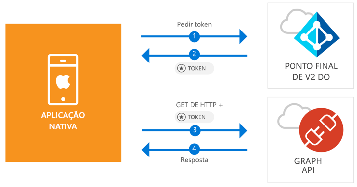

# <a name="quickstart-sign-in-users-and-call-the-microsoft-graph-api-from-an-ios-native-app"></a>Início rápido: Iniciar sessão dos utilizadores e chamar a API do Microsoft Graph a partir de uma aplicação nativa do iOS

[!INCLUDE [active-directory-develop-applies-v2-msal](../../../includes/active-directory-develop-applies-v2-msal.md)]

Este início rápido contém um exemplo de código que demonstra como uma aplicação iOS nativa pode iniciar sessão em contas pessoais ou contas profissionais e escolares, obter um token de acesso e chamar a Microsoft Graph API.



> [!div renderon="docs"]
> ## <a name="register-and-download"></a>Registar e transferir
> ### <a name="register-and-configure-your-application-and-code-sample"></a>Registar e configurar a aplicação e o exemplo de código
> #### <a name="step-1-register-your-application"></a>Passo 1: Registar a sua aplicação
> Para registar a sua aplicação e adicionar as informações de registo da aplicação à sua solução, faça o seguinte:
> 1. Aceda ao [Microsoft Application Registration Portal](https://apps.dev.microsoft.com/portal/register-app) para registar uma aplicação.
> 1. Na caixa **Nome da Aplicação**, introduza um nome para a sua aplicação.
> 1. Certifique-se de que a caixa de verificação **Configuração Assistida** está desmarcada e, em seguida, selecione **Criar**.
> 1. Selecione **Adicionar Plataforma**, selecione **Aplicação Nativa** e, em seguida, selecione **Guardar**.

> [!div renderon="portal" class="sxs-lookup"]
> #### <a name="step-1-configure-your-application"></a>Passo 1: Configurar a aplicação
> Para o código de exemplo deste início rápido funcionar, terá de adicionar um URL de resposta como `msal<AppId>://auth` (onde msal<AppId> é o Id da aplicação).
> > [!div renderon="portal" id="makechanges" class="nextstepaction"]
> > [Fazer esta alteração por mim]()
>
> > [!div id="appconfigured" class="alert alert-info"]
> >  A sua aplicação está configurada com este atributo

#### <a name="step-2-download-your-web-server-or-project"></a>Passo 2: Transfira o seu servidor web ou projeto

- [Transfira o Projeto XCode](https://github.com/Azure-Samples/active-directory-ios-swift-native-v2/archive/master.zip)

#### <a name="step-3-configure-your-project"></a>Passo 3: Configurar o seu projeto

1. Extraia o ficheiro zip e abra o projeto no XCode.
1. Edite **ViewController.swift** e substitua a linha que começa com "let kClientID" pelo seguinte fragmento de código:

    > [!div renderon="portal" class="sxs-lookup"]
    > ```swift
    > let kClientID = "Enter_the_Application_Id_here"
    > ```

    > [!div renderon="docs"]
    > ```swift
    > let kClientID = "<ENTER_THE_APPLICATION_ID_HERE>"
    > ```   
1. Prima Control + clique **Info.plist** para abrir o menu de contexto e, em seguida, selecione **Abrir como** > **Código Fonte**.
1. No nó de raiz dict, adicione o seguinte código:

    > [!div renderon="portal" class="sxs-lookup"]
    > ```xml
    > <key>CFBundleURLTypes</key>
    > <array>
    >     <dict>
    >         <key>CFBundleTypeRole</key>
    >         <string>Editor</string>
    >         <key>CFBundleURLName</key>
    >         <string>$(PRODUCT_BUNDLE_IDENTIFIER)</string>
    >         <key>CFBundleURLSchemes</key>
    >         <array>
    >             <string>msalEnter_the_Application_Id_here</string>
    >         </array>
    >     </dict>
    > </array>
    > ```

    > [!div renderon="docs"]
    > ```xml
    > <key>CFBundleURLTypes</key>
    > <array>
    >     <dict>
    >         <key>CFBundleTypeRole</key>
    >         <string>Editor</string>
    >         <key>CFBundleURLName</key>
    >         <string>$(PRODUCT_BUNDLE_IDENTIFIER)</string>
    >         <key>CFBundleURLSchemes</key>
    >         <array>
    >             <string>msal<ENTER_THE_APPLICATION_ID_HERE></string>
    >         </array>
    >     </dict>
    > </array>
    > ```
    
> [!div renderon="docs"]
> <span>5.</span> Substitua `<ENTER_THE_APPLICATION_ID_HERE>` pelo *ID de Aplicação* da sua aplicação. Se precisar de localizar o *ID de Aplicação*, aceda à página *Descrição geral*.

## <a name="more-information"></a>Mais Informações

Leia estas secções para saber mais sobre este início rápido.

### <a name="msal"></a>MSAL

A MSAL ([MSAL.framework](https://github.com/AzureAD/microsoft-authentication-library-for-objc)) é a biblioteca utilizada para iniciar sessão dos utilizadores e solicitar tokens utilizados para aceder a uma API protegida pelo Microsoft Azure Active Directory. Pode adicionar a MSAL à sua aplicação através do seguinte processo:

```
$ vi Podfile
```
Adicione o seguinte a este podfile:

```
 target 'QuickStart' do
   use_frameworks!
 pod 'MSAL'
 end
```

### <a name="msal-initialization"></a>Inicialização da MSAL

Pode adicionar a referência para MSAL, adicionando o código seguinte:

```swift
import MSAL
```

Em seguida, inicialize a MSAL com o código seguinte:

```swift
let authority = MSALAuthority(url: URL(string: kAuthority)!)
self.applicationContext = try MSALPublicClientApplication(clientId: kClientID, authority: authority)
```

> |Em que: ||
> |---------|---------|
> | `clientId` | O ID de Aplicação da aplicação registada em *portal.azure.com* |
> | `authority` | O ponto final v2.0 do Azure AD. Na maioria dos casos será *https<span/>: //login.microsoftonline.com/common* |

### <a name="requesting-tokens"></a>Pedir tokens

A MSAL tem dois métodos que servem para comprar tokens: `acquireToken` e `acquireTokenSilent`.

#### <a name="getting-an-access-token-interactively"></a>Obter um token de acesso interativamente

Algumas situações exigem forçar os utilizadores a interagir com o ponto final v2.0 do Azure Active Directory (Azure AD), o que irá resultar numa alternância de contexto para o browser de sistema para validar as credenciais dos utilizadores ou para darem consentimento. Alguns exemplos incluem:

* A primeira vez que os utilizadores iniciam sessão na aplicação
* Quando os utilizadores possam ter de reintroduzir as respetivas credenciais por a palavra-passe ter expirado
* Quando a aplicação está a pedir acesso a um recurso para o qual o utilizador tem de dar consentimento
* Quando é precisa a autenticação de dois fatores

```swift
applicationContext.acquireToken(forScopes: self.kScopes) { (result, error) in /* Add your handling logic */}
```

> |Em que:||
> |---------|---------|
> | `forScopes` | Contém os âmbitos que estão a ser pedidos (ou seja, [ "user.read" ]` for Microsoft Graph or `[ "<Application ID URL>/scope" ]` for custom Web APIs (i.e. `api://<Application ID>/access_as_user`)) |

#### <a name="getting-an-access-token-silently"></a>Obter um token de acesso silenciosamente

Não vai querer exigir que o utilizador valide as suas credenciais sempre que tiver de aceder a um recurso. A maioria das vezes, vai querer que as aquisições e renovação de tokens sejam feitas sem qualquer interação do utilizador. Pode utilizar o método `acquireTokenSilent` para obter tokens para aceder a recursos protegidos após o método `acquireToken` inicial:

```swift
applicationContext.acquireTokenSilent(forScopes: self.kScopes, account: applicationContext.allAccounts().first) { (result, error) in /* Add your handling logic */}
```

> |Em que: ||
> |---------|---------|
> | `forScopes` | Contém os âmbitos que estão a ser pedidos (ou seja, `[ "user.read" ]` para o Microsoft Graph ou `[ "<Application ID URL>/scope" ]` para as APIs Web personalizadas (ou seja, `api://<Application ID>/access_as_user`)) |
> | `account` | A conta que pede o token (a MSAL suporta várias contas numa única aplicação única). No caso deste Início Rápido, o valor aponta para a primeira conta na cache (`applicationContext.allAccounts().first`). |

## <a name="next-steps"></a>Passos Seguintes

Experimente o tutorial para iOS para obter um guia passo a passo completo sobre a criação de aplicações e novas funcionalidades, incluindo uma explicação completa deste início rápido.

### <a name="learn-the-steps-to-create-the-application-used-in-this-quickstart"></a>Conheça os passos para criar a aplicação utilizada neste início rápido

> [!div class="nextstepaction"]
> [Chamar tutorial da Graph API iOS](https://docs.microsoft.com/azure/active-directory/develop/guidedsetups/active-directory-ios)

[!INCLUDE [Help and support](../../../includes/active-directory-develop-help-support-include.md)]
