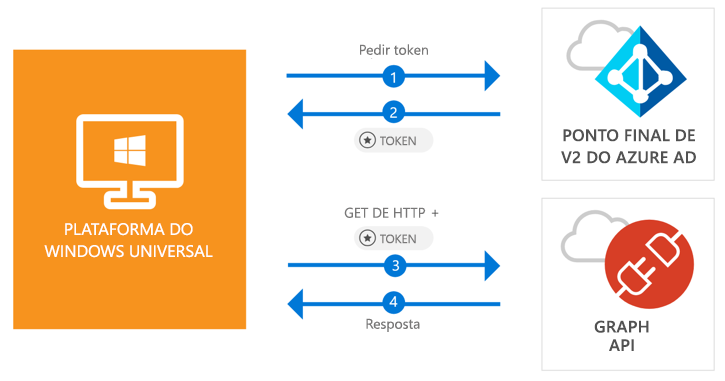

# <a name="call-the-microsoft-graph-api-from-a-universal-windows-platform-uwp-application"></a>Chame a Microsoft Graph API a partir de uma aplicação da Plataforma Universal do Windows (UWP)

[!INCLUDE [active-directory-develop-applies-v2-msal](../../../includes/active-directory-develop-applies-v2-msal.md)]

Este início rápido contém um exemplo de código que demonstra como uma aplicação da Plataforma Universal do Windows (UWP) pode iniciar sessão dos utilizadores em contas pessoais ou contas profissionais e escolares, obter um token de acesso e chamar a Microsoft Graph API.



> [!div renderon="docs"]
> ## <a name="register-and-download"></a>Registar e transferir
> ### <a name="register-and-configure-your-application-and-code-sample"></a>Registar e configurar a aplicação e o exemplo de código
> #### <a name="step-1-register-your-application"></a>Passo 1: Registar a aplicação
> Para registar a sua aplicação e adicionar as informações de registo da aplicação à sua solução, faça o seguinte:
> 1. Aceda ao [Microsoft Application Registration Portal](https://apps.dev.microsoft.com/portal/register-app) para registar uma aplicação.
> 1. Na caixa **Nome da Aplicação**, introduza um nome para a sua aplicação.
> 1. Certifique-se de que a caixa de verificação **Configuração Assistida** está desmarcada e, em seguida, selecione **Criar**.
> 1. Selecione **Adicionar Plataforma**, selecione **Aplicação Nativa** e, em seguida, selecione **Guardar**.

> [!div renderon="portal" class="sxs-lookup alert alert-info"]
> #### <a name="step-1-configure-your-application"></a>Passo 1: Configurar a aplicação
> Para o código de exemplo deste início rápido funcionar, terá de adicionar um URL de redirecionamento como **urn: ietf:wg:oauth:2.0:oob**.
> > [!div renderon="portal" id="makechanges" class="nextstepaction"]
> > [Fazer esta alteração por mim]()
>
> > [!div id="appconfigured" class="alert alert-info"]
> >  A sua aplicação está configurada com estes atributos

#### <a name="step-2-download-your-visual-studio-project"></a>Passo 2: Transfira o seu projeto do Visual Studio

 - [Transferir o projeto do Visual Studio 2017](https://github.com/Azure-Samples/active-directory-dotnet-native-uwp-v2/archive/master.zip)

#### <a name="step-3-configure-your-visual-studio-project"></a>Passo 3: Transferir o seu projeto do Visual Studio

1. Extrair o ficheiro zip para uma pasta local (por exemplo, **C:\Azure-Samples**)
1. Abrir o projeto no Visual Studio
1. Edite **App.Xaml.cs** e substitua a linha que começa por `private static string ClientId` por:

    ```csharp
    private static string ClientId = "Enter_the_Application_Id_here";
    ```

## <a name="more-information"></a>Mais Informações

Abaixo encontra uma descrição geral deste Início rápido:

### <a name="msalnet"></a>MSAL.NET

A MSAL ([Microsoft.Identity.Client](https://www.nuget.org/packages/Microsoft.Identity.Client)) é a biblioteca que serve para iniciar sessão dos utilizadores e solicitar tokens utilizados para aceder a uma API protegida pelo Microsoft Azure Active Directory. Pode instalá-lo ao executar o comando seguinte na *Consola do Gestor de Pacotes* do Visual Studio:

```powershell
Install-Package Microsoft.Identity.Client -Pre
```

### <a name="msal-initialization"></a>Inicialização da MSAL

Pode adicionar a referência para MSAL, ao adicionar a linha abaixo:

```csharp
using Microsoft.Identity.Client;
```

Em seguida, inicialize a MSAL com a linha abaixo:

```csharp
public static PublicClientApplication PublicClientApp = new PublicClientApplication(ClientId);
```

> |Em que: ||
> |---------|---------|
> |ClientId | O Id de Aplicação da aplicação registada em *portal.microsoft.com* |

### <a name="requesting-tokens"></a>Pedir tokens

A Msal tem dois métodos que servem para comprar tokens - `AcquireTokenAsync` e `AcquireTokenSilentAsync`:

#### <a name="get-a-user-token-interactively"></a>Obter um token de utilizador interativamente

 Algumas situações exigem que os utilizadores sejam forçados a interagir com o ponto final do Azure Active Directory v2 através de uma janela pop-up para optar entre validar as credenciais ou para dar consentimento - alguns exemplos são:

- A primeira vez que os utilizadores iniciam sessão na aplicação
- Os utilizadores podem ter de reintroduzir as respetivas credenciais pela palavra-passe ter expirado
- A aplicação está a pedir acesso a um recurso para o qual o utilizador tem de dar consentimento
- É precisa a autenticação de dois fatores

```csharp
authResult = await App.PublicClientApp.AcquireTokenAsync(scopes);
```

> |Em que:||
> |---------|---------|
> |âmbitos | Contém os âmbitos que estão a ser pedidos (ou seja, `{ "user.read" }` para o Microsoft Graph ou `{ "api://<Application ID>/access_as_user" }` para as API Web personalizadas) |

#### <a name="get-a-user-token-silently"></a>Obter um token de utilizador automaticamente

Não deve exigir que o utilizador valide as credenciais sempre que precise de aceder a um recurso - a maioria das vezes pretende aquisições de token e renovação sem qualquer interação do utilizador - `AcquireTokenSilentAsync` é o método que normalmente serve para obter tokens utilizados para aceder a recursos protegidos após o `AcquireTokenAsync` inicial:

```csharp
var accounts = await App.PublicClientApp.GetAccountsAsync();
authResult = await App.PublicClientApp.AcquireTokenSilentAsync(scopes, accounts.FirstOrDefault());
```

> |Em que: ||
> |---------|---------|
> |âmbitos | Contém os âmbitos que estão a ser pedidos (ou seja, `{ "user.read" }` para o Microsoft Graph ou `{ "api://<Application ID>/access_as_user" }` para as API Web personalizadas) |
> |accounts.FirstOrDefault() | O primeiro utilizador na cache (a MSAL suporta vários utilizadores numa única aplicação) |

## <a name="next-steps"></a>Passos seguintes

Experimente o tutorial do Ambiente de Trabalho do Windows para obter um guia passo a passo completo sobre a criação de aplicações e novas funcionalidades, incluindo uma explicação completa deste Início rápido:

### <a name="learn-the-steps-to-create-the-application-used-in-this-quickstart"></a>Conheça os passos para criar a aplicação utilizada neste Início rápido

> [!div class="nextstepaction"]
> [UWP - Chamar tutorial da Graph API](tutorial-v2-windows-uwp.md)

[!INCLUDE [Help and support](../../../includes/active-directory-develop-help-support-include.md)]