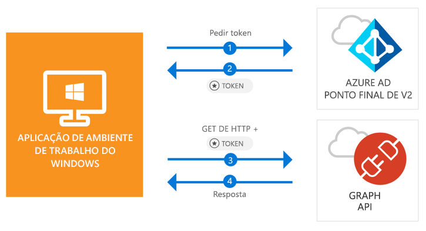

# <a name="quickstart-acquire-a-token-and-call-microsoft-graph-api-from-a-windows-desktop-app"></a>Início rápido: Adquirir um token e chamar a Microsoft Graph API a partir de uma aplicação de ambiente de trabalho do Windows

[!INCLUDE [active-directory-develop-applies-v2-msal](../../../includes/active-directory-develop-applies-v2-msal.md)]

Neste início rápido, irá aprender como escrever uma aplicação .NET (WPF) de ambiente de trabalho do Windows que pode iniciar sessão em contas pessoais, profissionais e escolares, obter um token de acesso e chamar a Microsoft Graph API.



> [!div renderon="docs"]
> ## <a name="register-and-download-your-quickstart-app"></a>Registar e transferir a aplicação do início rápido
> [!div renderon="docs" class="sxs-lookup"]
> Tem duas opções para iniciar a aplicação de início rápido:
> * [Express] [Opção 1: registar e configurar automaticamente a sua aplicação e, em seguida, transferir o exemplo de código](#option-1-register-and-auto-configure-your-app-and-then-download-your-code-sample)
> * [Manual] [Opção 2: registar e configurar manualmente a aplicação e o exemplo de código](#option-2-register-and-manually-configure-your-application-and-code-sample)
>
> ### <a name="option-1-register-and-auto-configure-your-app-and-then-download-your-code-sample"></a>Opção 1: registar e configurar automaticamente a sua aplicação e, em seguida, transferir o exemplo de código
>
> 1. Aceda ao [Portal do Azure - Registo de Aplicação](https://portal.azure.com/?Microsoft_AAD_RegisteredApps=true#blade/Microsoft_AAD_RegisteredApps)
> 1. Introduza um nome para a sua aplicação e xelecione **Registar**.
> 1. Siga as instruções para transferir e configurar automaticamente a sua nova aplicação com um só clique.
>
> ### <a name="option-2-register-and-manually-configure-your-application-and-code-sample"></a>Opção 2: registar e configurar manualmente a aplicação e o exemplo de código
> [!div renderon="docs"]
> #### <a name="step-1-register-your-application"></a>Passo 1: Registar a aplicação
> 1. Inicie sessão no [portal do Azure](https://portal.azure.com) com uma conta profissional ou escolar ou uma conta pessoal da Microsoft.
> 1. Se a sua conta permitir aceder a mais de um inquilino, selecione-a no canto superior direito e defina a sua sessão no portal para o inquilino pretendido do Azure AD.
> 1. No painel de navegação do lado esquerdo, selecione o serviço **Azure Active Directory** e, em seguida, selecione **Registos de aplicações (Pré-visualização)** > **Novo registo**.
> 1. Quando a página **Registar uma aplicação** for apresentada, introduza as informações de registo da aplicação:
>      - Na secção **Nome**, introduza um nome de aplicação significativo que será apresentado aos utilizadores da aplicação, por exemplo `Win-App-calling-MsGraph`.
>      - Na secção **Tipos de conta suportados**, selecione **Contas em qualquer diretório organizacional e contas Microsoft pessoais (por exemplo, Skype, Xbox, Outlook.com)**.
>      - Selecione **Registar** para criar a aplicação.
> 1. Na lista de páginas da aplicação, selecione **Autenticação**.
> 1. Na secção **URIs de Redirecionamento**, localize a secção **URIs de Redirecionamento Sugeridos para clientes públicos (móvel, ambiente de trabalho)** e selecione **"urn:ietf:wg:oauth:2.0:oob**.
> 1. Selecione **Guardar**.

> [!div renderon="portal" class="sxs-lookup"]
> #### <a name="step-1-configure-your-application"></a>Passo 1: Configurar a aplicação
> Para o código de exemplo deste início rápido funcionar, terá de adicionar um URL de resposta como **urn: ietf:wg:oauth:2.0:oob**.
> > [!div renderon="portal" id="makechanges" class="nextstepaction"]
> > [Fazer esta alteração por mim]()
>
> > [!div id="appconfigured" class="alert alert-info"]
> >  A sua aplicação está configurada com estes atributos.

#### <a name="step-2-download-your-visual-studio-project"></a>Passo 2: Transfira o seu projeto do Visual Studio

[Transferir o projeto do Visual Studio 2017](https://github.com/Azure-Samples/active-directory-dotnet-desktop-msgraph-v2/archive/master.zip)

#### <a name="step-3-configure-your-visual-studio-project"></a>Passo 3: Configurar o projeto do Visual Studio

1. Extraia o ficheiro zip para uma pasta local próxima da raiz do disco, por exemplo, **C:\Azure-Samples**.
1. Abra o projeto no Visual Studio.
1. Edite **App.Xaml.cs** e substitua os valores dos campos `ClientId` e `Tenant` com o código seguinte:

    ```csharp
    private static string ClientId = "Enter_the_Application_Id_here";
    private static string Tenant = "Enter_the_Tenant_Info_Here";
    ```

> [!div renderon="docs"]
> Em que:
> - `Enter_the_Application_Id_here` - é o **ID da Aplicação (cliente)** que registou.
> - `Enter_the_Tenant_Info_Here` - está definido para uma das seguintes opções:
>   - Se a sua aplicação suportar **Contas neste diretório organizacional**, substitua este valor pelo **Id do Inquilino** ou pelo **Nome do inquilino** (por exemplo, contoso.microsoft.com)
>   - Se a sua aplicação suportar **Contas em qualquer diretório organizacional**, substitua este valor por `organizations`
>   - Se a sua aplicação suportar **Contas em quaisquer contas da Microsoft de diretório organizacional e pessoais**, substitua este valor por `common`
>
> > [!TIP]
> > Para encontrar os valores do **ID da Aplicação (cliente)**, o **ID de Diretório (inquilino)** e os **Tipos de conta suportados**, vá para a página **Descrição geral** da aplicação no portal do Azure.

## <a name="more-information"></a>Mais informações

### <a name="msalnet"></a>MSAL.NET

A MSAL ([Microsoft.Identity.Client](https://www.nuget.org/packages/Microsoft.Identity.Client)) é a biblioteca utilizada para iniciar sessão dos utilizadores e solicitar tokens utilizados para aceder a uma API protegida pelo Microsoft Azure Active Directory (Azure AD). Pode instalar a MSAL ao executar o comando seguinte na **Consola do Gestor de Pacotes** do Visual Studio:

```powershell
Install-Package Microsoft.Identity.Client -Pre
```

### <a name="msal-initialization"></a>Inicialização da MSAL

Pode adicionar a referência para MSAL, adicionando o código seguinte:

```csharp
using Microsoft.Identity.Client;
```

Em seguida, inicialize a MSAL com o código seguinte:

```csharp
public static PublicClientApplication PublicClientApp = new PublicClientApplication(ClientId);
```

> |Em que: ||
> |---------|---------|
> | `ClientId` | É o **ID de Aplicação (cliente)** da aplicação registada no portal do Azure. Pode encontrar este valor na página **Descrição geral** da aplicação no portal do Azure. |

### <a name="requesting-tokens"></a>Pedir tokens

A MSAL tem dois métodos para comprar tokens: `AcquireTokenAsync` e `AcquireTokenSilentAsync`.

#### <a name="get-a-user-token-interactively"></a>Obter um token de utilizador interativamente

Algumas situações exigem que os utilizadores sejam forçados a interagir com o ponto final do Azure AD v2.0 através de uma janela de pop-up para optar entre validar as credenciais ou para dar consentimento. Alguns exemplos incluem:

- A primeira vez que os utilizadores iniciam sessão na aplicação
- Quando os utilizadores possam ter de reintroduzir as respetivas credenciais por a palavra-passe ter expirado
- Quando a aplicação está a pedir acesso a um recurso para o qual o utilizador tem de dar consentimento
- Quando é precisa a autenticação de dois fatores

```csharp
authResult = await App.PublicClientApp.AcquireTokenAsync(_scopes);
```

> |Em que:||
> |---------|---------|
> | `_scopes` | Contém os âmbitos que estão a ser pedidos (como o `{ "user.read" }` para o Microsoft Graph ou `{ "api://<Application ID>/access_as_user" }` para as API Web personalizadas). |

#### <a name="get-a-user-token-silently"></a>Obter um token de utilizador automaticamente

Não vai querer exigir que o utilizador valide as suas credenciais sempre que tiver de aceder a um recurso. A maioria das vezes, vai querer que as aquisições e renovação de tokens sejam feitas sem qualquer interação do utilizador. Pode utilizar o método `AcquireTokenSilentAsync` para obter tokens para aceder a recursos protegidos após o método `AcquireTokenAsync` inicial:

```csharp
var accounts = await App.PublicClientApp.GetAccountsAsync();
authResult = await App.PublicClientApp.AcquireTokenSilentAsync(scopes, accounts.FirstOrDefault());
```

> |Em que: ||
> |---------|---------|
> | `scopes` | Contém os âmbitos que estão a ser pedidos (como o `{ "user.read" }` para o Microsoft Graph ou `{ "api://<Application ID>/access_as_user" }` para as API Web personalizadas). |
> | `accounts.FirstOrDefault()` | Especifica o primeiro utilizador na cache (a MSAL suporta vários utilizadores numa única aplicação). |

[!INCLUDE [Help and support](../../../includes/active-directory-develop-help-support-include.md)]

## <a name="next-steps"></a>Passos seguintes

Experimente o tutorial do ambiente de trabalho do Windows para obter um guia passo a passo completo sobre a criação de aplicações e novas funcionalidades, incluindo uma explicação completa deste início rápido.

> [!div class="nextstepaction"]
> [Chamar tutorial da Graph API](https://docs.microsoft.com/azure/active-directory/develop/guidedsetups/active-directory-windesktop)

