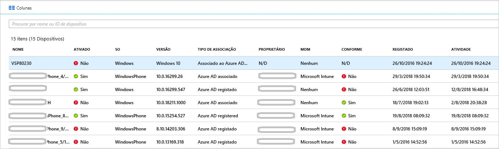

# <a name="how-to-manage-the-stale-devices-in-azure-ad"></a>Procedimento: Gerir os dispositivos obsoletos no Azure AD

Idealmente, para concluir o ciclo de vida, deverá anular o registo dos dispositivos registados quando estes já não são necessários. No entanto, devido a vários motivos, como dispositivos perdidos, roubados ou danificados ou a reinstalações do SO, é comum haver dispositivos obsoletos no seu ambiente. Enquanto administrador de TI, é provável que precise de um método para remover os dispositivos obsoletos, para que os seus recursos se possam dedicar à gestão dos dispositivos que têm, efetivamente, de ser geridos.

Neste artigo, vai aprender a gerir de forma eficiente os dispositivos obsoletos no sue ambiente.
  

## <a name="what-is-a-stale-device"></a>O que são dispositivos obsoletos?

Os dispositivos obsoletos são dispositivos registados no Azure AD, mas que já não são utilizados há um determinado período de tempo para aceder a aplicações na cloud. Estes dispositivos têm impacto na capacidade de gerir e dar suporte técnico aos seus dispositivos e utilizadores no inquilino porque: 

- Dispositivos duplicados podem fazer com que seja mais difícil à sua equipa de suporte técnico identificar que dispositivo está atualmente ativo.

- Um número mais alto de dispositivos cria repetições de escrita de dispositivos desnecessárias, o que faz com que a sincronização do AAD Connect demore mais tempo.

- Por questões de organização geral e para estar em conformidade, poderá querer ter dispositivos com um estado limpo. 


Os dispositivos obsoletos no Azure AD podem interferir com as políticas gerais de ciclo de vida dos dispositivos da sua organização.


## <a name="detect-stale-devices"></a>Detetar dispositivos obsoletos

Uma vez que os dispositivos obsoletos são definidos como dispositivos registados que já não são utilizados há um determinado período de tempo para aceder a aplicações na cloud, a deteção dos mesmos requer uma propriedade relacionada com carimbo de data/hora. No Azure AD, essa propriedade é denominada **ApproximateLastLogonTimestamp**, ou **activity timestamp**. Se o delta entre o valor de agora e o valor de **carimbo de data/hora da atividade** exceder o período de tempo que definiu para os dispositivos ativos, considera-se que o dispositivo está obsoleto. Este **carimbo de data/hora da atividade** está agora em pré-visualização pública.

## <a name="how-is-the-value-of-the-activity-timestamp-managed"></a>Como é gerido o valor do carimbo de data/hora da atividade?  

A avaliação do carimbo de data/hora da atividade é acionado por uma tentativa de autenticação de um dispositivo. O Azure AD avalia o carimbo de data/hora da atividade quando:

- for acionada uma política de acesso condicional que exija [dispositivos geridos](../conditional-access/require-managed-devices.md) ou [aplicações cliente aprovadas](../conditional-access/app-based-conditional-access.md).

- Os dispositivos Windows 10 associados ao Azure AD ou associados ao Azure AD híbrido estiverem ativos na rede. 

- Os dispositivos geridos do Intune tenham dado entrada no serviço.


Se o delta entre o valor existente do carimbo de data/hora da atividade e o valor atual for superior a 14 dias, o valor existente é substituído pelo novo.
    

## <a name="how-do-i-get-the-activity-timestamp"></a>Como posso obter o carimbo de data/hora da atividade?

Tem duas opções para obter o valor do carimbo de data/hora da atividade:

- A coluna **Atividade**, na [página de dispositivos](https://portal.azure.com/#blade/Microsoft_AAD_IAM/DevicesMenuBlade/Devices) no portal do Azure.

    


- O cmdlet [Get-MsolDevice](https://docs.microsoft.com/powershell/module/msonline/get-msoldevice?view=azureadps-1.0)

    


## <a name="plan-the-cleanup-of-your-stale-devices"></a>Planear a limpeza dos dispositivos obsoletos

Para limpar eficazmente os dispositivos obsoletos no seu ambiente, deve definir uma política relacionada. Essa política ajuda-o a ter a certeza de que captura todas as considerações associadas aos dispositivos obsoletos. As seguintes secções mostram-lhe exemplos de considerações comuns para a política. 

### <a name="cleanup-account"></a>Conta de limpeza

Para atualizar um dispositivo no Azure AD, precisa de uma conta com uma das seguintes funções atribuída:

- Administrador Global

- Administrador de Dispositivo na Cloud (função nova disponível agora!)

- Administrador de Serviços do Intune

Na sua política de limpeza, selecione as contas que têm as funções necessárias atribuídas. 


### <a name="timeframe"></a>Período de tempo

Defina um período de tempo que funcione como indicador de dispositivo obsoleto. Quando definir o período de tempo, tenha em conta a janela de 14 dias para atualizar o carimbo de data/hora da atividade no seu valor. Por exemplo, não deve considerar um carimbo de data/hora com menos de 14 dias como indicador de dispositivo obsoleto. Há casos que podem fazer com que um dispositivo pareça obsoleto, embora não o esteja. Por exemplo, o proprietário do dispositivo afetado pode estar de férias ou de baixa médica  por um período que excede o que definido para os dispositivos obsoletos.

### <a name="disable-devices"></a>Desativar dispositivos

Não é aconselhável eliminar imediatamente um dispositivo que pareça estar obsoleto, porque não é possível anular a eliminação em caso de falsos positivos. Como melhor prática, desative os dispositivos durante um período de tolerância antes de os eliminar. Na sua política, defina um período de tempo durante o qual um dispositivo estará desativado, antes de o eliminar.


### <a name="mdm-controlled-devices"></a>Dispositivos controlados por MDM

Se o seu dispositivo estiver a ser controlado pelo Intune ou por outra solução de MDM, descontinue-o no sistema de gestão antes de o desativar ou eliminar.


### <a name="system-managed-devices"></a>Dispositivos geridos pelo sistema

Não elimine dispositivos geridos pelo sistema. Geralmente, tratam-se de dispositivo como piloto automático. Depois de eliminados, não podem ser reaprovisionados. Por predefinição, o cmdlet `get-msoldevice` novo exclui os dispositivos geridos pelo sistema. 


### <a name="hybrid-azure-ad-joined-devices"></a>Dispositivos híbridos associados ao Azure AD

Os seus dispositivos associados ao Azure AD híbrido devem seguir as suas políticas de gestão de dispositivos obsoletos no local. 

Para limpar o Azure AD:

- **Dispositivos Windows 10** - desative ou elimine os dispositivos Windows 10 no seu AD no local e permita que o Azure AD Connect sincronize o estado do dispositivo alterado com o Azure AD.

- **Windows 7/8** - desative ou elimine os dispositivos Windows 10 no Azure AD. Não pode utilizar o Azure AD Connect para desativar ou eliminar dispositivos Windows 7/8 no Azure AD.


### <a name="azure-ad-joined-devices"></a>Dispositivos associados ao Azure AD

Desative ou elimine os dispositivos associados ao Azure AD no Azure AD.


### <a name="azure-ad-registered-devices"></a>Dispositivos registados no Azure AD

Desative ou elimine os dispositivos registados no Azure AD no Azure AD.


## <a name="clean-up-stale-devices-in-the-azure-portal"></a>Limpar dispositivos obsoletos no portal do Azure  

Embora possa limpar dispositivos obsoletos no portal do Azure, é mais eficiente lidar com esse processo com um script do PowerShell. Utilize o módulo do PowerShell V1 mais recente para utilizar o filtro de carimbo de data/hora e para filtrar os dispositivos geridos pelo sistema, como dispositivos de piloto automático. Neste momento, não se recomendado a utilização do PowerShell V2.


Uma rotina típica consiste nos seguintes passos:

1. Ligar ao Azure Active Directory com o cmdlet [Connect-MsolService](https://docs.microsoft.com/powershell/module/msonline/connect-msolservice?view=azureadps-1.0)

2. Obter a lista de dispositivos

3. Desativar o dispositivo com o cmdlet [Disable-MsolDevice](https://docs.microsoft.com/powershell/module/msonline/disable-msoldevice?view=azureadps-1.0). 

4. Aguarde até ao fim do período de tolerância com o número de dias que escolher antes de eliminar o dispositivo.

5. Remover o dispositivo com o cmdlet [Remove-MsolDevice](https://docs.microsoft.com/powershell/module/msonline/remove-msoldevice?view=azureadps-1.0).

### <a name="get-the-list-of-devices"></a>Obter a lista de dispositivos

Para obter todos os dispositivos e armazenar os dados devolvidos num ficheiro CSV:

```powershell
Get-MsolDevice -all | select-object -Property Enabled, DeviceId, DisplayName, DeviceTrustType, Approxi
mateLastLogonTimestamp | export-csv devicelist-summary.csv
```

Se tiver muitos dispositivos no seu diretório, utilize o filtro de carimbo de data/hora para limitar o número de dispositivos devolvidos. Para obter todos os dispositivos com um carimbo de data/hora posterior a uma data específica e armazenar os dados devolvidos num ficheiro CSV: 

```powershell
$dt = [datetime]’2017/01/01’
Get-MsolDevice -all -LogonTimeBefore $dt | select-object -Property Enabled, DeviceId, DisplayName, DeviceTrustType, ApproximateLastLogonTimestamp | export-csv devicelist-olderthan-Jan-1-2017-summary.csv
```


## <a name="what-you-should-know"></a>O que deve saber

### <a name="why-is-the-timestamp-not-updated-more-frequently"></a>Por que é que o carimbo de data/hora não é atualizado mais frequentemente?

O carimbo de data/hora é atualizado para suportar cenários de ciclo de vida dos dispositivos. Não é uma auditoria. Para atualizações mais frequentes no dispositivo, utilize os registos de auditoria de início de sessão.

### <a name="why-should-i-worry-about-my-bitlocker-keys"></a>Por que me devo preocupar com as chaves BitLocker?

Quando configuradas, as chaves BitLocker para os dispositivos Windows 10 são armazenadas nos objetos dos dispositivos no Azure AD. Se eliminar um dispositivo obsoleto, as chaves BitLocker armazenadas no mesmo também são eliminadas. Antes de eliminar dispositivos obsoletos, deve determinar se a sua política de limpeza está alinhada com o ciclo de vida efetivo dos dispositivos. 

### <a name="how-do-i-know-all-the-type-of-devices-joined"></a>Como posso saber todos os tios de dispositivos associados?

Para saber mais sobre os diversos tipos, veja a [descrição geral da gestão de dispositivos](overview.md).

### <a name="what-happens-when-i-disable-a-device"></a>O que acontece quando desativo um dispositivo?

Qualquer autenticação em que esteja a ser utilizado um dispositivo para autenticação no Azure é recusada. Alguns exemplos comuns são:

- **Dispositivo associado ao Azure AD híbrido** - os utilizadores poderão utilizar o dispositivo para iniciarem sessão no respetivo domínio no local. Contudo, não podem aceder aos recursos do Azure AD, como o Office 365.

- **Dispositivo associado ao Azure AD** - os utilizadores não podem utilizar o dispositivo para iniciarem sessão. 

- **Dispositivos móveis** - o utilizador não pode aceder aos recursos do Azure AD, como o Office 365. 


## <a name="next-steps"></a>Passos seguintes

Para obter uma descrição geral sobre como gerir dispositivos no portal do Azure, veja [Managing devices using the Azure portal](device-management-azure-portal.md) (Gerir dispositivos no portal do Azure)


