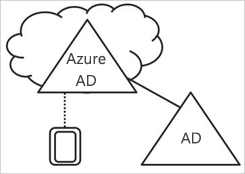
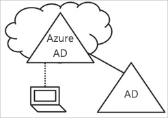
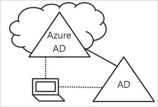

# Introdução à gestão de dispositivos no Azure Active Directory

Num mundo de dispositivos móveis e da cloud, Azure Active Directory (Azure AD) permite início de sessão único para dispositivos, aplicações e serviços de qualquer lugar. Com a proliferação de dispositivos – incluindo Bring Your Own Device (BYOD), os profissionais de TI enfrentam com dois objetivos opostos:

- Aumentar a produtividade dos usuários finais para serem produtivos, onde quer e sempre que
- Proteger os ativos empresariais em qualquer altura

Através de dispositivos, os seus utilizadores estiver a obter acesso a seus recursos empresariais. Para proteger os ativos corporativos, como um administrador de TI, deseja ter controle sobre esses dispositivos. Isto permite-lhe certificar-se de que os utilizadores estão a aceder ao seus recursos de dispositivos que cumprem as normas de segurança e conformidade. 

Gestão de dispositivos também é a base para [acesso condicional com base no dispositivo](../active-directory-conditional-access-policy-connected-applications.md). Com o acesso condicional com base no dispositivo, pode certificar-se de que o acesso a recursos no seu ambiente apenas é possível com os dispositivos geridos.   

Este artigo explica como funciona a gestão de dispositivos no Azure Active Directory.

## Dispositivos sob o controlo do Azure AD

Para obter um dispositivo sob o controlo do Azure AD, tem duas opções:

- A registar 
- Associar

**Registar** um dispositivo para o Azure AD permite-lhe gerir a identidade de um dispositivo. Quando um dispositivo é registado, o registo de dispositivos do Azure AD fornece ao dispositivo uma identidade que é utilizado para autenticar o dispositivo quando um utilizador inicia sessão com o Azure AD. Pode utilizar a identidade para ativar ou desativar um dispositivo.

Quando combinada com uma solução de gestão de dispositivos móveis, como o Microsoft Intune, os atributos do dispositivo no Azure AD são atualizados com informações adicionais sobre o dispositivo. Isto permite criar regras de acesso condicional que impõem o acesso a partir de dispositivos para cumprir as normas de segurança e conformidade. Para obter mais informações sobre a inscrição de dispositivos no Microsoft Intune, consulte inscrever dispositivos para gestão no Intune.

**Associar** um dispositivo é uma extensão para registar um dispositivo. Isto significa que ele fornece todas as vantagens de registo de um dispositivo e além disso, também altera o estado local de um dispositivo. Alterar o estado local permite que os utilizadores para início de sessão para um dispositivo com uma conta escolar ou profissional de organizacional em vez de uma conta pessoal.

## Dispositivos do Azure AD registado   

O objetivo de dispositivos do Azure AD registado é para lhe fornecer suporte para o **Bring Your Own Device (BYOD)** cenário. Neste cenário, um utilizador pode aceder a recursos do Azure Active Directory controlada da sua organização através de um dispositivo pessoal.  

O acesso baseia-se numa conta escolar ou profissional que foi introduzida no dispositivo.  
Por exemplo, o Windows 10 permite aos utilizadores adicionar uma conta escolar ou profissional a um computador pessoal, tablet ou telefone.  
Quando um usuário adicionar um ou conta profissional, o dispositivo é registado com o Azure AD e, opcionalmente, inscritos no sistema de gestão (MDM) de dispositivos móveis que tenha configurado a sua organização. Utilizadores da sua organização podem adicionar uma conta escolar ou profissional para um dispositivo pessoal convenientemente:

- Quando acedem a uma aplicação de trabalho pela primeira vez
- Manualmente através da **definições** menu no caso do Windows 10 

Pode configurar dispositivos do Azure AD registado para o Windows 10, iOS, Android e macOS.

## Dispositivos associados ao Azure AD

O objetivo de dispositivos associados ao Azure AD é simplificar:

- Implementações de Windows de dispositivos da empresa de trabalho 
- Acesso a aplicações organizacionais e de recursos a partir de qualquer dispositivo de Windows
- Com base na cloud de gestão de dispositivos da empresa de trabalho

Associação do Azure AD pode ser implementada por meio de um dos seguintes métodos: 
 - [Windows Autopilot](https://docs.microsoft.com/windows/deployment/windows-autopilot/windows-10-autopilot)
 - [Implantação em massa](https://docs.microsoft.com/intune/windows-bulk-enroll)
 - [Experiência self-service](azuread-joined-devices-frx.md) 

**Associação do Azure AD** destina-se para as organizações que pretendem ser cloud-first (ou seja, principalmente utilizar serviços cloud, com o objetivo de reduzir a utilização de uma infraestrutura no local) ou apenas na cloud (nenhuma infraestrutura no local). Não há restrições sobre o tamanho ou tipo de organizações que pode implementar a associação do Azure AD. Funciona de associação com o AD do Azure bem, mesmo num ambiente híbrido, permitir o acesso a aplicações na cloud e no local e recursos.

Implementação de dispositivos associados ao Azure AD fornece as seguintes vantagens:

- **Início de sessão único (SSO)** para sua do Azure geridas por serviços e aplicações SaaS. Os utilizadores não veem pedidos de autenticação adicional ao aceder a recursos de trabalho. A funcionalidade SSO é mesmo quando não estiverem ligados à rede de domínio disponível.

- **Roaming de conformidade empresarial** das definições de utilizador em todos os dispositivos associados a um. Os usuários não precisam de ligar a uma conta Microsoft (por exemplo, Hotmail) para ver as definições em dispositivos.

- **Acesso a Windows Store para empresas** através de uma conta do Azure AD. Os utilizadores escolherem um inventário dos aplicativos pré-selecionada pela organização.

- **Windows Hello** suporte para acesso seguro e conveniente aos recursos de trabalho.

- **Restrição de acesso** para as aplicações sejam apenas os dispositivos que cumprem a política de conformidade.

- **Acesso totalmente integrado aos recursos no local** quando o dispositivo tem linha Visual para o controlador de domínio no local. 

Enquanto a associação do Azure AD destina-se principalmente para organizações que não tenham uma infraestrutura do Windows Server Active Directory no local, certamente ele pode ser usado em cenários em que:

- Pretende efetuar a transição para a infraestrutura baseada na cloud com o Azure AD e o MDM, como o Intune.

- Não é possível utilizar uma associação de domínio no local, por exemplo, se precisar de os dispositivos móveis, como tablets e telemóveis sob controle.

- Os utilizadores precisam de aceder principalmente do Office 365 ou outras aplicações SaaS integradas com o Azure AD.

- Pretender gerir um grupo de utilizadores no Azure AD em vez de no Active Directory. Isto pode aplicar, por exemplo, a funcionários temporários, contratantes ou estudantes.

- Deseja fornecer capacidades de junção para funções de trabalho remoto das filiais com limitado infraestrutura no local.

Pode configurar dispositivos associados ao Azure AD para dispositivos Windows 10.

## Dispositivos associados ao Azure AD híbrido

Para mais de uma década, muitas organizações têm usado a associação ao domínio para o Active Directory no local para ativar:

- Departamentos de TI para gerir dispositivos pertencentes à empresa trabalho de um local central.

- Os utilizadores iniciem sessão nos seus dispositivos com o Active Directory funcionam contas escolares ou profissionais. 

Normalmente, as organizações com uma pegada no local confiam na geração de imagens de métodos para aprovisionar dispositivos e muitas vezes utilizam **System Center Configuration Manager (SCCM)** ou **(GP) de política de grupo** para gerir -los.

Se o ambiente tiver no local requisitos de espaço do AD e também deseja o benefício dos recursos fornecidos pelo Azure Active Directory, pode implementar dispositivos de associados ao Azure AD híbrido. Estes são os dispositivos que estão ambos, associado ao seu local do Active Directory e o Azure Active Directory.

Deve usar dispositivos híbridos associados do Azure AD se:

- Tem aplicações de Win32 implementadas para estes dispositivos que se baseiam na autenticação de computador do Active Directory.

- Precisa de GP gerir dispositivos.

- Pretende continuar a utilizar soluções de geração de imagens para configurar dispositivos para os seus empregados.

Pode configurar Hybrid Azure AD associado a um dispositivos para Windows 10 e dispositivos de nível inferior, como o Windows 8 e Windows 7.

## Resumo

Gestão de dispositivos no Azure AD, pode: 

- Simplificar o processo de trazer dispositivos sob o controlo do Azure AD

- Fornecer aos usuários um acesso fácil de usar a recursos baseados na nuvem de sua organização

Como regra de um princípio básico, deve usar:

- Dispositivos registados do Azure AD:

    - Para os dispositivos pessoais 

    - Para registar manualmente os dispositivos com o Azure AD

- Dispositivos associados ao Azure AD: 

    - Para dispositivos que são propriedade da sua organização

    - Para dispositivos que estejam **não** associado a uma local do AD

    - Para registar manualmente os dispositivos com o Azure AD

    - Para alterar o estado local de um dispositivo

- Azure AD híbrido associou dispositivos para dispositivos que estão associados a uma local do AD     

    - Para dispositivos que são propriedade da sua organização

    - Para dispositivos que estão associados a uma local do AD

    - Para registrar automaticamente os dispositivos com o Azure AD

    - Para alterar o estado local de um dispositivo

## Passos Seguintes

- Para obter uma descrição geral de como gerir dispositivos no portal do Azure, consulte [gestão de dispositivos no portal do Azure](device-management-azure-portal.md)

- Para saber mais sobre o acesso condicional com base no dispositivo, veja [configurar políticas de acesso condicional com base no dispositivo do Azure Active Directory](../active-directory-conditional-access-policy-connected-applications.md).

- A configuração:
    - O Azure Active Directory de dispositivos Windows 10 registados, consulte [dispositivos Windows 10 registados de como configurar o Azure Active Directory](../user-help/device-management-azuread-registered-devices-windows10-setup.md)
    - Dispositivos associados ao Azure Active Directory, consulte [dispositivos associados ao como configurar o Azure Active Directory](../user-help/device-management-azuread-joined-devices-setup.md)
    - Dispositivos de associados ao Azure AD híbrido, consulte [como planear a sua implementação híbrida do Azure Active Directory](hybrid-azuread-join-plan.md).

