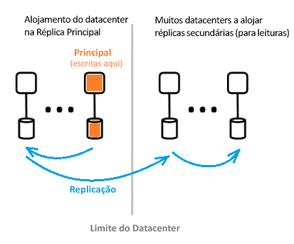

# O que é a arquitetura do Azure Active Directory?
O Azure Active Directory (Azure AD) permite-lhe gerir de forma segura o acesso dos seus utilizadores aos serviços e recursos do Azure. Incluído com o Azure AD está um conjunto completo de capacidades de gestão de identidades. Para obter informações sobre as funcionalidades do Azure AD, veja [What is Azure Active Directory?](active-directory-whatis.md) (O que é o Azure Active Directory?)

Com o Azure AD, pode criar e gerir utilizadores e grupos e ativar permissões para permitir e recusar o acesso a recursos empresariais. Para obter informações sobre a gestão de identidades, veja [The fundamentals of Azure identity management](active-directory-whatis.md) (Noções Básicas da gestão de identidades do Azure).

## Arquitetura do Azure AD
A arquitetura geograficamente distribuída do Azure AD combina alargadas de monitorização, redirecionamento automatizado, ativação pós-falha e recursos de recuperação, o que fornecem toda a empresa de disponibilidade e desempenho aos clientes.

Este artigo cobre os elementos da arquitetura seguintes:
 *  Design da arquitetura do serviço
 *  Facilidade de utilização 
 *  Disponibilidade contínua
 *  Datacenters

### Design da arquitetura do serviço
A forma mais comum para criar um acessível e sistema utilizável, providos de dados é efetuada através de blocos modulares independentes ou unidades de escala. Para a camada de dados do Azure AD, são chamadas de unidades de escala *partições*. 

A camada de dados tem vários serviços front-end que proporcionam a capacidade de leitura/escrita. O diagrama abaixo mostra como os componentes de uma partição de diretório único são entregues ao longo de datacenters distribuídos geograficamente. 

  

Os componentes da arquitetura do Azure AD incluem uma réplica primária e réplicas secundárias.

**Réplica primária**

A *réplica primária* recebe todas as *escritas* da partição a que pertence. Qualquer operação de escrita é replicada imediatamente numa réplica secundária noutro datacenter antes de devolver com êxito para o chamador, garantindo, assim, a durabilidade geograficamente redundante das escritas.

**Réplicas secundárias**

Todas as *leituras* do diretório são servidas a partir de *réplicas secundárias*, que estão em datacenters localizados fisicamente em diferentes geografias. Existem muitas réplicas secundárias, uma vez que os dados são replicados de forma assíncrona. Leituras de diretório, tais como pedidos de autenticação, são servidas a partir de centros de dados que estão próximos dos clientes. As réplicas secundárias são responsáveis pela escalabilidade das leituras.

### Escalabilidade

A escalabilidade é a capacidade de um serviço se expandir para satisfazer o aumento da procura pelo desempenho. A escalabilidade das escritas é obtida ao particionar os dados. A escalabilidade das leituras é obtida ao replicar dados de uma partição para várias réplicas secundárias distribuídas em todo o mundo.

Pedidos de aplicações de diretório são encaminhados para o Centro de dados que estão fisicamente mais perto. As escritas são redirecionadas, de forma transparente, para a réplica primária, de modo a proporcionar consistência de leitura/escrita. As réplicas secundárias ampliam significativamente a escala das partições, porque, regra geral, na maior parte do tempo, os diretórios estão a servir leituras.

As aplicações de diretório ligam-se aos datacenters mais próximos. Esta ligação melhora o desempenho e dimensionamento, por conseguinte, é possível. Uma vez que as partições de diretório podem ter muitas réplicas secundárias, estas podem ser colocadas mais perto dos clientes dos diretórios. Apenas os componentes do serviço de diretório internos que sejam de escrita intensiva segmentam diretamente a réplica primária ativa.

### Disponibilidade contínua

A disponibilidade (ou tempo de atividade) define a capacidade de um sistema de funcionar sem interrupções. A chave para elevada disponibilidade do Azure AD é que os serviços podem alternar rapidamente o tráfego em vários centros de dados distribuída geograficamente. Cada datacenter é independente, o que possibilita os modos de falha de descorrelação.

O design de partições do Azure AD é simplificado quando comparado com o AD empresarial, com um design de mestre único que inclui um processo de ativação pós-falha de réplicas primárias determinístico e cuidadosamente orquestrado.

**Tolerância a falhas**

Os sistemas estão mais disponíveis se forem tolerantes a falhas de hardware, rede e software. Para cada partição no diretório, existe uma réplica principal de elevada disponibilidade: A réplica primária. Só são realizadas nesta réplica as escritas para a partição. Esta réplica é monitorizada continuamente e de perto e as escritas podem ser alternadas imediatamente para outra réplica (que se torna na primária nova) caso seja detetada uma falha. Durante a ativação pós-falha, poderá haver uma perda de disponibilidade de escrita de cerca de 1 a 2 minutos, geralmente. A disponibilidade de leitura não é afetada durante este período.

As operações de leitura (que superam em muito as escritas) só vão para as réplicas secundárias. Uma vez que as réplicas secundárias são idempotentes, a perda de qualquer réplica numa determinada partição é facilmente compensada mediante o direcionamento das leituras para outra réplica, normalmente no mesmo datacenter.

**Durabilidade de dados**

As escritas são consolidadas de forma duradoura a, pelo menos, dois datacenters antes de serem reconhecidas. Isto acontece ao consolidar primeiro as escritas no datacenter primário e, depois, replicá-las imediatamente em, pelo menos, num outro. Esta ação de escrita garante que um potencial perda catastrófica de dados no Datacenter que aloja o primário não resulta em perda de dados.

Azure AD mantém um zero [objetivo de tempo de recuperação (RTO)](https://en.wikipedia.org/wiki/Recovery_time_objective) para não perder os dados em ativações pós-falha. Isto inclui:
-  Emissão de tokens e leituras de diretório
-  Permitir que apenas cerca de 5 minutos RTO para escritas de diretório

### Datacenters

As réplicas do Azure AD são armazenadas nos datacenters localizados em todo o mundo. Para obter mais informações, veja [Datacenters do Azure](https://azure.microsoft.com/overview/datacenters).

O Azure AD funciona em datacenters que têm as características seguintes:

 * Autenticação, Graph e outros serviços do AD residem por trás do serviço de Gateway. O Gateway gere o balanceamento de carga destes serviços. Ele irá efetuar a ativação pós-falha automaticamente se todos os servidores de mau estado de funcionamento forem detetados utilizar sondas de estado de funcionamento transacionais. Com base nestas sondas de estado de funcionamento, o Gateway encaminha dinamicamente o tráfego para os datacenters em bom estado de funcionamento.
 * Relativamente a *leituras*, o diretório tem réplicas secundárias e serviços front-end correspondentes numa configuração ativo-ativo e em funcionamento em vários datacenters. Em caso de falha de um datacenter inteiro, o tráfego é encaminhado automaticamente para outro datacenter.
 *  Para *escreve*, o diretório realizará a ativação pós-falha de réplica (mestre) primária em centros de dados por meio de planeada (primária nova é sincronizada com a primária antiga) ou os procedimentos de emergência de ativação pós-falha. A durabilidade dos dados é obtida mediante a replicação de uma consolidação com, pelo menos, dois datacenters.

**Consistência de dados**

O modelo de diretório é um dos consistência eventual. Um problema comum com sistemas de replicação assíncrona distribuídos é que os dados retornados de uma "determinada" réplica podem não ser atualizados. 

O Azure AD proporciona consistência de leitura/escrita às aplicações que segmentam réplicas secundárias ao encaminhar as respetivas escritas para a réplica primária e ao enviá-las de forma síncrona novamente para a réplica secundária.

As escritas de aplicações que utilizem a Graph API do Azure AD não mantêm afinidade com réplicas de diretórios para consistência de leitura/escrita. O serviço Azure AD Graph mantém uma sessão lógica, que tem afinidade com uma réplica secundária utilizada para leituras; a afinidade é capturada num “token de réplicas” que o serviço Graph coloca em cache mediante a utilização de uma cache distribuída. Este token é, depois, utilizado para operações subsequentes na mesma sessão lógica. 

 >[!NOTE]
 >As escritas são replicadas imediatamente na réplica secundária para a qual as leituras da sessão lógica foram emitidas.
 >

**Proteção de cópia de segurança**

O diretório implementa eliminações de forma recuperável, em vez de eliminações definitivas, para utilizadores e inquilinos para recuperação fácil em caso de eliminações acidentais por parte de um cliente. Se o administrador de inquilinos acidental elimina os utilizadores, pode facilmente anular e restaurar os utilizadores eliminados. 

O Azure AD implementa cópias de segurança diárias de todos os dados, pelo que consegue restaurar com autoridade dados, em caso de eliminações lógicas ou danos nos dados. A camada de dados emprega erro corrigir códigos, para que possa verificar a existência de erros e corrigir automaticamente determinados tipos de erros no disco.

**Métricas e monitores**

A execução de um serviço de elevada disponibilidade requer capacidades de métricas e monitorização de topo. O Azure AD analisa e comunica, de forma contínua, as métricas-chave de estado de funcionamento e os critérios de sucesso relativos a cada um dos seus serviços. Também há desenvolvimento contínuo e otimização de métricas e monitorização e alertas para cada cenário, dentro de cada serviço do Azure AD e em todos os serviços.

Se a qualquer serviço do Azure AD não está a funcionar conforme esperado, ação imediatamente é executada para restaurar as funcionalidades mais rapidamente possível. As faixas de métrica do Azure AD mais importantes é o site de quão rapidamente em direto problemas podem ser detetados e mitigados para os clientes. Investimos significativamente na monitorização e nos alertas para minimizar o tempo de deteção (TTD de Destino: <5 minutos) e a prontidão operacional para minimizar o tempo para mitigar (TTM de Destino: <30 minutos).

**Operações seguras**

Utilizar controlos operacionais, como a autenticação multifator (MFA) para qualquer operação, bem como auditoria de todas as operações. Além disso, a utilizar um sistema de elevação just-in-time para conceder acesso temporário necessário qualquer operacional tarefas a pedido de forma contínua. Para obter mais informações, veja [A Cloud de Confiança](https://azure.microsoft.com/support/trust-center).

## Passos Seguintes
[Guia para programadores do Azure Active Directory](https://docs.microsoft.com/azure/active-directory/develop/active-directory-developers-guide)

