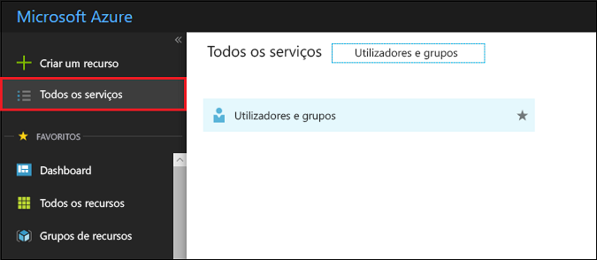
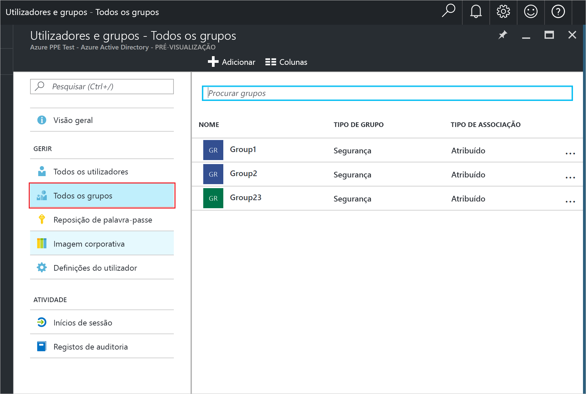
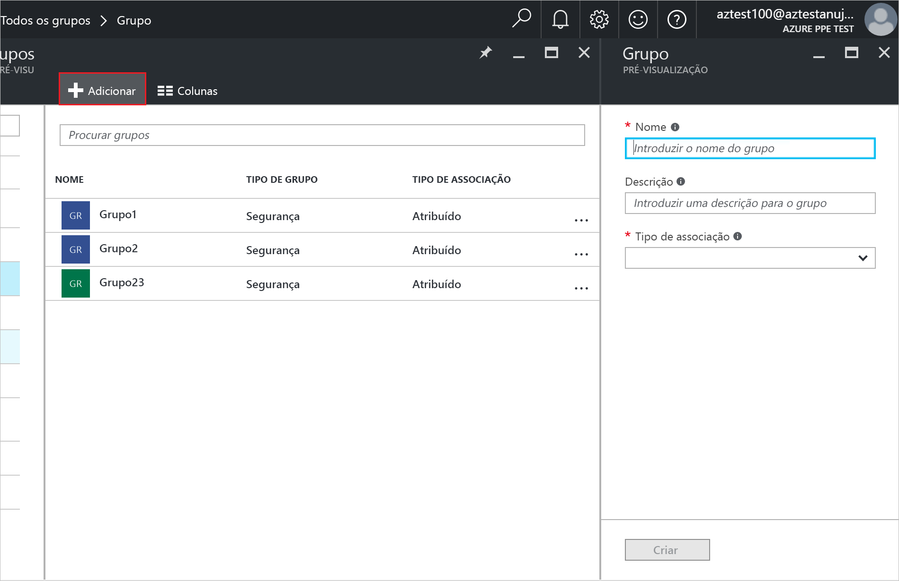
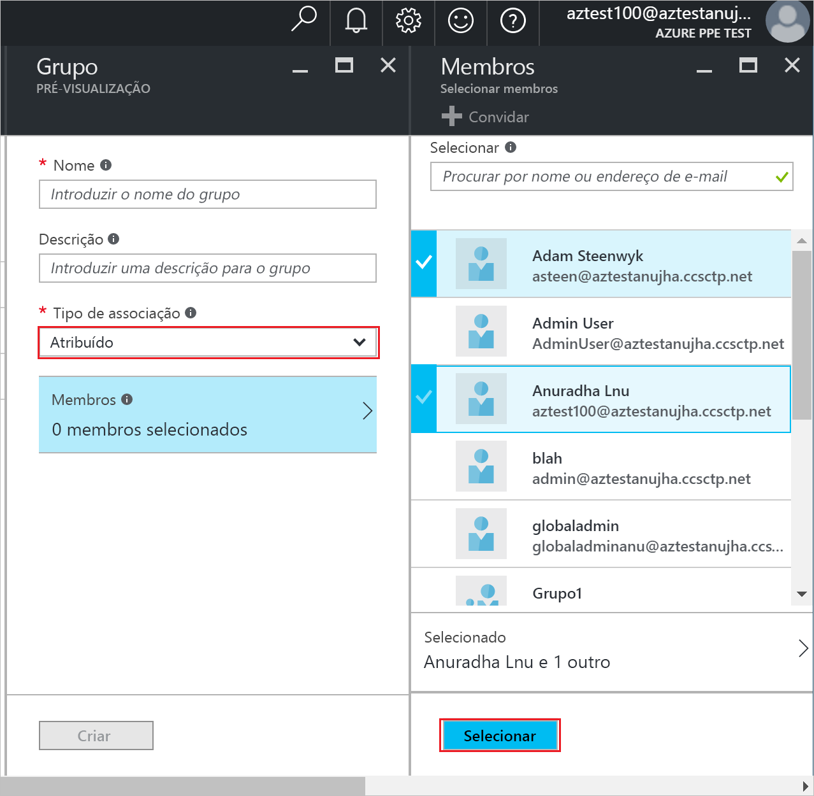
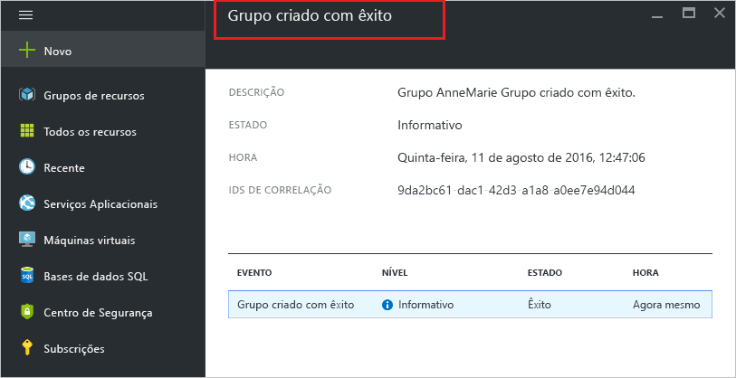

# Criar um grupo e adicionar membros no Azure Active Directory
> [!div class="op_single_selector"]
> * [Portal do Azure](active-directory-groups-create-azure-portal.md)
> * [PowerShell](../users-groups-roles/groups-settings-v2-cmdlets.md)

Este artigo explica como criar e preencher um novo grupo no Azure Active Directory. Utilize um grupo para realizar tarefas de gestão, tais como atribuir licenças ou permissões a vários utilizadores ou dispositivos em simultâneo.

## Como crio um grupo?
1. Iniciar sessão no [Portal do Azure](https://portal.azure.com) com uma conta que seja um administrador global do diretório.
2. Selecione **Todos os serviços**, introduza **Utilizador e grupos** na caixa de texto e, em seguida, selecione **Enter**.

   
3. No painel **Utilizadores e grupos**, selecione **Todos os grupos**.

   
4. No painel **Utilizadores e grupos – Todos os grupos**, selecione o comando **Adicionar**.

   
5. No painel **Grupo**, adicione um nome e descrição ao grupo.
6. Para selecionar membros para adicionar ao grupo, selecione **Atribuído** na caixa **Tipo de associação** e, em seguida, selecione **Membros**. Para obter mais informações sobre como gerir a associação de um grupo de forma dinâmica, veja [Utilizar atributos para criar regras avançadas para a associação a um grupo](../users-groups-roles/groups-dynamic-membership.md).

   
7. No painel **Membros**, selecione um ou mais utilizadores ou dispositivos para adicionar ao grupo e selecione o botão **Selecionar** na parte inferior do painel para adicioná-los ao grupo. A caixa **Utilizador** filtra a apresentação com base na correspondência da sua entrada a qualquer parte de um nome de utilizador ou dispositivo. Os carateres universais não são aceites nessa caixa.
8. Quando terminar de adicionar os membros ao grupo, selecione **Criar** no painel **Grupo**.    

   

## Passos seguintes
Estes artigos fornecem informações adicionais acerca do Azure Active Directory.

* [Ver grupos existentes](active-directory-groups-view-azure-portal.md)
* [Gerir definições de um grupo](active-directory-groups-settings-azure-portal.md)
* [Gerir membros de um grupo](active-directory-groups-members-azure-portal.md)
* [Gerir associações de um grupo](active-directory-groups-membership-azure-portal.md)
* [Gerir regras dinâmicas dos utilizadores num grupo](../users-groups-roles/groups-dynamic-membership.md)
