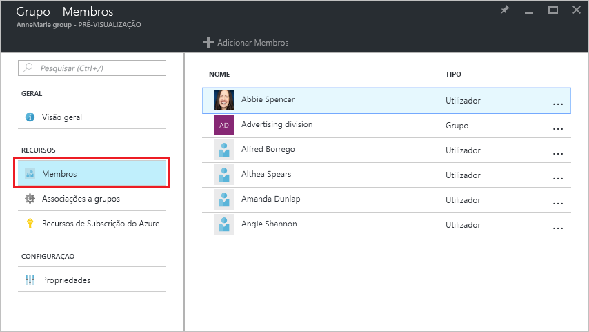
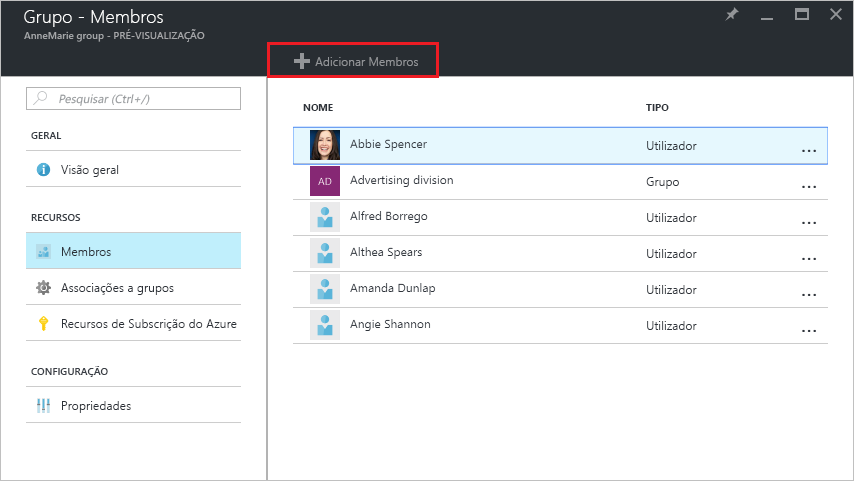
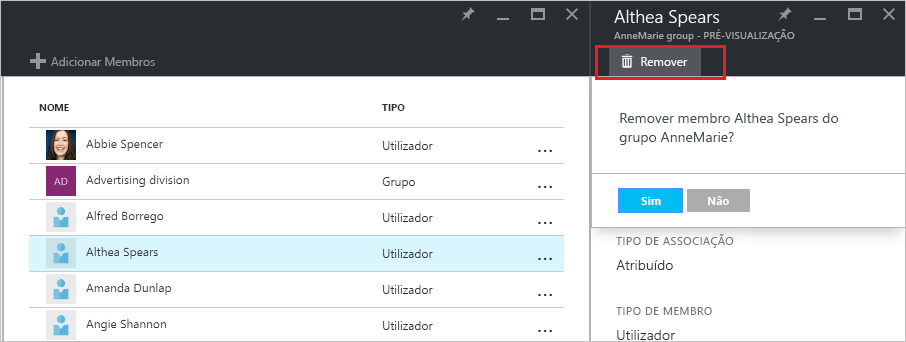

# Gerir a associação de grupo para utilizadores no seu inquilino do Azure Active Directory
Este artigo explica como gerir os membros de um grupo no Azure Active Directory (Azure AD).

## Como encontrar os membros e geri-los?
1. Iniciar sessão no [Portal do Azure](https://portal.azure.com) com uma conta que seja um administrador global do diretório.
2. Selecione **Todos os serviços**, introduza **Utilizadores e grupos** na caixa de texto e, em seguida, selecione **Enter**.

   
3. No painel **Utilizadores e grupos**, selecione **Todos os grupos**.

   
4. No painel **Utilizadores e grupos - Todos os grupos**, selecione um grupo.
5. No painel **Grupo - *groupname*** , selecione **Membros**.

   
6. Para adicionar membros ao grupo, no painel **Grupo - Membros**, selecione **Adicionar Membros**.

   
7. No painel **Membros**, selecione um ou mais utilizadores ou dispositivos para adicionar ao grupo e selecione o botão **Selecionar** na parte inferior do painel para adicioná-los ao grupo. A caixa **Utilizador** filtra a apresentação com base na correspondência da sua entrada a qualquer parte de um nome de utilizador ou dispositivo. Os carateres universais não são aceites nessa caixa.
8. Para remover membros do grupo, no painel **Grupo - Membros**, selecione um membro.
9. No painel ***membername***, selecione o comando **Remover** e confirme a sua escolha na linha de comandos.

   
10. Quando terminar de alterar os membros do grupo, selecione **Guardar**.

## Informações adicionais
Estes artigos fornecem informações adicionais acerca do Azure Active Directory.

* [Ver grupos existentes](active-directory-groups-view-azure-portal.md)
* [Criar um novo grupo e adicionar membros](active-directory-groups-create-azure-portal.md)
* [Gerir definições de um grupo](active-directory-groups-settings-azure-portal.md)
* [Gerir associações de um grupo](active-directory-groups-membership-azure-portal.md)
* [Gerir regras dinâmicas dos utilizadores num grupo](../users-groups-roles/groups-dynamic-membership.md)
