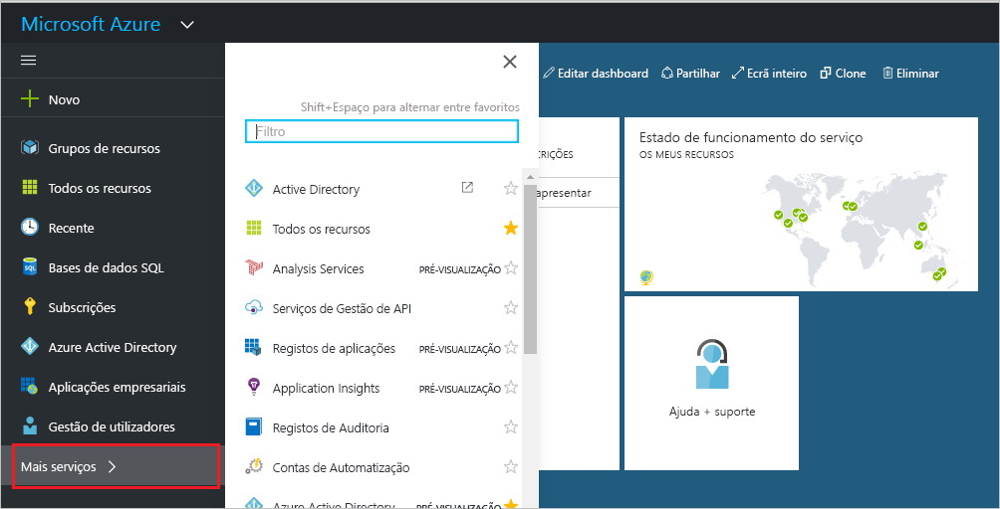
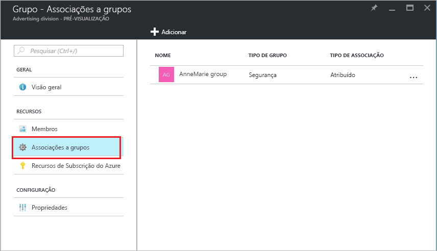
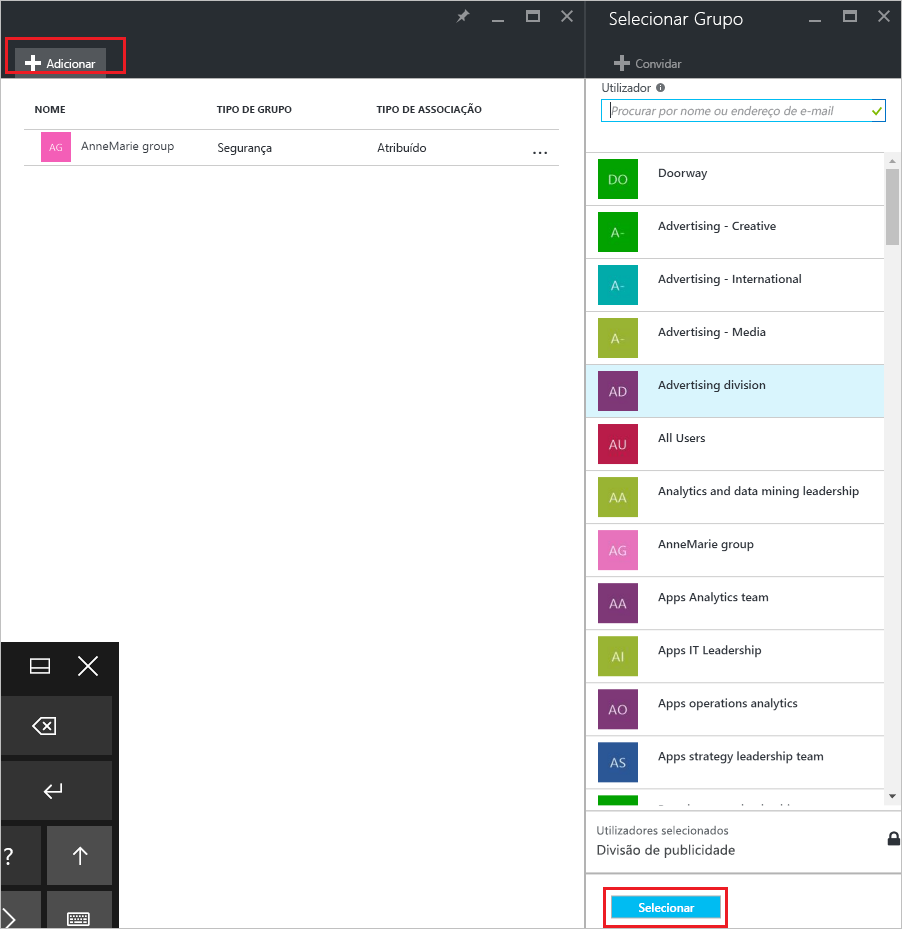
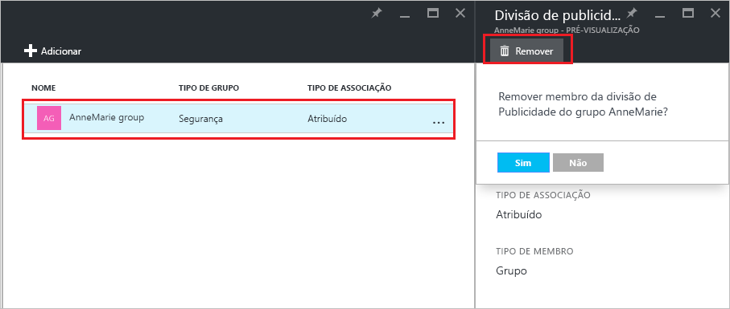

# Gira a que grupos um grupo pertence no seu inquilino do Azure Active Directory
Os grupos podem conter outros grupos no Azure Active Directory. Eis como gerir essas associações.

## Como encontro os grupos em que o meu grupo é um membro?
1. Inicie sessão no [Centro de administradores do Azure AD](https://aad.portal.azure.com) com uma conta que seja administrador global do diretório.
2. Selecionar **Utilizadores e grupos**.

   
1. Selecione **Todos os grupos**.

   
1. Selecione um grupo.
2. Selecione **Associações a grupos**.

   
1. Para adicionar o seu grupo como membro de outro grupo, no painel **Grupo - Associações a grupos**, selecione o comando **Adicionar**.
2. Selecione um grupo no painel **Selecionar Grupo** e, em seguida, selecione o botão **Selecionar** na parte inferior do painel. Pode adicionar o grupo a apenas um grupo de cada vez. A caixa **Utilizador** filtra a apresentação com base na correspondência da sua entrada a qualquer parte de um nome de utilizador ou dispositivo. Os carateres universais não são aceites nessa caixa.

   
8. Para remover o seu grupo como membro de outro grupo, no painel **Grupo - Associações a grupos**, selecione um grupo.
9. Selecione o comando **Remover** e confirme a sua escolha na linha de comandos.

   
10. Quando terminar de alterar as associações a grupos para o seu grupo, selecione **Guardar**.

## Informações adicionais
Estes artigos fornecem informações adicionais acerca do Azure Active Directory.

* [Ver grupos existentes](active-directory-groups-view-azure-portal.md)
* [Criar um novo grupo e adicionar membros](active-directory-groups-create-azure-portal.md)
* [Gerir definições de um grupo](active-directory-groups-settings-azure-portal.md)
* [Gerir membros de um grupo](active-directory-groups-members-azure-portal.md)
* [Gerir regras dinâmicas dos utilizadores num grupo](../users-groups-roles/groups-dynamic-membership.md)
