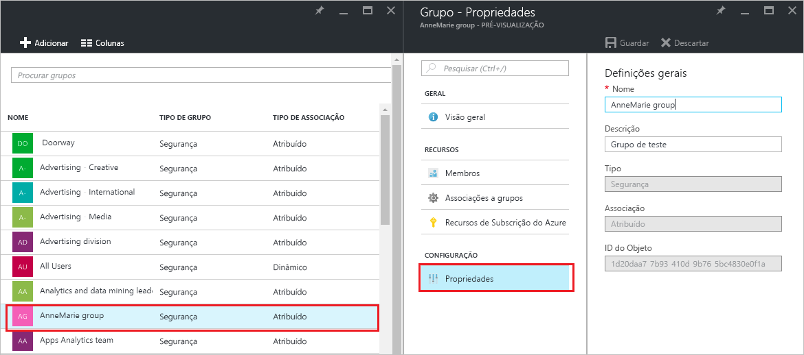
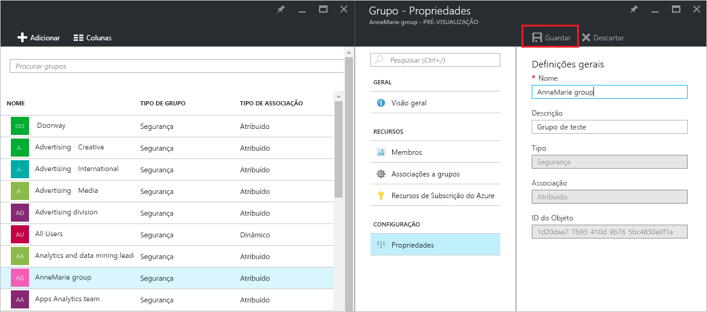

# Gerir as definições de um grupo no Azure Active Directory
Este artigo explica como alterar as definições de um grupo no Azure Active Directory (Azure AD).

## Como posso encontrar e alterar as definições?
1. Inicie sessão no [Centro de administradores do Azure AD](https://aad.portal.azure.com) com uma conta que seja administrador global do diretório.
2. Selecione **Todos os serviços**, introduza **Utilizadores e grupos** na caixa de texto e, em seguida, selecione **Enter**.

   
3. No painel **Utilizadores e grupos**, selecione **Todos os grupos**.

   
4. No painel **Utilizadores e grupos - Todos os grupos**, selecione um grupo.
5. No painel **Grupo - *groupname***, selecione **Propriedades**.

   
6. Quando terminar de alterar as propriedades do grupo, selecione **Guardar**.    

   

## Passos seguintes
Estes artigos fornecem informações adicionais acerca do Azure Active Directory.

* [Ver grupos existentes](active-directory-groups-view-azure-portal.md)
* [Criar um novo grupo e adicionar membros](active-directory-groups-create-azure-portal.md)
* [Gerir membros de um grupo](active-directory-groups-members-azure-portal.md)
* [Gerir associações de um grupo](active-directory-groups-membership-azure-portal.md)
* [Gerir regras dinâmicas dos utilizadores num grupo](../users-groups-roles/groups-dynamic-membership.md)
