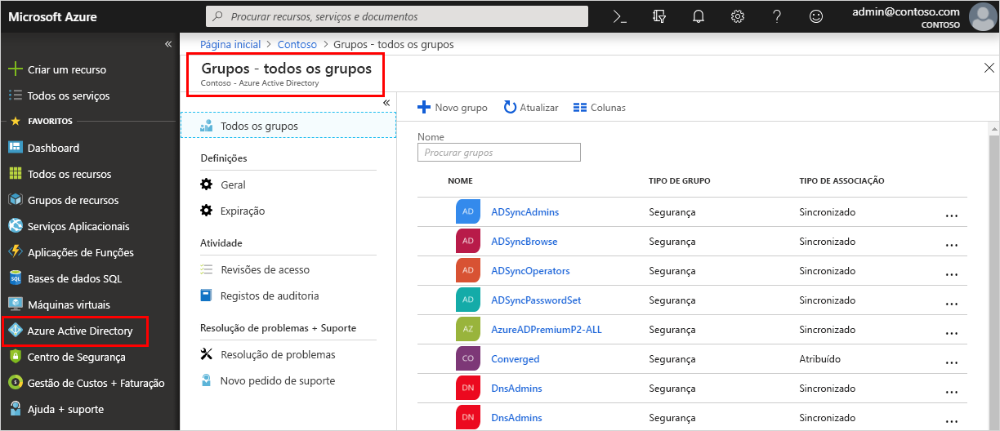

<!--As a brand-new Azure AD administrator, I need to view my organization’s groups along with the assigned members, so I can manage permissions to apps and services for people in my organization-->

# Início rápido: Ver grupos e membros da sua organização no Azure Active Directory
Pode ver os grupos e membros de grupos da sua organização com o portal do Azure. Os grupos são utilizados para gerir os utilizadores (membros) que precisam do mesmo acesso e permissões para aplicações e serviços potencialmente restritos.

Neste início rápido, irá ver todos os grupos existentes da sua organização e ver os membros atribuídos.

Se não tiver uma subscrição do Azure, crie uma [conta gratuita](https://azure.microsoft.com/free/) antes de começar. 

## Pré-requisitos
Antes de começar, precisará de:

- Criar um inquilino do Azure Active Directory. Para obter mais informações, veja [Aceder ao portal do Azure Active Directory e criar um novo inquilino](active-directory-access-create-new-tenant.md).

## Iniciar sessão no portal do Azure
Tem de iniciar sessão no [portal do Azure](https://portal.azure.com/) com uma conta de Administrador global do diretório.

## Criar um novo grupo 
Crie um novo grupo, com o nome _Política MDM - Oeste_. Para obter mais informações sobre como criar um grupo, veja [Como criar um grupo básico e adicionar membros](active-directory-groups-create-azure-portal.md).

1. Selecione **Azure Active Directory**, **Grupos** e, em seguida, selecione **Novo grupo**.

2. Preencha a página **Grupo**:
    
    - **Tipo de grupo:** Selecione **segurança**
    
    - **Nome do grupo:** Tipo de _política da MDM - oeste_
    
    - **Tipo de associação:** Selecione **atribuídos**.

3. Selecione **Criar**.

## Criar um novo utilizador
Crie um novo utilizador, com o nome _Alain Charon_. O utilizador tem de existir antes de ser adicionado como membro do grupo. Para obter mais informações sobre a criação de um utilizador, veja [Como adicionar ou eliminar utilizadores](add-users-azure-active-directory.md).

1. Selecione **Azure Active Directory**, **Utilizadores** e, em seguida, selecione **Novo utilizador**.

2. Preencha a página **Utilizador**:

    - **Nome:** Tipo _Alain Charon_.

    - **Nome de utilizador:** Tipo *alain@contoso.com*.

3. Copie a palavra-passe gerada automaticamente,fornecida na caixa **Palavra-passe** e, em seguida, selecione **Criar**.

## Adicionar um membro ao grupo
Agora que tem um grupo e um utilizador, pode adicionar _Alain Charon_ como membro ao grupo _Política MDM - Oeste_. Para obter mais informações sobre a adição de membros a grupos, veja [Como adicionar ou remover membros de um grupo](active-directory-groups-members-azure-portal.md).

1. Selecione **Azure Active Directory** > **Grupos**.

2. Na página **Grupos - Todos os grupos**, procure e selecione o grupo **Política MDM - Oeste**.

3. Na página **Descrição Geral da Política MDM - Oeste**, selecione **Membros** na área **Gerir**.

4. Selecione **Adicionar membros** e, em seguida, procure e selecione **Alain Charon**.

5. Escolha **Selecionar**.

## Ver todos os grupos
Pode ver todos os grupos da sua organização na página **Grupos – Todos os grupos** do portal do Azure.

- Selecione Azure **Active Directory** > **Grupos**.

    A página **Grupos – Todos os grupos** é apresentada, mostrando todos os grupos ativos.

    

## Procurar o grupo
Procure na página **Grupos – Todos os grupos** para encontrar o grupo **Política MDM – Oeste**.

1. Na página **Grupos – Todos os grupos**. escreva _MDM_ na caixa **Pesquisar**.

    Os resultados da pesquisa são apresentados na caixa **Pesquisar**, incluindo o grupo _Política MDM - Oeste_.

    

3. Selecione o grupo **Política MDM – Oeste**.

4. Veja as informações do grupo na página **Descrição Geral da Política MDM - Oeste**, incluindo o número de membros desse grupo.

    

## Ver os membros do grupo
Agora que encontrou o grupo, pode ver todos os membros atribuídos.

- Selecione **Membros** na área **Gerir** e, em seguida, reveja a lista completa de nomes dos membros atribuídos a esse grupo específico, incluindo _Alain Charon_.

    

## Limpar recursos
Este grupo é utilizado em vários processos de procedimentos que estão disponíveis na secção **Manuais de instruções** desta documentação. No entanto, se preferir não utilizar este grupo, pode eliminá-lo e aos respetivos membros atribuídos com os seguintes passos:

1. Na página **Grupos - Todos os grupos**, procure o grupo **Política MDM - Oeste**.

2.  Selecione o grupo **Política MDM - Oeste**.

    A página **Descrição Geral da Política MDM - Oeste** é apresentada.

3. Selecione **Eliminar**.

    O grupo e os respetivos membros associados são eliminados.

    

    >[!Important]
    >Esta ação não elimina o utilizador Alain Charon, apenas elimina a sua associação do grupo eliminado.

## Passos Seguintes
Avance para o artigo seguinte para saber como associar uma subscrição ao diretório do Azure AD.

> [!div class="nextstepaction"]
> [Associar uma subscrição do Azure](active-directory-how-subscriptions-associated-directory.md)
