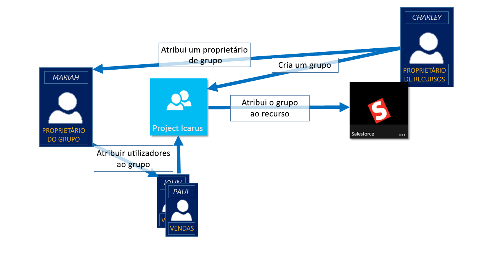
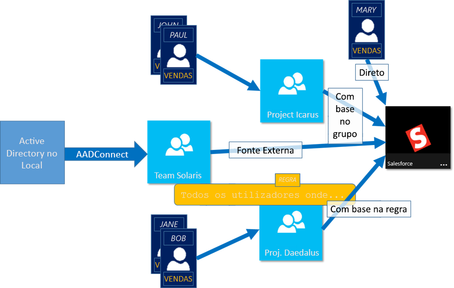

# Gerir o acesso de aplicação e de recursos com grupos do Active Directory do Azure
Azure Active Directory (Azure AD) ajuda-o a gerir as suas aplicações com base na cloud, aplicações no local e seus recursos através de grupos da sua organização. Os recursos podem fazer parte do diretório, tais como permissões para gerir objetos através de funções no diretório ou externo no diretório, como para aplicações de Software como um serviço (SaaS), serviços do Azure, sites do SharePoint e recursos no local.

>[!NOTE]
>Para utilizar o Azure Active Directory, precisa de uma conta do Azure. Se não tiver uma conta, pode [inscrever-se para obter uma conta do Azure gratuita](https://azure.microsoft.com/free/).

## Como aceder a gestão de trabalho do Azure AD?
O Azure AD ajuda a dar acesso aos recursos da sua organização ao fornecer os direitos de acesso a um único utilizador ou para um Azure AD inteiro de grupo. Utilização de grupos permite que o recurso proprietário (ou proprietário de diretório do Azure AD), atribua um conjunto de permissões de acesso a todos os membros do grupo, em vez de ter que fornecer os direitos de um a um. O proprietário do recurso ou diretório também pode dar o management rights para obter a lista de membro para outra pessoa antes e como gerente do departamento ou um administrador de suporte técnico, permitindo que essa pessoa adicionar e remover membros, conforme necessário. Para obter mais informações sobre como gerir os proprietários do grupo, consulte [gerir os proprietários do grupo](active-directory-accessmanagement-managing-group-owners.md)

## Formas de atribuir direitos de acesso
Existem quatro maneiras de atribuir direitos de acesso aos seus utilizadores de recursos:

- **Atribuição direta.** O proprietário do recurso diretamente atribui ao utilizador para o recurso.

- **Atribuição de grupo.** O proprietário do recurso atribui um grupo do Azure AD para o recurso, que fornece todo o acesso de membros do grupo automaticamente para o recurso. Associação de grupo é gerida através do proprietário do grupo e o proprietário do recurso, permitindo que qualquer um dos proprietário adicionar ou remover membros do grupo. Para obter mais informações sobre como adicionar ou remover a associação de grupo, consulte [como: Adicionar ou remover um grupo de outro grupo com o portal do Azure Active Directory](active-directory-groups-membership-azure-portal.md). 

- **Atribuição baseada em regras.** O proprietário do recurso cria um grupo e utiliza uma regra para definir que utilizadores são atribuídos a um recurso específico. A regra é baseada em atributos que são atribuídos a utilizadores individuais. O proprietário do recurso gere a regra, determinar quais atributos e valores são necessários para permitir o acesso o recursos. Para obter mais informações, consulte [criar um grupo dinâmico e verificar o estado](../users-groups-roles/groups-create-rule.md).

    Também pode ver este breve vídeo para obter uma explicação rápida sobre como criar e utilizar grupos dinâmicos:

    >[!VIDEO https://channel9.msdn.com/Series/Azure-Active-Directory-Videos-Demos/Azure-AD--Introduction-to-Dynamic-Memberships-for-Groups/player]

- **Atribuição de autoridade externo.** Acesso vem de uma origem externa, como um diretório no local ou uma aplicação SaaS. Nesta situação, o proprietário do recurso atribui um grupo para fornecer acesso ao recurso e, em seguida, a origem externa gere os membros do grupo.

   

## Os utilizadores associar grupos sem serem atribuídas
O proprietário do grupo pode permitir que os utilizadores a encontrar os seus próprios grupos a associar, em vez de atribuir-lhes. O proprietário também pode configurar o grupo para aceitar automaticamente todos os utilizadores que aderir ou para exigir a aprovação.

Depois de um utilizador pede para aderir a um grupo, a solicitação é encaminhada para o proprietário do grupo. Caso seja necessário, o proprietário pode aprovar o pedido e o utilizador é notificado sobre a associação ao grupo. No entanto, se tiver vários proprietários e uma delas disapproves, o utilizador é notificado, mas não é adicionado ao grupo. Para obter mais informações e instruções sobre como permitir que os utilizadores do pedido para aderir a grupos, consulte [configurar do Azure AD para que os utilizadores podem pedir para aderir a grupos](../users-groups-roles/groups-self-service-management.md)

## Passos Seguintes
Agora que tem um pouco de uma introdução à utilização de grupos de gestão de acesso, começar a gerir os seus recursos e aplicações.

- [Criar um novo grupo com o Azure Active Directory](active-directory-groups-create-azure-portal.md) ou [criar e gerir um novo grupo utilizando cmdlets do PowerShell](../users-groups-roles/groups-settings-v2-cmdlets.md)

- [Utilizar grupos para atribuir acesso a uma aplicação SaaS integrada](../users-groups-roles/groups-saasapps.md)

- [Sincronizar um grupo no local para o Azure com o Azure AD Connect](../hybrid/whatis-hybrid-identity.md)
