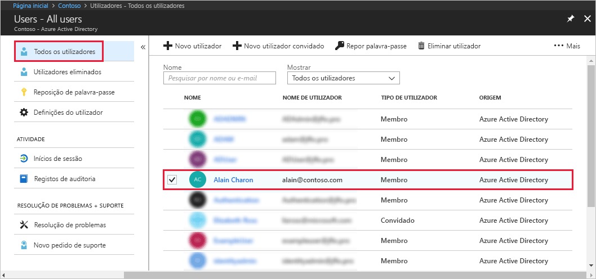
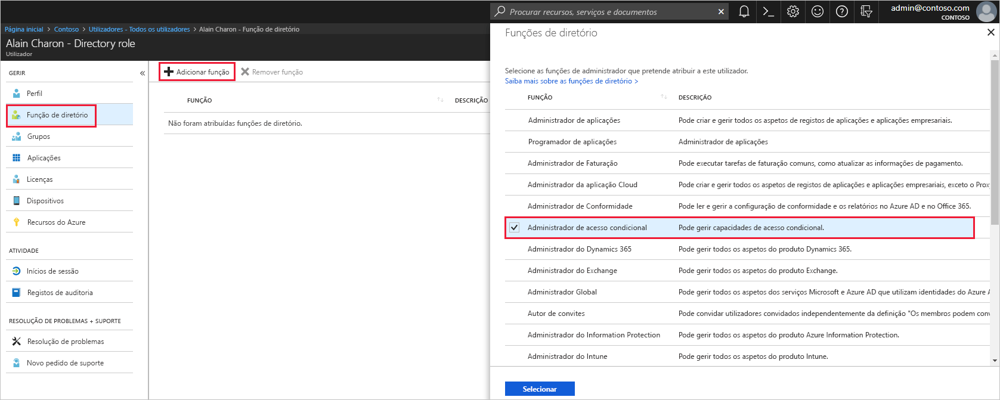

# Atribua um utilizador a funções de administrador no Azure Active Directory
Este artigo explica como atribuir uma função administrativa a um utilizador no Azure Active Directory (Azure AD). Para obter informações sobre a adição de novos utilizadores à organização, veja [Adicionar novos utilizadores ao Azure Active Directory](../add-users-azure-active-directory.md). Por predefinição, os utilizadores adicionados não têm permissões de administrador. No entanto, pode atribuir-lhes funções em qualquer altura.

## Atribuir uma função a um utilizador
1. Iniciar sessão no [portal do Azure](https://portal.azure.com) com uma conta que seja um administrador global ou administrador de função com privilégios do diretório.

2. Selecione **Azure Active Directory**, selecione **Utilizadores**e, em seguida, selecione um utilizador específico da lista.

    

3. Para o utilizador selecionado, selecione **Função de diretório**, selecione **Adicionar função** e, em seguida, escolha as funções administrativas apropriadas na lista **Funções de diretório**, como **Administrador de acesso condicional**. Para obter mais informações sobre as funções administrativas, veja [Atribuir funções de administrador no Azure AD](../users-groups-roles/directory-assign-admin-roles.md). 

    

1. Prima **Selecionar** para guardar.

## Passos seguintes
* [Início rápido: Adicionar ou eliminar utilizadores no Azure Active Directory](add-users-azure-active-directory.md)
* [Gerir perfis de utilizador](active-directory-users-profile-azure-portal.md)
* [Adicionar utilizadores convidados a partir de outro diretório](../b2b/what-is-b2b.md) 
* [Atribuir um utilizador a uma função no seu Azure AD](active-directory-users-assign-role-azure-portal.md)
* [Restaurar um utilizador eliminado](active-directory-users-restore.md)
