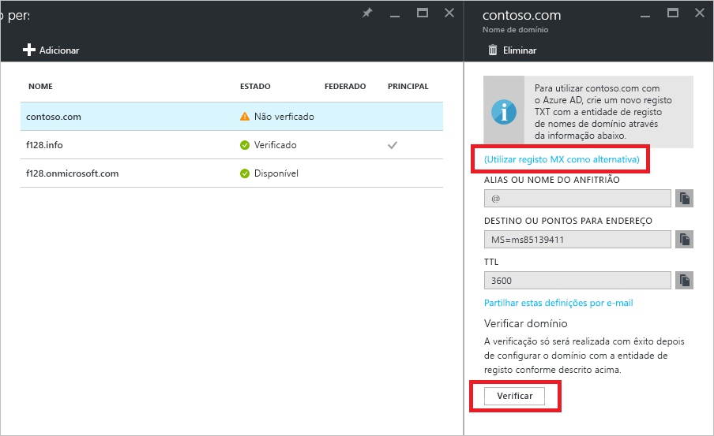

# Início Rápido: Adicionar um nome de domínio personalizado ao Azure Active Directory

Cada diretório do Azure AD inclui um nome de domínio inicial no formato *domainname*.onmicrosoft.com. O nome de domínio inicial não pode ser alterado ou eliminado, mas também pode adicionar o seu nome de domínio corporativo ao Azure AD. Por exemplo, a sua organização provavelmente tem outros nomes de domínio utilizados para fazer negócios e utilizadores que iniciam sessão com o seu nome de domínio corporativo. Adicionar nomes de domínio personalizado ao Azure AD permite-lhe atribuir nomes de utilizador no diretório com que os seus utilizadores estão familiarizados, como "alice@contoso.com". em vez de "alice@*nome de domínio*.onmicrosoft.com". O processo é simples:

1. Adicione o nome de domínio personalizado ao seu diretório
2. Adicione uma entrada DNS do nome de domínio à entidade registo do nome de domínio
3. Verifique o nome de domínio personalizado no Azure AD

## Adicione o nome de domínio personalizado ao seu diretório
1. Iniciar sessão no [Portal do Azure](https://aad.portal.azure.com/#blade/Microsoft_AAD_IAM/ActiveDirectoryMenuBlade/Overview) com uma conta que seja um administrador global do diretório.
2. No lado esquerdo, selecione **Nomes de domínio personalizado**.
3. Selecione **Adicionar domínio personalizado**.
   
   
5. Em **Nomes de domínio personalizado**, introduza o nome do seu domínio personalizado na caixa, como "contoso.com" e, em seguida, selecione **Adicionar Domínio**. Certifique-se de que inclui .com .net ou outra extensão de nível superior.
6. Em ***domainname*** (ou seja, o novo nome de domínio é o título), recolha as informações de entrada DNS para utilizar mais tarde, para verificar o nome de domínio personalizado no Azure AD.
   
   

> [!TIP]
> Se pretende federar o seu Windows Server AD no local com o Azure AD, tem de selecionar a caixa de configuração **Pretendo configurar este domínio para o início de sessão único com o meu Active Directory local** ao executar a ferramenta Azure AD Connect para sincronizar os diretórios. Também tem de registar o mesmo nome de domínio que seleciona para a federação com o seu diretório no local no passo **Domínio do Azure AD** no assistente. Pode ver como funciona esse passo no assistente [nestas instruções](./../connect/active-directory-aadconnect-get-started-custom.md#verify-the-azure-ad-domain-selected-for-federation). Se não tiver a ferramenta Azure AD Connect, pode [transferi-lo aqui](http://go.microsoft.com/fwlink/?LinkId=615771).

## Adicione uma entrada DNS do nome de domínio à entidade registo do nome de domínio
O passo seguinte para utilizar o seu nome de domínio personalizado com o Azure AD é atualizar o ficheiro de zona DNS para o domínio. O Azure AD pode então verificar se a sua organização é proprietária do nome de domínio personalizado. Pode utilizar o [DNS do Azure](https://docs.microsoft.com/azure/dns/dns-getstarted-portal) para Azure/Office/365/registos do DNS externos no Azure, ou adicione a entrada DNS [numa entidade de registo de domínios DNS diferente](https://support.office.com/article/Create-DNS-records-for-Office-365-when-you-manage-your-DNS-records-b0f3fdca-8a80-4e8e-9ef3-61e8a2a9ab23/).

1. Inicie sessão na entidade de registo de nome de domínio para o domínio. Se não tiver acesso para atualizar a entrada DNS, peça à pessoa ou equipa na sua organização que tenham este acesso para concluir o passo 2 e para informá-lo quando for concluído.
2. Atualize o ficheiro de zona DNS para o domínio ao adicionar a entrada DNS fornecida pelo Azure AD. A entrada DNS não irá alterar quaisquer comportamentos, como o encaminhamento de correio ou o alojamento web.

## Verifique o nome de domínio personalizado no Azure AD
Depois de adicionar a entrada DNS, está pronto para verificar o nome de domínio com o Azure AD. Só pode verificar um nome de domínio depois de os registos DNS terem sido propagados. Esta propagação frequentemente demora apenas alguns segundos, mas, por vezes, pode demorar uma hora ou mais. Se a verificação não funcionar à primeira, tente de novo mais tarde.

1. Inicie sessão no [Azure AD](https://aad.portal.azure.com/#blade/Microsoft_AAD_IAM/ActiveDirectoryMenuBlade/Overview) com uma conta que seja administrador global do inquilino.
2. Selecione **Nomes de domínio personalizados**.
3. Selecione o nome de domínio não verificado que pretende verificar.
4. Verifique as suas entradas e selecione **Verificar** para concluir a verificação.

Já pode [atribuir nomes de utilizador que incluem o seu nome de domínio personalizado](../users-groups-roles/domains-manage.md). Pode criar contas de utilizador baseadas na cloud ou atualizar informações de uma conta de utilizador no local sincronizada anteriormente com o seu nome de domínio personalizado. Também pode alterar as informações de sufixo de domínio da conta de utilizador sincronizada com o [Microsoft PowerShell](https://msdn.microsoft.com/library/azure/e1ef403f-3347-4409-8f46-d72dafa116e0#BKMK_ManageDomains) ou o [Graph API](https://msdn.microsoft.com/Library/Azure/Ad/Graph/api/domains-operations).

> [!TIP]
> Pode adicionar um máximo de 900 nomes de domínio gerido. Se estiver a configurar todos os seus domínios para federação no local com o Active Directory, pode adicionar até um máximo de 450 nomes de domínio em cada diretório. Para obter mais informações, veja [Nomes de domínio geridos e federados](https://docs.microsoft.com/azure/active-directory/active-directory-add-domain-concepts#federated-and-managed-domain-names).

## Resolução de problemas
Se não conseguir verificar um nome de domínio personalizado, tente os seguintes passos de resolução de problemas:

1. **Aguarde uma hora**. Os registos DNS têm de ser propagados antes de o Azure AD poder verificar o domínio. Este processo pode demorar uma hora ou mais.
2. **Certifique-se de que o registo DNS foi introduzido e que está correto**. Conclua este passo no site da entidade de registo de nome do domínio. O Azure AD não consegue verificar o nome de domínio se 
  * A entrada DNS não estiver presente no ficheiro de zona DNS
  * Não for uma correspondência exata com a entrada DNS que o Azure AD lhe forneceu. 
  
  Se não tiver acesso para atualizar os registos DNS do domínio na entidade de registo de nome de domínio, partilhe a entrada DNS com a pessoa ou equipa na sua organização que tenham este acesso e peça-lhes para adicionar a entrada DNS.
3. **Elimine o nome de domínio a partir de outro diretório no Azure AD**. Um nome de domínio só pode ser verificado num único diretório. Se um nome de domínio estiver atualmente verificado noutro diretório, o mesmo não pode ser verificado no diretório novo enquanto não for eliminado naquele. Para saber mais sobre como eliminar nomes de domínio, veja o artigo [Gerir nomes de domínio personalizados](../users-groups-roles/domains-manage.md).    

Repita os passos neste artigo para adicionar cada um dos seus nomes de domínio.

## Saiba mais
[Descrição geral conceptual dos nomes de domínios personalizados no Azure AD](../users-groups-roles/domains-manage.md)

[Gerir nomes de domínio personalizado](../users-groups-roles/domains-manage.md)

## Passos seguintes
Neste início rápido, aprendeu a adicionar um domínio personalizado ao Azure AD. 

Pode utilizar a ligação seguinte para adicionar um novo domínio personalizado no Azure AD a partir do portal do Azure.

> [!div class="nextstepaction"]
> [Adicionar um domínio personalizado](https://aad.portal.azure.com/#blade/Microsoft_AAD_IAM/ActiveDirectoryMenuBlade/QuickStart) 