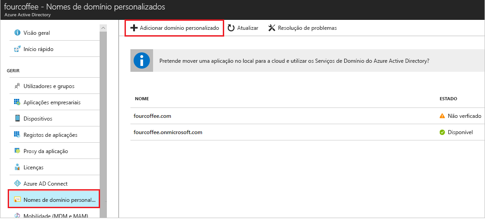

# Como: adicionar o seu nome de domínio personalizado com o portal do Azure Active Directory
Cada novo Azure inquilino AD vem com um nome de domínio inicial *domainname*. onmicrosoft.com. Não é possível alterar ou eliminar o nome de domínio inicial, mas pode adicionar nomes da sua organização para a lista. Adicionar nomes de domínio personalizados ajuda-o a criar nomes de utilizador que estão familiarizados para seus usuários, como *alain@contoso.com*.

## Antes de começar
Antes de poder adicionar um nome de domínio personalizado, tem de criar o seu nome de domínio com uma entidade de registo do domínio. Para uma entidade de registo do domínio acreditada, consulte [ICANN-Accredited entidades de registo](https://www.icann.org/registrar-reports/accredited-list.html).

## Criar o seu diretório no Azure AD
Depois de obter o seu nome de domínio, é possível criar o primeiro diretório do Azure AD.

1. Inicie sessão para o [portal do Azure](https://portal.azure.com/) usando um proprietário da subscrição da conta para o diretório e, em seguida, selecione **Azure Active Directory**.

    

    >[!TIP]
    > Se pretende federar o seu Windows Server AD no local com o Azure AD, tem de selecionar a caixa de configuração **Pretendo configurar este domínio para o início de sessão único com o meu Active Directory local** ao executar a ferramenta Azure AD Connect para sincronizar os diretórios. Também tem de registar o mesmo nome de domínio que seleciona para a federação com o seu diretório no local no passo **Domínio do Azure AD** no assistente. Pode ver como funciona esse passo no assistente [nestas instruções](../hybrid/how-to-connect-install-custom.md#verify-the-azure-ad-domain-selected-for-federation). Se não tiver a ferramenta Azure AD Connect, pode [transferi-lo aqui](http://go.microsoft.com/fwlink/?LinkId=615771).

2. Criar novo diretório ao seguir os passos em [criar um novo inquilino para a sua organização](active-directory-access-create-new-tenant.md#create-a-new-tenant-for-your-organization).

    >[!Important]
    >A pessoa que cria o inquilino é automaticamente o Administrador Global desse inquilino. O Administrador Global pode adicionar outros administradores de inquilinos.

## Adicionar o seu nome de domínio personalizado para o Azure AD
Depois de criar o seu diretório, pode adicionar o seu nome de domínio personalizado.

1. Selecione **nomes de domínio personalizado**e, em seguida, selecione **Adicionar domínio personalizado**.

    

2. Escreva o nome do novo domínio da sua organização para o **nome de domínio personalizado** caixa (por exemplo, _contoso.com_) e, em seguida, selecione **Adicionar domínio**.

    O domínio não verificado é adicionado e o **Contoso** é apresentada a página que mostra as suas informações DNS.

    >[!Important]
    >Tem de incluir. com, .net ou qualquer outra extensão de nível superior para que isso funcione corretamente.

    

4. Copie as informações DNS a partir da **Contoso** página. Por exemplo, MS = ms64983159.

    

## Adicione as suas informações de DNS para a entidade de registo do domínio
Depois de adicionar o seu nome de domínio personalizado para o Azure AD, tem de voltar à sua entidade de registo do domínio e adicione as informações de DNS do Azure AD a partir do ficheiro TXT copiado. Criar este TXT registo para o seu domínio "verifica" propriedade do seu nome de domínio.

-  Voltar para a entidade de registo do domínio, crie um novo registo TXT para o seu domínio com base nas suas informações de DNS copiadas, definir o **TTL** (tempo de duração) como 60 minutos e, em seguida, guarde as informações.

    >[!Important]
    >Pode registrar os nomes de domínio como quiser. No entanto, cada domínio obtém seu próprio registo TXT do Azure AD. Tenha cuidado ao introduzir as suas informações de ficheiro TXT na entidade de registo da domínio. Se introduzir incorretos ou duplicados informações por engano, terá de aguardar até que o valor de TTL exceder o tempo limite (60 minutos) antes de tentar novamente.

## Verificar o seu nome de domínio personalizado
Depois de registar o seu nome de domínio personalizado, terá de certificar-se de que é válido no Azure AD. A propagação da sua entidade de registo do domínio para o Azure AD pode ser imediata ou podem demorar alguns dias, dependendo da sua entidade de registo do domínio.

### Para verificar o seu nome de domínio personalizado
1. Inicie sessão para o [portal do Azure](https://portal.azure.com/) com uma conta de Administrador Global do diretório.

2. Selecione **do Azure Active Directory**e, em seguida, selecione **nomes de domínio personalizado**.

3. Sobre o **Fabrikam - nomes de domínio personalizado** página, selecione o nome de domínio personalizado **Contoso**.

    

4. Sobre o **Contoso** página, selecione **verificar** para se certificar-se de que o domínio personalizado está corretamente registado e é válido para o Azure AD.

    

## Problemas comuns de verificação
- Se o Azure AD não é possível verificar um nome de domínio personalizado, experimente as sugestões seguintes:
    - **Aguarde, pelo menos, uma hora e tente novamente**. Registos DNS devem propagar antes do Azure AD pode verificar que o domínio e este processo podem demorar uma hora ou mais.

    - **Certifique-se de que o registo DNS está correto.** Volte para o site de entidade de registo de nome de domínio e certifique-se a entrada existe e que corresponde às informações de entrada DNS fornecidas pelo Azure AD.

    Se não é possível atualizar o registo no site da entidade de registo, tem de partilhar a entrada com alguém que tenha as permissões corretas para adicionar a entrada e certifique-se de que ela está correta.

- **Certifique-se de que o nome de domínio não está já em utilização de outro diretório.** Um nome de domínio só pode ser verificado num diretório, o que significa que se o seu nome de domínio estiver atualmente verificado noutro diretório, ele não pode também ser verificado no novo diretório. Para corrigir esse problema de duplicação, tem de eliminar o nome de domínio do diretório antigo. Para obter mais informações sobre como eliminar nomes de domínio, consulte [gerir nomes de domínio personalizado](../users-groups-roles/domains-manage.md).

- **Certifique-se de que não tem quaisquer inquilinos do Power BI não geridos.** Se os utilizadores ativaram o Power BI através de inscrição Self-Service e criado um inquilino não gerido para a sua organização, deve assumir a gestão como um administrador interno ou externo, com o PowerShell. Para saber mais sobre como assumir um diretório não gerido, veja [assumir um diretório não gerido como administrador no Azure Active Directory](../users-groups-roles/domains-admin-takeover.md).

## Passos Seguintes

- Adicione outro administrador Global para o seu diretório. Para obter mais informações, consulte [como atribuir funções e os administradores](active-directory-users-assign-role-azure-portal.md)

- Adicionar utilizadores ao seu domínio, consulte [como adicionar ou eliminar utilizadores](add-users-azure-active-directory.md)

- Gerir as suas informações de nome de domínio no Azure AD. Para obter mais informações, consulte [gerir nomes de domínio personalizados](../users-groups-roles/domains-manage.md)

- Se tiver versões no local do Windows Server que pretende utilizar em conjunto com o Azure Active Directory, consulte [integrar seus diretórios no local com o Azure Active Directory](../connect/active-directory-aadconnect.md).
