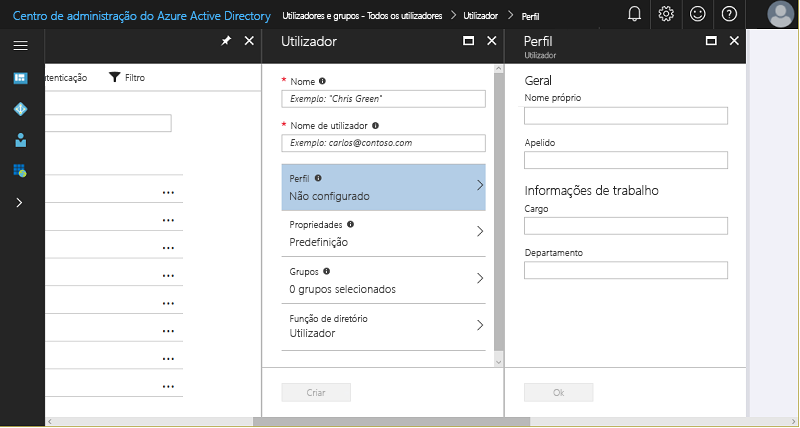
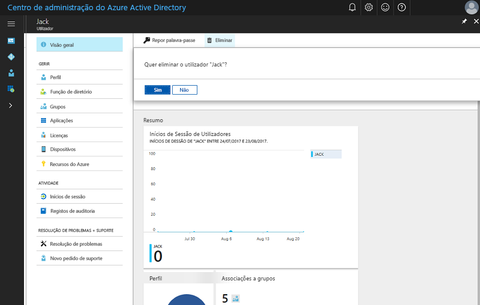

# Início Rápido: Adicionar novos utilizadores ao Azure Active Directory
Este artigo explica como eliminar ou adicionar utilizadores na sua organização no inquilino do Azure Active Directory (Azure AD) da sua organização com o portal do Azure ou ao sincronizar os dados da conta de utilizador do AD do Windows Server no local. 

## Adicionar utilizadores baseados na cloud
1. Inicie sessão no [Centro de administradores do Azure Active Directory](https://aad.portal.azure.com) com uma conta que seja administrador global do diretório.
2. Selecione **Azure Active Directory** e, em seguida, **Utilizadores e grupos**.
3. Em **Utilizadores e grupos**, selecione **Todos os utilizadores** e, em seguida, selecione **Novo utilizador**.
   
4. Introduza os detalhes do utilizador, como o **Nome** e o **Nome de utilizador**. A parte do nome de utilizador do nome de domínio deve ser o nome de domínio predefinido inicial "[nome de domínio].onmicrosoft.com" ou um [nome de domínio personalizado](add-custom-domain.md) verificado e não federado, como "contoso.com."
5. Copie ou, caso contrário, tenha em atenção à palavra-passe de utilizador gerada, para que possa dá-la ao utilizador, após a conclusão deste processo.
6. Opcionalmente, pode abrir e preencher as informações em **Perfil**, **Grupos** ou **Função de diretório** para o utilizador. Para obter mais informações sobre as funções de utilizador e administrador, consulte [Atribuir funções de administrador no Azure AD](../users-groups-roles/directory-assign-admin-roles.md).
7. Em **Utilizador**, selecione **Criar**.
8. Dê a palavra-passe gerada com segurança ao novo utilizador, para que este possa iniciar sessão.

> [!TIP]
> Também pode sincronizar os dados da conta de utilizador do AD do Windows Server no local. As soluções de identidade da Microsoft abrangem capacidades baseadas na cloud e no local, ao criar uma única identidade de utilizador para autenticação e autorização a todos os recursos, independentemente da localização. Chamamos-lhe Identidade Híbrida. O [Azure AD Connect](https://docs.microsoft.com/azure/active-directory/connect/active-directory-aadconnect) pode ser utilizado para integrar os diretórios no local ao Azure Active Directory, para cenários de identidade híbrida. Isto permite-lhe fornecer uma identidade comum para o utilizadores das aplicações do Office 365, do Azure e do SaaS integradas com o Azure AD. 

## Eliminar utilizadores do Azure AD
1. Inicie sessão no [Centro de administradores do Azure Active Directory](https://aad.portal.azure.com) com uma conta que seja administrador global do diretório.
2. Selecionar **Utilizadores e grupos**.
3. No painel **Utilizadores e grupos**, selecione um utilizador para eliminar da lista. 
4. No painel do utilizador selecionado, selecione **Descrição Geral**e, em seguida, na barra de comandos, selecione **Eliminar**.
   

### Saiba mais 
* [Adicionar utilizadores convidados a partir de outro diretório](../b2b/what-is-b2b.md) 
* [Atribuir um utilizador a uma função no seu Azure AD](active-directory-users-assign-role-azure-portal.md)
* [Gerir perfis de utilizador](active-directory-users-profile-azure-portal.md)
* [Restaurar um utilizador eliminado](active-directory-users-restore.md)

## Passos seguintes
Neste início rápido, aprendeu a adicionar novos utilizadores ao Azure AD Premium. 

Pode utilizar a ligação seguinte para criar um novo utilizador no Azure AD a partir do portal do Azure.

>[!div class="nextstepaction"]
>[Adicionar utilizadores ao Azure AD](https://aad.portal.azure.com/#blade/Microsoft_AAD_IAM/UserManagementMenuBlade/)