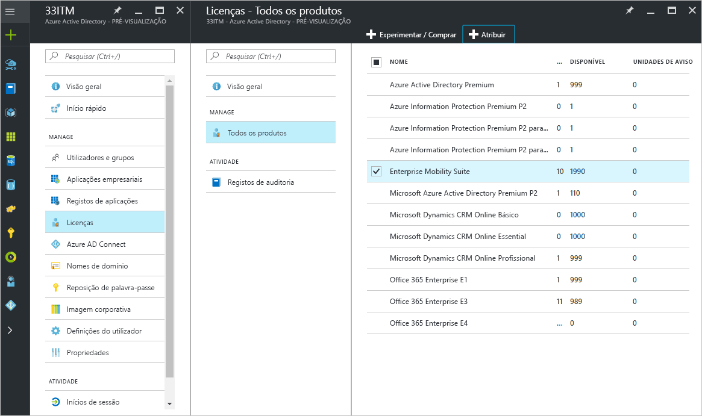
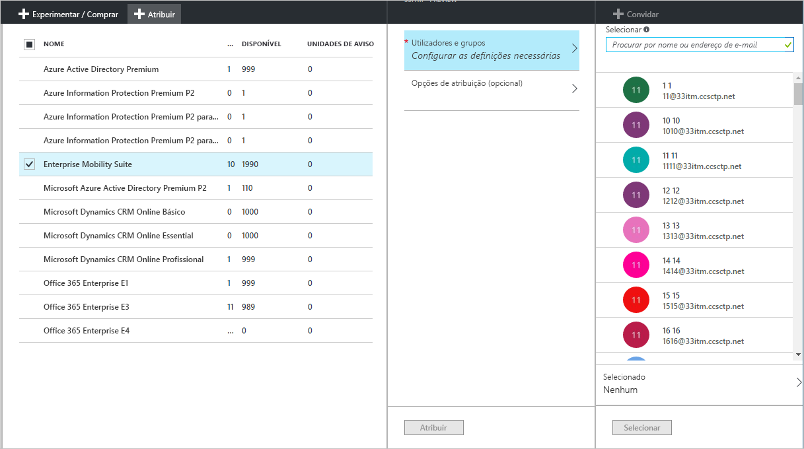
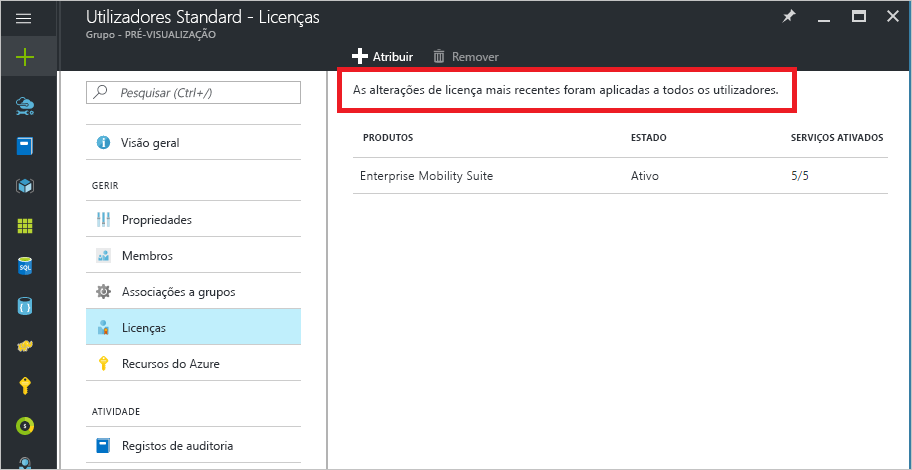
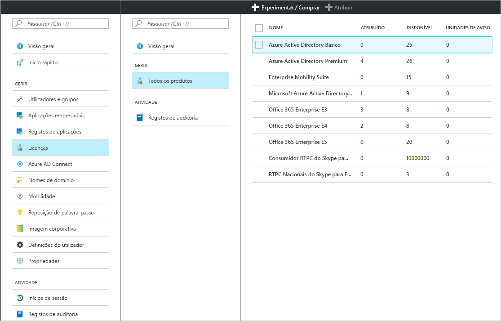
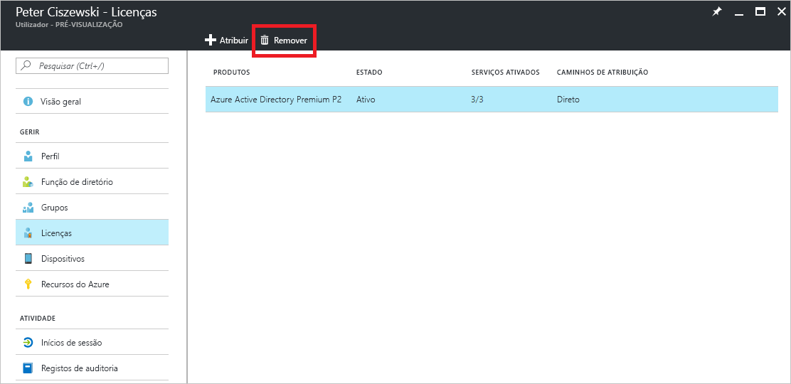

# Início Rápido: Licenciar utilizadores no Azure Active Directory
Os serviços do Azure AD baseados em licenças funcionam através da ativação de uma subscrição do Azure Active Directory (Azure AD) no seu inquilino do Azure. Depois de a subscrição estar ativa, as capacidades do serviço são geridas pelos administradores do Azure AD e utilizadas pelos utilizadores licenciados. Quando comprar o Enterprise Mobility + Security, o Azure AD Premium ou o Azure AD Básico, o seu inquilino é atualizado com a subscrição, incluindo o respetivo período de validade e licenças pré-pagas. Estão disponíveis informações sobre a sua subscrição, incluindo o número de licenças atribuídas ou disponíveis, no portal do Azure em **Azure Active Directory** ao abrir o mosaico **Licenças**. O painel **Licenças** é também o melhor local para gerir as suas atribuições de licenças.

Embora obter uma subscrição seja tudo o que precisa para configurar funcionalidades pagas, ainda tem de atribuir licenças de utilizador para funcionalidades pagas do Azure AD. Qualquer utilizador que deva ter acesso ou que seja gerido através de uma, tem de ser atribuída uma licença a uma funcionalidade paga do Azure AD. A atribuição de licenças é um mapeamento entre um utilizador e um serviço comprado, como o Azure AD Premium, Básico ou Enterprise Mobility + Security.

Pode utilizar a [atribuição de licenças baseada em grupos](active-directory-licensing-whatis-azure-portal.md) para configurar regras, como as seguintes:
* Todos os utilizadores no seu diretório recebem automaticamente uma licença
* Todos os utilizadores com o cargo apropriado recebe uma licença
* Pode delegar a decisão a outros gestores na organização (através de [grupos personalizados](../users-groups-roles/groups-self-service-management.md))

> [!TIP]
> Para uma discussão detalhada sobre a atribuição de licenças a grupos, incluindo cenários avançados e cenários de licenciamento do Office 365, veja [Atribuir licenças a utilizadores por associação a grupos no Azure Active Directory](../users-groups-roles/licensing-groups-assign.md).

## Atribuir licenças a utilizadores e grupos
Ao utilizar uma subscrição ativa, deve primeiro atribuir uma licença a si próprio e atualizar o browser para assegurar que vê todas as funcionalidades esperadas incluídas na sua subscrição. O próximo passo é atribuir licenças aos utilizadores que precisam de acesso às funcionalidades pagas do Azure AD. Uma forma fácil de atribuir licenças é fazê-lo a grupos de utilizadores em vez de individualmente. Quando atribui licenças a um grupo, todos os membros do grupo recebem uma licença. Se forem adicionados ou removidos utilizadores do grupo, a licença adequada é automaticamente atribuída ou removida. 

> [!NOTE]
> Alguns serviços Microsoft não estão disponíveis em todas as localizações. Antes de uma licença poder ser atribuída a um utilizador, o administrador tem de especificar a propriedade **Localização da utilização** do utilizador. Pode definir esta propriedade em **Utilizador** &gt; **Perfil** &gt; **Definições** no portal do Azure. Quando utilizar a atribuição de licença a grupos, qualquer utilizador cuja localização de utilização não esteja especificada herda a localização do diretório.

Para atribuir uma licença, em **Azure Active Directory** &gt; **Licenças** &gt; **Todos os Produtos**, selecione um ou mais produtos e, em seguida, selecione  **Atribuir** na barra de comandos.

Pode utilizar o painel **Utilizadores e grupos** para escolher vários utilizadores ou grupos ou desativar planos de serviço no produto. Utilize a caixa de pesquisa na parte superior para procurar nomes de utilizadores e grupos.

Quando atribuir licenças a um grupo, pode demorar algum tempo até todos os utilizadores herdarem a licença, consoante o tamanho do grupo. Pode verificar o estado de processamento no painel **Grupo**, no mosaico **Licenças**.

Podem ocorrer erros de atribuição durante a atribuição de licenças do Azure AD, mas são relativamente raros na gestão dos produtos Azure AD e Enterprise Mobility + Security. Os potenciais erros de atribuição estão limitados a:
- Conflito de atribuição: quando foi atribuída anteriormente uma licença a um utilizador incompatível com a licença atual. Neste caso, atribuir a licença nova requer a remoção da atual.
- Licenças disponíveis excedidas: quando o número de utilizadores em grupos atribuídos excede as licenças disponíveis, o estado de atribuição de um utilizador reflete uma falha de atribuição devido à falta de licenças.

### Licenciamento de colaboração do Azure AD B2B

A colaboração B2B permite convidar utilizadores para o inquilino do Azure AD para fornecer acesso aos serviços do Azure AD e a todos os recursos que disponibilizar.  

Não existe nenhum custo para convidar utilizadores B2B e atribuí-los a uma aplicação no Azure AD. É também gratuito ter até 10 aplicações por utilizador convidado e 3 relatórios básicos para utilizadores de colaboração B2B. Se o utilizador convidado tiver as licenças adequadas atribuídas no inquilino do Azure AD do parceiro, também estará licenciado nas suas.

Não é necessário, mas se quiser fornecer acesso às funcionalidades pagas do Azure AD, os utilizadores convidados B2B têm de estar licenciados com licenças do Azure AD adequadas. Um inquilino de convite com uma licença paga do Azure AD pode atribuir direitos de utilizador de colaboração B2B a cinco utilizadores convidados adicionais para o inquilino. Para cenários e informações, veja [Orientação de licenciamento de colaboração B2B](../b2b/licensing-guidance.md).

## Ver licenças atribuídas

É apresentada uma vista de resumo das licenças atribuídas e disponíveis em **Azure Active Directory** &gt; **Licenças** &gt; **Todos os produtos**.

Está disponível uma lista detalhada dos utilizadores e grupos atribuídos quando selecionar um produto específico. A lista **Utilizadores Licenciados** mostra todos os utilizadores que consomem atualmente uma licença e se a licença foi atribuída diretamente ao utilizador ou se foi herdada de um grupo.

Da mesma forma, a lista **Grupos Licenciados** mostra todos os grupos a quem foram atribuídas licenças. Selecione um utilizador ou grupo para abrir o painel **Licenças**, que mostra todas as licenças atribuídas a esse objeto.

## Remover uma licença

Para remover uma licença, vá para o utilizador ou grupo e abra o mosaico **Licenças**. Selecione a licença e clique em **Remover**.

Não é possível remover diretamente as licenças herdadas de um grupo pelo utilizador. Em vez disso, remova o utilizador do grupo do qual está a herdar a licença.

## Passos seguintes
Neste início rápido, aprendeu a atribuir licenças a utilizadores e grupos no diretório do Azure AD. 

Pode utilizar a ligação seguinte para configurar atribuições de licenças de subscrição no Azure AD a partir do portal do Azure.

> [!div class="nextstepaction"]
> [Atribuir licenças do Azure AD](https://aad.portal.azure.com/#blade/Microsoft_AAD_IAM/LicensesMenuBlade/Overview) 