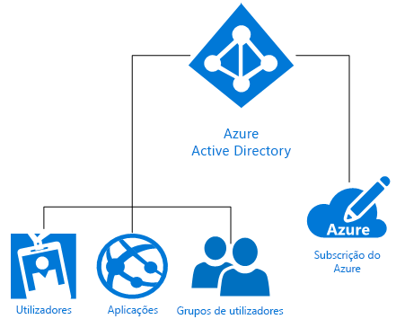

# O que é a identidade do Microsoft Azure?
O Microsoft Azure Active Directory (Azure AD) é uma solução na cloud de gestão de acessos e identidades que proporciona serviços de diretório, governação de identidade e gestão de acesso a aplicações. O Azure AD [ativa rapidamente o início de sessão único (SSO)](https://docs.microsoft.com/azure/active-directory/active-directory-enterprise-apps-manage-sso) em milhares de aplicações comerciais pré-integradas e personalizadas da [galeria de aplicações do Azure AD](https://azure.microsoft.com/marketplace/active-directory/all/). Provavelmente, já utiliza muitas dessas aplicações, como o Office 365, o Salesforce.com, o Box, o ServiceNow e o Workday.

Um diretório do Azure AD individual é automaticamente associado a uma subscrição no momento da sua criação. Sendo o serviço de identidade do Azure, o Azure AD proporciona todas as funções de gestão de identidades e controlo de acesso para os recursos baseados na cloud. Esses recursos podem incluir utilizadores, aplicações e grupos de inquilinos individuais (organização), conforme mostrado no diagrama seguir:

O Microsoft Azure oferece diversas formas de tirar partido da identidade como serviço (IDaaS) com diferentes níveis de complexidade, de modo a satisfazer as necessidades individuais da sua organização. O resto deste artigo ajuda-o a compreender a terminologia e os conceitos básicos da identidade do Azure e mostra-lhe recomendações para tomar a melhor decisão com base nas opções disponíveis.

## Termos que deve saber

Antes de escolher uma solução de identidade para a sua organização, precisa de compreender as noções básicas dos termos que são geralmente utilizados quando falamos de serviços de identidade do Azure.

|Termo| Descrição|
|-----|-----|
|Subscrição do Azure |As subscrições são utilizadas para pagar os serviços cloud do Azure e, normalmente, estão associados a um cartão de crédito. Pode ter várias subscrições, mas pode ser difícil partilhar recursos entre as mesmas.|
|Inquilino do Azure | Um inquilino do Azure AD representa uma organização individual. É uma instância dedicada e fiável do Azure AD que é criada automaticamente quando as organizações se inscrevem numa subscrição de um serviço cloud da Microsoft, como o Azure, o Intune ou o Office 365. Os inquilinos podem obter acesso aos serviços num ambiente dedicado (inquilino individual) ou num ambiente partilhado com outras organizações (multi-inquilinos).|
|Diretório do Azure AD | Cada inquilino do Azure tem um diretório do Azure AD dedicado e fiável que contém os respetivos utilizadores, grupos e aplicações. É utilizado para realizar funções de gestão de identidades e acesso nos recursos do inquilino. Uma vez que é automaticamente aprovisionado um diretório do Azure AD individual para representar a sua organização quando se inscreve num serviço cloud da Microsoft, como o Azure, o Microsoft Intune ou o Office 365, verá, por vezes, os termos *inquilino*, *Azure AD* e *diretório do Azure AD* serem utilizados de forma indistinta. |
|Domínio personalizado | Da primeira vez que se inscreve numa subscrição de um serviço cloud da Microsoft, o seu inquilino (organização) utiliza um nome de domínio *.onmicrosoft.com*. Contudo, a maioria das organizações tem um ou mais nomes de domínio que utilizam na sua atividade e que os utilizadores finais utilizam para aceder aos recursos da empresa. Pode adicionar o seu nome de domínio personalizado ao Azure AD, de modo a que o nome de domínio seja familiar para os seus utilizadores, como *alice@contoso.com*, em vez de *alice@contoso.onmicrosoft.com*. |
|Conta do Azure AD | É uma identidade que é criada quando se utiliza o Azure AD ou outro serviço cloud da Microsoft, como o Office 365. É armazenada no Azure AD e está acessível a qualquer subscrição de serviço cloud da organização. |
|Administrador de subscrição do Azure| O administrador de conta é a pessoa que se inscreveu ou comprou a subscrição do Azure. Pode utilizar o [Centro de Contas](https://account.azure.com/Subscriptions) para realizar várias tarefas de gestão, como criar e cancelar subscrições, alterar a faturação de uma subscrição ou alterar o administrador do serviço. |
|Administrador global do Azure AD | Os administradores globais do Azure AD têm acesso total a todas as funcionalidades administrativas do Azure AD. Por predefinição, a pessoa que se inscreve na subscrição de um serviço cloud da Microsoft torna-se administradora global automaticamente. Pode haver mais de um administrador global, mas só estes podem atribuir as [outras funções de administrador](https://docs.microsoft.com/azure/active-directory/active-directory-assign-admin-roles-azure-portal) aos utilizadores. |
|Conta Microsoft | As contas Microsoft (criadas por si para utilização pessoal) oferecem acesso a produtos e serviços cloud orientados para o consumidor, como o Outlook (Hotmail), o OneDrive, a Xbox LIVE ou o Office 365. Estas identidades são criadas e armazenadas no sistema de contas de identidades de consumidores da Microsoft. |
|Contas escolares ou profissionais | As contas escolares ou profissionais (emitidas por um administrador para utilização empresarial/académica) oferecem acesso a serviços cloud de nível empresarial da Microsoft, como o Azure, o Intune ou o Office 365.|

## Conceitos que deve saber

Agora que já conhece os termos básicos da identidade do Azure, deve saber mais sobre os seguintes conceitos de identidade do Azure, que o vão ajudar a tomar uma decisão informada quanto ao serviço de identidade do Azure.

|Conceito |Descrição|
|-----|-----|
|[Como as subscrições do Azure estão associadas ao Azure Active Directory](https://docs.microsoft.com/azure/active-directory/active-directory-how-subscriptions-associated-directory) |Todas as subscrições do Azure têm uma relação de confiança com um diretório do Azure AD para autenticar utilizadores, serviços e dispositivos. *Várias subscrições podem confiar no mesmo diretório do Azure AD, mas só confiam num único diretório do Azure AD*. Esta relação de confiança é diferente da relação que as subscrições têm com outros recursos do Azure (sites, bases de dados, etc.), que são mais parecidos com recursos subordinados das mesmas. Em caso de expiração de uma subscrição, o acesso aos recursos associados à subscrição que não o Azure AD também para. No entanto, o diretório do Azure AD permanece no Azure, para que associar outra subscrição a esse diretório e continuar a gerir os utilizadores do inquilino.|
|[Como funciona o licenciamento do Azure AD](https://docs.microsoft.com/azure/active-directory/active-directory-licensing-get-started-azure-portal) | Quando compra ou ativa o Enterprise Mobility Suite, o Azure AD Premium ou o Azure AD Básico, o seu diretório é atualizado com a subscrição, incluindo o respetivo período de validade e licenças pré-pagas. Depois de a subscrição estar ativa, o serviço pode ser gerido pelos administradores globais do Azure AD e utilizado pelos utilizadores licenciados. Estão disponíveis informações sobre a sua subscrição, incluindo o número de licenças atribuídas ou disponíveis, no portal do Azure, no painel **Azure Active Directory** > **Licenças**. Este painel também é o melhor local para gerir as suas atribuições de licenças.|
|[Controlo de Acesso Baseado em Funções no portal do Azure](https://docs.microsoft.com/azure/role-based-access-control/overview)|O Controlo de Acesso Baseado em Funções (RBAC) do Azure ajuda a proporcionar uma gestão pormenorizada de acesso aos recursos do Azure. Demasiadas permissões podem expor as contas a atacantes. Permissões insuficientes significam que os funcionários não podem trabalhar eficientemente. Com o RBAC, pode dar aos funcionários as permissões exatas de que precisam com base em três funções básicas que se aplicam a todos os grupos de recursos: proprietário, contribuidor, leitor. Também pode criar até duas mil [funções RBAC personalizadas](https://docs.microsoft.com/azure/role-based-access-control/custom-roles) para dar resposta às suas necessidades específicas. |
|[Identidade híbrida](https://docs.microsoft.com/azure/active-directory/connect/active-directory-aadconnect)|A identidade híbrida é obtida ao integrar o seu Windows Server Active Directory (AD DS) no local com o Azure AD mediante a utilização do [Azure AD Connect](https://docs.microsoft.com/azure/active-directory/connect/active-directory-aadconnect). Isto permite-lhe fornecer uma identidade comum para o utilizadores das aplicações do Office 365, do Azure e das aplicações no local ou SaaS integradas com o Azure AD. Com a identidade híbrida, pode alargar o seu ambiente no local para a cloud eficazmente para identidade e acesso.|

### Diferença entre o Windows Server AD DS e o Azure AD
Tanto o Azure Active Directory (Azure AD), como o Active Directory no local (Active Directory Domain Services ou AD DS), são sistemas que armazenam dados de diretórios e gerem a comunicação entre utilizadores e recursos, incluindo processos de início de sessão, autenticação e pesquisas nos diretórios por parte dos utilizadores.

Se já estiver familiarizado com o Windows Server Active Directory Domain Services (AD DS) no local, introduzido originalmente no Windows 2000 Server, é provável que já saiba o conceito básico dos serviços de identidade. Contudo, também é importante compreender que o Azure AD não é apenas um controlador de domínios na cloud. É uma forma completamente nova de proporcionar a identidade como serviço (IDaaS) no Azure e que exige uma abordagem inovadora para adotar integralmente as capacidades baseadas na cloud e proteger a sua organização das ameaças modernas. 

O AD DS é uma função de servidor no Windows Server, o que significa que pode ser implementado em computadores físicos ou em máquinas virtuais. Tem uma estrutura hierárquica baseada em X.500. Utiliza DNS para localizar objetos, utiliza essencialmente Kerberos para autenticação e é possível utilizar LDAP para interagir com o mesmo. O Active Directory permite unidades organizacionais (UOs) e Objetos de Política de Grupo (GPOs), para além de associar máquinas ao domínio, e são criadas confianças entre os domínios.

As equipas de TI utilizaram o AD DS para proteger o perímetro de segurança durante anos, mas as empresas modernas sem perímetro e com necessidades de identidade para funcionários, clientes e parceiros precisam de um plano de controlo novo. O Azure AD é esse plano de controlo de identidades. A segurança passou da firewall empresarial para a cloud, na qual o Azure AD protege os recursos e os acessos das empresas ao fornecer uma identidade comum para os utilizadores (no local ou na cloud). Desta forma, os seus utilizadores ganham flexibilidade para aceder em segurança às aplicações de que precisam para trabalhar em praticamente qualquer dispositivo. Também são disponibilizados controlos de proteção de dados com base no risco, apoiados por capacidades de machine learning e relatórios aprofundados, de que as equipas de TI precisam para manter os dados das empresas seguros.

O Azure AD é um serviço de diretórios públicos multicliente, o que significa que pode criar, no Azure AD, um inquilino para os servidores cloud e para as aplicações, como o Office 365. Os utilizadores e os grupos são criados numa estrutura plana sem UOs nem GPOs. A autenticação é feita através de protocolos, como SAML, WS-Federation e OAuth. É possível consultar o Azure AD. Contudo, em vez de utilizar LDAP, tem de utilizar uma API REST chamada Graph API do AD. Todos funcionam com HTTP e HTTPS.

### Ampliar as capacidades de gestão e segurança do Office 365
Já utiliza o Office 365? Pode acelerar a sua transformação digital ao ampliar as capacidades incorporadas do Office 365 com o Azure AD para proteger todos os seus recursos e permitir a produtividade segura para todos os funcionários. Quando utiliza o Azure AD, para além das capacidades do Office 365, pode proteger todo o seu portfólio de aplicações com uma identidade que permite o início de sessão único para todas as aplicações. Pode ampliar as capacidades do acesso condicional em função não apenas no estado do dispositivo, mas também no utilizador, na localização, na aplicação e no risco. As capacidades da autenticação multifator (MFA) oferecem ainda mais proteção para quando precisa. Obterá uma supervisão adicional dos privilégios dos utilizadores e conceder acesso administrativo a pedido e just-in-time. Os seus utilizadores serão mais produtivos e criarão menos pedidos de suporte, graças às capacidades de self-service que o Azure AD oferece, como a reposição de palavras-passe esquecidas, os pedidos de acesso a aplicações e a criação e gestão de grupos.

> [!TIP]
> Quer saber mais sobre como utilizar a gestão de identidades do Azure AD com o Office 365? [Obtenha o e-book](https://info.microsoft.com/Extend-Office-365-security-with-EMS.html).

## Soluções de identidade do Microsoft Azure

O Microsoft Azure oferece várias formas de gerir as identidades dos seus utilizadores, quer sejam mantidos totalmente no local, apenas na cloud ou algures entre ambos. Essas opções incluem o AD DS de implementação personalizada no Azure, o Azure Active Directory (Azure AD), a Identidade Híbrida e o Azure AD Domain Services.

### AD DS de implementação personalizada
As empresas que só precisam de uma pequena pegada na cloud podem utilizar o **AD DS de implementação personalizada** no Azure. Esta opção suporta muitos cenários do Windows Server AD DS que são bastante adequados para implementação como máquinas virtuais (VMs) no Azure. Por exemplo, pode criar uma VM do Azure como um controlador de domínio em execução num datacenter muito distante que está ligado à mesma rede remota. Daí, a VM pode suportar pedidos de autenticação de utilizadores remotos e melhorar o desempenho da autenticação. Esta opção também é bastante adequada como alternativa relativamente económica aos sites de recuperação após desastre caros, pois aloja um pequeno número de controladores de domínio e uma única rede virtual no Azure. Por fim, pode ter de implementar uma aplicação no Azure, como o SharePoint, que precisa do Windows Server AD DS, mas que não tem nenhuma dependência na rede no local ou no Windows Server Active Directory empresarial. Nesse caso, pode implementar uma floresta isolada no Azure, de modo a cumprir os requisitos do farm de servidores do SharePoint. Também é possível implementar aplicações de rede que precisam de conectividade à rede no local e ao Active Directory no local.

### Azure Active Directory (Azure AD)
O **Azure AD autónomo** é uma solução de gestão de identidades e acessos como Serviço (IDaaS) baseada na cloud. O Azure AD dá-lhe um conjunto robusto de capacidades para gerir utilizadores e grupos. É um serviço que ajuda a proteger o acesso a aplicações no local e na cloud, incluindo serviços Web da Microsoft como o Office 365, e a várias aplicações SaaS (software como serviço) que não são da Microsoft. O Azure AD está disponível em três edições: Gratuita, Básica e Premium. O Azure AD aumenta a eficácia organizacional e alarga a segurança para lá da firewall do perímetro, para um plano de controlo novo que é protegido pelo machine learning do Azure e por outras funcionalidades de segurança avançadas.

### Identidade híbrida
Em vez de escolher entre soluções de identidade no local ou na cloud, muitos CIOs e empresas inovadoras, que começaram a antecipar a direção para que seguiam no longo prazo, estão a alargar os diretórios no local para a cloud através de soluções de **identidade híbrida**. Com a identidade híbrida, obtém uma solução de gestão de identidades e acessos verdadeiramente global que disponibiliza acesso seguro e produtivo às aplicações que os utilizadores têm de utilizar para trabalhar.

> [!TIP]
> Para saber mais sobre como é que os CIOs fizeram do Azure Active Directory uma peça fundamental das estratégias de TI, transfira [CIO’s Guide to Azure Active Directory](https://aka.ms/AzureADCIOGuide) (Guia do Azure Active Directory para CIOs).

### Azure AD Domain Services
O **Azure AD Domain Services** proporciona uma opção baseada na cloud para utilizar o AD DS para controlo de configuração leve de VMs do Azure e uma forma de cumprir os requisitos de identidade no local para desenvolvimento e teste de aplicações de rede. O Azure AD Domain Services não se destina a fazer a migração lift and shift da sua infraestrutura do AD DS no local para as VMs do Azure geridas pelo Azure AD Domain Services. Em vez disso, as VMs do Azure em domínios geridos devem ser utilizadas para suportar o desenvolvimento, o teste e a movimentação de aplicações no local para precisam de métodos de autenticação do AD DS para a cloud.

## Cenários comuns e recomendações

Eis alguns cenários de identidades e acessos comuns com recomendações sobre qual a opção de identidade do Azure que pode ser mais adequada para cada um.

|Cenário de identidade| Recomendação|
|-----|-----|
|A minha organização fez grandes investimentos no Windows Server Active Directory no local, mas queremos alargar a identidade para a cloud.| A solução de identidade do Azure mais utilizada é a [identidade híbrida](https://docs.microsoft.com/azure/active-directory/active-directory-hybrid-identity-design-considerations-overview). Se já tiver feito investimentos no AD DS no local, pode alargar facilmente a identidade para a cloud com o Azure AD Connect.|
|A minha empresa nasceu na cloud e não investimos em soluções de identidade no local.| O [Azure Active Directory](https://docs.microsoft.com/azure/active-directory/active-directory-whatis) é a melhor opção para empresas apenas na cloud que não tenham feito investimentos no local.|
|Preciso de controlo de configuração leve das VMs do Azure para cumprir os requisitos de identidade no local para desenvolvimento e teste de aplicações.|O [Azure AD Domain Services](https://docs.microsoft.com/azure/active-directory-domain-services/active-directory-ds-overview) é uma boa escolha se precisar de utilizar o AD DS para controlo de configuração leve das VMs do Azure ou se pretender desenvolver ou migrar aplicações no local legadas e compatíveis com diretórios para a cloud.|  
|Tenho de suportar algumas máquinas virtuais no Azure, mas a minha empresa ainda tem um investimento avultado no Active Directory no local (AD DS).|Se tiver de suportar algumas máquinas virtuais e tiver investimentos avultados no AD DS no local, utilize [AD DS de implementação personalizada](https://docs.microsoft.com/azure/active-directory-domain-services/active-directory-ds-comparison#do-it-yourself-diy-ad-deployment-options) para utilizar as VMs do Azure. |

## Onde posso saber mais?
Temos dezenas de excelentes recursos online para o ajudar a saber tudo sobre o Azure AD. Segue-se uma lista de ótimos artigos por onde começar:

* [Ativar o seu diretório para gestão híbrida com o Azure AD Connect](../connect/active-directory-aadconnect.md)
* [Additional security for an ever connected world](../authentication/multi-factor-authentication.md) (Segurança adicional para um mundo cada vez mais ligado)
* [Automate User Provisioning and Deprovisioning to SaaS Applications with Azure Active Directory](../manage-apps/user-provisioning.md) (Automatizar o aprovisionamento e o desaprovisionamento de utilizadores em Aplicações SaaS com o Azure Active Directory)
* [Manage your passwords from anywhere](../user-help/active-directory-passwords-update-your-own-password.md) (Gerir as suas palavras-passe em qualquer local)
* [What is application access and single sign-on with Azure Active Directory?](../manage-apps/what-is-single-sign-on.md) (O que é o acesso a aplicações e o início de sessão único com o Azure Active Directory?)
* [Automate User Provisioning and Deprovisioning to SaaS Applications with Azure Active Directory](../manage-apps/user-provisioning.md) (Automatizar o aprovisionamento e o desaprovisionamento de utilizadores em Aplicações SaaS com o Azure Active Directory)
* [How to provide secure remote access to on-premises applications](../manage-apps/application-proxy.md) (Como fornecer acesso remoto seguro a aplicações no local)
* [Gerir o acesso aos recursos com grupos do Azure Active Directory](active-directory-manage-groups.md)
* [O que é o licenciamento do Microsoft Azure Active Directory?](active-directory-licensing-whatis-azure-portal.md)
* [How can I discover unsanctioned cloud apps that are used within my organization](../manage-apps/cloud-app-discovery.md) (Como posso descobrir aplicações na cloud não sancionadas que são utilizadas na minha organização)

## Passos Seguintes

Agora que já sabe os conceitos da identidade do Azure e as opções à sua escolha, pode utilizar os recursos seguintes para começar a implementar a opção que escolheu:

[Learn more about Azure hybrid identity solutions](https://docs.microsoft.com/azure/active-directory/choose-hybrid-identity-solution) (Saber mais sobre as soluções de identidade híbrido do Azure)

[Learn more in an Azure Proof of Concept environment](https://aka.ms/aad-poc) (Saber mais num ambiente de Prova de Conceito do Azure)
