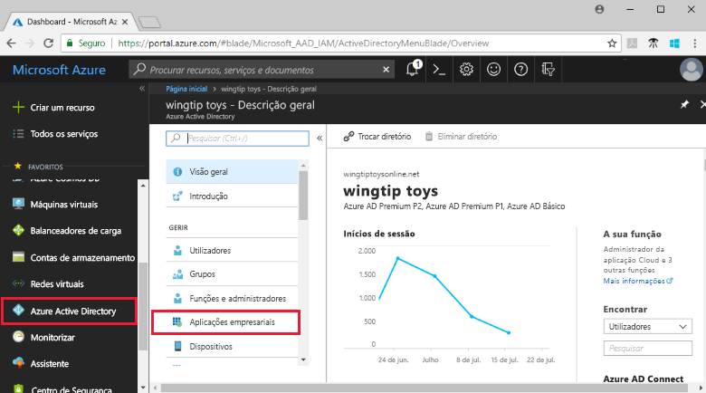
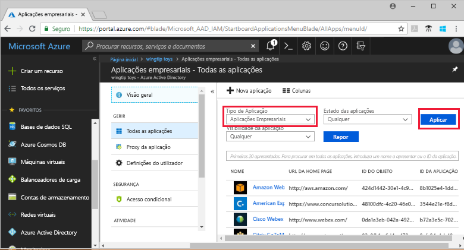
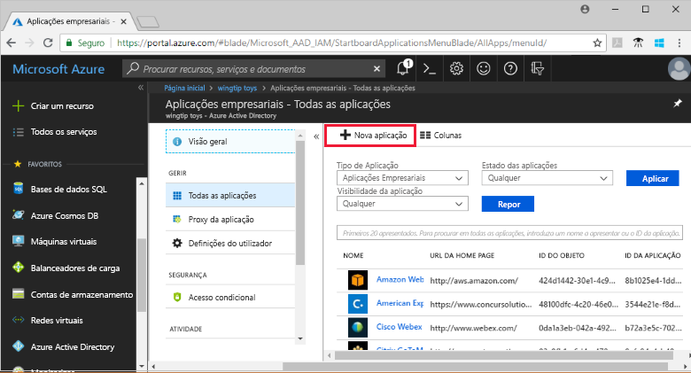
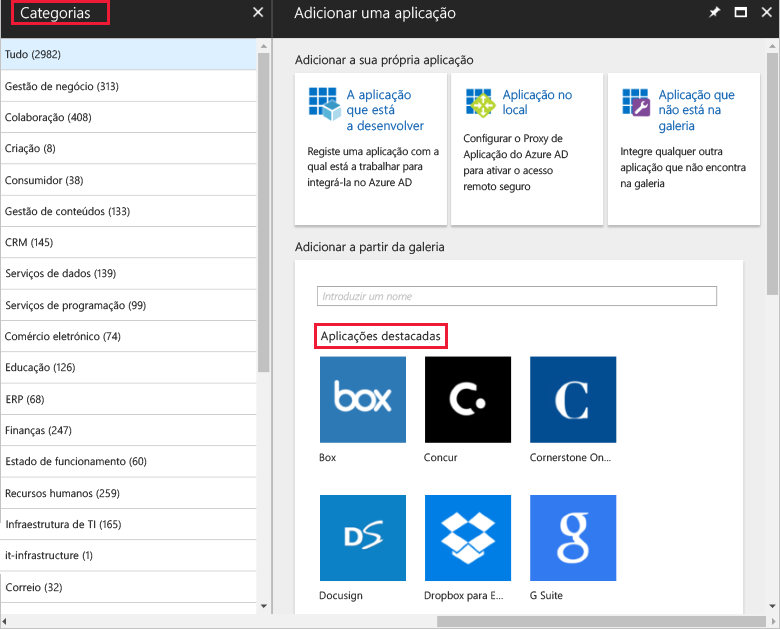
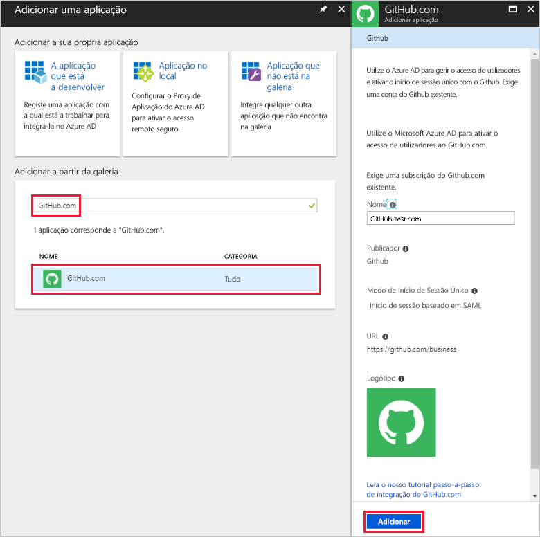
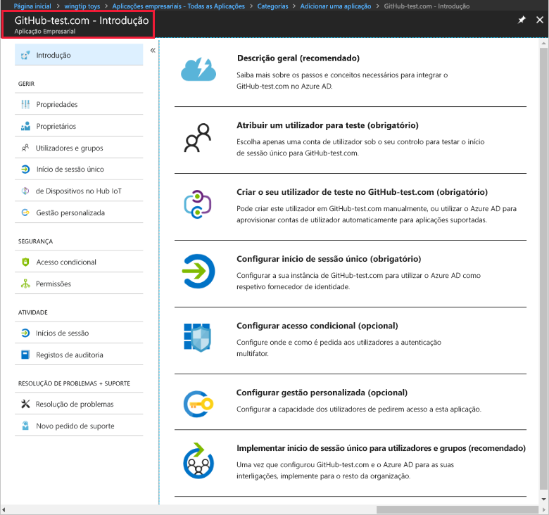
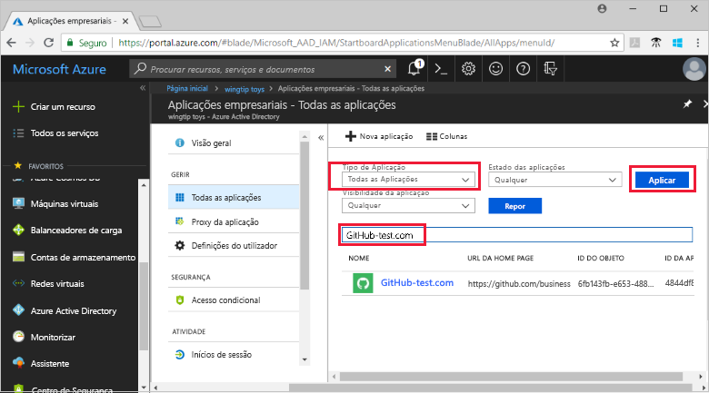
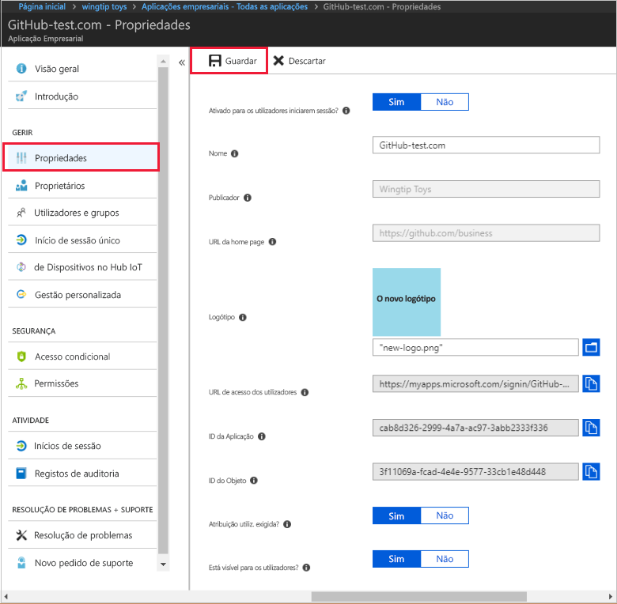
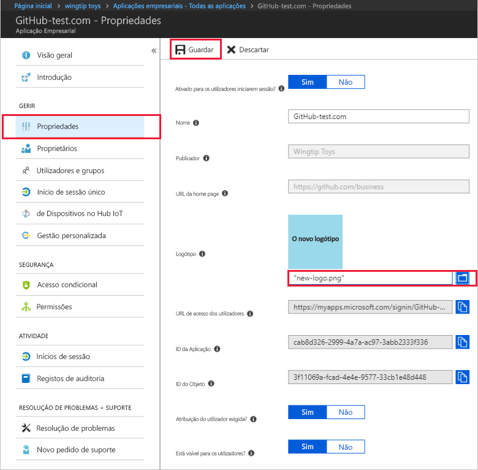

# Início rápido: Adicionar uma aplicação com o seu inquilino do Azure Active Directory

O Azure Active Directory (Azure AD) tem uma galeria que contém milhares de aplicações pré-integradas. É provável que algumas das aplicações que a sua organização utiliza estão na galeria. Este início rápido utiliza o portal do Azure para adicionar uma aplicação da galeria ao seu inquilino do Azure Active Directory (Azure AD).

Após a adição de uma aplicação ao seu inquilino do Azure AD, pode:

- Gerir o acesso dos utilizadores à aplicação com uma política de acesso condicional.
- Configurar utilizadores para o início de sessão único na aplicação com as contas do Azure AD deles.

## Antes de começar

Para adicionar uma aplicação ao seu inquilino, precisa de:

- Uma subscrição do Azure
- Uma subscrição com início de sessão único ativado para a aplicação

Inicie sessão no [portal do Azure](https://portal.azure.com) como administrador global do inquilino do Azure AD, administrador de uma aplicação na cloud ou administrador de uma aplicação.

Para testar os passos neste tutorial, recomendamos utilizar um ambiente de não produção. Se não tiver um ambiente de não produção do Azure AD, pode [obter uma avaliação de um mês](https://azure.microsoft.com/pricing/free-trial/).

## Adicionar uma aplicação ao seu inquilino

Para adicionar uma aplicação da galeria ao seu inquilino do Azure AD:

1. No [portal do Azure](https://portal.azure.com), no painel de navegação do lado esquerdo, clique em **Azure Active Directory**.

2. No painel **Azure Active Directory,** clique em **Aplicações empresariais**.

    

3. É aberto o painel **Todas as aplicações**, que mostra uma amostra aleatória das aplicações no seu inquilino do Azure AD.

    

4. Clique em **Nova aplicação**, na parte superior do painel **Todas as aplicações**.

    

5. Para ver uma lista das aplicações na galeria, é mais fácil utilizar as **Categorias**, pois os ícones em **Aplicações em destaque** são uma amostra aleatória de aplicações da galeria.

    

    Para ver mais aplicações, pode clicar em **Mostrar mais**. Não recomendamos pesquisar desta forma, visto que a galeria tem milhares de aplicações.

6. Para procurar uma aplicação, em **Adicionar a partir da galeria**, introduza o nome da aplicação que quer adicionar. Selecione a aplicação nos resultados e clique em **Adicionar**. A exemplo a seguir mostra a **Adicionar aplicação** formulário que aparece a seguir a procurar github.com.

    

6. No formulário específico da aplicação, pode alterar as informações de propriedade. Por exemplo, pode editar o nome da aplicação para satisfazer as necessidades da sua organização. Este exemplo utiliza o nome **GitHub-test**.

8. Quando concluir as alterações às propriedades, clique em **Adicionar**.

9. É apresentada uma página de introdução com as opções para configurar a aplicação para a sua organização.

    

Concluiu a adição da aplicação. Aproveite para descansar. As secções seguintes mostram-lhe como alterar o logótipo e editar outras propriedades da aplicação.

## Localizar a aplicação do seu inquilino do Azure AD

Vamos supor que teve de se ausentar e que voltou agora para retomar a configuração da aplicação. A primeira coisa a fazer é localizar a aplicação.

1. No **[portal do Azure](https://portal.azure.com)**, no painel de navegação do lado esquerdo, clique em **Azure Active Directory**.

2. No painel Azure Active Directory, clique em **Aplicações empresariais**.

3. No menu pendente **Tipo de Aplicação**, selecione **Todas as Aplicações** e clique em **Aplicar**. Para saber mais sobre as opções de visualização, veja [View tenant applications](view-applications-portal.md) (Ver aplicações do inquilino).

4. Agora, pode ver uma lista com todas as aplicações no seu inquilino do Azure AD. A lista é uma amostra aleatória. Para ver mais aplicações, clique em **Mostrar mais** uma ou mais vezes.

5. Para localizar rapidamente uma aplicação no inquilino, introduza o nome da mesma na caixa de pesquisa e clique em **Aplicar**. Este exemplo localiza a aplicação GitHub-test que adicionámos anteriormente.

    

## Configurar as propriedades de início de sessão do utilizador

Agora que já encontrou a aplicação, pode abri-la e configurar as propriedades.

Para editar as propriedades da aplicação

1. Clique na aplicação para abri-la.
2. Clique em **Propriedades** para abrir o painel de propriedades para edição.

    

3. Dispense alguns momentos para compreender as opções de início de sessão. As opções **Ativada para os utilizadores iniciarem sessão**, **Atribuição do utilizador necessária** e **Visível para o utilizador** combinam-se para determinar se os utilizadores que foram atribuídos ou não à aplicação podem iniciar sessão. Também determinam se o utilizador pode ver a aplicação no painel de acesso.

    - **Ativada para os utilizadores iniciarem sessão** determina se os utilizadores atribuídos à aplicação podem iniciar sessão.
    - **Atribuição do utilizador necessária** determina se os utilizadores que não foram atribuídos à aplicação podem iniciar sessão.
    - **Visível para o utilizador** determina se os utilizadores atribuídos a uma aplicação podem vê-la no painel de acesso e no iniciador do O365.

4. As tabelas seguintes ajudam-no a escolher as opções que são mais adequadas às suas necessidades.

    - Comportamento para utilizadores **atribuídos**:

        | Definições da propriedades da aplicação | | | Experiência para utilizadores atribuídos | |
        |---|---|---|---|---|
        | Ativado para os utilizadores iniciarem sessão? | Atribuição do utilizador necessária? | Visível para os utilizadores? | Os utilizadores atribuídos podem iniciar sessão? | Os utilizadores atribuídos podem ver a aplicação?* |
        | sim | sim | sim | sim | sim  |
        | sim | sim | não  | sim | não   |
        | sim | não  | sim | sim | sim  |
        | sim | não  | não  | sim | não   |
        | não  | sim | sim | não  | não   |
        | não  | sim | não  | não  | não   |
        | não  | não  | sim | não  | não   |
        | não  | não  | não  | não  | não   |

    - Comportamento para utilizadores **não atribuídos**:

        | Definições da propriedades da aplicação | | | Experiência para utilizadores não atribuídos | |
        |---|---|---|---|---|
        | Ativado para os utilizadores iniciarem sessão? | Atribuição do utilizador necessária? | Visível para os utilizadores? | Os utilizadores não atribuídos podem iniciar sessão? | Os utilizadores não atribuídos podem ver a aplicação?* |
        | sim | sim | sim | não  | não   |
        | sim | sim | não  | não  | não   |
        | sim | não  | sim | sim | não   |
        | sim | não  | não  | sim | não   |
        | não  | sim | sim | não  | não   |
        | não  | sim | não  | não  | não   |
        | não  | não  | sim | não  | não   |
        | não  | não  | não  | não  | não   |

    *O utilizador pode ver a aplicação no painel de acesso e no iniciador de aplicações do Office 365?

## Utilizar um logótipo personalizado

Para utilizar um logótipo personalizado:

1. Crie um logótipo com 215 por 215 píxeis e guarde-o no formato PNG.
2. Uma vez que já encontrou a aplicação, clique na mesma.
2. No painel do lado esquerdo, clique em **Propriedades**.
4. Atualize o logótipo.
5. Quando tiver terminado, clique em **Guardar**.

    

## Passos Seguintes

Neste início rápido, aprendeu a adicionar uma aplicação da galeria ao seu inquilino do Azure AD. Aprendeu a editar as propriedades da aplicação.

Agora, está pronto para configurar a aplicação para início de sessão único.

> [!div class="nextstepaction"]
> [Configure single sign-on](configure-single-sign-on-portal.md) (Configurar o início de sessão único)

