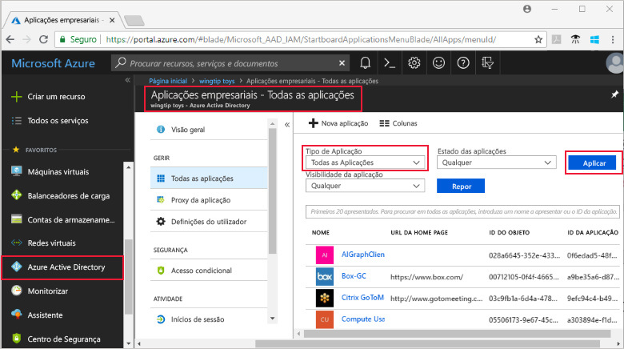
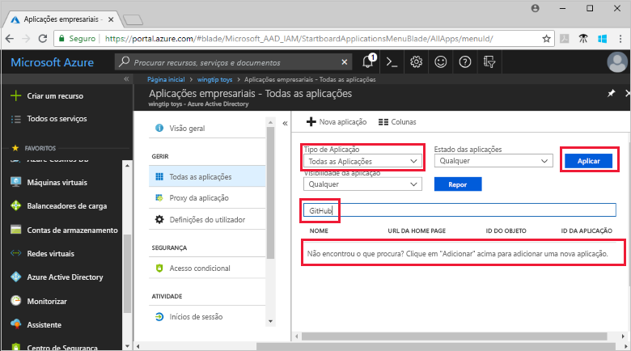
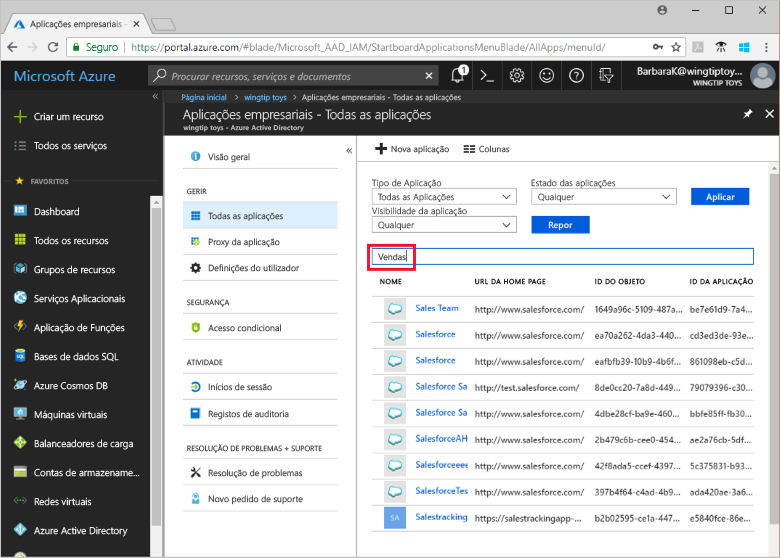

# Ver as aplicações do seu inquilino do Azure Active Directory

Este início rápido utiliza o portal do Azure para ver as aplicações no seu inquilino do Azure Active Directory (Azure AD).

## Antes de começar

Para ver resultados, tem de ter pelo menos uma aplicação no inquilino do Azure AD. Para adicionar uma aplicação, veja o início rápido [Add an application](add-application-portal.md) (Adicionar uma aplicação).

Inicie sessão no [portal do Azure](https://portal.azure.com) como administrador global do inquilino do Azure AD, administrador de uma aplicação na cloud ou administrador de uma aplicação.

## Localizar a lista de aplicações do inquilino

As aplicações do inquilino do Azure AD são visíveis na secção **Aplicações empresariais** do portal do Azure.

Para localizar as aplicações do inquilino:

1. No **[portal do Azure](https://portal.azure.com)**, no painel de navegação do lado esquerdo, clique em **Azure Active Directory**. 

2. No painel Azure Active Directory, clique em **Aplicações empresariais**. 

3. No menu pendente **Tipo de Aplicação**, selecione **Todas as Aplicações** e clique em **Aplicar**. É apresentada uma amostra aleatória das aplicações do seu inquilino.

    
   
4. Para ver mais aplicações, clique em **Mostrar mais**, na parte inferior da lista. Dependendo do número de aplicações no inquilino, poderá ser mais fácil [procurar uma aplicação específica](#search-for-a-tenant-application) em vez de percorrer a lista.

## Selecionar as opções de visualização

Nesta secção, selecione as opções segundo o que está à procura.

1. Pode ver as aplicações de acordo com opções para **Tipo de Aplicação**, **Estado da Aplicação** e **Visibilidade da aplicação**. 

    

2. Em **Tipo de Aplicação**, escolha uma das seguintes opções:

    - **Aplicações Empresariais** mostra aplicações não Microsoft.
    - **Aplicações da Microsoft** mostra aplicações da Microsoft.
    - **Todas as Aplicações** mostra aplicações não Microsoft e Microsoft.

3. Em **Estado da Aplicação**, escolha **Qualquer**, **Desativada** ou **Ativada**. A opção **Qualquer** inclui aplicações desativadas e ativadas.

4. Em **Visibilidade da Aplicação**, escolha **Qualquer** ou **Oculta**. A opção **Oculta** mostra as aplicações que estão no inquilino, mas que não estão visíveis para os utilizadores.

5. Depois de escolheres as opções que pretende, clique em **Aplicar**.
 

## Procurar uma aplicação do inquilino

Para procurar uma aplicação específica:

1. No menu **Tipo de Aplicação**, selecione **Todas as Aplicações** e clique em **Aplicar**.

2. Introduza o nome da aplicação que quer encontrar. Se a aplicação tiver sido adicionada ao inquilino do Azure AD, aparecerá nos resultados da pesquisa. Este exemplo mostra que o GitHub não foi adicionado às aplicações do inquilino.

    

3. Experimente introduzir as primeiras letras do nome de uma aplicação.  Este exemplo mostra todas as aplicações que começam com **Sales**.

    

## Passos seguintes

Neste início rápido, aprendeu a ver as aplicações que estão no seu inquilino do Azure AD e a filtrar a lista de aplicações por tipo de aplicação, estado e visibilidade. Também aprendeu a procurar aplicações específicas.

Agora que já localizou a aplicação de que estava à procura, pode avançar para [Add more applications to your tenant](add-application-portal.md) (Adicionar mais aplicações ao inquilino) ou clique na aplicação para ver ou editar propriedades e opções de configuração. Por exemplo, pode configurar o início de sessão único. 

> [!div class="nextstepaction"]
> [Configure single sign-on](configure-single-sign-on-portal.md) (Configurar o início de sessão único)

