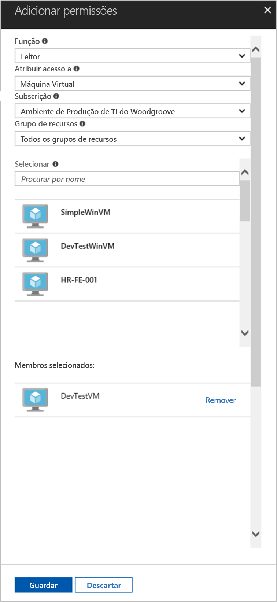

# <a name="use-a-linux-vm-managed-service-identity-msi-to-access-azure-resource-manager"></a>Utilizar uma Identidade de Serviço Gerida (MSI) de VM do Linux para aceder ao Azure Resource Manager

[!INCLUDE[preview-notice](../../../includes/active-directory-msi-preview-notice.md)]

Este tutorial mostra como ativar a Identidade de Serviço Gerida (MSI) para uma Máquina Virtual do Linux e, em seguida, utilizar essa identidade para aceder à API do Azure Resource Manager. As Identidades de Serviço Geridas são geridas automaticamente pelo Azure e permitem-lhe a autenticação em serviços que suportam a autenticação do Azure AD, sem a necessidade de inserir as credenciais no seu código. Saiba como:

> [!div class="checklist"]
> * Ativar a MSI numa Máquina Virtual do Linux 
> * Conceder o acesso da VM a um Grupo de Recursos no Azure Resource Manager 
> * Obter um token de acesso com a identidade da VM e utilizá-lo para chamar o Azure Resource Manager 

## <a name="prerequisites"></a>Pré-requisitos

[!INCLUDE [msi-qs-configure-prereqs](../../../includes/active-directory-msi-qs-configure-prereqs.md)]

[!INCLUDE [msi-tut-prereqs](../../../includes/active-directory-msi-tut-prereqs.md)]

## <a name="sign-in-to-azure"></a>Iniciar sessão no Azure

Inicie sessão no Portal do Azure em [https://portal.azure.com](https://portal.azure.com).

## <a name="create-a-linux-virtual-machine-in-a-new-resource-group"></a>Criar uma Máquina Virtual do Linux num novo Grupo de Recursos

Neste tutorial, vamos criar uma nova VM do Linux. Também pode ativar o MSI numa VM existente.

1. Clique no botão **Criar um recurso**, no canto superior esquerdo do portal do Azure.
2. Selecione **Computação** e, em seguida, selecione **Ubuntu Server 16.04 LTS**.
3. Introduza as informações da máquina virtual. Em **Tipo de autenticação**, selecione **Chave SSH pública** ou **Palavra-passe**. As credenciais criadas permitem-lhe iniciar sessão na VM.

    

4. Selecione uma **Subscrição** para a máquina virtual na lista pendente.
5. Para selecionar um novo **Grupo de Recursos** no qual gostaria que a máquina virtual fosse criada, escolha **Criar Novo**. Quando terminar, clique em **OK**.
6. Selecione o tamanho da VM. Para ver mais tamanhos, selecione **Visualizar todos** ou altere o filtro Tipo de disco suportado. No painel de definições, mantenha as predefinições e clique em **OK**.

## <a name="enable-msi-on-your-vm"></a>Ativar a MSI na sua VM

Uma MSI de Máquina Virtual permite-lhe obter os tokens de acesso do Azure AD, sem ter de colocar as credenciais no código. Ativar a Identidade de Serviço Gerida numa VM faz duas coisas: regista a sua VM no Azure Active Directory para criar a respetiva identidade gerida e configura a identidade na VM.

1. Selecione a **Máquina Virtual** na qual pretende ativar a MSI.
2. Na barra de navegação esquerda, clique em **Configuração**.
3. Vai ver a **Identidade de Serviço Gerida**. Para registar e ativar a MSI, selecione **Sim**; se desejar desativá-la, selecione Não.
4. Certifique-se de que clica em **Guardar** para guardar a configuração.

    

## <a name="grant-your-vm-access-to-a-resource-group-in-azure-resource-manager"></a>Conceder o acesso da VM a um Grupo de Recursos no Azure Resource Manager 

Com a MSI, o seu código pode obter tokens de acesso para autenticação em recursos que suportam a autenticação do Azure AD. A API do Azure Resource Manager suporta a autenticação do Azure AD. Primeiro, temos de conceder acesso de identidade a esta VM a um recurso no Azure Resource Manager, neste caso, o Grupo de Recursos no qual a VM está contida.  

1. Navegue até ao separador para **Grupos de Recursos**.
2. Selecione o **Grupo de Recursos** específico que criou anteriormente.
3. Aceda a **Controlo de acesso (IAM)** no painel esquerdo.
4. Clique para **Adicionar** uma nova atribuição de função à sua VM. Selecione **Função** como **Leitor**.
5. Na lista pendente seguinte, defina **Atribuir acesso a** para o recurso **Máquina Virtual**.
6. Em seguida, certifique-se de que está listada a subscrição correta na lista pendente **Subscrição**. Para **Grupo de Recursos**, selecione **Todos os grupos de recursos**.
7. Por fim, em **Selecionar**, selecione a sua Máquina Virtual do Linux na lista pendente e clique em **Guardar**.

    

## <a name="get-an-access-token-using-the-vms-identity-and-use-it-to-call-resource-manager"></a>Obter um token de acesso com a identidade da VM e utilizá-lo para chamar o Resource Manager 

Para concluir estes passos, precisará de um cliente SSH. Se estiver a utilizar o Windows, pode utilizar o cliente SSH no [Subsistema Windows para Linux](https://msdn.microsoft.com/commandline/wsl/about). Se precisar de ajuda para configurar as chaves do seu cliente SSH, veja [Como utilizar chaves SSH com o Windows no Azure](../../virtual-machines/linux/ssh-from-windows.md) ou [Como criar e utilizar um par de chaves SSH públicas e privadas para VMs do Linux no Azure](../../virtual-machines/linux/mac-create-ssh-keys.md).

1. No portal, navegue para a VM do Linux e, em **Descrição Geral**, clique em **Ligar**.  
2. **Ligue** à VM com o cliente SSH que escolher. 
3. Na janela de terminal, com o CURL, faça um pedido ao ponto final de MSI local para obter um token de acesso para o Azure Resource Manager.  
 
    O pedido CURL para o token de acesso encontra-se abaixo.  
    
    ```bash
    curl 'http://169.254.169.254/metadata/identity/oauth2/token?api-version=2018-02-01&resource=https%3A%2F%2Fmanagement.azure.com%2F' -H Metadata:true   
    ```
    
    > [!NOTE]
    > O valor do parâmetro "recurso" tem de ser uma correspondência exata para o que é esperado pelo Azure AD.  No caso do ID de recurso do Resource Manager, tem de incluir a barra à direita no URI. 
    
    A resposta inclui o token de acesso necessário para aceder ao Azure Resource Manager. 
    
    Resposta:  

    ```bash
    {"access_token":"eyJ0eXAiOi...",
    "refresh_token":"",
    "expires_in":"3599",
    "expires_on":"1504130527",
    "not_before":"1504126627",
    "resource":"https://management.azure.com",
    "token_type":"Bearer"} 
    ```
    
    Pode utilizar este token de acesso para aceder ao Azure Resource Manager, por exemplo, para ler os detalhes do Grupo de Recursos ao qual concedeu anteriormente este acesso de VM. Substitua os valores de \<ID DA SUBSCRIÇÃO\>, \<GRUPO DE RECURSOS\> e \<TOKEN DE ACESSO\> pelos que criou anteriormente. 
    
    > [!NOTE]
    > O URL é sensível às maiúsculas de minúsculas, por isso, certifique-se de que utiliza as mesmas maiúsculas e minúsculas que utilizou anteriormente, quando atribuiu o nome ao Grupo de Recursos e a maiúscula "G" em "resourceGroup".  
    
    ```bash 
    curl https://management.azure.com/subscriptions/<SUBSCRIPTION ID>/resourceGroups/<RESOURCE GROUP>?api-version=2016-09-01 -H "Authorization: Bearer <ACCESS TOKEN>" 
    ```
    
    A resposta devolve as informações específicas do Grupo de Recursos: 
     
    ```bash
    {"id":"/subscriptions/98f51385-2edc-4b79-bed9-7718de4cb861/resourceGroups/DevTest","name":"DevTest","location":"westus","properties":{"provisioningState":"Succeeded"}} 
    ```     

## <a name="next-steps"></a>Passos seguintes

Neste tutorial, aprendeu a criar uma identidade atribuída pelo utilizador e a anexá-la a uma Máquina Virtual do Azure para aceder à API do Azure Resource Manager.  Para saber mais sobre o Azure Resource Manager, veja:

> [!div class="nextstepaction"]
>[Azure Resource Manager](/azure/azure-resource-manager/resource-group-overview)