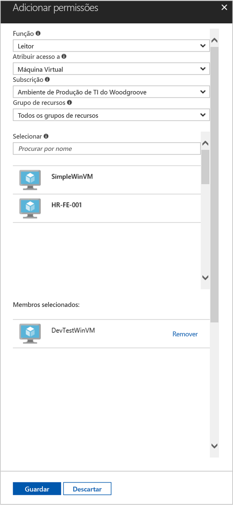

# <a name="use-a-windows-vm-managed-service-identity-msi-to-access-resource-manager"></a>Utilizar um Windows VM geridos serviço de identidade (MSI) para aceder ao Gestor de recursos

[!INCLUDE[preview-notice](../../../includes/active-directory-msi-preview-notice.md)]

Este tutorial mostra como ativar a identidade de serviço geridas (MSI) para uma máquina virtual (VM) do Windows. Em seguida, pode utilizar essa identidade para aceder à API do Gestor de recursos do Azure. Identidades de serviço geridas são automaticamente geridas pelo Azure e permitem-lhe autenticar para serviços que suportam a autenticação do Azure AD sem necessidade de introduzir as credenciais para o seu código. Saiba como:

> [!div class="checklist"]
> * Ativar MSI na VM do Windows 
> * Conceder o acesso VM a um grupo de recursos no Gestor de recursos do Azure 
> * Obter um token de acesso utilizando a identidade da VM e utilizá-la para chamar o Azure Resource Manager

## <a name="prerequisites"></a>Pré-requisitos

[!INCLUDE [msi-qs-configure-prereqs](../../../includes/active-directory-msi-qs-configure-prereqs.md)]

[!INCLUDE [msi-tut-prereqs](../../../includes/active-directory-msi-tut-prereqs.md)]

## <a name="sign-in-to-azure"></a>Iniciar sessão no Azure
Inicie sessão no Portal do Azure em [https://portal.azure.com](https://portal.azure.com).

## <a name="create-a-windows-virtual-machine-in-a-new-resource-group"></a>Criar uma máquina virtual do Windows num novo grupo de recursos

Para este tutorial, iremos criar uma nova VM do Windows.  Também pode ativar MSI numa VM existente.

1.  Clique no botão **Criar um recurso**, no canto superior esquerdo do portal do Azure.
2.  Selecione **Computação** e, em seguida, selecione **Windows Server 2016 Datacenter**. 
3.  Introduza as informações da máquina virtual. O **Username** e **palavra-passe** criada aqui é as credenciais que utiliza para início de sessão para a máquina virtual.
4.  Escolha o adequado **subscrição** para a máquina virtual na lista pendente.
5.  Para selecionar um novo **grupo de recursos** na qual pretende criar a máquina virtual, escolha **criar novo**. Quando terminar, clique em **OK**.
6.  Selecione o tamanho da VM. Para ver mais tamanhos, selecione **Visualizar todos** ou altere o filtro **Tipo de disco suportado**. Na página Definições, mantenha as predefinições e clique em **OK**.

    

## <a name="enable-msi-on-your-vm"></a>Ativar o MSI da VM 

Um MSI da VM permite-lhe obter os tokens de acesso do Azure AD sem a necessidade de colocar as credenciais para o seu código. Ativar a identidade de serviço gerida numa VM, duas coisas: regista a VM com o Azure Active Directory para criar a respetiva identidade gerida e configura a identidade da VM.

1.  Selecione o **Máquina Virtual** que pretende ativar o MSI em.  
2.  Na barra de navegação esquerdo em **configuração**. 
3.  Verá **identidade de serviço geridas**. Para registar e ativar o MSI, selecione **Sim**, se pretender desativá-la, escolha não. 
4.  Certifique-se de que clica **guardar** para guardar a configuração.  
    

## <a name="grant-your-vm-access-to-a-resource-group-in-resource-manager"></a>Conceder o acesso VM a um grupo de recursos no Gestor de recursos
Utilizar MSI código pode obter tokens de acesso para autenticar em recursos que suportam a autenticação do Azure AD.  O Azure Resource Manager suporta a autenticação do Azure AD.  Em primeiro lugar, é necessário conceder acesso de identidade desta VM a um recurso no Gestor de recursos, neste caso, o grupo de recursos no qual a VM está contida.  

1.  Navegue até ao separador para **grupos de recursos**. 
2.  Selecione o específicos **grupo de recursos** que criou para o seu **VM do Windows**. 
3.  Aceda a **(IAM) do controlo de acesso** no painel esquerdo. 
4.  Em seguida, **adicionar** uma nova atribuição de função para a sua **VM do Windows**.  Escolha **função** como **leitor**. 
5.  Na seguinte lista pendente, **atribuir acesso** o recurso **Máquina Virtual**. 
6.  Em seguida, certifique-se a subscrição correta está listada no **subscrição** pendente. E para **grupo de recursos**, selecione **todos os grupos de recursos**. 
7.  Por fim, em **selecione** escolha sua VM do Windows na lista pendente e clique em **guardar**.

    

## <a name="get-an-access-token-using-the-vm-identity-and-use-it-to-call-azure-resource-manager"></a>Obter um token de acesso utilizando a identidade da VM e utilizá-la para chamar o Azure Resource Manager 

Terá de utilizar **PowerShell** nesta parte.  Se não tiver instalado, transfira- [aqui](https://docs.microsoft.com/powershell/azure/overview?view=azurermps-4.3.1). 

1.  No portal, navegue para **máquinas virtuais** e vá para a máquina virtual do Windows e no **descrição geral**, clique em **Connect**. 
2.  Introduza o **Username** e **palavra-passe** para que adicionou ao criar a VM do Windows. 
3.  Agora que já criou um **ligação ao ambiente de trabalho remoto** com a máquina virtual, abra **PowerShell** na sessão remota. 
4.  Através Invoke-WebRequest do Powershell, efetue um pedido para o ponto final local de MSI para obter acesso token para o Azure Resource Manager.

    ```powershell
       $response = Invoke-WebRequest -Uri 'http://169.254.169.254/metadata/identity/oauth2/token?api-version=2018-02-01&resource=https%3A%2F%2Fmanagement.azure.com%2F' -Method GET -Headers @{Metadata="true"}
    ```
    
    > [!NOTE]
    > O valor do parâmetro "recursos" tem de ser uma correspondência exata para que é esperado pelo Azure AD. Ao utilizar o ID de recurso do Azure Resource Manager, tem de incluir a barra no final no URI.
    
    Em seguida, a extrair a resposta completa, que é armazenada como uma cadeia de JavaScript Object Notation (JSON) formatado no objeto $response. 
    
    ```powershell
    $content = $response.Content | ConvertFrom-Json
    ```
    Em seguida, extraia o token de acesso da resposta.
    
    ```powershell
    $ArmToken = $content.access_token
    ```
    
    Por fim, a chamada do Azure Resource Manager utilizando o token de acesso. Neste exemplo, estamos a utilizar também Invoke-WebRequest do PowerShell para efetuar a chamada para o Azure Resource Manager e incluir o token de acesso no cabeçalho de autorização.
    
    ```powershell
    (Invoke-WebRequest -Uri https://management.azure.com/subscriptions/<SUBSCRIPTION ID>/resourceGroups/<RESOURCE GROUP>?api-version=2016-06-01 -Method GET -ContentType "application/json" -Headers @{ Authorization ="Bearer $ArmToken"}).content
    ```
    > [!NOTE] 
    > O URL é maiúsculas e minúsculas, por isso, certifique-se se estiver a utilizar as maiúsculas exata que utilizou anteriormente quando denominado o grupo de recursos e, em maiúsculas "G" em "resourceGroups."
        
    O comando seguinte devolve os detalhes do grupo de recursos:

    ```powershell
    {"id":"/subscriptions/98f51385-2edc-4b79-bed9-7718de4cb861/resourceGroups/DevTest","name":"DevTest","location":"westus","properties":{"provisioningState":"Succeeded"}}
    ```

## <a name="next-steps"></a>Passos Seguintes

Neste tutorial, aprendeu a criar um utilizador atribuído a identidade e anexe-o a uma máquina de Virtual do Azure para aceder à API do Gestor de recursos do Azure.  Para obter mais informações sobre o Azure Resource Manager, consulte:

> [!div class="nextstepaction"]
>[Azure Resource Manager](/azure/azure-resource-manager/resource-group-overview)

