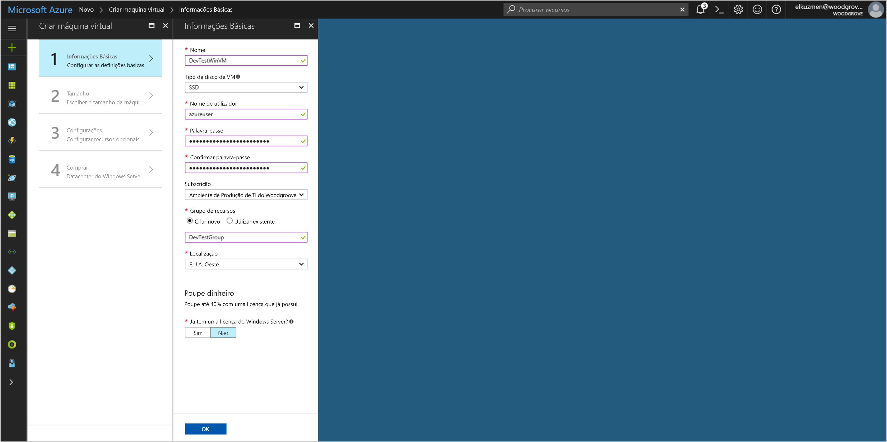

# <a name="use-a-windows-vm-managed-service-identity-msi-to-access-resource-manager"></a>Utilizar uma Identidade de Serviço Gerida (MSI) de VM do Windows para aceder ao Resource Manager

[!INCLUDE[preview-notice](../../../includes/active-directory-msi-preview-notice.md)]

Este tutorial mostra como ativar a Identidade de Serviço Gerida (MSI) para uma máquina virtual (VM) do Windows. Pode utilizar essa identidade para aceder à API do Azure Resource Manager. As Identidades de Serviço Geridas são geridas automaticamente pelo Azure e permitem-lhe a autenticação em serviços que suportam a autenticação do Azure AD, sem a necessidade de inserir as credenciais no seu código. Saiba como:

> [!div class="checklist"]
> * Ativar o MSI numa VM do Windows 
> * Conceder o acesso da VM a um Grupo de Recursos no Azure Resource Manager 
> * Obter um token de acesso com a identidade da VM e utilizá-lo para chamar o Azure Resource Manager

## <a name="prerequisites"></a>Pré-requisitos

[!INCLUDE [msi-qs-configure-prereqs](../../../includes/active-directory-msi-qs-configure-prereqs.md)]

[!INCLUDE [msi-tut-prereqs](../../../includes/active-directory-msi-tut-prereqs.md)]

## <a name="sign-in-to-azure"></a>Iniciar sessão no Azure
Inicie sessão no Portal do Azure em [https://portal.azure.com](https://portal.azure.com).

## <a name="create-a-windows-virtual-machine-in-a-new-resource-group"></a>Criar uma máquina virtual do Windows num novo grupo de recursos

Neste tutorial, vamos criar uma nova VM do Windows.  Também pode ativar o MSI numa VM existente.

1.  Clique no botão **Criar um recurso**, no canto superior esquerdo do portal do Azure.
2.  Selecione **Computação** e, em seguida, selecione **Windows Server 2016 Datacenter**. 
3.  Introduza as informações da máquina virtual. O **Nome de Utilizador** e a **Palavra-passe** aqui criados são as credenciais a utilizar para iniciar sessão na máquina virtual.
4.  Escolha uma **Subscrição** para a máquina virtual na lista pendente.
5.  Para selecionar um novo **Grupo de Recursos** no qual irá criar a sua máquina virtual, selecione **Criar Novo**. Quando terminar, clique em **OK**.
6.  Selecione o tamanho da VM. Para ver mais tamanhos, selecione **Visualizar todos** ou altere o filtro **Tipo de disco suportado**. Na página Definições, mantenha as predefinições e clique em **OK**.

    

## <a name="enable-msi-on-your-vm"></a>Ativar a MSI na sua VM 

Um MSI de VM permite-lhe obter os tokens de acesso do Azure AD sem ter de colocar as credenciais no código. Ativar a Identidade de Serviço Gerida numa VM faz duas coisas: regista a sua VM no Azure Active Directory para criar a respetiva identidade gerida e configura a identidade na VM.

1.  Selecione a **Máquina Virtual** na qual pretende ativar a MSI.  
2.  Na barra de navegação esquerda, clique em **Configuração**. 
3.  Vai ver a **Identidade de Serviço Gerida**. Para registar e ativar a MSI, selecione **Sim**; se desejar desativá-la, selecione Não. 
4.  Certifique-se de que clica em **Guardar** para guardar a configuração.  
    

## <a name="grant-your-vm-access-to-a-resource-group-in-resource-manager"></a>Conceder o acesso da VM a um grupo de recursos no Resource Manager
Com a MSI, o seu código pode obter tokens de acesso para autenticação em recursos que suportam a autenticação do Azure AD.  O Azure Resource Manager suporta a autenticação do Azure AD.  Primeiro, temos de conceder acesso de identidade a esta VM a um recurso no Resource Manager, neste caso, o Grupo de Recursos no qual a VM está contida.  

1.  Navegue até ao separador para **Grupos de Recursos**. 
2.  Selecione o **Grupo de Recursos** específico que criou para a sua **VM do Windows**. 
3.  Aceda a **Controlo de acesso (IAM)** no painel esquerdo. 
4.  Em seguida, clique em **Adicionar** para adicionar uma nova atribuição de função para a sua **VM do Windows**.  Selecione **Função** como **Leitor**. 
5.  Na lista pendente seguinte, defina **Atribuir acesso a** para o recurso **Máquina Virtual**. 
6.  Em seguida, certifique-se de que está listada a subscrição correta na lista pendente **Subscrição**. Para **Grupo de Recursos**, selecione **Todos os grupos de recursos**. 
7.  Por fim, em **Selecionar**, selecione a sua VM do Windows na lista pendente e clique em **Guardar**.

    

## <a name="get-an-access-token-using-the-vm-identity-and-use-it-to-call-azure-resource-manager"></a>Obter um token de acesso com a identidade da VM e utilizá-lo para chamar o Azure Resource Manager 

Terá de utilizar o **PowerShell** nesta parte.  Se não o tiver instalado, transfira-o [aqui](https://docs.microsoft.com/powershell/azure/overview?view=azurermps-4.3.1). 

1.  No portal, navegue para **Máquinas Virtuais**, aceda à sua máquina virtual do Windows e, em **Descrição Geral**, clique em **Ligar**. 
2.  Introduza o seu **Nome de Utilizador** e a **Palavra-passe** que adicionou quando criou a VM do Windows. 
3.  Agora que já criou uma **Ligação ao Ambiente de Trabalho Remoto** com a máquina virtual, abra o **PowerShell** na sessão remota. 
4.  Através de Invoke-WebRequest do PowerShell, faça um pedido ao ponto final da MSI local para obter um token de acesso para o Azure Resource Manager.

    ```powershell
       $response = Invoke-WebRequest -Uri 'http://169.254.169.254/metadata/identity/oauth2/token?api-version=2018-02-01&resource=https%3A%2F%2Fmanagement.azure.com%2F' -Method GET -Headers @{Metadata="true"}
    ```
    
    > [!NOTE]
    > No pedido anterior, o valor do parâmetro "recurso" tem de ser uma correspondência exata para o que é esperado pelo Azure AD. Ao utilizar o ID de recurso do Azure Resource Manager, tem de incluir a barra à direita no URI.
    
    Em seguida, extraia a resposta completa, que é armazenada como uma cadeia formatada do JavaScript Object Notation (JSON) no objeto $response. 
    
    ```powershell
    $content = $response.Content | ConvertFrom-Json
    ```
    Em seguida, extraia o token de acesso da resposta.
    
    ```powershell
    $ArmToken = $content.access_token
    ```
    
    Por fim, chame o Azure Resource Manager com o token de acesso. Neste exemplo, estamos também a utilizar Invoke-WebRequest do PowerShell para fazer a chamada ao Azure Resource Manager e incluir o token de acesso no cabeçalho de Autorização.
    
    ```powershell
    (Invoke-WebRequest -Uri https://management.azure.com/subscriptions/<SUBSCRIPTION ID>/resourceGroups/<RESOURCE GROUP>?api-version=2016-06-01 -Method GET -ContentType "application/json" -Headers @{ Authorization ="Bearer $ArmToken"}).content
    ```
    > [!NOTE] 
    > O URL é sensível às maiúsculas de minúsculas, por isso, certifique-se de que utiliza as mesmas maiúsculas e minúsculas que utilizou anteriormente, quando atribuiu o nome ao Grupo de Recursos e a maiúscula "G" em "resourceGroups".
        
    O comando seguinte devolve os detalhes do Grupo de Recursos:

    ```powershell
    {"id":"/subscriptions/98f51385-2edc-4b79-bed9-7718de4cb861/resourceGroups/DevTest","name":"DevTest","location":"westus","properties":{"provisioningState":"Succeeded"}}
    ```

## <a name="next-steps"></a>Passos seguintes

Neste tutorial, aprendeu a criar uma identidade atribuída pelo utilizador e a anexá-la a uma Máquina Virtual do Azure para aceder à API do Azure Resource Manager.  Para saber mais sobre o Azure Resource Manager, veja:

> [!div class="nextstepaction"]
>[Azure Resource Manager](/azure/azure-resource-manager/resource-group-overview)

