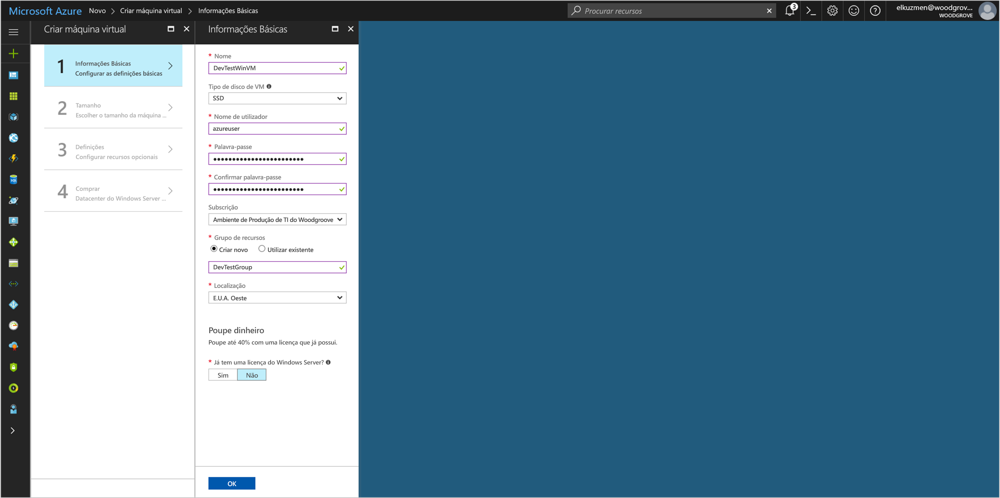
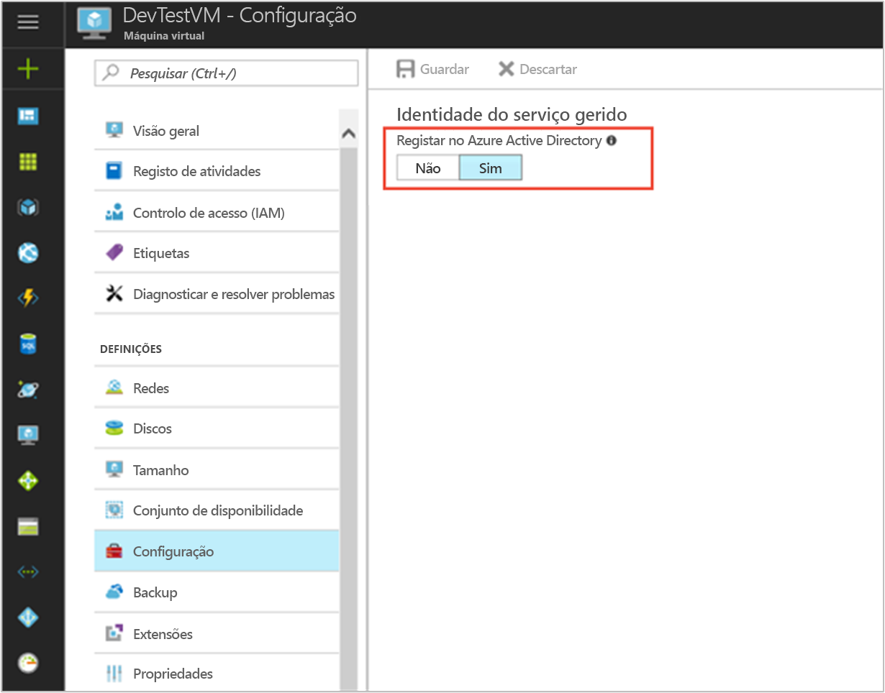

# <a name="tutorial-use-a-windows-vm-msi-to-access-azure-cosmos-db"></a>Tutorial: Utilize um MSI de VM do Windows para aceder à base de dados do Azure Cosmos

[!INCLUDE[preview-notice](../../../includes/active-directory-msi-preview-notice.md)]

Este tutorial mostra como criar e utilizar um MSI de VM do Windows para aceder à base de dados do Cosmos. Saiba como:

> [!div class="checklist"]
> * Criar um MSI ativada VM do Windows 
> * Criar uma conta do Cosmos DB
> * Acesso de conceder Windows VM MSI para as chaves de acesso da conta de base de dados do Cosmos
> * Obter um token de acesso utilizando o MSI da VM do Windows para chamar o Azure Resource Manager
> * Obter chaves de acesso do Azure Resource Manager para efetuar chamadas de base de dados do Cosmos

## <a name="prerequisites"></a>Pré-requisitos

[!INCLUDE [msi-qs-configure-prereqs](../../../includes/active-directory-msi-qs-configure-prereqs.md)]

[!INCLUDE [msi-tut-prereqs](../../../includes/active-directory-msi-tut-prereqs.md)]


## <a name="sign-in-to-azure"></a>Iniciar sessão no Azure

Inicie sessão no Portal do Azure em [https://portal.azure.com](https://portal.azure.com).

## <a name="create-a-windows-virtual-machine-in-a-new-resource-group"></a>Criar uma máquina virtual do Windows num novo grupo de recursos

Para este tutorial, iremos criar uma nova VM do Windows.  Também pode ativar MSI numa VM existente.

1. Clique no botão **Criar um recurso**, no canto superior esquerdo do portal do Azure.
2. Selecione **Computação** e, em seguida, selecione **Windows Server 2016 Datacenter**. 
3. Introduza as informações da máquina virtual. O **Username** e **palavra-passe** criada aqui é as credenciais que utiliza para início de sessão para a máquina virtual.
4. Escolha o adequado **subscrição** para a máquina virtual na lista pendente.
5. Para selecionar um novo **grupo de recursos** na qual pretende criar a máquina virtual, escolha **criar novo**. Quando terminar, clique em **OK**.
6. Selecione o tamanho da VM. Para ver mais tamanhos, selecione **Visualizar todos** ou altere o filtro **Tipo de disco suportado**. Na página Definições, mantenha as predefinições e clique em **OK**.

   

## <a name="enable-msi-on-your-vm"></a>Ativar o MSI da VM 

Um MSI de Máquina Virtual permite-lhe obter os tokens de acesso do Azure AD sem necessidade de colocar as credenciais para o seu código. Nos bastidores, permitir MSI numa máquina Virtual através do portal do Azure duas coisas:-regista a VM com o Azure AD para criar uma identidade gerida e configura a identidade da VM.

1. Selecione o **Máquina Virtual** que pretende ativar o MSI em.  
2. Na barra de navegação esquerdo em **configuração**. 
3. Verá **identidade de serviço geridas**. Para registar e ativar o MSI, selecione **Sim**, se pretender desativá-la, escolha não. 
4. Certifique-se de que clica **guardar** para guardar a configuração.  
   

## <a name="create-a-cosmos-db-account"></a>Criar uma conta do Cosmos DB 

Se ainda não tiver um, crie uma conta de base de dados do Cosmos. Pode ignorar este passo e utilizar uma conta de base de dados do Cosmos existente. 

1. Clique em de **+ /Safari/Chrome criar novo serviço** botão encontrado no canto superior esquerdo do portal do Azure.
2. Clique em **bases de dados**, em seguida, **Azure Cosmos DB**e uma nova "nova conta" painel mostra.
3. Introduza um **ID** para a conta de base de dados do Cosmos, o que utilizar mais tarde.  
4. **API** deve ser definido como "SQL". A abordagem descrita neste tutorial pode ser utilizada com outros tipos de API disponíveis, mas os passos neste tutorial são para a API do SQL Server.
5. Certifique-se a **subscrição** e **grupo de recursos** corresponder aqueles que especificou quando criou a VM no passo anterior.  Selecione um **localização** onde a base de dados do Cosmos está disponível.
6. Clique em **Criar**.

## <a name="create-a-collection-in-the-cosmos-db-account"></a>Criar uma coleção na conta de base de dados do Cosmos

Em seguida, adicione uma coleção de dados na conta de base de dados do Cosmos que pode consultar em passos posteriores.

1. Navegue até à sua conta de base de dados do Cosmos recentemente criada.
2. No **descrição geral** separador clique o **+ /Safari/Chrome adicionar coleção** botão e um "Adicionar coleção" painel slides enviados.
3. Conceder a coleção selecione de ID, ID de coleção, uma base de dados uma capacidade de armazenamento, introduza uma chave de partição, introduza um valor de débito, em seguida, clique em **OK**.  Para este tutorial, é suficiente para utilizar o "Teste" como o ID de base de dados e o ID de coleção, selecione uma capacidade de armazenamento fixo e o débito mais baixo (400 RU/s).  

## <a name="grant-windows-vm-msi-access-to-the-cosmos-db-account-access-keys"></a>Acesso de conceder Windows VM MSI para as chaves de acesso da conta de base de dados do Cosmos

Cosmos DB não suportam de forma nativa a autenticação do Azure AD. No entanto, pode utilizar um MSI para obter uma chave de acesso do Cosmos BD do Gestor de recursos e utilizar a chave para aceder à base de dados do Cosmos. Neste passo, pode conceder o acesso do MSI para as chaves para a conta de base de dados do Cosmos.

Para conceder o acesso de identidade do MSI para a conta de base de dados do Cosmos no Azure Resource Manager com o PowerShell, atualize os valores para `<SUBSCRIPTION ID>`, `<RESOURCE GROUP>`, e `<COSMOS DB ACCOUNT NAME>` para o seu ambiente. Substitua `<MSI PRINCIPALID>` com o `principalId` propriedade devolvida pelo `az resource show` no [obter principalID do MSI da VM com Linux](#retrieve-the-principalID-of-the-linux-VM's-MSI).  BD do cosmos suporta dois níveis de granularidade quando utilizar chaves de acesso: leitura/escrita acesso à conta e o acesso só de leitura à conta.  Atribuir o `DocumentDB Account Contributor` função se pretender obter chaves de leitura/escrita para a conta ou atribuir o `Cosmos DB Account Reader Role` função se pretender obter chaves de só de leitura para a conta:

```azurepowershell
$spID = (Get-AzureRMVM -ResourceGroupName myRG -Name myVM).identity.principalid
New-AzureRmRoleAssignment -ObjectId $spID -RoleDefinitionName "Reader" -Scope "/subscriptions/<mySubscriptionID>/resourceGroups/<myResourceGroup>/providers/Microsoft.Storage/storageAccounts/<myStorageAcct>"
```

## <a name="get-an-access-token-using-the-windows-vms-msi-to-call-azure-resource-manager"></a>Obter um token de acesso utilizando o MSI da VM do Windows para chamar o Azure Resource Manager

Para o resto do tutorial, iremos trabalhar da VM que criou anteriormente. 

Terá de utilizar os cmdlets do PowerShell do Azure Resource Manager nesta parte.  Se não o tiver instalado, [transferir a versão mais recente](https://docs.microsoft.com/powershell/azure/overview) antes de continuar.

Também terá de instalar a versão mais recente do [Azure CLI 2.0](https://docs.microsoft.com/cli/azure/install-azure-cli) na sua VM do Windows.

1. No portal do Azure, navegue para **máquinas virtuais**, aceda a sua máquina virtual do Windows, em seguida, a partir de **descrição geral** página clique **Connect** na parte superior. 
2. Introduza o **Username** e **palavra-passe** para que adicionou ao criar a VM do Windows. 
3. Agora que já criou um **ligação ao ambiente de trabalho remoto** com a máquina virtual, abra o PowerShell na sessão remota.
4. Através Invoke-WebRequest do Powershell, efetue um pedido para o ponto final local de MSI para obter acesso token para o Azure Resource Manager.

    ```powershell
        $response = Invoke-WebRequest -Uri 'http://169.254.169.254/metadata/identity/oauth2/token?api-version=2018-02-01&resource=https%3A%2F%2Fmanagement.azure.com%2F' -Method GET -Headers @{Metadata="true"}
    ```

    > [!NOTE]
    > O valor do parâmetro "recursos" tem de ser uma correspondência exata para que é esperado pelo Azure AD. Ao utilizar o ID de recurso do Azure Resource Manager, tem de incluir a barra no final no URI.
    
    Em seguida, a extrair o elemento "Conteúdo", que é armazenado como uma cadeia de JavaScript Object Notation (JSON) formatado no objeto $response. 
    
    ```powershell
    $content = $response.Content | ConvertFrom-Json
    ```
    Em seguida, extraia o token de acesso da resposta.
    
    ```powershell
    $ArmToken = $content.access_token
    ```

## <a name="get-access-keys-from-azure-resource-manager-to-make-cosmos-db-calls"></a>Obter chaves de acesso do Azure Resource Manager para efetuar chamadas de base de dados do Cosmos

Agora utilize o PowerShell para chamar o Resource Manager utilizando o token de acesso que obteve na secção anterior para obter a chave de acesso da conta de base de dados do Cosmos. Assim que tivermos a chave de acesso, iremos pode consultar a base de dados do Cosmos. Não se esqueça de substituir o `<SUBSCRIPTION ID>`, `<RESOURCE GROUP>`, e `<COSMOS DB ACCOUNT NAME>` valores de parâmetros com os seus próprios valores. Substitua o `<ACCESS TOKEN>` valor com o token de acesso que obteve anteriormente.  Se pretender obter chaves de leitura/escrita, utilize o tipo de chave operação `listKeys`.  Se pretender obter chaves de só de leitura, utilize o tipo de operação de chave `readonlykeys`:

```powershell
Invoke-WebRequest -Uri https://management.azure.com/subscriptions/<SUBSCRIPTION-ID>/resourceGroups/<RESOURCE-GROUP>/providers/Microsoft.DocumentDb/databaseAccounts/<COSMOS DB ACCOUNT NAME>/listKeys/?api-version=2016-12-01 -Method POST -Headers @{Authorization="Bearer $ARMToken"}
```
A resposta dão-lhe a lista de chaves.  Por exemplo, se obter chaves de só de leitura:

```powershell
{"primaryReadonlyMasterKey":"bWpDxS...dzQ==",
"secondaryReadonlyMasterKey":"38v5ns...7bA=="}
```
Agora que tem a chave de acesso para a conta de base de dados do Cosmos pode transmiti-lo para um SDK de BD do Cosmos e efetuar chamadas para a conta de acesso.  Para obter um exemplo rápido, pode passar a chave de acesso para a CLI do Azure.  Pode obter o <COSMOS DB CONNECTION URL> do **descrição geral** separador no painel de conta de base de dados do Cosmos no portal do Azure.  Substitua o <ACCESS KEY> com o valor obtido acima:

```bash
az cosmosdb collection show -c <COLLECTION ID> -d <DATABASE ID> --url-connection "<COSMOS DB CONNECTION URL>" --key <ACCESS KEY>
```

Este comando da CLI devolve detalhes sobre a coleção:

```bash
{
  "collection": {
    "_conflicts": "conflicts/",
    "_docs": "docs/",
    "_etag": "\"00006700-0000-0000-0000-5a8271e90000\"",
    "_rid": "Es5SAM2FDwA=",
    "_self": "dbs/Es5SAA==/colls/Es5SAM2FDwA=/",
    "_sprocs": "sprocs/",
    "_triggers": "triggers/",
    "_ts": 1518498281,
    "_udfs": "udfs/",
    "id": "Test",
    "indexingPolicy": {
      "automatic": true,
      "excludedPaths": [],
      "includedPaths": [
        {
          "indexes": [
            {
              "dataType": "Number",
              "kind": "Range",
              "precision": -1
            },
            {
              "dataType": "String",
              "kind": "Range",
              "precision": -1
            },
            {
              "dataType": "Point",
              "kind": "Spatial"
            }
          ],
          "path": "/*"
        }
      ],
      "indexingMode": "consistent"
    }
  },
  "offer": {
    "_etag": "\"00006800-0000-0000-0000-5a8271ea0000\"",
    "_rid": "f4V+",
    "_self": "offers/f4V+/",
    "_ts": 1518498282,
    "content": {
      "offerIsRUPerMinuteThroughputEnabled": false,
      "offerThroughput": 400
    },
    "id": "f4V+",
    "offerResourceId": "Es5SAM2FDwA=",
    "offerType": "Invalid",
    "offerVersion": "V2",
    "resource": "dbs/Es5SAA==/colls/Es5SAM2FDwA=/"
  }
}
```

## <a name="next-steps"></a>Passos Seguintes

Neste tutorial, aprendeu a criar uma identidade de serviço do Windows geridos para aceder à base de dados do Cosmos.  Para saber mais sobre Cosmos DB, consulte:

> [!div class="nextstepaction"]
>[Descrição geral do Cosmos BD do Azure](/azure/cosmos-db/introduction)


