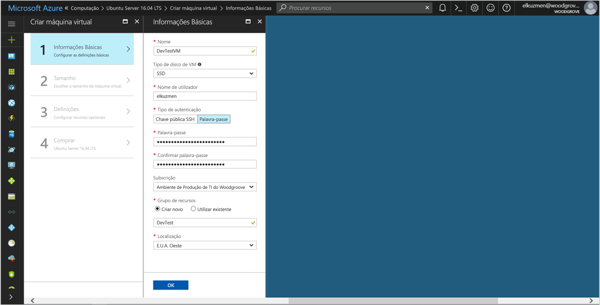

# <a name="use-managed-service-identity-for-a-linux-vm-to-access-azure-data-lake-store"></a>Utilizar identidade de serviço gerida para uma VM com Linux para aceder ao Azure Data Lake Store

[!INCLUDE[preview-notice](../../includes/active-directory-msi-preview-notice.md)]

Este tutorial mostra como utilizar identidade de serviço gerida para uma máquina virtual (VM) do Linux para aceder ao Azure Data Lake Store. Azure gere automaticamente identidades por si através de MSI. Pode utilizar o MSI para se autenticarem em serviços que suportam a autenticação do Azure Active Directory (Azure AD), sem necessidade de introduzir as credenciais para o seu código. 

Neste tutorial, ficará a saber como:

> [!div class="checklist"]
> * Ative MSI numa VM com Linux. 
> * Conceda o acesso VM para o Azure Data Lake Store.
> * Obter um acesso token utilizando a identidade da VM e utilizá-lo para aceder ao Azure Data Lake Store.

## <a name="prerequisites"></a>Pré-requisitos

[!INCLUDE [msi-qs-configure-prereqs](../../includes/active-directory-msi-qs-configure-prereqs.md)]

[!INCLUDE [msi-tut-prereqs](../../includes/active-directory-msi-tut-prereqs.md)]

## <a name="sign-in-to-azure"></a>Iniciar sessão no Azure

Inicie sessão no [portal do Azure](https://portal.azure.com).

## <a name="create-a-linux-virtual-machine-in-a-new-resource-group"></a>Criar uma máquina virtual Linux num novo grupo de recursos

Para este tutorial, iremos criar uma nova VM do Linux. Também pode ativar MSI numa VM existente.

1. Selecione o **novo** botão no canto superior esquerdo do portal do Azure.
2. Selecione **Computação** e, em seguida, selecione **Ubuntu Server 16.04 LTS**.
3. Introduza as informações da máquina virtual. Para **tipo de autenticação**, selecione **chave pública SSH** ou **palavra-passe**. As credenciais criadas permitem-lhe iniciar sessão VM.

   

4. No **subscrição** lista, selecione uma subscrição para a máquina virtual.
5. Para selecionar um novo grupo de recursos que pretende que a máquina virtual a serem criadas, selecione **grupo de recursos** > **criar nova**. Quando terminar, selecione **OK**.
6. Selecione o tamanho da VM. Para ver mais tamanhos, selecione **Visualizar todos** ou altere o filtro **Tipo de disco suportado**. No painel de definições, manter as predefinições e selecione **OK**.

## <a name="enable-msi-on-your-vm"></a>Ativar o MSI da VM

Pode utilizar o MSI para uma máquina virtual para obter os tokens de acesso do Azure AD sem necessidade de colocar as credenciais no seu código. Ativar MSI instala a extensão de VM de MSI da VM e permite MSI no Gestor de recursos do Azure.  

1. Para **Máquina Virtual**, selecione a máquina virtual que pretende ativar o MSI em.
2. No painel esquerdo, selecione **configuração**.
3. Verá **identidade do serviço gerido**. Para registar e ativar MSI, selecione **Sim**. Se pretender desativá-lo, selecione **não**.
   
4. Selecione **Guardar**.
5. Se quiser verificar quais as extensões são nesta VM do Linux, selecione **extensões**. Se estiver ativado MSI, **ManagedIdentityExtensionforLinux** aparece na lista.

   

## <a name="grant-your-vm-access-to-azure-data-lake-store"></a>Conceder o acesso VM para o Azure Data Lake Store

Agora pode conceder o acesso VM para ficheiros e pastas no Azure Data Lake Store. Para este passo, pode utilizar uma instância existente do Data Lake Store ou crie um novo. Para criar uma instância do Data Lake Store utilizando o portal do Azure, siga o [início rápido do Azure Data Lake Store](https://docs.microsoft.com/azure/data-lake-store/data-lake-store-get-started-portal). Também existem inícios rápidos que utilizam a CLI do Azure e o Azure PowerShell no [documentação do Azure Data Lake Store](https://docs.microsoft.com/azure/data-lake-store/data-lake-store-overview).

No Data Lake Store, criar uma nova pasta e conceder a permissão do MSI para ler, escrever e executar ficheiros nessa pasta:

1. No portal do Azure, selecione **Data Lake Store** no painel esquerdo.
2. Selecione a instância do Data Lake Store que pretende utilizar.
3. Selecione **Explorador de dados** na barra de comandos.
4. A pasta raiz da instância do Data Lake Store está selecionada. Selecione **acesso** na barra de comandos.
5. Selecione **Adicionar**.  No **selecione** caixa, introduza o nome da sua VM – por exemplo, **DevTestVM**. Selecione a VM de resultados da pesquisa e, em seguida, clique em **selecione**.
6. Clique em **selecionar permissões**.  Selecione **leitura** e **executar**, adicionar a **esta pasta**e adicione como **apenas uma permissão de acesso**. Selecione **Ok**.  A permissão deve ser adicionada com êxito.
7. Fechar o **acesso** painel.
8. Para este tutorial, crie uma nova pasta. Selecione **nova pasta** na barra de comandos e forneça a nova pasta um nome - por exemplo **TestFolder**.  Selecione **Ok**.
9. Selecione a pasta que criou e, em seguida, selecione **acesso** na barra de comandos.
10. Semelhante para o passo 5, selecione **adicionar**. No **selecione** caixa, introduza o nome da sua VM. Selecione a VM de resultados da pesquisa e, em seguida, clique em **selecione**.
11. Semelhante para o passo 6, selecione **selecionar permissões**. Selecione **leitura**, **escrever**, e **executar**, adicionar a **esta pasta**e adicione como **uma entrada de permissão de acesso e uma predefinição entrada de permissão**. Selecione **Ok**.  A permissão deve ser adicionada com êxito.

MSI agora pode efetuar todas as operações em ficheiros na pasta que criou. Para obter mais informações sobre gerir o acesso ao Data Lake Store, consulte [controlo de acesso no Data Lake Store](https://docs.microsoft.com/azure/data-lake-store/data-lake-store-access-control).

## <a name="get-an-access-token-and-call-the-data-lake-store-file-system"></a>Obter um token de acesso e chame o sistema de ficheiros do Data Lake Store

O Azure Data Lake Store nativamente autenticação de suporte do Azure AD, para que possa aceitar tokens de acesso diretamente obtido através de MSI. Para autenticar para o sistema de ficheiros do Data Lake Store, envie um token de acesso emitido pelo Azure AD para o ponto de final do sistema de ficheiros do Data Lake Store. O token de acesso é num cabeçalho de autorização no formato "portador \<ACCESS_TOKEN_VALUE\>".  Para saber mais sobre o suporte de Data Lake Store para autenticação do Azure AD, consulte [autenticação com o Data Lake Store utilizando o Azure Active Directory](https://docs.microsoft.com/azure/data-lake-store/data-lakes-store-authentication-using-azure-active-directory).

Neste tutorial, pode autenticar-se a API REST para o sistema de ficheiros do Data Lake Store utilizando cURL para fazer pedidos REST.

> [!NOTE]
> O SDKs do cliente para o sistema de ficheiros do Data Lake Store ainda não suportam uma identidade de serviço geridas.

Para concluir estes passos, precisa de um cliente SSH. Se estiver a utilizar o Windows, pode utilizar o cliente SSH o [subsistema Windows para Linux](https://msdn.microsoft.com/commandline/wsl/about). Se precisar de assistência para configurar as chaves do seu cliente SSH, consulte [das chaves de como utilizar o SSH com o Windows no Azure](../virtual-machines/linux/ssh-from-windows.md) ou [como criar e utilizar um par de chaves público e privado SSH para VMs com Linux no Azure](../virtual-machines/linux/mac-create-ssh-keys.md).

1. No portal, navegue para a VM com Linux. No **descrição geral**, selecione **Connect**.  
2. Liga à VM através do cliente SSH à sua escolha. 
3. Na janela de terminal, utilizando cURL, efetue um pedido para o ponto final local de MSI para obter um token de acesso para o sistema de ficheiros do Data Lake Store. O identificador de recurso para o Data Lake Store é "https://datalake.azure.net/".  É importante incluir a barra no final no identificador de recurso.
    
   ```bash
   curl http://localhost:50342/oauth2/token --data "resource=https://datalake.azure.net/" -H Metadata:true   
   ```
    
   Devolve uma resposta com êxito o token de acesso que utiliza para autenticar para o Data Lake Store:

   ```bash
   {"access_token":"eyJ0eXAiOiJ...",
    "refresh_token":"",
    "expires_in":"3599",
    "expires_on":"1508119757",
    "not_before":"1508115857",
    "resource":"https://datalake.azure.net/",
    "token_type":"Bearer"}
   ```

4. Ao utilizar cURL, efetue um pedido para o ponto final REST do seu sistema de ficheiros de Data Lake Store para listar as pastas na pasta raiz. Esta é uma forma simple de verificar que tudo está configurado corretamente. Copie o valor do token de acesso do passo anterior. É importante que a cadeia "Portador" no cabeçalho de autorização tem um capital "b". Pode encontrar o nome da sua instância do Data Lake Store no **descrição geral** secção o **Data Lake Store** painel no portal do Azure.

   ```bash
   curl https://<YOUR_ADLS_NAME>.azuredatalakestore.net/webhdfs/v1/?op=LISTSTATUS -H "Authorization: Bearer <ACCESS_TOKEN>"
   ```
    
   Uma resposta com êxito tem o seguinte aspeto:

   ```bash
   {"FileStatuses":{"FileStatus":[{"length":0,"pathSuffix":"TestFolder","type":"DIRECTORY","blockSize":0,"accessTime":1507934941392,"modificationTime":1508105430590,"replication":0,"permission":"770","owner":"bd0e76d8-ad45-4fe1-8941-04a7bf27f071","group":"bd0e76d8-ad45-4fe1-8941-04a7bf27f071"}]}}
   ```

5. Agora pode tentar carregar um ficheiro à sua instância do Data Lake Store. Em primeiro lugar, crie um ficheiro para carregar.

   ```bash
   echo "Test file." > Test1.txt
   ```

6. Ao utilizar cURL, efetue um pedido para ponto final REST do sistema de ficheiros de Data Lake Store para carregar o ficheiro para a pasta que criou anteriormente. O carregamento envolve o redirecionamento e cURL segue o redirecionamento automaticamente. 

   ```bash
   curl -i -X PUT -L -T Test1.txt -H "Authorization: Bearer <ACCESS_TOKEN>" 'https://<YOUR_ADLS_NAME>.azuredatalakestore.net/webhdfs/v1/<FOLDER_NAME>/Test1.txt?op=CREATE' 
   ```

    Uma resposta com êxito tem o seguinte aspeto:

   ```bash
   HTTP/1.1 100 Continue
   HTTP/1.1 307 Temporary Redirect
   Cache-Control: no-cache, no-cache, no-store, max-age=0
   Pragma: no-cache
   Expires: -1
   Location: https://mytestadls.azuredatalakestore.net/webhdfs/v1/TestFolder/Test1.txt?op=CREATE&write=true
   x-ms-request-id: 756f6b24-0cca-47ef-aa12-52c3b45b954c
   ContentLength: 0
   x-ms-webhdfs-version: 17.04.22.00
   Status: 0x0
   X-Content-Type-Options: nosniff
   Strict-Transport-Security: max-age=15724800; includeSubDomains
   Date: Sun, 15 Oct 2017 22:10:30 GMT
   Content-Length: 0
       
   HTTP/1.1 100 Continue
       
   HTTP/1.1 201 Created
   Cache-Control: no-cache, no-cache, no-store, max-age=0
   Pragma: no-cache
   Expires: -1
   Location: https://mytestadls.azuredatalakestore.net/webhdfs/v1/TestFolder/Test1.txt?op=CREATE&write=true
   x-ms-request-id: af5baa07-3c79-43af-a01a-71d63d53e6c4
   ContentLength: 0
   x-ms-webhdfs-version: 17.04.22.00
   Status: 0x0
   X-Content-Type-Options: nosniff
   Strict-Transport-Security: max-age=15724800; includeSubDomains
   Date: Sun, 15 Oct 2017 22:10:30 GMT
   Content-Length: 0
   ```

Ao utilizar outras APIs para o sistema de ficheiros do Data Lake Store, pode acrescentar a ficheiros, transferir ficheiros e muito mais.

Parabéns! Tiver de autenticar para o sistema de ficheiros do Data Lake Store utilizando MSI para uma VM com Linux.

## <a name="related-content"></a>Conteúdo relacionado

- Para obter uma descrição geral do MSI, consulte [descrição geral de identidade de serviço geridas](../active-directory/msi-overview.md).
- Para operações de gestão, o Data Lake Store utiliza o Azure Resource Manager.  Para obter mais informações sobre a utilização do MSI para autenticar para o Gestor de recursos, consulte [utilizar um Linux VM geridos serviço de identidade (MSI) para aceder ao Gestor de recursos](https://docs.microsoft.com/azure/active-directory/msi-tutorial-linux-vm-access-arm).
- Saiba mais sobre [autenticação com o Data Lake Store utilizando o Azure Active Directory](https://docs.microsoft.com/azure/data-lake-store/data-lakes-store-authentication-using-azure-active-directory).
- Saiba mais sobre [ficheiros operações do sistema no Azure Data Lake Store utilizando a API REST](https://docs.microsoft.com/azure/data-lake-store/data-lake-store-data-operations-rest-api) ou [APIs do sistema de ficheiros de WebHDFS](https://docs.microsoft.com/rest/api/datalakestore/webhdfs-filesystem-apis).
- Saiba mais sobre [controlo de acesso no Data Lake Store](https://docs.microsoft.com/azure/data-lake-store/data-lake-store-access-control).

Utilize a seguinte secção de comentários para fornecer comentários e ajudam-nos refinar e formam o nosso conteúdo.