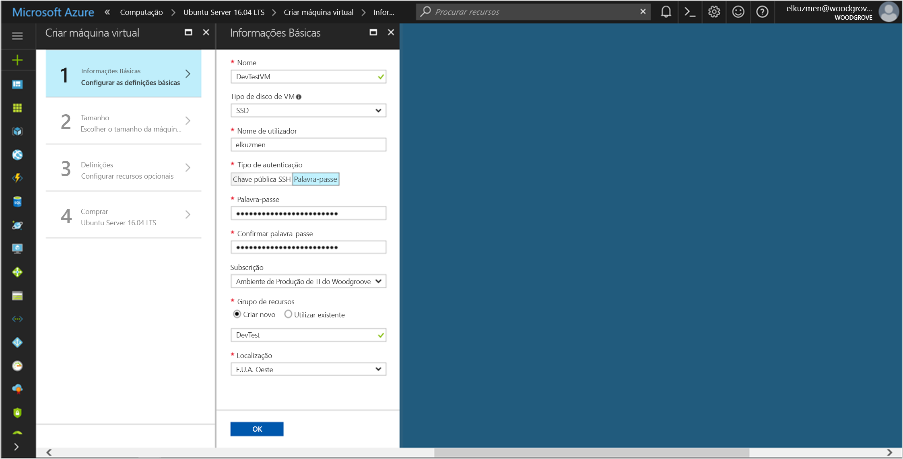
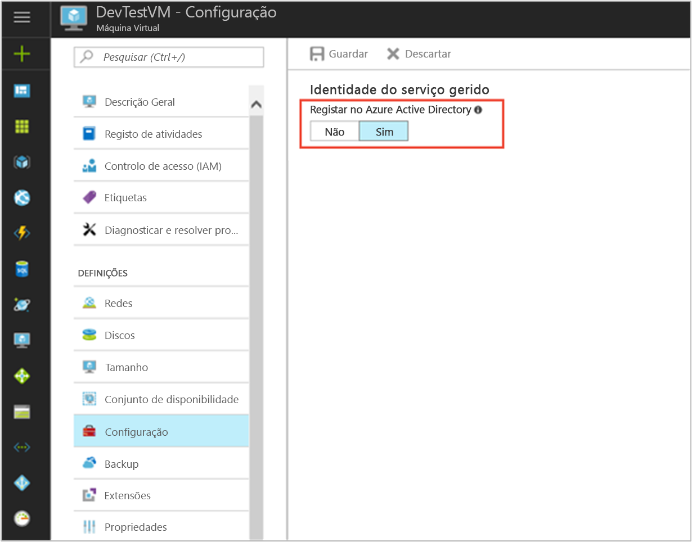

# <a name="use-a-linux-vm-managed-service-identity-msi-to-access-azure-key-vault"></a>Utilize um Linux VM Managed Service Identity (MSI) para aceder ao Azure Key Vault 

[!INCLUDE[preview-notice](~/includes/active-directory-msi-preview-notice-ua.md)]

Este tutorial mostra como ativar a identidade de serviço gerida (MSI) para uma Máquina Virtual do Linux, em seguida, utilizar essa identidade para aceder ao Azure Key Vault. Atuando como fazer a inicialização, Key Vault torna possível para a sua aplicação de cliente, em seguida, utilizar o segredo para aceder aos recursos não protegidos pelo Azure Active Directory (AD). Identidades de serviço geridas são geridas automaticamente pelo Azure e ativar a autenticação no serviços que suportam a autenticação do Azure AD, sem a necessidade de inserir as credenciais no seu código. 

Saiba como:

> [!div class="checklist"]
> * Ativar o MSI numa máquina Virtual do Linux 
> * Conceder o acesso VM para um segredo armazenado num cofre de chave 
> * Obter um token de acesso com a identidade da VM e utilizá-lo a obter o segredo do Key Vault 
 
## <a name="prerequisites"></a>Pré-requisitos

[!INCLUDE [msi-core-prereqs](~/includes/active-directory-msi-core-prereqs-ua.md)]

[!INCLUDE [msi-tut-prereqs](~/includes/active-directory-msi-tut-prereqs.md)]

## <a name="sign-in-to-azure"></a>Iniciar sessão no Azure
Inicie sessão no Portal do Azure em [https://portal.azure.com](https://portal.azure.com). 

## <a name="create-a-linux-virtual-machine-in-a-new-resource-group"></a>Criar uma Máquina Virtual Linux num novo grupo de recursos

Para este tutorial, vamos criar uma nova VM do Linux. Também pode ativar o MSI numa VM existente.

1. Clique em **criar um recurso** no canto superior esquerdo do portal do Azure.
2. Selecione **Computação** e, em seguida, selecione **Ubuntu Server 16.04 LTS**.
3. Introduza as informações da máquina virtual. Para **tipo de autenticação**, selecione **chave pública SSH** ou **palavra-passe**. As credenciais criadas permitem-lhe iniciar sessão VM.

    

4. Escolher uma **subscrição** para a máquina virtual na lista pendente.
5. Para selecionar um novo **grupo de recursos** pretende que a máquina virtual para ser criado no, escolha **criar nova**. Quando terminar, clique em **OK**.
6. Selecione o tamanho da VM. Para ver mais tamanhos, selecione **ver todos os** ou alterar o filtro de tipo de disco suportados. Na página Definições, mantenha as predefinições e clique em **OK**.

## <a name="enable-msi-on-your-vm"></a>Ativar o MSI na sua VM

Um MSI de Máquina Virtual permite-lhe obter os tokens de acesso do Azure AD sem a necessidade de colocar as credenciais em seu código. Nos bastidores, ativar o MSI faz duas coisas: instala a extensão de VM de MSI na sua VM e permite a MSI para a VM.  

1. Selecione o **Máquina Virtual** que pretende ativar o MSI em.
2. Na barra de navegação esquerdo, clique em **configuração**.
3. Verá **identidade do serviço gerido**. Para registar e ativar o MSI, selecione **Sim**, se desejar para desabilitá-lo, selecione não.
4. Certifique-se de que clica **guardar** para guardar a configuração.

    

5. Se desejar verificar que extensões estão nisso **VM do Linux**, clique em **extensões**. Se o MSI é ativado, o **ManagedIdentityExtensionforLinux** aparece na lista.

    


## <a name="grant-your-vm-access-to-a-secret-stored-in-a-key-vault"></a>Conceder o acesso à sua VM a um segredo armazenado num cofre de chave  

Com o MSI seu código pode obter tokens de acesso para autenticar em recursos que suportam a autenticação do Azure Active Directory. No entanto, nem todos os serviços do Azure suportam a autenticação do Azure AD. Para utilizar MSI com esses serviços, armazenar as credenciais de serviço no Azure Key Vault e utilizar o MSI para aceder ao Key Vault para obter as credenciais. 

Em primeiro lugar, é necessário criar um Key Vault e conceder acesso de identidade da nossa VM para o Key Vault.   

1. Na parte superior da barra de navegação esquerda, selecione **+ novo** , em seguida, **segurança + identidade** , em seguida, **Key Vault**.  
2. Fornecer um **nome** para o novo cofre de chaves. 
3. Localize o Cofre de chaves no mesmo grupo de recursos e subscrição da VM que criou anteriormente. 
4. Selecione **políticas de acesso** e clique em **adicionar novo**. 
5. Na configuração do modelo, selecione **gestão de segredo**. 
6. Escolher **selecionar Principal**e no campo de pesquisa, introduza o nome da VM que criou anteriormente.  Selecione a VM na lista de resultados e clique em **selecione**. 
7. Clique em **OK** para concluir a adição de nova política de acesso, e **OK** para concluir a seleção da política de acesso. 
8. Clique em **criar** para concluir a criação do Cofre de chaves. 

    

Em seguida, adicione um segredo ao Key Vault, para que mais tarde possa obter o segredo com código em execução na sua VM: 

1. Selecione **todos os recursos**e localize e selecione o Cofre de chaves que criou. 
2. Selecione **segredos**e clique em **Add**. 
3. Selecione **Manual**, do **opções de carregamento**. 
4. Introduza um nome e valor para o segredo.  O valor pode ser que quiser. 
5. Deixe a data de ativação e a data de expiração clara e deixe **Enabled** como **Sim**. 
6. Clique em **criar** para criar o segredo. 
 
## <a name="get-an-access-token-using-the-vms-identity-and-use-it-to-retrieve-the-secret-from-the-key-vault"></a>Obter um token de acesso com a identidade da VM e utilizá-lo a obter o segredo do Key Vault  

Para concluir estes passos, terá de um cliente SSH.  Se estiver a utilizar o Windows, pode utilizar o cliente SSH no [subsistema Windows para Linux](https://msdn.microsoft.com/commandline/wsl/about). Se precisar de ajuda a configurar chaves de seu cliente SSH, veja [como utilizar chaves SSH com Windows no Azure](~/articles/virtual-machines/linux/ssh-from-windows.md), ou [como criar e utilizar um par de chaves público e privado SSH para VMs do Linux no Azure](~/articles/virtual-machines/linux/mac-create-ssh-keys.md).
 
1. No portal, navegue para a VM do Linux e, no **descrição geral**, clique em **Connect**. 
2. **Ligar** para a VM com o cliente SSH à sua escolha. 
3. Na janela de terminal, com o CURL, fazer um pedido para o ponto de final de MSI local para obter um acesso de token para o Azure Key Vault.  
 
    O pedido CURL para o token de acesso é inferior.  
    
    ```bash
    curl http://localhost:50342/oauth2/token --data "resource=https://vault.azure.net" -H Metadata:true  
    ```
    A resposta inclui o token de acesso que precisa acessar o Resource Manager. 
    
    Resposta:  
    
    ```bash
    {"access_token":"eyJ0eXAi...",
    "refresh_token":"",
    "expires_in":"3599",
    "expires_on":"1504130527",
    "not_before":"1504126627",
    "resource":"https://vault.azure.net",
    "token_type":"Bearer"} 
    ```
    
    Pode usar esse token de acesso para autenticar para o Azure Key Vault.  O pedido CURL seguinte mostra como ler um segredo do Key Vault com o CURL e a API de REST do Key Vault.  Terá do URL do seu Cofre de chaves, que está no **Essentials** secção a **descrição geral** página do Cofre de chaves do.  Também terá do token de acesso que obteve na chamada anterior. 
        
    ```bash
    curl https://<YOUR-KEY-VAULT-URL>/secrets/<secret-name>?api-version=2016-10-01 -H "Authorization: Bearer <ACCESS TOKEN>" 
    ```
    
    A resposta será o seguinte aspeto: 
    
    ```bash
    {"value":"p@ssw0rd!","id":"https://mytestkeyvault.vault.azure.net/secrets/MyTestSecret/7c2204c6093c4d859bc5b9eff8f29050","attributes":{"enabled":true,"created":1505088747,"updated":1505088747,"recoveryLevel":"Purgeable"}} 
    ```
    
Depois de recuperar o segredo do Key Vault, pode utilizá-lo para se autenticarem num serviço que requer um nome e uma palavra-passe.


## <a name="related-content"></a>Conteúdo relacionado

- Para uma descrição geral do MSI, consulte [descrição geral de identidade do serviço gerido](msi-overview.md).

Utilize a seguinte secção de comentários para fornecer comentários e ajude-na refinar e moldar o nosso conteúdo.


