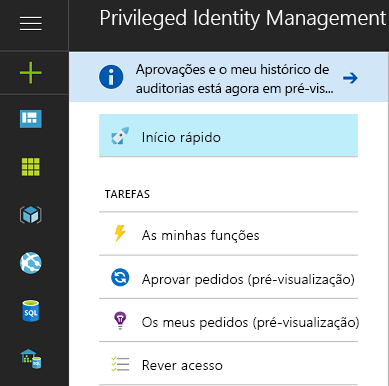
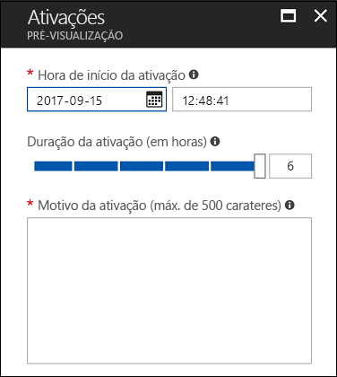
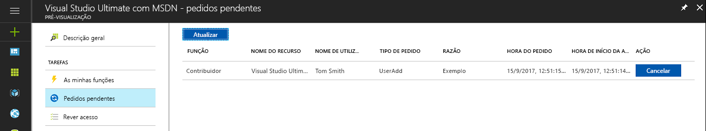
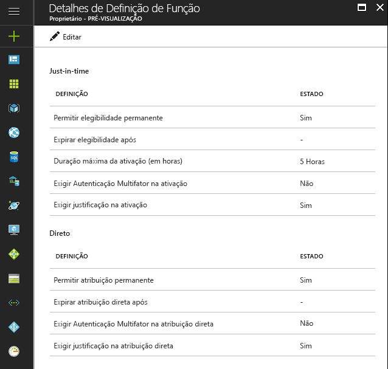

# O que é o Azure AD Privileged Identity Management?

Com o Azure Active Directory (AD) Privileged Identity Management, pode gerir, controlar e monitorizar o acesso dentro da sua organização. Isto inclui o acesso a recursos no Azure AD, Recursos do Azure (Pré-visualização) e outros Microsoft Online Services, como o Office 365 ou o Microsoft Intune.

> [!NOTE]
> Quando ativa o Privileged Identity Management para o seu inquilino, é necessária uma licença de avaliação ou paga válida do Azure AD Premium P2 ou do Enterprise Mobility + Security E5 para cada utilizador que interaja com o serviço ou que receba um benefício do serviço. Os exemplos incluem os utilizadores/utilizadores num grupo que são:
>
>- Atribuídos à função de Administrador de Função com Privilégios 
>- Atribuídos como elegíveis a outras funções de diretório que podem ser geridas através do PIM 
>- Capazes de aprovar/rejeitar pedidos no PIM 
>- Atribuídos a uma função de recursos do Azure com atribuições Just-in-time ou Diretas (com base no tempo)  
>- Atribuídos a uma revisão de acesso
>
>Para obter mais informações, consulte [Edições do Azure Active Directory](../fundamentals/active-directory-whatis.md).

As organizações querem minimizar o número de pessoas que têm acesso a informações ou recursos seguros, uma vez que tal reduz a possibilidade de um utilizador malicioso obter esse acesso ou de um utilizador autorizado afetar inadvertidamente um recurso sensível.  No entanto, os utilizadores continuam a ter de realizar operações privilegiadas em aplicações do Azure AD, Azure, Office 365 ou SaaS. As organizações podem dar aos utilizadores acesso privilegiado a recursos do Azure como as Subscrições e ao Azure AD. Há uma necessidade de supervisionar o que esses utilizadores estão a fazer com os seus privilégios de administrador. O Azure AD Privileged Identity Management ajuda a mitigar o risco de direitos de acesso excessivos, desnecessários ou utilizados indevidamente.

O Azure AD Privileged Identity Management ajuda a sua organização a:

- Ver a que utilizadores são atribuídas funções com privilégios para gerir recursos do Azure (Pré-visualização), bem como a que utilizadores são atribuídas funções administrativas no Azure AD
- Permitir o acesso administrativo a pedido, "just-in-time", a Microsoft Online Services como o Office 365 e o Intune, e a recursos do Azure (Pré-visualização) de subscrições, grupos de recursos e recursos individuais, tais como Máquinas Virtuais 
-   Ver um histórico de ativação de administrador, incluindo as alterações que os administradores fizeram aos recursos do Azure (Pré-visualização)
- Obter alertas sobre alterações em atribuições de administrador
- Exigir aprovação para ativar as funções de administrador privilegiado do Azure AD (Pré-visualização) 
- Rever a associação de funções administrativas e exigir que os utilizadores forneçam uma justificação para a associação continuada

No Azure AD, o Azure AD Privileged Identity Management pode gerir os utilizadores atribuídos às funções organizacionais incorporadas do Azure AD, como a de Administrador Global. No Azure, o Azure AD Privileged Identity Management pode gerir os utilizadores e grupos atribuídos através de funções RBAC do Azure, incluindo a de Proprietário ou Contribuidor.

## Acesso de administrador just-in-time

Historicamente, pode atribuir um utilizador a uma função de administrador através do portal do Azure, de outros portais do Microsoft Online Services ou dos cmdlets do Azure AD no Windows PowerShell. Em resultado, esse utilizador torna-se num **administrador permanente**, sempre ativo na função atribuída. O Azure AD Privileged Identity Management introduz o conceito de **administrador elegível**. Os administradores elegíveis devem ser utilizadores que necessitam de acesso privilegiado de vez em quando, mas não durante o dia todo, todos os dias. A função está inativa até que o utilizador precise de acesso. Nessa altura, o utilizador realiza um processo de ativação e torna-se num administrador ativo durante uma quantidade pré-determinada de tempo. Cada vez mais organizações estão a optar por utilizar esta abordagem para reduzir ou eliminar o "acesso de administrador permanente" a funções com privilégios.

## Terminologia

*Utilizador de função elegível* – um utilizador de função elegível é um utilizador na sua organização a quem foi atribuída uma função do Azure AD como elegível (a função necessita de ativação).

*Aprovador delegado* – um aprovador delegado é um indivíduo ou vários indivíduos ou grupos dentro do seu Azure AD responsáveis pela aprovação de pedidos para ativar as funções.

## Cenários

O Privileged Identity Management suporta os seguintes cenários:

**Enquanto Administrador de Função com Privilégios, pode:**

- Ativar a aprovação de funções específicas
- Especificar utilizadores e/ou grupos de aprovação para aprovar pedidos
- Ver o histórico de pedidos e de aprovação de todas as funções com privilégios

**Enquanto aprovador designado, pode:**

- Ver aprovações pendentes (pedidos)
- Aprovar ou rejeitar pedidos para elevação de funções (individuais e/ou em massa)
- Fornecer justificação para aprovações/rejeições 

**Enquanto utilizador de função elegível, pode:**

- Pedir a ativação de uma função que requer aprovação
- Ver o estado do seu pedido para ativação
- Completar a sua tarefa no Azure AD se a ativação for aprovada

## Ativar o Privileged Identity Management para o seu diretório

Pode começar a utilizar o Azure AD Privileged Identity Management no [portal do Azure](https://portal.azure.com/).

> [!NOTE]
> Tem de ser um administrador global com uma conta profissional (por exemplo, @yourdomain.com), e não uma conta Microsoft (por exemplo, @outlook.com), para ativar o Azure AD Privileged Identity Management para um diretório.

1. Inicie sessão no [Portal do Azure](https://portal.azure.com/) como administrador global do diretório.
2. Se a organização tiver mais do que um diretório, selecione o nome de utilizador no canto superior direito do Portal do Azure. Selecione o diretório onde irá utilizar o Azure AD Privileged Identity Management.
3. Selecione **Todos os serviços** e utilize a caixa de texto Filtro para procurar **Azure AD Privileged Identity Management**.
4. Marque **Afixar ao dashboard** e, em seguida, clique em **Criar**. A aplicação Privileged Identity Management abre.

Se for a primeira pessoa a utilizar o Azure AD Privileged Identity Management no diretório e navegar até às funções de diretório do Azure AD, um [assistente de segurança](pim-security-wizard.md) irá guiá-lo na experiência de atribuição inicial. Depois disso, torna-se automaticamente no primeiro **Administrador de segurança** e **Administrador de função com privilégios** do diretório.

Para funções do Azure AD, apenas um utilizador que está na função de Administrador de Função com Privilégios pode gerir atribuições de outros administradores no Azure AD PIM. Pode [dar a outros utilizadores a capacidade de gerir funções de diretório no PIM](pim-how-to-give-access-to-pim.md). Os Administradores Globais, Administradores de Segurança e Leitores de Segurança podem ver as atribuições a funções do Azure AD no Azure AD PIM.
Para funções RBAC do Azure, apenas um administrador de subscrição, um proprietário de recurso ou um administrador de acesso de utilizador de recursos pode gerir as atribuições de outros administradores no Azure AD PIM.  Os utilizadores que são Administradores de Função com Privilégios, Administradores de Segurança ou Leitores de Segurança não têm, por predefinição, acesso para ver as atribuições a funções RBAC do Azure no Azure AD PIM.

## Descrição Geral do Privileged Identity Management (Ponto de Entrada)

O Azure AD Privileged Identity Management suporta a administração de funções de diretório do Azure AD e funções para Recursos do Azure (Pré-visualização). A função das funções para recursos do Azure diferem das funções administrativas no Azure AD. As funções de recursos do Azure fornecem permissões granulares para o recurso ao qual estão atribuídas e para todos os recursos subordinados na hierarquia de recursos (conhecida como herança). [Saiba mais sobre RBAC, hierarquia de recursos e herança](../../role-based-access-control/role-assignments-portal.md). O PIM para as funções de diretório do Azure AD e os Recursos do Azure (Pré-visualização) pode ser administrado ao aceder à ligação adequada na secção Gerir do menu de navegação à esquerda do ponto de entrada de Descrição Geral do PIM.

O PIM fornece acesso conveniente para ativar funções, ver ativações/pedidos pendentes, aprovações pendentes (para funções de diretório do Azure AD) e revisões que aguardam a sua resposta na secção Tarefas do menu de navegação à esquerda.

Ao aceder a qualquer um dos itens do menu Tarefas a partir do ponto de entrada de Descrição geral, a vista resultante contém resultados para funções de diretório do Azure AD e funções de Recursos do Azure (Pré-visualização).

As minhas funções contêm uma lista de atribuições de funções ativas e elegíveis para funções de diretório do Azure AD e funções de Recursos do Azure (Pré-visualização). [Saiba mais sobre a ativação de atribuições de funções elegíveis](pim-how-to-activate-role.md).

A ativação de funções para Recursos do Azure (Pré-visualização) introduz uma nova experiência que permite que os membros elegíveis de uma função agendem a ativação para uma data/hora no futuro e selecionem uma duração de ativação específica dentro do limite máximo permitido pelos administradores.

No caso de uma ativação agendada já não ser necessária, os utilizadores podem cancelar o pedido pendente ao navegarem para pedidos pendentes, no menu de navegação à esquerda, e ao clicarem no botão Cancelar em linha com esse pedido.

## Dashboard de administração do Privileged Identity Management

O Azure AD Privileged Identity Manager oferece um dashboard de administração que lhe dá informações importantes, tais como:

* Alertas que indicam oportunidades para melhorar a segurança
* O número de utilizadores que estão atribuídos a cada função com privilégios  
* O número de administradores elegíveis e permanentes
* Um grafo de ativações de função com privilégios no seu diretório
*   O número de atribuições Just-In-Time, com Vínculo de tempo e Permanentes para funções de Recursos do Azure (Pré-visualização)
*   Utilizadores e grupos com novas atribuições de função nos últimos 30 dias (funções de Recursos do Azure)

## Gestão de funções com privilégios

Com o Azure AD Privileged Identity Management, pode gerir os administradores ao adicionar ou remover os administradores permanentes ou elegíveis de cada função para funções de diretório do Azure AD. Com o PIM para Recursos do Azure (Pré-visualização), os Proprietários, Administradores de Acesso dos Utilizadores e Administradores Globais que ativam a gestão de Subscrições no seu inquilino podem atribuir utilizadores ou grupos a funções de recursos do Azure como elegíveis (acesso Just-In-Time), acesso com Vínculo de tempo (ativação não necessária) com um data/hora de início e de fim ou permanentes (se forem ativados nas definições de função).

## Configurar as definições de ativação de função

Com as [definições de função](pim-how-to-change-default-settings.md), pode configurar as propriedades de ativação de função elegível para as funções de diretório do Azure AD, incluindo:

* A duração do período de ativação de função
* A notificação de ativação de função
* As informações que um utilizador tem de fornecer durante o processo de ativação de função
* Número de incidente ou pedido de serviço
* [Requisitos de fluxo de trabalho de aprovação - Pré-visualização](./azure-ad-pim-approval-workflow.md)

Tenha em atenção que na imagem, os botões da **Multi-Factor Authentication** estão desativados. Para algumas funções com muitos privilégios, exigimos a MFA para proteção acrescida.

As definições de função para funções de Recursos do Azure (Pré-visualização) permitem aos administradores configurar definições de atribuição Just-In-Time e Direta, incluindo:

- A capacidade de atribuir utilizadores ou grupos a funções sem uma data/hora de fim (atribuição permanente)
- A duração predefinida de uma atribuição (quando não é permanente)
- A duração máxima da ativação (quando um membro da função elegível ativa)
- As informações que um utilizador tem de fornecer durante a ativação de função (atribuições Just-In-Time) ou o processo de atribuição (atribuições diretas)

## Ativação de função

Para [ativar uma função](pim-how-to-activate-role.md), um administrador elegível solicita uma "ativação" com vínculo de tempo para a função. A ativação pode ser pedida através da opção **Ativar a minha função** no Azure AD Privileged Identity Management.

Um administrador que pretenda ativar uma função tem de inicializar o Azure AD Privileged Identity Management no portal do Azure.

A ativação de função é personalizável. Nas definições do PIM, pode determinar a duração da ativação e as informações que o administrador tem de fornecer para ativar a função.

## Rever a atividade da função

Existem duas formas de controlar como os seus funcionários e administradores estão a utilizar as funções com privilégios. A primeira opção consiste em utilizar o [Histórico de auditoria de funções de diretório](pim-how-to-use-audit-log.md). Os registos do histórico de auditoria registam as alterações nas atribuições de funções com privilégios, no histórico de ativações de função e as alterações às definições para funções de Recursos do Azure (Pré-visualização). 

A segunda opção consiste em configurar [revisões de acesso](pim-how-to-start-security-review.md) regulares. Estas revisões de acesso podem ser executadas por um revisor nomeado (como um chefe de equipa) ou os funcionários podem rever eles próprios. Esta é a melhor forma de monitorizar quem ainda precisa de acesso e quem já não precisa.

## Azure AD PIM na expiração da subscrição

Um inquilino tem de ter uma subscrição paga ou de avaliação do Azure AD Premium P2 (ou EMS E5) no respetivo inquilino para poder utilizar o Azure AD PIM.  Além disso, têm de ser atribuídas licenças aos administradores do inquilino.  Especificamente, têm de ser atribuídas licenças aos administradores nas funções do Azure AD geridas através do Azure AD PIM, aos administradores nas funções RBAC do Azure geridas através do Azure AD PIM e a quaisquer utilizadores não administradores que realizem revisões de acesso.
Se sua organização não renovar o Azure AD Premium P2 ou se a sua avaliação expirar, as funcionalidades do Azure AD PIM já não estarão disponíveis no seu inquilino, as atribuições de funções elegíveis serão removidas e os utilizadores já não poderão ativar as funções. Pode ler mais nos [requisitos de subscrição do Azure AD PIM](./subscription-requirements.md)

## Passos seguintes

- [Requisitos da subscrição para utilização do PIM](subscription-requirements.md)
- [Funções de diretório do Azure AD que pode gerir no PIM](pim-roles.md)
- [Proteção de acesso privilegiado para implementações híbridas e na cloud no Azure AD](../users-groups-roles/directory-admin-roles-secure.md?toc=%2fazure%2factive-directory%2fprivileged-identity-management%2ftoc.json)
