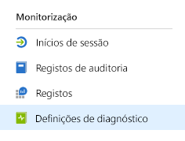
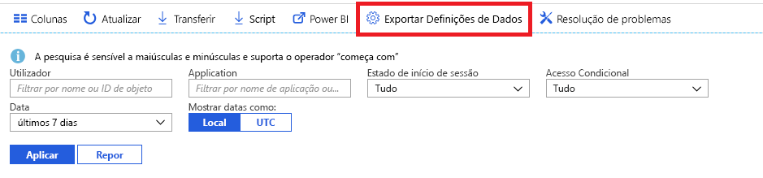

# O que é a monitorização do Azure Active Directory? (pré-visualização)

Com a monitorização do Azure Active Directory (Azure AD), pode agora encaminhar os registos de atividades do Azure AD para diferentes pontos finais. Em seguida, pode retê-los para utilização a longo prazo ou integrá-los com ferramentas de Gestão de Informações e Eventos de Segurança (SIEM) de terceiros para obter informações sobre o seu ambiente.

Atualmente, pode encaminhar os registos para:

- Uma conta de armazenamento do Azure.
- Um hub de eventos do Azure, para que possa integrar em instâncias do Splunk e do Sumologic.
- A área de trabalho do Azure Log Analytics, onde pode analisar os dados, criar o dashboard e alertar sobre eventos específicos

## Configuração de definições de diagnóstico

Para configurar definições de monitorização para registos de atividades do Azure AD, primeiro inicie sessão no [portal do Azure](https://portal.azure.com) e, em seguida, selecione **Azure Active Directory**. A partir daqui, pode aceder à página de configuração de definições de diagnóstico de duas formas:

* Selecione **Definições de diagnóstico** na secção **Monitorização**.

    
    
* Selecione **Registos de Auditoria** ou **Inícios de Sessão** e, em seguida, selecione **Exportar definições**. 

    

## Encaminhar registos para a conta de armazenamento

Ao encaminhar os registos para uma conta de armazenamento do Azure, pode mantê-los durante mais tempo do que o período de retenção predefinido descrito nas nossas [políticas de retenção](reference-reports-data-retention.md). Saiba como [encaminhar dados para a sua conta de armazenamento](quickstart-azure-monitor-route-logs-to-storage-account.md).

## Transmitir registos no hub de eventos

O encaminhamento de registos para um hub de eventos do Azure permite-lhe integrar com ferramentas SIEM de terceiros, como o Sumologic e o Splunk. Esta integração permite-lhe combinar dados de registo de atividade do Azure AD com outros dados geridos pelo seu SIEM, para fornecer informações mais ricas sobre o seu ambiente. Saiba como [transmitir registos a um hub de eventos](tutorial-azure-monitor-stream-logs-to-event-hub.md).

## Enviar registos para o Log Analytics

O [Log Analytics](https://docs.microsoft.com/azure/log-analytics/log-analytics-overview) é uma solução que consolida a monitorização de dados de diferentes origens e fornece uma linguagem de consulta e um mecanismo de análise que permitem obter informações sobre o funcionamento das suas aplicações e recursos. Através do envio de registos de atividades do Azure AD para o Log Analytics, pode obter, monitorizar e alertar rapidamente sobre os dados recolhidos. Saiba como [enviar dados para o Log Analytics](howto-integrate-activity-logs-with-log-analytics.md).

Também pode instalar as vistas pré-criadas para os registos de atividades do Azure AD para monitorizar cenários comuns que envolvem inícios de sessão e eventos de auditoria. Saiba como [instalar e utilizar vistas do Log Analytics para registos de atividades do Azure AD](howto-install-use-log-analytics-views.md).

## Passos Seguintes

* [Registos de atividades no Azure Monitor](concept-activity-logs-azure-monitor.md)
* [Transmitir registos ao hub de eventos](tutorial-azure-monitor-stream-logs-to-event-hub.md)
* [Enviar registos para o Log Analytics](howto-integrate-activity-logs-with-log-analytics.md)