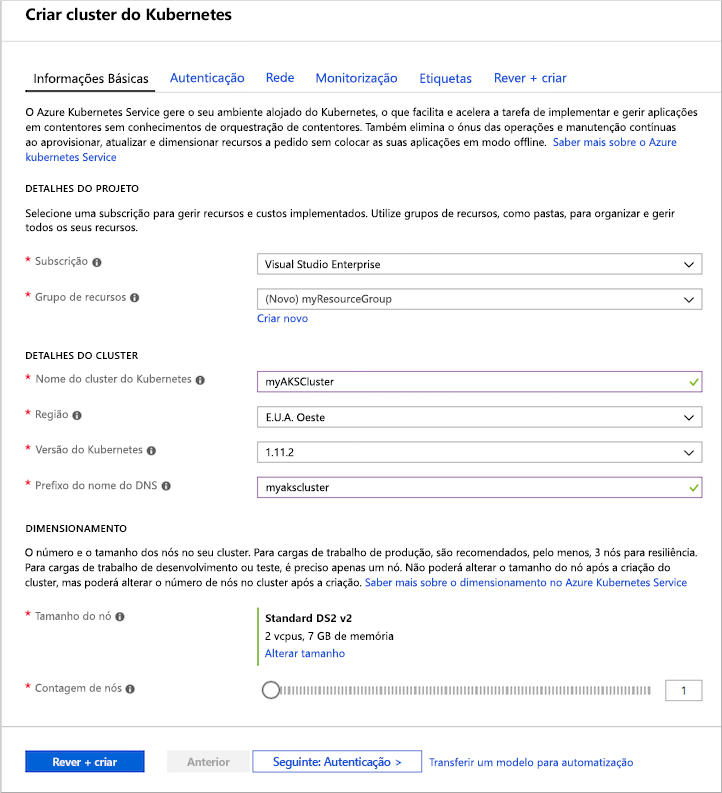
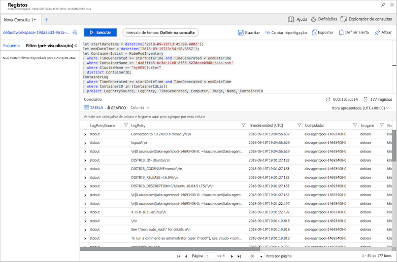

# <a name="quickstart-deploy-an-azure-kubernetes-service-aks-cluster-using-the-azure-portal"></a>Início rápido: Implementar um cluster do Azure Kubernetes Service (AKS) no portal do Azure

O Azure Kubernetes Service (AKS) é um serviço de Kubernetes gerido que permite-lhe implementar e gerir clusters rapidamente. Neste guia de introdução, vai implementar um cluster do AKS com o portal do Azure. Uma aplicação de vários contentores que inclui um front-end da web e numa instância de Redis é executada no cluster. Em seguida, veja como monitorizar o estado de funcionamento do cluster e pods que execute a sua aplicação.


Este guia de introdução parte do princípio de que possui conhecimentos básicos dos conceitos do Kubernetes. Para obter mais informações, consulte [Kubernetes principais conceitos para o Azure Kubernetes Service (AKS)][kubernetes-concepts].

Se não tiver uma subscrição do Azure, crie uma [conta gratuita](https://azure.microsoft.com/free/?WT.mc_id=A261C142F) antes de começar.

## <a name="sign-in-to-azure"></a>Iniciar sessão no Azure

Inicie sessão no portal do Azure em https://portal.azure.com.

## <a name="create-an-aks-cluster"></a>Criar um cluster do AKS (Create an AKS cluster)

No canto superior esquerdo do portal do Azure, selecione **+ criar um recurso** > **serviço Kubernetes**.

Para criar um cluster do AKS, execute os passos seguintes:

1. **Detalhes básicos** - configure as seguintes opções:
    - *DETALHES DO PROJETO*: Selecione uma subscrição do Azure, em seguida, selecionar ou criar um grupo de recursos do Azure, tal como *myResourceGroup*. Introduza um **nome para o cluster do Kubernetes**, como *myAKSCluster*.
    - *DETALHES DO CLUSTER*: Selecione uma região, a versão do Kubernetes e o prefixo de nome de DNS para o cluster do AKS.
    - *DIMENSIONAMENTO*: Selecione um tamanho VM para os nós do AKS. O tamanho da VM **não pode** ser alterado após a implementação de um cluster de AKS.
        - Selecione o número de nós a implementar no cluster. Neste início rápido, defina **Contagem de nós** como *1*. O número de nós **pode** ser ajustado após a implementação do cluster.
    
    

    Selecione **seguinte: Autenticação** quando terminar.

1. **Autenticação**: Configure as seguintes opções:
    - Crie um principal de serviço novo ou *configure* para utilizar um existente. Quando utilizar um SPN existente, terá de fornecer o ID de cliente de SPN e o segredo.
    - Ative a opção para os controlos de acesso baseado em funções (RBAC) do Kubernetes. Estes controlos proporcionam um controlo mais detalhado sobre o acesso aos recursos do Kubernetes implementados no cluster do AKS.

    Por predefinição, *básica* à rede é utilizado e o Monitor do Azure para contentores está ativado. Quando estiver pronto, selecione **Rever + criar** e **Criar**.

O cluster do AKS demora alguns minutos a ser criado e a estar pronto para utilização. Quando concluída, navegue para o grupo de recursos de cluster do AKS, tal como *myResourceGroup*e selecione o recurso do AKS, tal como *myAKSCluster*. É apresentado o dashboard do cluster do AKS, como na captura de ecrã de exemplo abaixo:


## <a name="connect-to-the-cluster"></a>Ligar ao cluster

Para gerir um cluster de Kubernetes, utilize [kubectl][kubectl], o cliente de linha de comandos do Kubernetes. O cliente `kubectl` está pré-instalado no Azure Cloud Shell.

Abra o Cloud Shell com o botão que se encontra no canto superior direito do portal do Azure.


Para configurar `kubectl` para se ligar ao cluster do Kubernetes, utilize o comando [az aks get-credentials][az-aks-get-credentials]. Este comando transfere credenciais e configura a CLI do Kubernetes para utilizá-los. O exemplo seguinte obtém credenciais para o nome do cluster *myAKSCluster* no grupo de recursos denominado *myResourceGroup*:

```azurecli-interactive
az aks get-credentials --resource-group myResourceGroup --name myAKSCluster
```

Para verificar a ligação ao cluster, utilize o comando [kubectl get][kubectl-get] para devolver uma lista de nós do cluster.

```azurecli-interactive
kubectl get nodes
```

A saída de exemplo seguinte mostra o nó único criado nos passos anteriores. Certifique-se de que o estado do nó é *pronto*:

```
NAME                       STATUS    ROLES     AGE       VERSION
aks-agentpool-14693408-0   Ready     agent     15m       v1.11.5
```

## <a name="run-the-application"></a>Executar a aplicação

Um arquivo de manifesto do Kubernetes define um estado pretendido para o cluster, como o contentor de imagens para executar. Neste início rápido, é utilizado um manifesto para criar todos os objetos necessários para executar a aplicação Azure Vote. Esse manifesto inclui dois [implementações de Kubernetes] [ kubernetes-deployment] -um para as aplicações do Azure Vote Python de exemplo e outro para uma instância de Redis. Dois [serviços do Kubernetes] [ kubernetes-service] também são criados - um serviço interno para a instância de Redis e um serviço externo para aceder a aplicação Azure Vote a partir da internet.

> [!TIP]
> Neste início rápido, crie e implemente manualmente os seus manifestos de aplicação para o cluster do AKS. Em mais cenários do mundo real, pode utilizar o [Azure Dev Spaces][azure-dev-spaces] para iterar e depurar o seu código rápida e diretamente no cluster do AKS. Pode utilizar o Dev Spaces em várias plataformas do SO e ambientes de desenvolvimento, e trabalhar em conjunto com outras pessoas na sua equipa.

Crie um ficheiro denominado `azure-vote.yaml` e copie a seguinte definição de YAML. No Azure Cloud Shell, crie o ficheiro com `vi` ou `Nano`, como se trabalhar num sistema físico ou virtual:

```yaml
apiVersion: apps/v1
kind: Deployment
metadata:
  name: azure-vote-back
spec:
  replicas: 1
  selector:
    matchLabels:
      app: azure-vote-back
  template:
    metadata:
      labels:
        app: azure-vote-back
    spec:
      containers:
      - name: azure-vote-back
        image: redis
        resources:
          requests:
            cpu: 100m
            memory: 128Mi
          limits:
            cpu: 250m
            memory: 256Mi
        ports:
        - containerPort: 6379
          name: redis
---
apiVersion: v1
kind: Service
metadata:
  name: azure-vote-back
spec:
  ports:
  - port: 6379
  selector:
    app: azure-vote-back
---
apiVersion: apps/v1
kind: Deployment
metadata:
  name: azure-vote-front
spec:
  replicas: 1
  selector:
    matchLabels:
      app: azure-vote-front
  template:
    metadata:
      labels:
        app: azure-vote-front
    spec:
      containers:
      - name: azure-vote-front
        image: microsoft/azure-vote-front:v1
        resources:
          requests:
            cpu: 100m
            memory: 128Mi
          limits:
            cpu: 250m
            memory: 256Mi
        ports:
        - containerPort: 80
        env:
        - name: REDIS
          value: "azure-vote-back"
---
apiVersion: v1
kind: Service
metadata:
  name: azure-vote-front
spec:
  type: LoadBalancer
  ports:
  - port: 80
  selector:
    app: azure-vote-front
```

Implemente a aplicação com o [aplicam-se de kubectl] [ kubectl-apply] de comando e especifique o nome do seu manifesto YAML:

```azurecli-interactive
kubectl apply -f azure-vote.yaml
```

O resultado de exemplo seguinte mostra as implementações e os serviços criados com êxito:

```
deployment "azure-vote-back" created
service "azure-vote-back" created
deployment "azure-vote-front" created
service "azure-vote-front" created
```

## <a name="test-the-application"></a>Testar a aplicação

Quando o aplicativo for executado, um serviço do Kubernetes expõe à aplicação de front-end à internet. Este processo pode demorar alguns minutos a concluir.

Para monitorizar o progresso, utilize o comando [kubectl get service][kubectl-get] com o argumento `--watch`.

```azurecli-interactive
kubectl get service azure-vote-front --watch
```

Inicialmente o *EXTERNAL-IP* para o *do azure-vote-front* serviço é mostrado como *pendente*.

```
NAME               TYPE           CLUSTER-IP   EXTERNAL-IP   PORT(S)        AGE
azure-vote-front   LoadBalancer   10.0.37.27   <pending>     80:30572/TCP   6s
```

Quando o *EXTERNAL-IP* é alterado de endereço *pendente* para um endereço IP público real, utilize `CTRL-C` para parar o `kubectl` veja processo. O resultado de exemplo seguinte mostra um endereço IP público válido atribuído ao serviço:

```
azure-vote-front   LoadBalancer   10.0.37.27   52.179.23.131   80:30572/TCP   2m
```

Para ver a aplicação Azure Vote em ação, abra um navegador da web para o endereço IP externo do seu serviço.


## <a name="monitor-health-and-logs"></a>Monitorizar o estado de funcionamento e os registos

Quando criou o cluster, o Azure Monitor para contentores foi ativado. Esta funcionalidade de monitorização proporciona métricas de estado de funcionamento para o cluster do AKS e para pods em execução no mesmo.

Pode demorar alguns minutos até que estes dados sejam povoados no portal do Azure. Para ver o estado atual, o tempo de atividade e a utilização de recursos relativamente aos pods do Azure Vote, regresse ao recurso do AKS no portal do Azure, como *myAKSCluster*. Em seguida, pode aceder ao estado de funcionamento da seguinte forma:

1. Sob **monitorização** no lado esquerdo, selecione **Insights**
1. Na parte superior, opte por **+ Adicionar Filtro**
1. Selecione *Espaço de nomes* como a propriedade e, em seguida, escolha *\<Todas, exceto o sistema kube\>*
1. Selecione para ver os **Contentores**.

Os contentores *azure-vote-back* e *azure-vote-front* são apresentados, conforme mostrado no exemplo seguinte:


Para ver os registos relativos ao pod `azure-vote-front`, selecione a ligação **Ver registos de contentor** no lado direito da lista de contentores. Esses registos incluem os fluxos *stdout* e *stderr* do contentor.



## <a name="delete-cluster"></a>Eliminar o cluster

Quando o cluster já não for necessário, elimine o recurso do cluster, o que, por sua vez, elimina todos os recursos associados. Esta operação pode ser levada a cabo no portal do Azure através da seleção do botão **Eliminar** no dashboard do cluster do AKS. Em alternativa, é possível utilizar o comando [az aks delete][az-aks-delete] no Cloud Shell:

```azurecli-interactive
az aks delete --resource-group myResourceGroup --name myAKSCluster --no-wait
```

> [!NOTE]
> Quando elimina o cluster, o principal de serviço do Azure Active Directory utilizado pelo cluster do AKS não é removido. Para obter passos sobre como remover o principal de serviço, consulte [Considerações sobre e eliminação do principal de serviço AKS][sp-delete].

## <a name="get-the-code"></a>Obter o código

Neste início rápido, foram utilizadas imagens de contentores pré-criadas para criar uma implementação de Kubernetes. O código da aplicação relacionado, o Dockerfile, e o ficheiro de manifesto do Kubernetes, estão disponíveis no GitHub.

[https://github.com/Azure-Samples/azure-voting-app-redis][azure-vote-app]

## <a name="next-steps"></a>Passos seguintes

Neste guia de início rápido, implementou um cluster do Kubernetes e implementou uma aplicação de vários contentores no mesmo.

Para saber mais sobre o AKS e ver um exemplo completo de código para implementação, avance para o tutorial dos clusters de Kubernetes.

> [!div class="nextstepaction"]
> [Tutorial do AKS][aks-tutorial]

<!-- LINKS - external -->
[azure-vote-app]: https://github.com/Azure-Samples/azure-voting-app-redis.git
[kubectl]: https://kubernetes.io/docs/user-guide/kubectl/
[kubectl-apply]: https://kubernetes.io/docs/reference/generated/kubectl/kubectl-commands#apply
[kubectl-get]: https://kubernetes.io/docs/reference/generated/kubectl/kubectl-commands#get
[kubernetes-documentation]: https://kubernetes.io/docs/home/

<!-- LINKS - internal -->
[kubernetes-concepts]: concepts-clusters-workloads.md
[az-aks-get-credentials]: /cli/azure/aks?view=azure-cli-latest#az-aks-get-credentials
[az-aks-delete]: /cli/azure/aks#az-aks-delete
[aks-monitor]: ../monitoring/monitoring-container-health.md
[aks-network]: ./concepts-network.md
[aks-tutorial]: ./tutorial-kubernetes-prepare-app.md
[http-routing]: ./http-application-routing.md
[sp-delete]: kubernetes-service-principal.md#additional-considerations
[azure-dev-spaces]: https://docs.microsoft.com/azure/dev-spaces/
[kubernetes-deployment]: concepts-clusters-workloads.md#deployments-and-yaml-manifests
[kubernetes-service]: concepts-network.md#services
