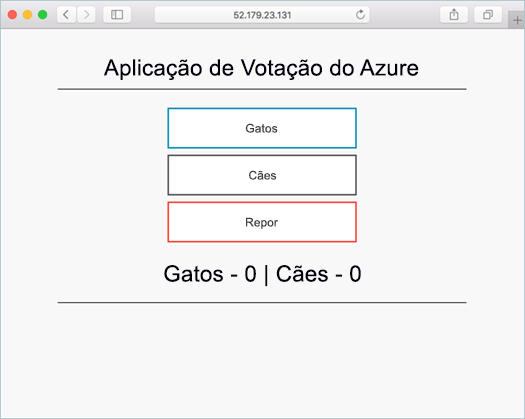
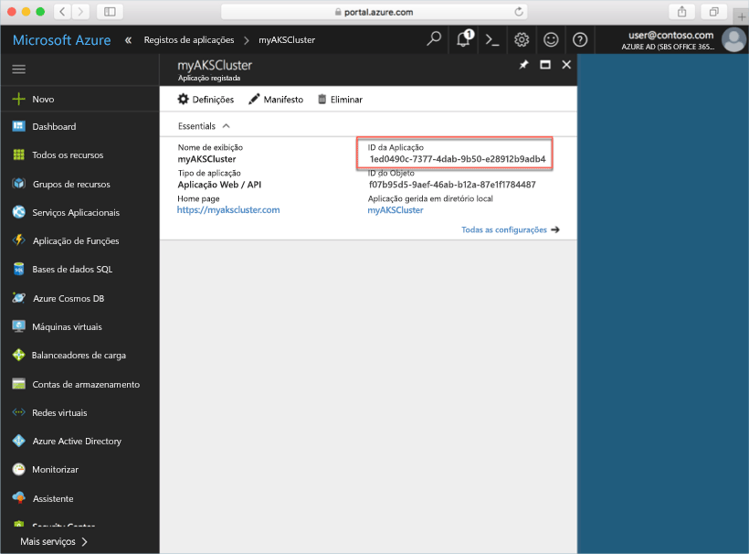
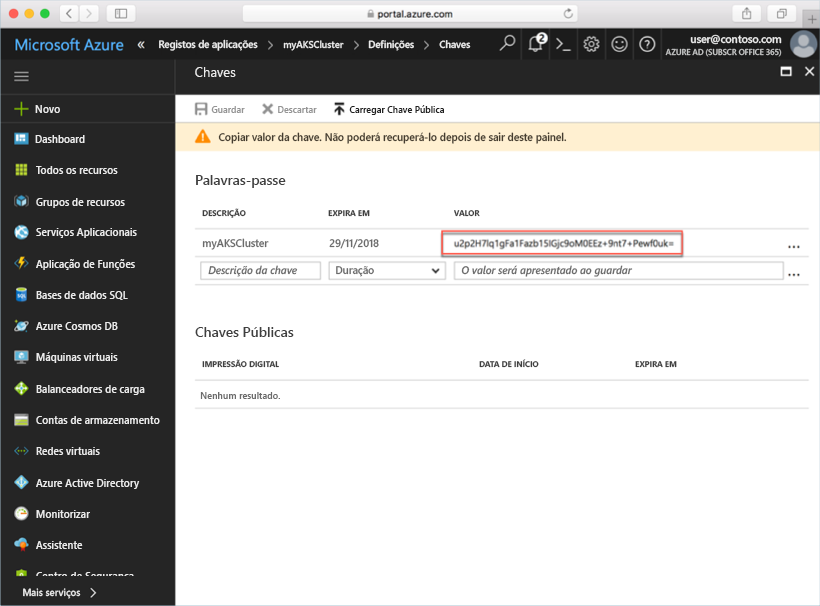
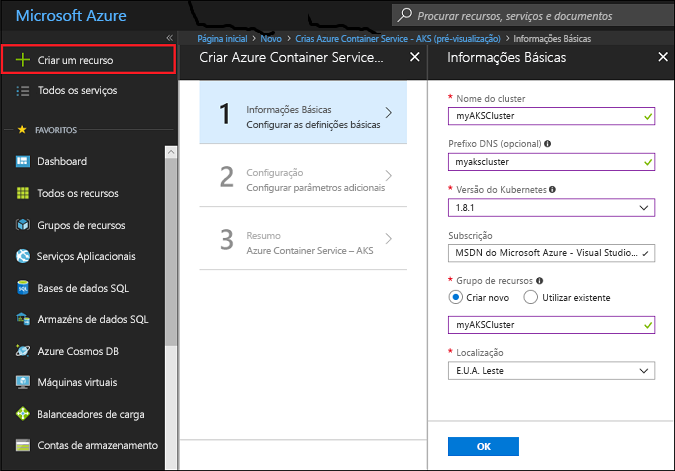
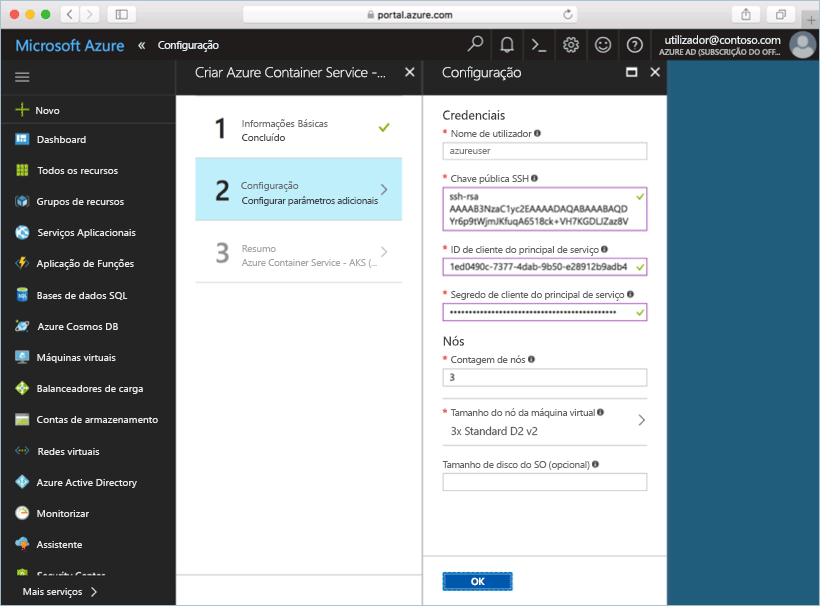
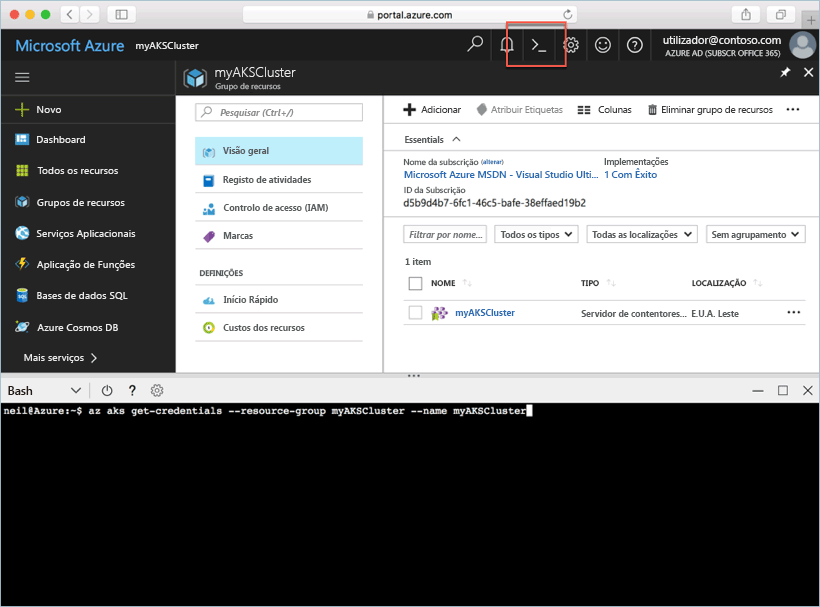

# <a name="deploy-an-azure-container-service-aks-cluster"></a>Implementar um cluster do Azure Container Service (AKS)

Neste guia de introdução, vai implementar um cluster do AKS com o portal do Azure. Depois, é executada no cluster uma aplicação de vários contentores que consiste num front-end da Web e numa instância de Redis. Depois de concluída, a aplicação está acessível através da Internet.



Este guia de introdução parte do princípio de que possui conhecimentos básicos dos conceitos do Kubernetes. Para obter informações detalhadas sobre o Kubernetes, consulte a [documentação do Kubernetes][kubernetes-documentation].

## <a name="sign-in-to-azure"></a>Iniciar sessão no Azure

Inicie sessão no portal do Azure, em http://portal.azure.com.

## <a name="create-service-principal"></a>Criar um principal de serviço

Antes de criar o cluster do AKS no portal do Azure, tem de criar um principal de serviço. O Azure utiliza este principal de serviço para gerir a infraestrutura associada ao cluster do AKS.

Selecione **Azure Active Directory** > **Registos das aplicações** > **Novo registo de aplicação**.

Introduza um nome para a aplicação, que pode ser qualquer valor. Selecione **Aplicação/API Web** para o tipo de aplicação. Introduza um valor para o **URL de início de sessão**; pode ser qualquer valor num formato de URL válido, mas não precisa de ser um ponto final real.

Quando terminar, selecione **Criar**.


Selecione o registo de aplicação que acabou de criar e tome nota do ID da Aplicação. Este valor é necessário quando criar o cluster do AKS.



Em seguida, tem de criar uma palavra-passe para o principal de serviço. Selecione **Todas as Definições** > **Chaves** e introduza qualquer valor para a descrição da chave. Selecione uma duração, que corresponde ao tempo durante o qual o principal de serviço é válido.

Clique em **Guardar** e tome nota do valor de palavra-passe. A palavra-passe é necessária quando criar um cluster do AKS.



## <a name="create-aks-cluster"></a>Criar um cluster do AKS

Selecione **Novo** > **Contentores** > **Azure Container Service - AKS (pré-visualização)**.

Indique o nome do cluster, o prefixo de DNS, o nome do grupo de recursos, a localização e a versão do Kubernetes para o cluster. Tome nota do nome do cluster e do nome do grupo de recursos, uma vez que são necessários quando ligar ao cluster.

Quando terminar, selecione **OK**.



No formulário de configuração, introduza o seguinte:

- Nome de Utilizador - o nome atribuído às contas administrativas nos nós de cluster.
- Chave pública SSH - associada à chave que será utilizada para aceder aos nós de cluster.
- ID de cliente do principal de serviço - o ID da Aplicação do principal de serviço que criou anteriormente neste documento.
- Segredo do cliente do principal de serviço - a palavra-passe do principal de serviço que criou anteriormente neste documento.
- Contagem de nós - o número de nós do AKS a criar.
- Tamanho da máquina virtual de nós - o tamanho da VM para os nós do AKS
- Tamanho do disco do OS - o tamanho do disco do SO dos nós do AKS.

Selecione **OK** quando terminar e selecione novamente **OK** após a conclusão da validação.



Após uma breve espera, o cluster do ASK é implementado e fica pronto a utilizar.

## <a name="connect-to-the-cluster"></a>Ligar ao cluster

Para gerir um cluster de Kubernetes, utilize [kubectl][kubectl], o cliente de linha de comandos do Kubernetes. O cliente kubectl está pré-instalado no Azure Cloud Shell.

Abra o Cloud Shell com o botão que se encontra no canto superior direito do portal do Azure.



Utilize o comando [az aks get-credentials][az-aks-get-credentials] para configurar kubectl para se ligar ao seu cluster do Kubernetes.

Copie e cole o comando seguinte para o Cloud Shell. Modifique o nome do grupo de recursos e do cluster, se necessário.

```azurecli-interactive
az aks get-credentials --resource-group myAKSCluster --name myAKSCluster
```

Para verificar a ligação ao cluster, utilize o comando [kubectl get][kubectl-get] para devolver uma lista de nós do cluster.

```azurecli-interactive
kubectl get nodes
```

Saída:

```
NAME                       STATUS    ROLES     AGE       VERSION
aks-agentpool-14693408-0   Ready     agent     6m        v1.8.1
aks-agentpool-14693408-1   Ready     agent     6m        v1.8.1
aks-agentpool-14693408-2   Ready     agent     7m        v1.8.1
```

## <a name="run-the-application"></a>Executar a aplicação

Um ficheiro de manifesto do Kubernetes define um estado pretendido para o cluster, incluindo que imagens de contentor devem estar em execução. Neste exemplo, é utilizado um manifesto para criar todos os objetos necessários para executar a aplicação Azure Vote.

Crie um ficheiro com o nome `azure-vote.yaml` e copie-o para o código YAML seguinte. Se estiver a trabalhar no Azure Cloud Shell, pode criar o ficheiro através de vi ou Nano, como se estivesse a trabalhar num sistema físico ou virtual.

```yaml
apiVersion: apps/v1beta1
kind: Deployment
metadata:
  name: azure-vote-back
spec:
  replicas: 1
  template:
    metadata:
      labels:
        app: azure-vote-back
    spec:
      containers:
      - name: azure-vote-back
        image: redis
        ports:
        - containerPort: 6379
          name: redis
---
apiVersion: v1
kind: Service
metadata:
  name: azure-vote-back
spec:
  ports:
  - port: 6379
  selector:
    app: azure-vote-back
---
apiVersion: apps/v1beta1
kind: Deployment
metadata:
  name: azure-vote-front
spec:
  replicas: 1
  template:
    metadata:
      labels:
        app: azure-vote-front
    spec:
      containers:
      - name: azure-vote-front
        image: microsoft/azure-vote-front:redis-v1
        ports:
        - containerPort: 80
        env:
        - name: REDIS
          value: "azure-vote-back"
---
apiVersion: v1
kind: Service
metadata:
  name: azure-vote-front
spec:
  type: LoadBalancer
  ports:
  - port: 80
  selector:
    app: azure-vote-front
```

Utilize o comando [kubectl create][kubectl-create] para executar a aplicação.

```azurecli-interactive
kubectl create -f azure-vote.yaml
```

Saída:

```
deployment "azure-vote-back" created
service "azure-vote-back" created
deployment "azure-vote-front" created
service "azure-vote-front" created
```

## <a name="test-the-application"></a>Testar a aplicação

À medida que a aplicação é executada, é criado um [serviço do Kubernetes][kubernetes-service] que expõe o front-end da aplicação na Internet. Este processo pode demorar alguns minutos a concluir.

Para monitorizar o progresso, utilize o comando [kubectl get service][kubectl-get] com o argumento `--watch`.

```azurecli-interactive
kubectl get service azure-vote-front --watch
```

Inicialmente, o *EXTERNAL-IP* do serviço *azure-vote-front* aparece como *pendente*.

```
NAME               TYPE           CLUSTER-IP   EXTERNAL-IP   PORT(S)        AGE
azure-vote-front   LoadBalancer   10.0.37.27   <pending>     80:30572/TCP   6s
```

Quando o endereço *EXTERNAL-IP* mudar de *pendente* para *Endereço IP*, utilize `CTRL-C` para parar o processo de observação do kubectl.

```
azure-vote-front   LoadBalancer   10.0.37.27   52.179.23.131   80:30572/TCP   2m
```

Agora, pode navegar para o endereço IP externo para ver a aplicação Azure Vote.


## <a name="delete-cluster"></a>Eliminar o cluster

Quando o cluster já não for necessário, pode eliminar o grupo de recursos do cluster, o que elimina todos os recursos associados. Pode executar esta ação no portal do Azure ao selecionar o grupo de recursos e clicar no botão de eliminação. Em alternativa, o comando [az group delete][az-group-delete] pode ser utilizado no Cloud Shell.

```azurecli-interactive
az group delete --name myAKSCluster --no-wait
```

## <a name="get-the-code"></a>Obter o código

Neste guia de introdução, foram utilizadas imagens de contentores pré-criadas para criar uma implementação de Kubernetes. O código da aplicação relacionado, o Dockerfile, e o ficheiro de manifesto do Kubernetes, estão disponíveis no GitHub.

[https://github.com/Azure-Samples/azure-voting-app-redis][azure-vote-app]

## <a name="next-steps"></a>Passos seguintes

Neste guia de início rápido, implementou um cluster do Kubernetes e implementou uma aplicação de vários contentores no mesmo.

Para saber mais sobre o AKS e ver um exemplo completo de código para implementação, avance para o tutorial dos clusters de Kubernetes.

> [!div class="nextstepaction"]
> [Gerir um cluster do AKS][aks-tutorial]

<!-- LINKS - external -->
[azure-vote-app]: https://github.com/Azure-Samples/azure-voting-app-redis.git
[kubectl]: https://kubernetes.io/docs/user-guide/kubectl/
[kubectl-create]: https://kubernetes.io/docs/reference/generated/kubectl/kubectl-commands#create
[kubectl-get]: https://kubernetes.io/docs/reference/generated/kubectl/kubectl-commands#get
[kubernetes-documentation]: https://kubernetes.io/docs/home/
[kubernetes-service]: https://kubernetes.io/docs/concepts/services-networking/service/

<!-- LINKS - internal -->
[az-aks-get-credentials]: /cli/azure/aks?view=azure-cli-latest#az_aks_get_credentials
[az-group-delete]: /cli/azure/group#delete
[aks-tutorial]: ./tutorial-kubernetes-prepare-app.md


