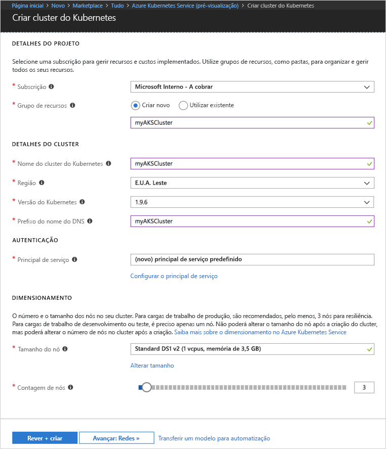
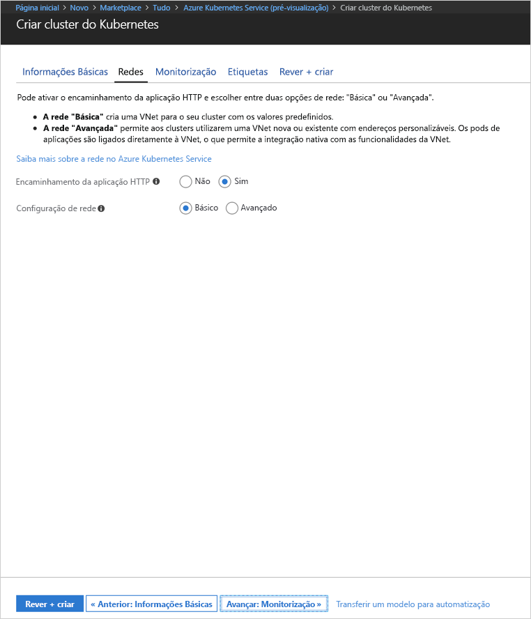
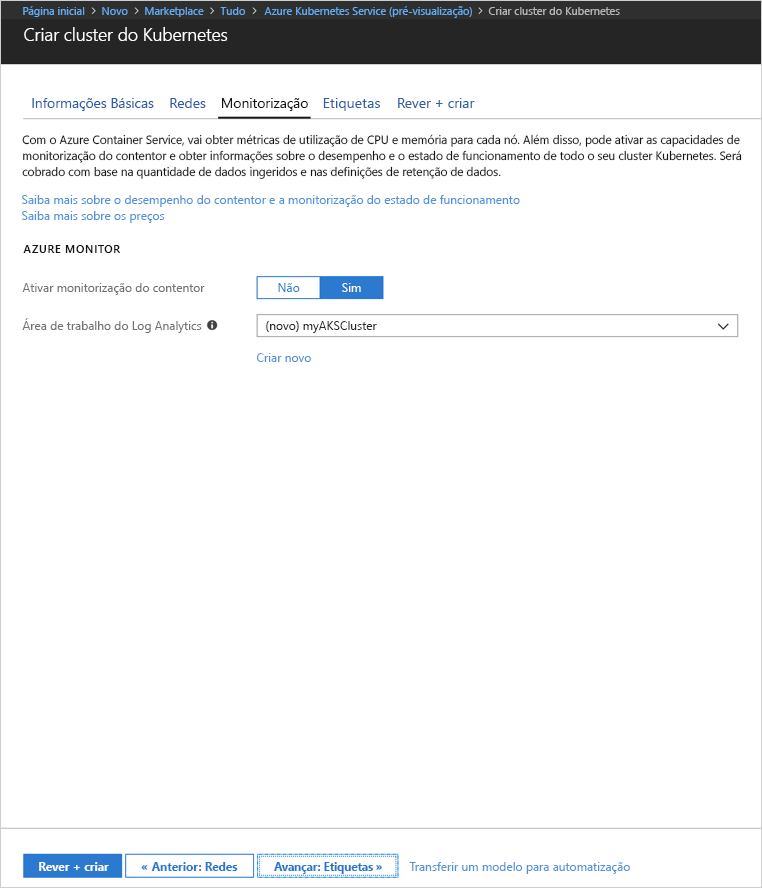
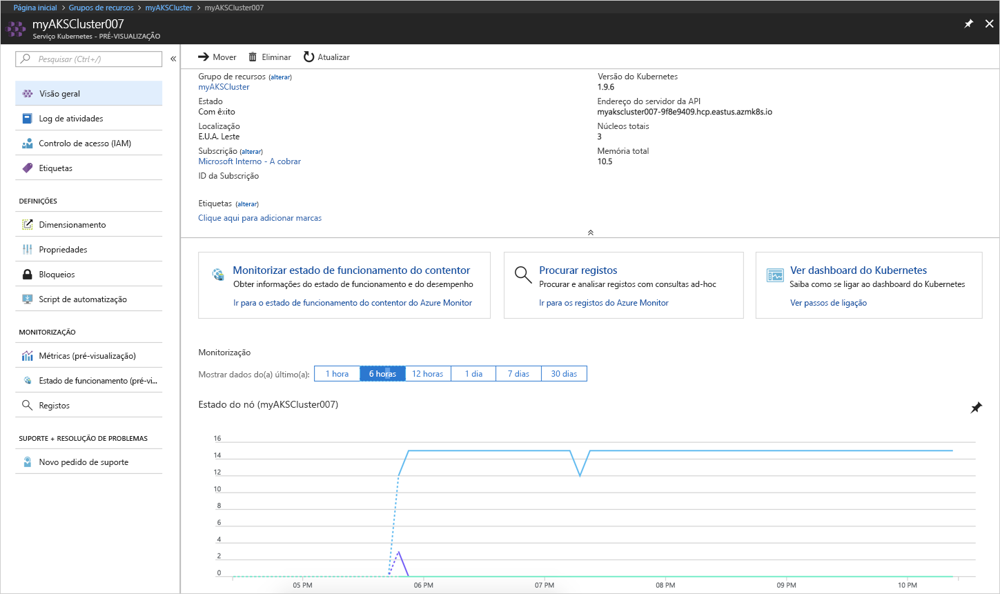
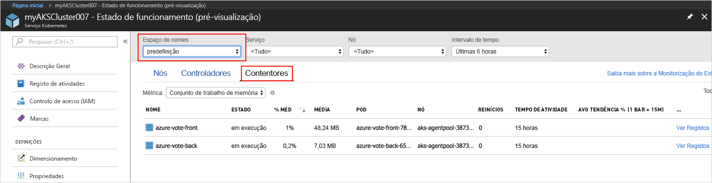
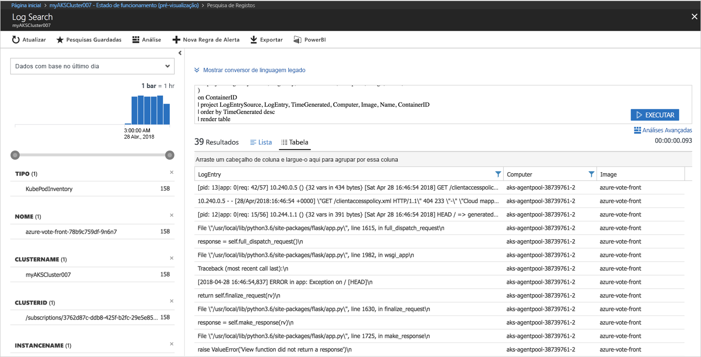

# <a name="quickstart-deploy-an-azure-kubernetes-service-aks-cluster"></a>Início Rápido: Implementar um cluster do Serviço Kubernetes do Azure (AKS)

Neste guia de introdução, vai implementar um cluster do AKS com o portal do Azure. Depois, é executada no cluster uma aplicação de vários contentores que consiste num front-end da Web e numa instância de Redis. Depois de concluída, a aplicação está acessível através da Internet.


Este guia de introdução parte do princípio de que possui conhecimentos básicos dos conceitos do Kubernetes. Para obter informações detalhadas sobre o Kubernetes, consulte a [documentação do Kubernetes][kubernetes-documentation].

## <a name="sign-in-to-azure"></a>Iniciar sessão no Azure

Inicie sessão no portal do Azure em http://portal.azure.com.


## <a name="create-aks-cluster"></a>Criar um cluster do AKS

Escolha **Criar um recurso** > procure **Kubernetes** > selecione **Serviço Kubernetes** > **Criar**.

Conclua os passos seguintes, descritos abaixo de cada um dos títulos do formulário para criar o cluster de AKS.

- **DETALHES DO PROJETO**: selecione uma subscrição do Azure e um grupo de recursos, novo ou existente, do Azure.
- **DETALHES DO CLUSTER**: introduza um nome, a região, a versão e o prefixo do nome DNS para o cluster de AKS.
- **AUTENTICAÇÃO**: crie um novo principal de serviço ou utilize um existente. Quando utilizar um SPN existente, terá de fornecer o ID de cliente de SPN e o segredo.
- **ESCALA**: selecione um tamanho de VM para os nós de AKS. O tamanho da VM **não pode** ser alterado após a implementação de um cluster de AKS. Além disso, selecione o número de nós a implementar no cluster. O número de nós **pode** ser ajustado após a implementação do cluster.

Selecione **Seguinte: Redes** quando terminar.



Configure as seguintes opções de rede:

- **Encaminhamento de aplicações de HTTP** - configura um controlador de entrada integrado com criação automática de nomes DNS públicos. Para obter mais informações sobre encaminhamento de HTTP, veja [Encaminhamento de HTTP e DNS de AKS][http-routing].
- **Configuração de rede** - opte entre a configuração de rede básica através do plug-in [kubenet][kubenet] do Kubernetes e a configuração de rede avançada através do [Azure CNI][azure-cni]. Para obter mais informações sobre as opções de rede, veja [Descrição geral do funcionamento em rede de AKS][aks-network].

Selecione **Seguinte: Monitorização** quando terminar.



Quando implementar um cluster de AKS, o Azure Container Insights pode ser configurado para monitorizar o estado de funcionamento do cluster de AKS e dos pods em execução no cluster. Para obter mais informações sobre a monitorização do estado de funcionamento dos contentores, veja [Monitorizar o estado de funcionamento do Azure Kubernetes Service][aks-monitor].

Selecione **Sim** para ativar a monitorização dos contentores e selecione uma área de trabalho existente do Log Analytics ou crie uma nova.

Selecione **Rever + criar** e, em seguida, selecione **Criar** quando terminar.



Após uma breve espera, o cluster do AKS é implementado e fica pronto a utilizar. Navegue para o grupo de recursos do cluster de AKS e selecione o recurso do AKS para ver o dashboard do cluster de AKS.



## <a name="connect-to-the-cluster"></a>Ligar ao cluster

Para gerir um cluster de Kubernetes, utilize [kubectl][kubectl], o cliente de linha de comandos do Kubernetes. O cliente kubectl está pré-instalado no Azure Cloud Shell.

Abra o Cloud Shell com o botão que se encontra no canto superior direito do portal do Azure.


Utilize o comando [az aks get-credentials][az-aks-get-credentials] para configurar kubectl para se ligar ao seu cluster do Kubernetes.

Copie e cole o comando seguinte para o Cloud Shell. Modifique o nome do grupo de recursos e do cluster, se necessário.

```azurecli-interactive
az aks get-credentials --resource-group myAKSCluster --name myAKSCluster
```

Para verificar a ligação ao cluster, utilize o comando [kubectl get][kubectl-get] para devolver uma lista de nós do cluster.

```azurecli-interactive
kubectl get nodes
```

Saída:

```
NAME                       STATUS    ROLES     AGE       VERSION
aks-agentpool-11482510-0   Ready     agent     9m        v1.9.6
aks-agentpool-11482510-1   Ready     agent     8m        v1.9.6
aks-agentpool-11482510-2   Ready     agent     9m        v1.9.6
```

## <a name="run-the-application"></a>Executar a aplicação

Os ficheiros de manifesto do Kubernetes definem um estado pretendido para um cluster, incluindo quais as imagens dos contentores devem estar em execução. Neste exemplo, é utilizado um manifesto para criar todos os objetos necessários para executar a aplicação Azure Vote. Estes objetos incluem duas [implementações de Kubernetes][kubernetes-deployment], uma para o front-end de Azure Vote e outra para uma instância de Redis. Além disso, são criados dois [serviços de Kubernetes][kubernetes-service], um serviço interno para a instância de Redis e um serviço externo para aceder à aplicação Azure Vote a partir da Internet.

Crie um ficheiro com o nome `azure-vote.yaml` e copie-o para o código YAML seguinte. Se estiver a trabalhar no Azure Cloud Shell, crie o ficheiro através de vi ou Nano, como se estivesse a trabalhar num sistema físico ou virtual.

```yaml
apiVersion: apps/v1beta1
kind: Deployment
metadata:
  name: azure-vote-back
spec:
  replicas: 1
  template:
    metadata:
      labels:
        app: azure-vote-back
    spec:
      containers:
      - name: azure-vote-back
        image: redis
        ports:
        - containerPort: 6379
          name: redis
---
apiVersion: v1
kind: Service
metadata:
  name: azure-vote-back
spec:
  ports:
  - port: 6379
  selector:
    app: azure-vote-back
---
apiVersion: apps/v1beta1
kind: Deployment
metadata:
  name: azure-vote-front
spec:
  replicas: 1
  template:
    metadata:
      labels:
        app: azure-vote-front
    spec:
      containers:
      - name: azure-vote-front
        image: microsoft/azure-vote-front:v1
        ports:
        - containerPort: 80
        env:
        - name: REDIS
          value: "azure-vote-back"
---
apiVersion: v1
kind: Service
metadata:
  name: azure-vote-front
spec:
  type: LoadBalancer
  ports:
  - port: 80
  selector:
    app: azure-vote-front
```

Utilize o comando [kubectl apply][kubectl-apply] para executar a aplicação.

```azurecli-interactive
kubectl apply -f azure-vote.yaml
```

Saída:

```
deployment "azure-vote-back" created
service "azure-vote-back" created
deployment "azure-vote-front" created
service "azure-vote-front" created
```

## <a name="test-the-application"></a>Testar a aplicação

À medida que a aplicação é executada, é criado um [serviço do Kubernetes][kubernetes-service] para expor a aplicação na Internet. Este processo pode demorar alguns minutos a concluir.

Para monitorizar o progresso, utilize o comando [kubectl get service][kubectl-get] com o argumento `--watch`.

```azurecli-interactive
kubectl get service azure-vote-front --watch
```

Inicialmente, o *EXTERNAL-IP* do serviço *azure-vote-front* aparece como *pendente*.

```
NAME               TYPE           CLUSTER-IP   EXTERNAL-IP   PORT(S)        AGE
azure-vote-front   LoadBalancer   10.0.37.27   <pending>     80:30572/TCP   6s
```

Quando o endereço *EXTERNAL-IP* mudar de *pendente* para *Endereço IP*, utilize `CTRL-C` para parar o processo de observação do kubectl.

```
azure-vote-front   LoadBalancer   10.0.37.27   52.179.23.131   80:30572/TCP   2m
```

Navegue para o endereço IP externo para ver a aplicação Azure Vote.


## <a name="monitor-health-and-logs"></a>Monitorizar o estado de funcionamento e os registos

Se a monitorização das informações dos contentores tiver sido ativada, as métricas de estado de funcionamento tanto do cluster de AKS como dos pods em execução no cluster irão estar disponíveis no dashboard do cluster de AKS. Para obter mais informações sobre a monitorização do estado de funcionamento dos contentores, veja [Monitorizar o estado de funcionamento do Azure Kubernetes Service][aks-monitor].

Para ver o estado atual, o tempo de atividade e a utilização de recursos dos pods de Azure Vote, regresse ao recurso do AKS, selecione **Monitorizar Estado de Funcionamentos dos Contentores** > selecione o espaço de nomes **predefinido** > e, em seguida, selecione **Contentores**. Pode demorar alguns minutos até que estes dados sejam povoados no portal do Azure.



Para ver os registos do pod `azure-vote-front`, selecione a ligação **Ver Registos**. Estes registos incluem os fluxos stdout e stderr do contentor.



## <a name="delete-cluster"></a>Eliminar o cluster

Quando o cluster já não for necessário, elimine o recurso do cluster, o que, por sua vez, elimina todos os recursos associados. Esta operação pode ser levada a cabo no portal do Azure através da seleção do botão Eliminar no dashboard do cluster de AKS. Em alternativa, é possível utilizar o comando [az aks delete][az-aks-delete] no Cloud Shell.

```azurecli-interactive
az aks delete --resource-group myAKSCluster --name myAKSCluster --no-wait
```

## <a name="get-the-code"></a>Obter o código

Neste guia de introdução, foram utilizadas imagens de contentores pré-criadas para criar uma implementação de Kubernetes. O código da aplicação relacionado, o Dockerfile, e o ficheiro de manifesto do Kubernetes, estão disponíveis no GitHub.

[https://github.com/Azure-Samples/azure-voting-app-redis][azure-vote-app]

## <a name="next-steps"></a>Passos seguintes

Neste guia de início rápido, implementou um cluster do Kubernetes e implementou uma aplicação de vários contentores no mesmo.

Para saber mais sobre o AKS e ver um exemplo completo de código para implementação, avance para o tutorial dos clusters de Kubernetes.

> [!div class="nextstepaction"]
> [Tutorial do AKS][aks-tutorial]

<!-- LINKS - external -->
[azure-vote-app]: https://github.com/Azure-Samples/azure-voting-app-redis.git
[azure-cni]: https://github.com/Azure/azure-container-networking/blob/master/docs/cni.md
[kubectl]: https://kubernetes.io/docs/user-guide/kubectl/
[kubectl-apply]: https://kubernetes.io/docs/reference/generated/kubectl/kubectl-commands#apply
[kubectl-get]: https://kubernetes.io/docs/reference/generated/kubectl/kubectl-commands#get
[kubenet]: https://kubernetes.io/docs/concepts/cluster-administration/network-plugins/#kubenet
[kubernetes-deployment]: https://kubernetes.io/docs/concepts/workloads/controllers/deployment/
[kubernetes-documentation]: https://kubernetes.io/docs/home/
[kubernetes-service]: https://kubernetes.io/docs/concepts/services-networking/service/

<!-- LINKS - internal -->
[az-aks-get-credentials]: /cli/azure/aks?view=azure-cli-latest#az_aks_get_credentials
[az-aks-delete]: /cli/azure/aks#az-aks-delete
[aks-monitor]: ../monitoring/monitoring-container-health.md
[aks-network]: ./networking-overview.md
[aks-tutorial]: ./tutorial-kubernetes-prepare-app.md
[http-routing]: ./http-application-routing.md
