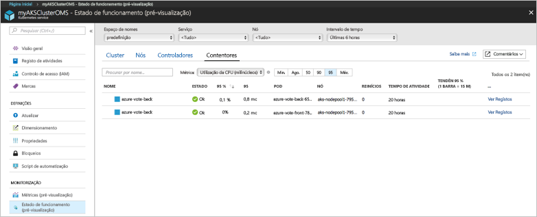
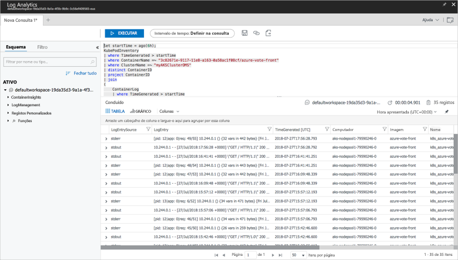

# <a name="quickstart-deploy-an-azure-kubernetes-service-aks-cluster"></a>Início Rápido: Implementar um cluster do Serviço Kubernetes do Azure (AKS)

Neste guia de introdução, é implementado um cluster do AKS com a CLI do Azure. Depois, é executada no cluster uma aplicação de vários contentores que consiste num front-end da Web e numa instância de Redis. Depois de concluída, a aplicação está acessível através da Internet.


Este guia de introdução pressupõe um conhecimento básico dos conceitos do Kubernetes. Para obter informações detalhadas sobre o Kubernetes, consulte a [documentação do Kubernetes][kubernetes-documentation].

[!INCLUDE [cloud-shell-try-it.md](../../includes/cloud-shell-try-it.md)]

Se optar por instalar e utilizar a CLI localmente, este início rápido requer a execução da versão 2.0.43 ou posterior da CLI do Azure. Executar `az --version` para localizar a versão. Se precisar de instalar ou atualizar, veja [Install Azure CLI (Instalar o Azure CLI)][azure-cli-install].

## <a name="create-a-resource-group"></a>Criar um grupo de recursos

Crie um grupo de recursos com o comando [az group create][az-group-create]. Um grupo de recursos do Azure é um grupo lógico, no qual os recursos do Azure são implementados e geridos. Quando cria um grupo de recursos, é-lhe pedido que especifique uma localização. É nessa localização que os seus recursos vão ser executados no Azure.

O exemplo seguinte cria um grupo de recursos denominado *myAKSCluster* na localização *eastus*.

```azurecli-interactive
az group create --name myAKSCluster --location eastus
```

Saída:

```json
{
  "id": "/subscriptions/00000000-0000-0000-0000-000000000000/resourceGroups/myAKSCluster",
  "location": "eastus",
  "managedBy": null,
  "name": "myAKSCluster",
  "properties": {
    "provisioningState": "Succeeded"
  },
  "tags": null
}
```

## <a name="create-aks-cluster"></a>Criar um cluster do AKS

Utilize o comando [az aks create][az-aks-create] para criar um cluster AKS. O exemplo seguinte cria um cluster com o nome *myAKSCluster* com um nó. A monitorização do estado de funcionamento do contentor também é ativada com o parâmetro *--enable-addons monitoring*. Para obter mais informações sobre a ativação da solução de monitorização do estado de funcionamento dos contentores, veja [Monitorizar o estado de funcionamento do Azure Kubernetes Service][aks-monitor].

```azurecli-interactive
az aks create --resource-group myAKSCluster --name myAKSCluster --node-count 1 --enable-addons monitoring --generate-ssh-keys
```

Ao fim de vários minutos, o comando é concluído e devolve informações sobre o cluster no formato JSON.

## <a name="connect-to-the-cluster"></a>Ligar ao cluster

Para gerir um cluster de Kubernetes, utilize [kubectl][kubectl], o cliente de linha de comandos do Kubernetes.

Se estiver a utilizar o Azure CloudShell, `kubectl` já está instalado. Se quiser instalá-lo a nível local, utilize o comando [az aks install-cli][az-aks-install-cli].


```azurecli
az aks install-cli
```

Para configurar `kubectl` para se ligar ao cluster do Kubernetes, utilize o comando [az aks get-credentials][az-aks-get-credentials]. Este passo transfere credenciais e configura a CLI do Kubernetes para as utilizar.

```azurecli-interactive
az aks get-credentials --resource-group myAKSCluster --name myAKSCluster
```

Para verificar a ligação ao cluster, utilize o comando [kubectl get][kubectl-get] para devolver uma lista de nós do cluster. Os nós podem demorar alguns minutos até serem apresentados.

```azurecli-interactive
kubectl get nodes
```

Saída:

```
NAME                          STATUS    ROLES     AGE       VERSION
k8s-myAKSCluster-36346190-0   Ready     agent     2m        v1.7.7
```

## <a name="run-the-application"></a>Executar a aplicação

Um ficheiro de manifesto do Kubernetes define um estado pretendido para o cluster, incluindo que imagens de contentor devem estar em execução. Neste exemplo, é utilizado um manifesto para criar todos os objetos necessários para executar a aplicação Azure Vote. Este manifesto inclui duas [implementações do Kubernetes][kubernetes-deployment], uma para as aplicações Python Azure Vote e outra para uma instância de Redis. Além disso, são criados dois [serviços de Kubernetes][kubernetes-service], um serviço interno para a instância de Redis e um serviço externo para aceder à aplicação Azure Vote a partir da Internet.

Crie um ficheiro com o nome `azure-vote.yaml` e copie-o para o código YAML seguinte. Se estiver a trabalhar no Azure Cloud Shell, este ficheiro pode ser criado através de vi ou Nano, como se estivesse a trabalhar num sistema físico ou virtual.

```yaml
apiVersion: apps/v1beta1
kind: Deployment
metadata:
  name: azure-vote-back
spec:
  replicas: 1
  template:
    metadata:
      labels:
        app: azure-vote-back
    spec:
      containers:
      - name: azure-vote-back
        image: redis
        ports:
        - containerPort: 6379
          name: redis
---
apiVersion: v1
kind: Service
metadata:
  name: azure-vote-back
spec:
  ports:
  - port: 6379
  selector:
    app: azure-vote-back
---
apiVersion: apps/v1beta1
kind: Deployment
metadata:
  name: azure-vote-front
spec:
  replicas: 1
  template:
    metadata:
      labels:
        app: azure-vote-front
    spec:
      containers:
      - name: azure-vote-front
        image: microsoft/azure-vote-front:v1
        ports:
        - containerPort: 80
        env:
        - name: REDIS
          value: "azure-vote-back"
---
apiVersion: v1
kind: Service
metadata:
  name: azure-vote-front
spec:
  type: LoadBalancer
  ports:
  - port: 80
  selector:
    app: azure-vote-front
```

Utilize o comando [kubectl apply][kubectl-apply] para executar a aplicação.

```azurecli-interactive
kubectl apply -f azure-vote.yaml
```

Saída:

```
deployment "azure-vote-back" created
service "azure-vote-back" created
deployment "azure-vote-front" created
service "azure-vote-front" created
```

## <a name="test-the-application"></a>Testar a aplicação

À medida que a aplicação é executada, é criado um [serviço do Kubernetes][kubernetes-service] que expõe o front-end da aplicação na Internet. Este processo pode demorar alguns minutos a concluir.

Para monitorizar o progresso, utilize o comando [kubectl get service][kubectl-get] com o argumento `--watch`.

```azurecli-interactive
kubectl get service azure-vote-front --watch
```

Inicialmente, o *EXTERNAL-IP* do serviço *azure-vote-front* aparece como *pendente*.

```
NAME               TYPE           CLUSTER-IP   EXTERNAL-IP   PORT(S)        AGE
azure-vote-front   LoadBalancer   10.0.37.27   <pending>     80:30572/TCP   6s
```

Quando o endereço *EXTERNAL-IP* mudar de *pendente* para *Endereço IP*, utilize `CTRL-C` para parar o processo de observação do kubectl.

```
azure-vote-front   LoadBalancer   10.0.37.27   52.179.23.131   80:30572/TCP   2m
```

Navegue para o endereço IP externo para ver a aplicação Azure Vote.


## <a name="monitor-health-and-logs"></a>Monitorizar o estado de funcionamento e os registos

Quando o cluster do AKS foi criado, a monitorização foi ativada para capturar métricas de estado de funcionamento dos nós do cluster e dos pods. Estas métricas de estado de funcionamento estão disponíveis no portal do Azure. Para obter mais informações sobre a monitorização do estado de funcionamento dos contentores, veja [Monitorizar o estado de funcionamento do Azure Kubernetes Service][aks-monitor].

Para ver o estado atual e a utilização de recursos dos pods de Azure Vote, conclua os seguintes passos:

1. Abra um browser no portal do Azure[https://portal.azure.com][azure-portal].
1. Selecione o grupo de recursos, como *myResourceGroup* e selecione o cluster do AKS, como *myAKSCluster*. 
1. Escolha **Monitorizar o Estado de Funcionamento do Contentor** > selecione o espaço de nomes **predefinido** > e selecione **Contentores**.

Pode demorar alguns minutos até que estes dados sejam preenchidos no portal do Azure, conforme mostrado no exemplo abaixo:



Para ver registos relativos ao pod `azure-vote-front`, selecione a ligação **Ver Registos**, no lado direito da lista de contentores. Esses registos incluem os fluxos *stdout* e *stderr* do contentor.



## <a name="delete-cluster"></a>Eliminar o cluster

Quando o cluster já não for necessário, utilize o comando [az group delete][az-group-delete] para remover o grupo de recursos, o serviço de contentores e todos os recursos relacionados.

```azurecli-interactive
az group delete --name myAKSCluster --yes --no-wait
```

> [!NOTE]
> Quando elimina o cluster, o principal de serviço do Azure Active Directory utilizado pelo cluster do AKS não é removido. Para obter passos sobre como remover o principal de serviço, consulte [Considerações sobre e eliminação do principal de serviço AKS][sp-delete].

## <a name="get-the-code"></a>Obter o código

Neste guia de introdução, foram utilizadas imagens de contentores pré-criadas para criar uma implementação de Kubernetes. O código da aplicação relacionado, o Dockerfile, e o ficheiro de manifesto do Kubernetes, estão disponíveis no GitHub.

[https://github.com/Azure-Samples/azure-voting-app-redis][azure-vote-app]

## <a name="next-steps"></a>Passos seguintes

Neste guia de início rápido, implementou um cluster do Kubernetes e implementou uma aplicação de vários contentores no mesmo.

Para saber mais sobre o AKS e ver um exemplo completo de código para implementação, avance para o tutorial dos clusters de Kubernetes.

> [!div class="nextstepaction"]
> [Tutorial do AKS][aks-tutorial]

<!-- LINKS - external -->
[azure-vote-app]: https://github.com/Azure-Samples/azure-voting-app-redis.git
[kubectl]: https://kubernetes.io/docs/user-guide/kubectl/
[kubectl-apply]: https://kubernetes.io/docs/reference/generated/kubectl/kubectl-commands#apply
[kubernetes-deployment]: https://kubernetes.io/docs/concepts/workloads/controllers/deployment/
[kubernetes-documentation]: https://kubernetes.io/docs/home/
[kubectl-get]: https://kubernetes.io/docs/reference/generated/kubectl/kubectl-commands#get
[kubernetes-service]: https://kubernetes.io/docs/concepts/services-networking/service/

<!-- LINKS - internal -->
[aks-monitor]: https://aka.ms/coingfonboarding
[aks-tutorial]: ./tutorial-kubernetes-prepare-app.md
[az-aks-browse]: /cli/azure/aks?view=azure-cli-latest#az_aks_browse
[az-aks-create]: /cli/azure/aks?view=azure-cli-latest#az_aks_create
[az-aks-get-credentials]: /cli/azure/aks?view=azure-cli-latest#az_aks_get_credentials
[az-aks-install-cli]: /cli/azure/aks?view=azure-cli-latest#az_aks_install_cli
[az-group-create]: /cli/azure/group#az_group_create
[az-group-delete]: /cli/azure/group#az_group_delete
[azure-cli-install]: /cli/azure/install-azure-cli
[sp-delete]: kubernetes-service-principal.md#additional-considerations
[azure-portal]: https://portal.azure.com
