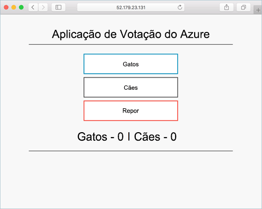

# <a name="run-applications-in-azure-container-service-aks"></a>Executar aplicações no serviço de contentor do Azure (AKS)

Neste tutorial, parte quatro de oito, um exemplo de aplicação é implementado num Kubernetes cluster. Passos concluídos incluem:

> [!div class="checklist"]
> * Atualizar os ficheiros de manifesto Kubernetes
> * Executar uma aplicação no Kubernetes
> * Testar a aplicação

Nos tutoriais subsequentes, esta aplicação é ampliada, atualizar, e Operations Management Suite configurado para monitorizar o cluster Kubernetes.

Este tutorial assume uma compreensão básica sobre conceitos Kubernetes, para obter informações detalhadas, consulte Kubernetes o [Kubernetes documentação][kubernetes-documentation].

## <a name="before-you-begin"></a>Antes de começar

Nos tutoriais anteriores, uma aplicação foi compactada uma imagem de contentor, esta imagem foi carregada para o registo de contentor do Azure e um cluster de Kubernetes foi criado. 

Para concluir este tutorial, terá de previamente criadas `azure-vote-all-in-one-redis.yaml` Kubernetes manifesto do ficheiro. Um tutorial anterior, este ficheiro foi transferido com o código fonte da aplicação. Certifique-se de que tem clonou o repositório e que foram alteradas diretórios para o repositório clonado.

Se não o fez estes passos e gostaria de acompanhar, regresse ao [Tutorial 1 – criar imagens de contentor][aks-tutorial-prepare-app].

## <a name="update-manifest-file"></a>Ficheiro de manifesto de atualização

Neste tutorial, registo de contentor do Azure (ACR) foi utilizado para armazenar uma imagem de contentor. Antes de executar a aplicação, o nome de servidor de início de sessão ACR tem de ser atualizada no ficheiro de manifesto Kubernetes.

Obter o nome do servidor de início de sessão ACR com o [lista de acr az] [ az-acr-list] comando.

```azurecli
az acr list --resource-group myResourceGroup --query "[].{acrLoginServer:loginServer}" --output table
```

O ficheiro de manifesto tiver sido previamente criado com um nome de servidor de início de sessão de `microsoft`. Abra o ficheiro com qualquer editor de texto. Neste exemplo, abrir o ficheiro com `vi`.

```console
vi azure-vote-all-in-one-redis.yaml
```

Substitua `microsoft` com o nome de servidor de início de sessão ACR. Este valor for encontrado na linha **47** do ficheiro de manifesto.

```yaml
containers:
- name: azure-vote-front
  image: microsoft/azure-vote-front:redis-v1
```

Guarde e feche o ficheiro.

## <a name="deploy-application"></a>Implementar a aplicação

Utilize o [kubectl criar] [ kubectl-create] comando a executar a aplicação. Este comando analisa o ficheiro de manifesto e cria os objetos de Kubernetes definidos.

```azurecli
kubectl create -f azure-vote-all-in-one-redis.yaml
```

Saída:

```
deployment "azure-vote-back" created
service "azure-vote-back" created
deployment "azure-vote-front" created
service "azure-vote-front" created
```

## <a name="test-application"></a>Aplicação de teste

A [Kubernetes serviço] [ kubernetes-service] é criado que expõe a aplicação à internet. Este processo pode demorar alguns minutos. 

Para monitorizar o progresso, utilize o [kubectl obter serviço] [ kubectl-get] comando com o `--watch` argumento.

```azurecli
kubectl get service azure-vote-front --watch
```

Inicialmente, o *EXTERNAL-IP* do serviço *azure-vote-front* aparece como *pendente*.
  
```
azure-vote-front   10.0.34.242   <pending>     80:30676/TCP   7s
```

Quando o endereço *EXTERNAL-IP* mudar de *pendente* para *Endereço IP*, utilize `CTRL-C` para parar o processo de observação do kubectl. 

```
azure-vote-front   10.0.34.242   52.179.23.131   80:30676/TCP   2m
```

Para ver a aplicação, navegue para o endereço IP externo.



## <a name="next-steps"></a>Passos Seguintes

Neste tutorial, a aplicação de voto do Azure foi implementada para um cluster de Kubernetes AKS. Tarefas foram completadas incluem:  

> [!div class="checklist"]
> * Transferir ficheiros de manifesto Kubernetes
> * Executar a aplicação no Kubernetes
> * Testar a aplicação

Avançar para o próximo tutorial para saber mais sobre uma aplicação Kubernetes e a infraestrutura de Kubernetes subjacente. 

> [!div class="nextstepaction"]
> [Dimensionar Kubernetes aplicação e a infraestrutura][aks-tutorial-scale]

<!-- LINKS - external -->
[kubectl-create]: https://kubernetes.io/docs/reference/generated/kubectl/kubectl-commands#create
[kubectl-get]: https://kubernetes.io/docs/reference/generated/kubectl/kubectl-commands#get
[kubernetes-documentation]: https://kubernetes.io/docs/home/
[kubernetes-service]: https://kubernetes.io/docs/concepts/services-networking/service/

<!-- LINKS - internal -->
[aks-tutorial-prepare-app]: ./tutorial-kubernetes-prepare-app.md
[aks-tutorial-scale]: ./tutorial-kubernetes-scale.md
[az-acr-list]: /cli/azure/acr#list
