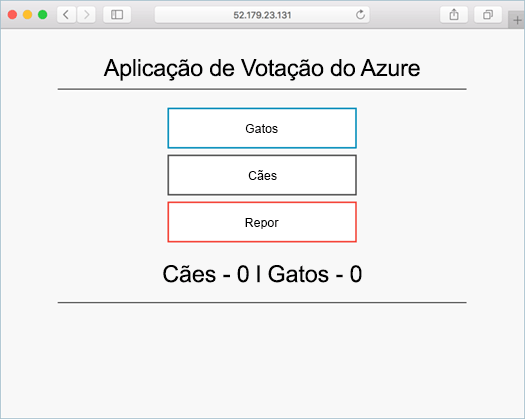

# <a name="tutorial-prepare-application-for-azure-kubernetes-service-aks"></a>Tutorial: Preparar aplicação para o Serviço Kubernetes do Azure (AKS)

Neste tutorial, a parte um de oito, uma aplicação de vários contentores é preparada para utilização com o Kubernetes. Os passos concluídos incluem:

> [!div class="checklist"]
> * A clonagem de origens das aplicações a partir do GitHub
> * Criar uma imagem de contentor a partir da origem de aplicação
> * Testar a aplicação num ambiente local do Docker

Depois de concluída, a aplicação seguinte fica acessível no seu ambiente de desenvolvimento local.



Nos tutoriais subsequentes, a imagem de contentor é carregada para o Azure Container Registry e, em seguida, é executada num cluster do AKS.

## <a name="before-you-begin"></a>Antes de começar

Este tutorial pressupõe conhecimentos básicos dos principais conceitos do Docker, como contentores, imagens de contentores e comandos simples do Docker. Se for necessário, veja a [Introdução ao Docker][docker-get-started] para obter um manual sobre as noções básicas dos contentores.

Para concluir este tutorial, precisa de um ambiente de desenvolvimento do Docker. O Docker disponibiliza pacotes que o configuram facilmente em qualquer sistema [Mac][docker-for-mac], [Windows][docker-for-windows] ou [Linux][docker-for-linux].

O Azure Cloud Shell não inclui os componentes do Docker necessários para concluir todos os passos deste tutorial. Por conseguinte, recomendamos a utilização de um ambiente de desenvolvimento completo do Docker.

## <a name="get-application-code"></a>Obter o código da aplicação

O exemplo de aplicação neste tutorial é uma aplicação de votos básica. A aplicação consiste num componente Web front-end e uma instância do Redis em back-end. O componente Web é compactado numa imagem personalizada de contentor. A instância do Redis utiliza uma imagem inalterada do Hub do Docker.

Utilize o git para transferir uma cópia da aplicação para o seu ambiente de desenvolvimento.

```console
git clone https://github.com/Azure-Samples/azure-voting-app-redis.git
```

Altere os diretórios para trabalhar a partir do diretório clonado.

```console
cd azure-voting-app-redis
```

Dentro do diretório estão: o código de origem da aplicação, um ficheiro de composição do Docker e um ficheiro de manifesto do Kubernetes. Estes ficheiros são utilizados em todo o tutorial.

## <a name="create-container-images"></a>Criar imagens de contentor

[O Docker Compose][docker-compose] pode ser utilizado para automatizar a compilação de imagens de contentor e a implementação de aplicações com vários contentores.

Execute o ficheiro `docker-compose.yaml` para criar a imagem de contentor, transferir a imagem de Redis e iniciar a aplicação.

```console
docker-compose up -d
```

Ao concluir, utilize o comando [docker images][docker-images] para ver as imagens criadas.

```console
docker images
```

Repare que foram transferidas ou criadas três imagens. A imagem `azure-vote-front` contém a aplicação e utilizar a imagem `nginx-flask` como base. A imagem `redis` é utilizada para iniciar uma instância do Redis.

```
REPOSITORY                   TAG        IMAGE ID            CREATED             SIZE
azure-vote-front             latest     9cc914e25834        40 seconds ago      694MB
redis                        latest     a1b99da73d05        7 days ago          106MB
tiangolo/uwsgi-nginx-flask   flask      788ca94b2313        9 months ago        694MB
```

Execute o comando [docker ps][docker-ps] para ver os contentores em execução.

```console
docker ps
```

Saída:

```
CONTAINER ID        IMAGE             COMMAND                  CREATED             STATUS              PORTS                           NAMES
82411933e8f9        azure-vote-front  "/usr/bin/supervisord"   57 seconds ago      Up 30 seconds       443/tcp, 0.0.0.0:8080->80/tcp   azure-vote-front
b68fed4b66b6        redis             "docker-entrypoint..."   57 seconds ago      Up 30 seconds       0.0.0.0:6379->6379/tcp          azure-vote-back
```

## <a name="test-application-locally"></a>Testar a aplicação localmente

Procure http://localhost:8080 para ver a aplicação em execução.


## <a name="clean-up-resources"></a>Limpar recursos

Agora que a funcionalidade da aplicação foi validada, os contentores em execução podem ser parados e removidos. Não elimine as imagens de contentor. A imagem `azure-vote-front` é carregada para uma instância do Azure Container Registry no tutorial seguinte.

Execute o seguinte para parar os contentores em execução.

```console
docker-compose stop
```

Elimine os contentores e os recursos parados com o seguinte comando.

```console
docker-compose down
```

Após a conclusão, tem uma imagem de contentor que contém a aplicação Azure Vote.

## <a name="next-steps"></a>Passos seguintes

Neste tutorial, uma aplicação foi testada e imagens de contentor foram criadas para a aplicação. Foram efetuados os seguintes passos:

> [!div class="checklist"]
> * Clonagem da origem da aplicação a partir do GitHub
> * Criou uma imagem de contentor a partir da origem de aplicação
> * Testou a aplicação em ambientes do Docker locais

Avance para o próximo tutorial para saber mais sobre o armazenamento das imagens de contentores em registos do Azure Container Registry.

> [!div class="nextstepaction"]
> [Enviar imagens para o Azure Container Registry][aks-tutorial-prepare-acr]

<!-- LINKS - external -->
[docker-compose]: https://docs.docker.com/compose/
[docker-for-linux]: https://docs.docker.com/engine/installation/#supported-platforms
[docker-for-mac]: https://docs.docker.com/docker-for-mac/
[docker-for-windows]: https://docs.docker.com/docker-for-windows/
[docker-get-started]: https://docs.docker.com/get-started/
[docker-images]: https://docs.docker.com/engine/reference/commandline/images/
[docker-ps]: https://docs.docker.com/engine/reference/commandline/ps/

<!-- LINKS - internal -->
[aks-tutorial-prepare-acr]: ./tutorial-kubernetes-prepare-acr.md