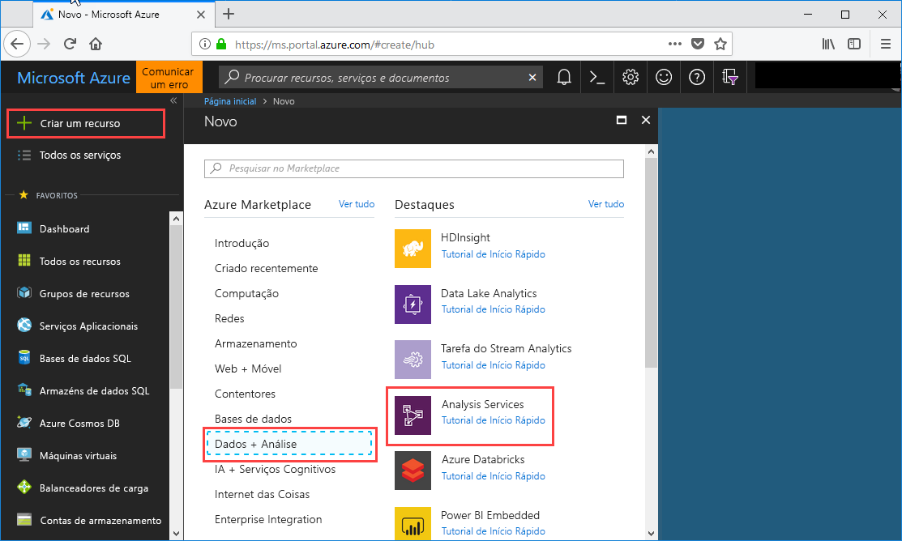
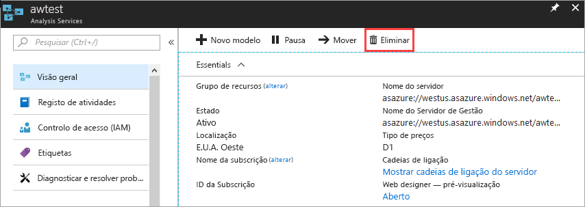

# Início Rápido: Criar um servidor - Portal

Este início rápido descreve como criar um recurso de servidor do Analysis Services na sua subscrição do Azure com o portal.

## Pré-requisitos 

* **Subscrição do Azure**: aceda à [Avaliação Gratuita do Azure](https://azure.microsoft.com/offers/ms-azr-0044p/) para criar uma conta.
* **Azure Active Directory**: a sua subscrição tem de estar associada a um inquilino do Azure Active Directory. E tem de ter sessão iniciada no Azure com uma conta nesse Azure Active Directory. Para saber mais,v eja [Authentication and user permissions](analysis-services-manage-users.md) (Autenticação e permissões de utilizador).

## Iniciar sessão no portal do Azure 

[Iniciar sessão no portal](https://portal.azure.com)

## Criar um servidor

1. Clique em **+ Criar um recurso** > **Dados + Análise** > **Analysis Services**.

    

2. No **Analysis Services**, preencha os campos obrigatórios e, em seguida, prima **Criar**.
   
   * **Nome do servidor**: escreva um nome exclusivo utilizado para referenciar o servidor.
   * **Subscrição**: selecione a subscrição à qual este servidor será associado.
   * **Grupo de recursos**: crie um novo grupo de recursos ou selecione um que já tenha. Os grupos de recursos são concebidos para ajudá-lo a gerir uma coleção de recursos do Azure. Para saber mais, veja [grupos de recursos](../azure-resource-manager/resource-group-overview.md).
   * **Localização**: esta localização do datacenter do Azure aloja o servidor. Escolha a localização mais perto da sua base de utilizadores.
   * **Escalão de preço**: selecionar um escalão de preço. Se estiver a testar e pretende instalar a base de dados do modelo de exemplo, selecione o escalão **D1** gratuito. Para saber mais, veja [Preços do Azure Analysis Services](https://azure.microsoft.com/pricing/details/analysis-services/). 
    * **Administrador**: por predefinição, esta será a conta em que tem sessão iniciada. Pode escolher uma conta diferente do Azure Active Directory.
    * **Definição do Armazenamento de Cópias de Segurança**: opcional. Se já tiver uma [conta de armazenamento](../storage/common/storage-introduction.md), pode especificá-la como a predefinição para a cópia de segurança de base de dados modelo. Também pode especificar as definições da [cópia de segurança e restauro](analysis-services-backup.md) mais tarde.
    * **Expiração da chave de armazenamento**: opcional. Especifique um período de expiração da chave de armazenamento.

Criar o servidor, normalmente, demora menos de um minuto. Se tiver selecionado **Adicionar ao Portal**, navegue até ao seu portal para ver o seu novo servidor. Ou navegue até **Todos os serviços** > **Analysis Services** para ver se o servidor está pronto.

## Limpar recursos

Quando já não precisar, elimine o seu servidor. Na **Descrição Geral** do servidor, clique em **Eliminar**. 

 

## Passos seguintes
Neste início rápido, aprendeu a criar um servidor na sua subscrição do Azure. Agora que tem o servidor, pode ajudar a protegê-lo ao configurar uma firewall do servidor (opcional). Também pode adicionar um modelo de dados de exemplo básico ao seu servidor diretamente a partir do portal. Ter um modelo de exemplo é útil para saber como configurar as funções de base de dados do modelo e testar as ligações de cliente. Para obter mais informações, avance para o tutorial para adicionar um modelo de exemplo.

> [!div class="nextstepaction"]
> [Início Rápido: Configurar a firewall do servidor - Portal](analysis-services-qs-firewall.md)   
> [!div class="nextstepaction"]
> [Tutorial: Adicionar um modelo de exemplo ao servidor](analysis-services-create-sample-model.md)
