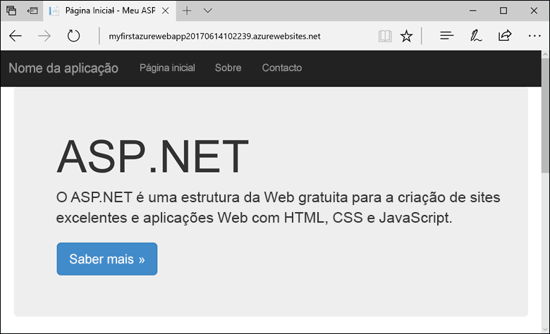
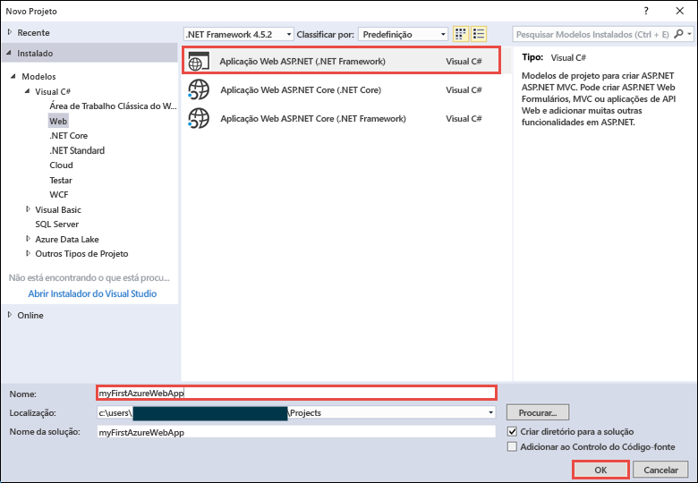
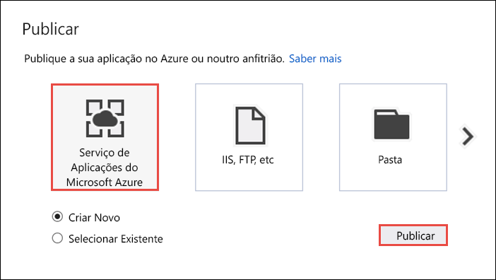
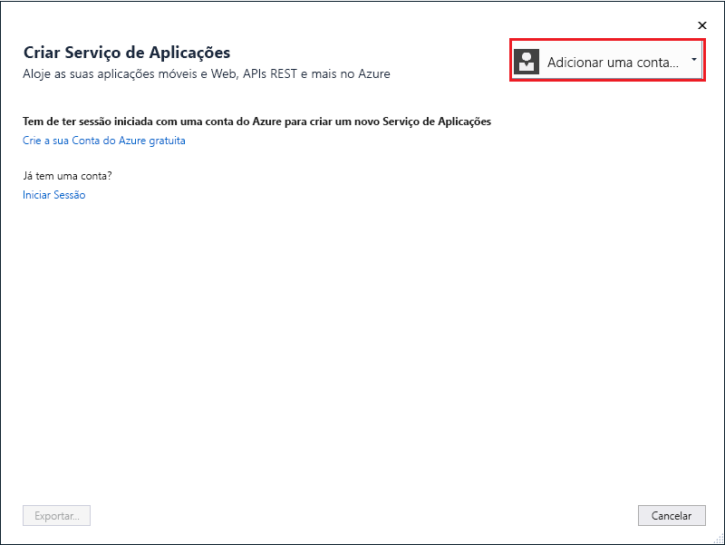
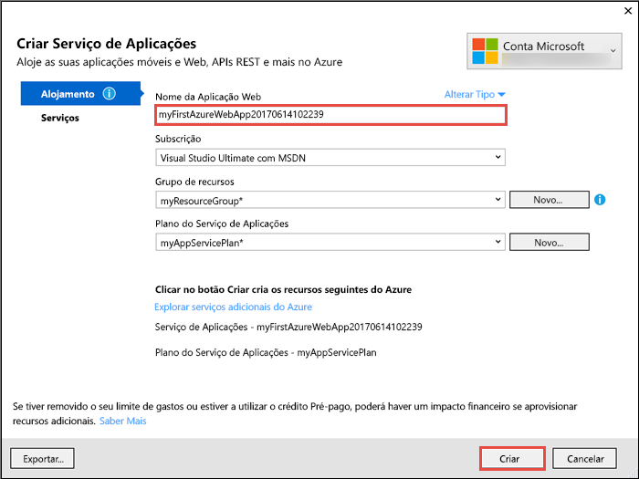
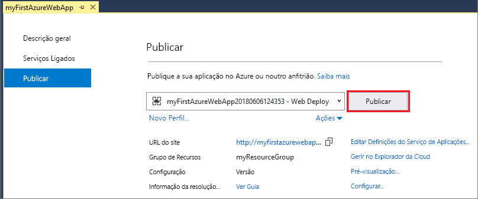
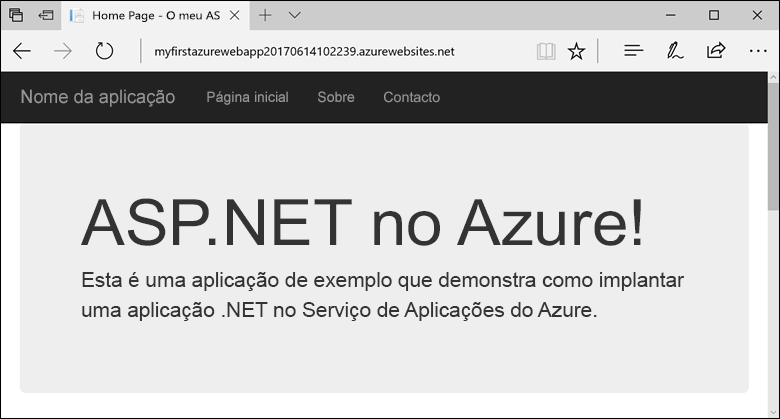

# <a name="create-an-aspnet-framework-web-app-in-azure"></a>Criar uma aplicação Web ASP.NET Framework no Azure

O [Serviço de Aplicações do Azure](overview.md) oferece um serviço de alojamento na Web altamente dimensionável e com correção automática.  Este início rápido mostra como implementar a sua primeira aplicação web ASP.NET no App Service do Azure. Quando terminar, terá um grupo de recursos que consiste num plano de serviços de aplicações e uma aplicação Web do Azure com uma aplicação Web implementada.



[!INCLUDE [quickstarts-free-trial-note](../../includes/quickstarts-free-trial-note.md)]

## <a name="prerequisites"></a>Pré-requisitos

Para concluir este tutorial, instale o <a href="https://www.visualstudio.com/downloads/" target="_blank">Visual Studio 2017</a> com a carga de trabalho de **desenvolvimento na Web e em ASP.NET**.

Se já instalou o Visual Studio 2017:

- Instale as atualizações mais recentes no Visual Studio ao clicar em **Ajuda** > **Procurar Atualizações**.
- Adicione a carga de trabalho ao clicar em **Ferramentas** > **Obter Ferramentas e Funcionalidades**.

## <a name="create-an-aspnet-web-app"></a>Criar uma aplicação Web ASP.NET

No Visual Studio, crie um projeto ao selecionar **Ficheiro > Novo > Projeto**. 

Na caixa de diálogo **Novo projeto**, clique em **Visual C# > Web > Aplicação Web ASP.NET (.NET Framework)**.

Atribua à aplicação o nome _myFirstAzureWebApp_ e clique em **OK**.
   


Pode implementar qualquer tipo de aplicação Web ASP.NET no Azure. Neste guia de início rápido, selecione o modelo **MVC** e confirme se a autenticação está definida como **Sem Autenticação**.
      
Selecione **OK**.


No menu, selecione **Depurar > Iniciar sem depuração** para executar a aplicação Web localmente.


## <a name="launch-the-publish-wizard"></a>Iniciar o assistente de publicação

No **Explorador de Soluções**, clique com o botão direito do rato no projeto **myFirstAzureWebApp** e selecione **Publicar**.


O assistente de publicação é iniciado automaticamente. Selecione **Serviço de Aplicações** > **Publicar** para abrir a caixa de diálogo **Criar Serviço de Aplicações**.



## <a name="sign-in-to-azure"></a>Iniciar sessão no Azure

Na caixa de diálogo **Criar Serviço de Aplicações**, selecione **Adicionar uma conta** e inicie sessão na sua subscrição do Azure. Se já tem sessão iniciada, selecione a conta que contém a subscrição pretendida na lista pendente.

> [!NOTE]
> Se já tiver sessão iniciada, não selecione ainda **Criar**.
>
>
   


## <a name="create-a-resource-group"></a>Criar um grupo de recursos

[!INCLUDE [resource group intro text](../../includes/resource-group.md)]

Junto a **Grupo de recursos**, selecione **Novo**.

Atribua ao grupo de recursos o nome **myResourceGroup** e selecione **OK**.

## <a name="create-an-app-service-plan"></a>Crie um plano do Serviço de Aplicações

[!INCLUDE [app-service-plan](../../includes/app-service-plan.md)]

Junto a **Plano de Alojamento**, selecione **Novo**. 

Na caixa de diálogo **Configurar Plano do Alojamento**, use as definições na tabela a seguir à captura de ecrã.


| Definição | Valor sugerido | Descrição |
|-|-|-|
|Plano do Serviço de Aplicações| myAppServicePlan | Nome do plano de serviço de aplicações. |
| Localização | Europa Ocidental | O centro de dados onde o a aplicação Web está alojada. |
| Tamanho | Gratuito | O [escalão de preço](https://azure.microsoft.com/pricing/details/app-service/?ref=microsoft.com&utm_source=microsoft.com&utm_medium=docs&utm_campaign=visualstudio) determina as funcionalidades do alojamento. |

Selecione **OK**.

## <a name="create-and-publish-the-web-app"></a>Criar e publicar a aplicação Web

No **Nome da Aplicação**, escreva um nome único para a aplicação (os carateres válidos são `a-z`, `0-9` e `-`) ou aceite o nome exclusivo gerado automaticamente. O URL da aplicação Web é `http://<app_name>.azurewebsites.net`, em que `<app_name>` é o nome da aplicação.

Selecione **Criar** para começar a criar os recursos do Azure.



Depois de concluir o assistente, este publica a aplicação Web ASP.NET no Azure e, em seguida, inicia a aplicação no browser predefinido.


O nome da aplicação especificado no [passo para criar e publicar](#create-and-publish-the-web-app) é utilizado como o prefixo de URL no formato `http://<app_name>.azurewebsites.net`.

Parabéns, a primeira aplicação Web ASP.NET está em execução em direto no Serviço de Aplicações do Azure.

## <a name="update-the-app-and-redeploy"></a>Atualizar a aplicação e reimplementar

No **Explorador de Soluções**, abra _Views\Home\Index.cshtml_.

Localize a etiqueta HTML `<div class="jumbotron">` na parte superior e substitua todo o elemento pelo código seguinte:

```HTML
<div class="jumbotron">
    <h1>ASP.NET in Azure!</h1>
    <p class="lead">This is a simple app that we’ve built that demonstrates how to deploy a .NET app to Azure App Service.</p>
</div>
```

Para voltar a implementar no Azure, clique com o botão direito do rato no projeto **myFirstAzureWebApp**, no **Explorador de Soluções** e selecione **Publicar**.

Na página de publicação, selecione **Publicar**.


Quando a publicação estiver concluída, o Visual Studio inicia um browser para o URL da aplicação Web.



## <a name="manage-the-azure-web-app"></a>Gerir a aplicação Web do Azure

Aceda ao <a href="https://portal.azure.com" target="_blank">portal do Azure</a> para gerir a aplicação Web.

No menu à esquerda, selecione **Serviços Aplicacionais** e selecione o nome da sua aplicação Web do Azure.


É apresentada a página de descrição geral da sua aplicação Web. Aqui, pode realizar tarefas de gestão básicas, como navegar, parar, iniciar, reiniciar e eliminar. 


O menu à esquerda fornece diferentes páginas para configurar a sua aplicação. 

## <a name="video"></a>Vídeo

Assista ao vídeo para ver este guia de introdução em ação e, em seguida, siga os passos para publicar a sua primeira aplicação .NET no Azure.

> [!VIDEO https://channel9.msdn.com/Shows/Azure-for-NET-Developers/Create-a-NET-app-in-Azure-Quickstart/player]

[!INCLUDE [Clean-up section](../../includes/clean-up-section-portal.md)]

## <a name="next-steps"></a>Passos Seguintes

> [!div class="nextstepaction"]
> [ASP.NET com Base de Dados SQL](app-service-web-tutorial-dotnet-sqldatabase.md)
