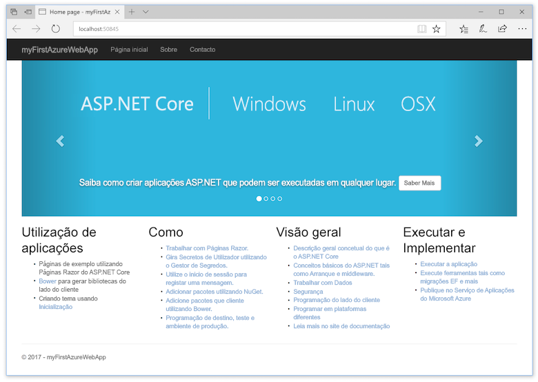
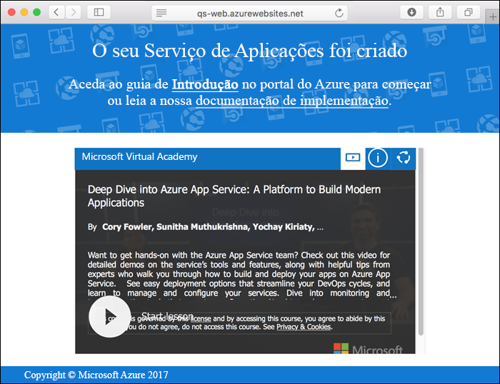
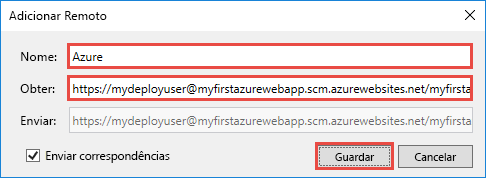
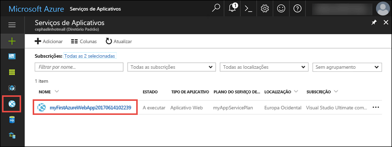
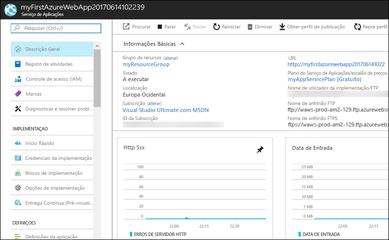

# <a name="create-an-aspnet-core-web-app-in-azure"></a>Criar uma aplicação Web ASP.NET Core no Azure

> [!NOTE]
> Este artigo implementa uma aplicação no Serviço de Aplicações no Windows. Para implementar um Serviço de Aplicações no _Linux_, consulte [Criar uma aplicação Web .NET Core no Serviço de Aplicações no Linux](./containers/quickstart-dotnetcore.md). 
>
> Se está à procura de passos para uma aplicação ASP.NET Framework, consulte [Criar uma aplicação Web ASP.NET Framework no Azure](app-service-web-get-started-dotnet-framework.md). 
>

[As Aplicações Web do Azure](app-service-web-overview.md) fornecem um serviço de alojamento na Web altamente dimensionável e com correção automática.  Este guia de início rápido mostra como implementar uma aplicação Web ASP.NET Core em aplicações Web do Azure. Quando terminar, terá um grupo de recursos que consiste num plano de serviços de aplicações e uma aplicação Web do Azure com uma aplicação Web implementada. Pode [ver um vídeo](#video) que demonstra como efetuar estes passos totalmente a partir do Visual Studio 2017.

[!INCLUDE [quickstarts-free-trial-note](../../includes/quickstarts-free-trial-note.md)]

## <a name="prerequisites"></a>Pré-requisitos

Para concluir este tutorial:

* Instale o <a href="https://www.visualstudio.com/downloads/" target="_blank">2017 do Visual Studio</a> com as seguintes cargas de trabalho:
    - **Desenvolvimento do ASP.NET e Web**
    - **Desenvolvimento do Azure**

    

## <a name="create-an-aspnet-core-web-app"></a>Criar uma aplicação Web ASP.NET Core

No Visual Studio, crie um projeto ao selecionar **Ficheiro > Novo > Projeto**. 

Na caixa de diálogo **Novo projeto**, clique em **Visual C# > Web > Aplicação Web ASP.NET Core**.

Dê à aplicação o nome _myFirstAzureWebApp_ e, em seguida, selecione **Criar novo repositório do Git** e **OK**.
   


Pode implementar qualquer tipo de aplicação Web ASP.NET Core no Azure. Neste guia de início rápido, selecione o modelo **Aplicação Web** e confirme se a autenticação está definida como **Sem Autenticação**.
      
Selecione **OK**.


Depois de criado o projeto do ASP.NET Core, a página de boas-vindas do ASP.NET Core é apresentada, com várias ligações para recursos que o podem ajudar a começar. 


No menu, selecione **Depurar > Iniciar sem depuração** para executar a aplicação Web localmente.



[!INCLUDE [cloud-shell-try-it.md](../../includes/cloud-shell-try-it.md)]

[!INCLUDE [Configure deployment user](../../includes/configure-deployment-user.md)] 

[!INCLUDE [Create resource group](../../includes/app-service-web-create-resource-group.md)] 

[!INCLUDE [Create app service plan](../../includes/app-service-web-create-app-service-plan.md)] 

[!INCLUDE [Create web app](../../includes/app-service-web-create-web-app.md)] 



## <a name="push-to-azure-from-visual-studio"></a>Enviar do Visual Studio para o Azure

Ao regressar ao Visual Studio, no menu **Ver** clique em **Explorador de Equipa**. É apresentado o **Explorador de Equipa**.

Na vista de **Raiz**, clique em **Definições** > **Definições de Repositório**.


Na secção **Remotos** das **Definições de Repositório**, selecione **Adicionar**. É apresentada a caixa de diálogo **Adicionar Remoto**.

Defina o campo **Nome** como _Azure_ e, em seguida, defina o campo **Obter** como o URL que guardou em [Criar uma aplicação Web](#create-a-web-app). Clique em **Guardar**.



Esta definição equivale ao comando do Git `git remote add Azure <URL>`.

Clique no botão **Base** na parte superior.

Selecione **Definições** > **Definições Globais**. Confirme que o nome e o endereço de e-mail estão definidos. Selecione **Atualizar** se tal for necessário.

O Visual Studio já consolidou todos os ficheiros no repositório do Git quando criou o projeto. Agora, só precisa de enviar os ficheiros para o Azure.

Clique no botão **Base** na parte superior. Selecione **Sincronização** > **Ações** > **Abrir Linha de Comandos**. 

Introduza o seguinte comando na janela de comandos e introduza a palavra-passe de implementação quando esta lhe for pedida:

```
git push Azure master
```

Este comando pode demorar alguns minutos a ser executado. Ao executar, apresenta informações semelhantes ao exemplo seguinte:

```
Counting objects: 4, done.
Delta compression using up to 8 threads.
Compressing objects: 100% (4/4), done.
Writing objects: 100% (4/4), 349 bytes | 349.00 KiB/s, done.
Total 4 (delta 3), reused 0 (delta 0)
remote: Updating branch 'master'.
remote: Updating submodules.
remote: Preparing deployment for commit id '9e20345e9c'.
remote: Generating deployment script.
remote: Project file path: .\myFirstAzureWebApp\myFirstAzureWebApp.csproj
remote: Solution file path: .\myFirstAzureWebApp.sln
remote: Generated deployment script files
remote: Running deployment command...
remote: Handling ASP.NET Core Web Application deployment.
remote:   Restoring packages for D:\home\site\repository\myFirstAzureWebApp\myFirstAzureWebApp.csproj...
remote:   Restoring packages for D:\home\site\repository\myFirstAzureWebApp\myFirstAzureWebApp.csproj...
...
remote: Finished successfully.
remote: Running post deployment command(s)...
remote: Deployment successful.
To https://<app_name>.scm.azurewebsites.net/<app_name>.git
 * [new branch]      master -> master
```

## <a name="browse-to-the-app"></a>Navegar para a aplicação

Num browser, navegue para o URL da aplicação Web do Azure: `http://<app_name>.azurewebsites.net`.

A página está a ser executada como uma aplicação Web do Serviço de Aplicações do Azure.


Parabéns, a primeira aplicação Web ASP.NET Core está em execução em direto no Serviço de Aplicações do Azure.

## <a name="update-the-app-and-redeploy"></a>Atualizar a aplicação e reimplementar

No **Explorador de Soluções**, abra _Pages/Index.cshtml_.

Localize a etiqueta HTML `<div id="myCarousel" class="carousel slide" data-ride="carousel" data-interval="6000">` na parte superior e substitua todo o elemento pelo código seguinte:

```HTML
<div class="jumbotron">
    <h1>ASP.NET in Azure!</h1>
    <p class="lead">This is a simple app that we’ve built that demonstrates how to deploy a .NET app to Azure App Service.</p>
</div>
```

No **Explorador de Soluções**, clique com o botão direito do rato em _Pages/Index.cshtml_ e clique em **Consolidar**. Introduza uma mensagem de consolidação da sua alteração e clique em **Consolidar Tudo**.

Ao regressar à janela da linha de comandos, envie as alterações de código para o Azure.

```bash
git push Azure master
```

Quando a implementação concluir, navegue novamente para `http://<app_name>.azurewebsites.net`.


## <a name="manage-the-azure-web-app"></a>Gerir a aplicação Web do Azure

Aceda ao <a href="https://portal.azure.com" target="_blank">portal do Azure</a> para gerir a aplicação Web.

No menu à esquerda, selecione **Serviços Aplicacionais** e selecione o nome da sua aplicação Web do Azure.



É apresentada a página de descrição geral da sua aplicação Web. Aqui, pode realizar tarefas de gestão básicas, como navegar, parar, iniciar, reiniciar e eliminar. 



O menu à esquerda fornece diferentes páginas para configurar a sua aplicação. 

[!INCLUDE [Clean-up section](../../includes/clean-up-section-portal.md)]

## <a name="video"></a>Vídeo

> [!VIDEO https://www.youtube-nocookie.com/embed/AEfG9PWPAxg]

## <a name="next-steps"></a>Passos seguintes

> [!div class="nextstepaction"]
> [ASP.NET Core com a Base de Dados SQL](app-service-web-tutorial-dotnetcore-sqldb.md)
