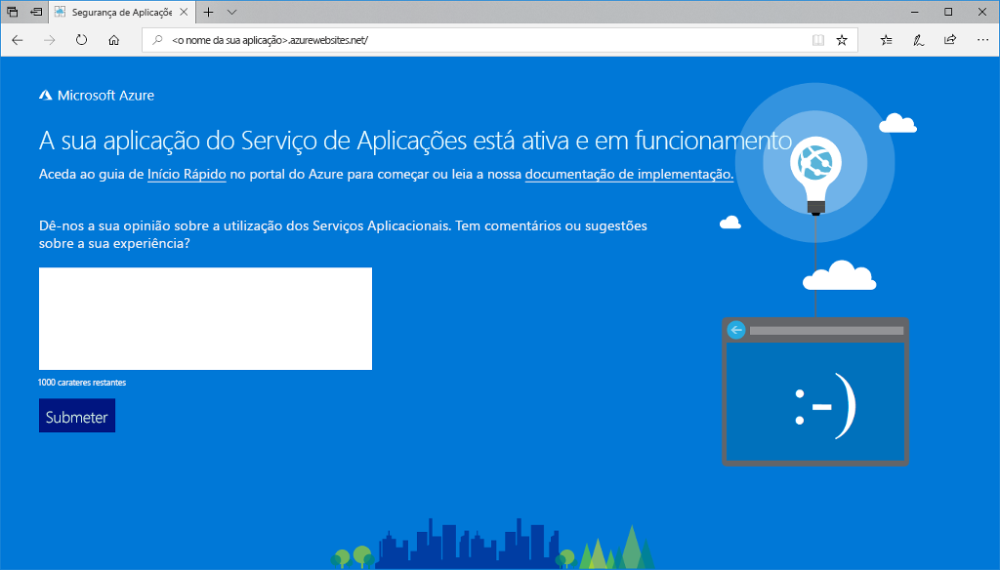
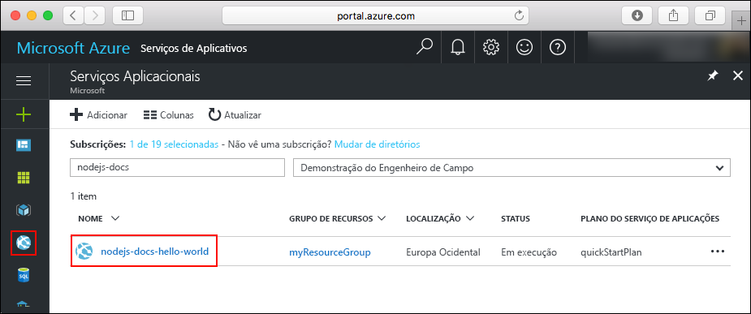
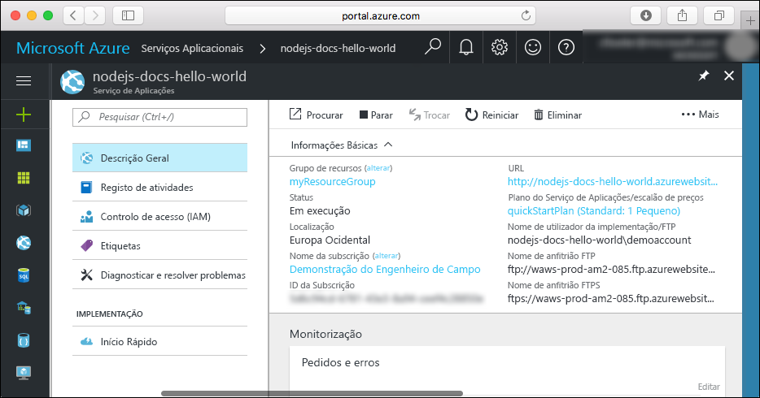

# <a name="create-a-nodejs-web-app-in-azure"></a>Criar uma aplicação Web Node.js no Azure

> [!NOTE]
> Este artigo implementa uma aplicação no Serviço de Aplicações no Windows. Para implementar um Serviço de Aplicações no _Linux_, consulte [Criar uma aplicação Web Node.js no Serviço de Aplicações do Azure no Linux](./containers/quickstart-nodejs.md).
>

[As Aplicações Web do Azure](app-service-web-overview.md) fornecem um serviço de alojamento na Web altamente dimensionável e com correção automática.  Este guia de início rápido mostra como implementar uma aplicação Node.js em aplicações Web do Azure. Crie a aplicação Web com a [CLI do Azure](https://docs.microsoft.com/cli/azure/get-started-with-azure-cli) e utilize o ZipDeploy para implementar o código Node.js de exemplo na aplicação Web.


Pode seguir os passos aqui indicados num computador Mac, Windows ou Linux. Depois de instalados os pré-requisitos, demora cerca de cinco minutos a concluir todos os passos.   

[!INCLUDE [quickstarts-free-trial-note](../../includes/quickstarts-free-trial-note.md)]

## <a name="prerequisites"></a>Pré-requisitos

Para concluir este guia de início rápido:

* <a href="https://nodejs.org/" target="_blank">Instale o Node.js e o NPM</a>

## <a name="download-the-sample"></a>Transferir o exemplo

Transfira o projeto Node.js de exemplo de [https://github.com/Azure-Samples/nodejs-docs-hello-world/archive/master.zip](https://github.com/Azure-Samples/nodejs-docs-hello-world/archive/master.zip) e extraia o arquivo ZIP.

Abra _index.js_ e localize a linha seguinte:

```javascript
var port = process.env.PORT || 1337;
```

O Serviço de Aplicações injeta process.env.PORT na sua aplicação, para que o código utilize a variável de modo a saber que porta escutar. 

Numa janela do terminal, navegue para o diretório de raiz do projeto Node.js de exemplo (o que contém _index.js_).

## <a name="run-the-app-locally"></a>Executar a aplicação localmente

Execute a aplicação localmente, para ver que aspeto deveria ter quando a implemente no Azure. Abra uma janela do terminal e use o script `npm start` para iniciar o servidor Node.js HTTP incorporado.

```bash
npm start
```

Abra um browser e navegue para a aplicação de exemplo em `http://localhost:1337`.

Pode ver a mensagem **Hello World** da aplicação de exemplo apresentada na página.


Na janela do terminal, prima **Ctrl+C** para desligar o servidor Web.

> [!NOTE]
> No Serviço de Aplicações do Azure, a aplicação é executada no IIS usando [iisnode](https://github.com/Azure/iisnode). Para ativar a aplicação a ser executada com o iisnode, o diretório da aplicação de raiz contém um arquivo web.config. O ficheiro é lido pelo IIS e as definições relacionadas com o iisnode são documentadas no [repositório do GitHub iisnode](https://github.com/Azure/iisnode/blob/master/src/samples/configuration/web.config).

[!INCLUDE [Create ZIP file](../../includes/app-service-web-create-zip.md)]

[!INCLUDE [cloud-shell-try-it.md](../../includes/cloud-shell-try-it.md)]

[!INCLUDE [Create resource group](../../includes/app-service-web-create-resource-group-scus.md)] 

[!INCLUDE [Create app service plan](../../includes/app-service-web-create-app-service-plan-scus.md)] 

## <a name="create-a-web-app"></a>Criar uma aplicação Web

No Cloud Shell, crie uma aplicação Web no plano do Serviço de Aplicações `myAppServicePlan` com o comando [`az webapp create`](/cli/azure/webapp?view=azure-cli-latest#az-webapp-create). 

No exemplo a seguir, substitua `<app_name>` com um nome de aplicação globalmente exclusivo (os carateres válidos são `a-z`, `0-9` e `-`).

```azurecli-interactive
# Bash and Powershell
az webapp create --resource-group myResourceGroup --plan myAppServicePlan --name <app_name>
```

Quando a aplicação Web tiver sido criada, a CLI do Azure mostra informações semelhantes ao seguinte exemplo:

```json
{
  "availabilityState": "Normal",
  "clientAffinityEnabled": true,
  "clientCertEnabled": false,
  "cloningInfo": null,
  "containerSize": 0,
  "dailyMemoryTimeQuota": 0,
  "defaultHostName": "<app_name>.azurewebsites.net",
  "enabled": true,
  < JSON data removed for brevity. >
}
```

### <a name="set-nodejs-runtime"></a>Definir o runtime do Node.js

Definir o runtime do Node para 8.11.1. Para ver todos os runtimes suportados, execute [`az webapp list-runtimes`](/cli/azure/webapp?view=azure-cli-latest#az-webapp-list-runtimes).

```azurecli-interactive
# Bash and Powershell
az webapp config appsettings set --resource-group myResourceGroup --name <app_name> --settings WEBSITE_NODE_DEFAULT_VERSION=8.11.1
```

Navegue para a sua aplicação Web recentemente criada. Substitua `<app_name>` com um nome de aplicação único.

```bash
http://<app_name>.azurewebsites.net
```

A aplicação Web deve ter o seguinte aspeto:



[!INCLUDE [Deploy ZIP file](../../includes/app-service-web-deploy-zip.md)]

## <a name="browse-to-the-app"></a>Navegar para a aplicação

Utilize o browser para navegar para a aplicação implementada.

```
http://<app_name>.azurewebsites.net
```

O código Node.js de exemplo está em execução numa aplicação Web do serviço de aplicações do Azure.


**Parabéns!** Implementou a sua primeira aplicação Node.js no Serviço de Aplicações.

## <a name="update-and-redeploy-the-code"></a>Atualizar e voltar a implementar o código

Utilizando um editor de texto, abra o ficheiro `index.js` na aplicação Node.js e faça uma pequena alteração ao texto na chamada para `response.end`:

```nodejs
response.end("Hello Azure!");
```

Na janela local do terminal, navegue para o diretório de raiz da sua aplicação e crie um novo ficheiro ZIP para o projeto atualizado.

```
# Bash
zip -r myUpdatedAppFiles.zip .

# PowerShell
Compress-Archive -Path * -DestinationPath myUpdatedAppFiles.zip
```

Implemente este novo ficheiro ZIP no Serviço de Aplicações através dos mesmos passos que se encontram em [Implementar o ficheiro ZIP](#deploy-zip-file).

Volte para a janela do browser aberta que abriu no passo **Navegar para a aplicação** e atualize a página.


## <a name="manage-your-new-azure-web-app"></a>Gerir a sua nova aplicação Web do Azure

Aceda ao <a href="https://portal.azure.com" target="_blank">portal do Azure</a> para gerir a aplicação Web que criou.

No menu à esquerda, clique em **Serviços de Aplicações** e clique no nome da sua aplicação Web do Azure.



É apresentada a página de descrição geral da sua aplicação Web. Aqui, pode realizar tarefas de gestão básicas, como navegar, parar, iniciar, reiniciar e eliminar. 



O menu à esquerda fornece diferentes páginas para configurar a sua aplicação. 

## <a name="video"></a>Vídeo

Assista ao vídeo para ver este guia de introdução em ação e, em seguida, siga os passos para publicar a sua primeira aplicação Node.js no Azure.

> [!VIDEO https://channel9.msdn.com/Shows/Azure-for-Node-Developers/Create-a-Nodejs-app-in-Azure-Quickstart/player]   

[!INCLUDE [cli-samples-clean-up](../../includes/cli-samples-clean-up.md)]

## <a name="next-steps"></a>Passos Seguintes

> [!div class="nextstepaction"]
> [Node.js com MongoDB](app-service-web-tutorial-nodejs-mongodb-app.md)
